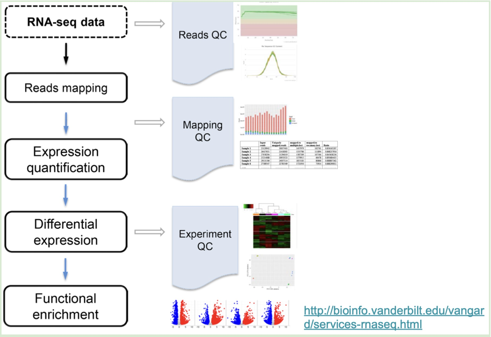
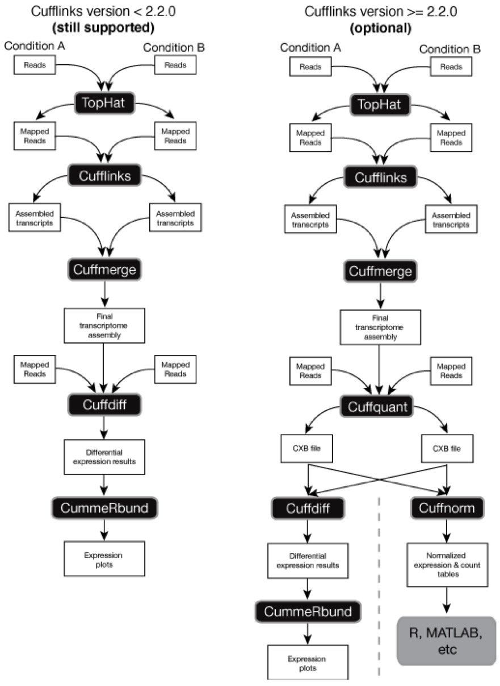

# Differential Gene Expression Analysis
Garrett Lam, Seshu Mallina, Gordon Ye

## What is differential gene expression analysis?
Differential gene expression analysis is a data analysis technique that is used to observe a difference in gene expression levels between two groups. Gene expression may be quantified through sequencing methods (e.g., RNA-seq) where gene transcripts are sequenced and quantified, or other methods including qPCR, microarrays, and Northern blotting. Today, the field has shifted towards RNA-seq.

## What are differentially expressed genes?
Differentially expressed genes are genes that have a difference in expression level between two groups that rises to statistical significance. In the case of RNA-seq, we may compare normalized read counts between samples to determine whether samples of one group have a higher or lower expression of one or more genes than samples in another group.

## Why do we use differential gene expression analysis?
Differential gene expression is particularly useful in understanding the biological mechanisms or differences between two states. For example, conducting differential gene expression analysis of tumor vs. normal tissue can help us identify specific genes and pathways that are altered in tumor tissue, which may help us improve our understanding of tumor biology while identifying novel therapeutic targets. Another example is conducting differential gene expression analysis of samples collected from patients before and after they are treated with a drug: in such an analysis, we may better understand the mechanisms of the drug in humans by studying genes whose expression is altered or biological pathways that are altered.

## Where in the RNA-seq pipeline is differential gene expression analysis used?
Differential gene expression analysis is step 4 out of the 5 main steps in the RNA-seq pipeline.  Specifically, differential gene expression analysis comes after the step of gene expression quantification and before functional enrichment analysis.


Figure 1: Overview of Workflows a and b



## What are some popular tools that people use for differentially gene expression analysis?
Some popular tools that people use to identify differentially expressed genes include bayseq, DESeq2, Ebseq, edgeR, and Limma(1). Most if not all of these tools are available as R/Python packages and Command Line Tools. Our group wanted to dive deeper into three tools, and we chose: CuffDiff, DESeq2, and edgeR. 


## What are the inputs and outputs of the tools that people use for differentially gene expression analysis?
The input for many differentially expressed gene software and tools is a count matrix. In essence, a count matrix is a table where the rows represent different genes and each column represents a unique sample. However, in some cases software such as CuffDiff requires an additional input of a SAM/BAM file. Of note, the values within a count matrix are unnormalized, and require normalization if we are to compare gene expression across samples. 
The output of differentially expressed genes is a table. Some important columns in this output table are the average normalized count, fold change (which can be a raw fold change or in another scale such as log), a standard error associated with the fold change value, a p-value associated with the fold change, and finally, a p-value adjusted for multiple hypothesis testing (e.g., through a familywise error or false discovery rate correction method). 
Fold change is a value that represents to what extent a particular gene is differentially expressed, calculated as the ratio of the difference between the expression values of the gene across two groups and the “reference” group’s expression value. The unadjusted and adjusted p-values capture how confident we are that a particular gene is differentially expressed in a statistically significant manner. The commonly accepted threshold in statistical analysis for p-value is 0.05, meaning that if you have a value smaller than 0.05 that means you reject the null hypothesis and there is a statistically significant difference. Note that to adjust for multiple hypothesis testing, there are two methods. First, we can either compute an adjusted p-value: an adjusted p-value less than 0.05 thus corresponds to a gene that is expressed differently between two groups. We may also set a new p-value threshold (e.g., dividing the 0.05 by the number of independent tests done in the case of a Bonferroni correction): unadjusted p-values below this threshold would then correspond to genes expressed differently between the groups.

## What kind of downstream analysis can we do after differential gene expression analysis?
One of the popular tools that we can use after differential gene expression analysis is Metascape. Metascape is a free gene annotation and analysis tool that assists biologists in making sense of one or more gene lists. From our differential gene expression analysis, we may create a list of differentially expressed genes. This list may then be uploaded to Metascape for functional analysis, where predicted alterations implications common or unique biological pathways pathways and protein networks can be identified.

## Differential Gene Expression Analysis Tools

### CuffDiff

#### What is Cufflinks/CuffDiff(2)
Cufflinks assembles transcripts in RNA-Seq samples, calculates their abundances, and checks for differential expression and regulation. It puts together a limited set of transcripts using aligned RNA-Seq data. The relative abundances of these transcripts are then determined by Cufflinks based on the amount of reads supporting each one and taking into account biases in library preparation processes. The Cufflinks pipeline contains a tool called Cuffdiff that determines which genes exhibit differential expression. Additionally, it can compare the levels of gene expression and inform users of which genes are up- or down-regulated in response to two or more situations. Behind the scenes, Cuffdiff calculates and determines which genes are differentially expressed using the poisson distribution. 

#### Advantages of Cuffdiff(2)
One advantage of cuffdiff is that it can still map a gene if it's an isoform.

#### Disadvantage of CuffDiff(3)
Cuffdiff does not does not account for uncertainty and dispersion. Count uncertainty is the idea that a read can be found across multiple genes due to shared genetic data. Count Dispersion is the reads are variable between samples. 

#### Who made Cufflinks(2)
Lior Pachter at UC Berkeley, Steven Salzberg at Johns Hopkins University, and Barbara Wold’s lab at California Institute of Technology collaborated on this differential gene analysis tool.

#### Getting Started: How to Download Cufflinks(2)

```
conda install -c conda-forge cufflinks-py
pip install cufflinks
```

#### Cuffdiff Input and Output(2)
Input: GTF + Sam/Bam File 
Output: CSV of gene_exp.diff

#### Prerequisites(2)
Cufflinks, the tool that CuffDiff is a part of, requires the user to use tophat as the software when mapping reads and generating count matrices.

#### Possible Workflows with CuffDiff(2)
Import Reads → Map Reads → assemble transcripts → assemble final transcript → differential analysis → expression plots

Import Reads → Map Reads → assemble transcripts → assemble final transcript → normalized expression → use other technologies like R and Matlab

Figure 1: Overview of Workflows a and b



#### Other Useful Tools
Cuffcompare:
 - Allows you to compare the transcriptome that you made from your samples to other RNA-seq libraries or known transcriptomes. To add on it it also allows you to compare the quality of your sample.

Cuffmerge:
 - Allows you to create a master transcriptome by combining RNA-seq libraries and the transcriptome generated from your sample.

Cuffquant:
 - Computes the gene transcript expression profiles.

Cuffnorm:
 - Tool used to normalize gene expression using FPKM.

#### How to Open Cufflinks(2)

```
## Unpacking cufflinks: 
tar zxvf cufflinks-0.7.0.tar.gz

## Change Directory
cd cufflinks-0.7.0

## Configure
./configure --prefix=/path/to/cufflinks/install --with-boost=/path/to/boost --with-eigen=/path/to/eigen

## Install
make install

## Test to see if download is working properly:
cufflinks ./sample_text
```

#### Running CuffDiff(3)

```
Cuffdiff - o diff_out ${entire path of gtf file} ${bam/sam file},...
```

#### Output of CuffDiff(3)

 - CSV headers: test_id, gene_id, gene locus, sample_,  sample_2, status, value_1, value_2, log2(fold_change), test_stat, p_value, q_value, significant 
 - Important columns to note: 
    - Q_value: false positive discovery rate(4)
    - P_value: significance
    - log2(fold-change) how much upregulated or downregulated a gene is 
    - Gene-id: unique identifier for a particular gene 

#### Command to filter the CSV to have only differentially expressed genes(3)


Yes identifier is used to filter and return genes that are significant: `grep yes gene_exp.diff`

#### Additional Information(3)

To change false positive discovery rate we can use the Bonferroni Correction:
 - P = a/m 

Where P = new p value that is to be achieved, m = number of comparisons, a = initial p value

Other important tools to download when using tophat-cufflinks pipeline:

Sam tools download: `git clone https://github.com/samtools/samtools.git`

Eigen download: `git clone https://gitlab.com/libeigen/eigen.git`

### edgeR(5-7)

#### What is edgeR
edgeR takes as input count data from sequencing technologies to perform differential gene expression analysis (using RNA-seq or SAGE data) or differential marking analysis (using ChIP-seq data). 

#### Advantages of edgeR
While it is a general tool, edgeR’s implementation of statistical methods based on the negative binomial distribution as a model for count variation makes it particularly useful for data generated from experiments with multiple experimental factors but a small number of replicates. Also setting edgeR apart is its ability to identify variation between transcripts of the same gene.

#### Who made edgeR
edgeR was developed in the lab of Dr. Gordon Smyth, who was at the time affiliated with the Garvan Institute of Medical Research and The Walter and Eliza Hall Institute of Medical Research.

#### Getting Started: How to Download edgeR
edgeR is available as an R package, and needs to be installed using Bioconductor. The package used to be available on CRAN but as of June 15, 2022, it is no longer available.
```
if (!require("BiocManager", quietly = TRUE))
    install.packages("BiocManager")

BiocManager::install("edgeR")
```

#### Prerequisites
edgeR takes as input a count matrix. The authors recommend using featureCounts (function in the Rsubread R package), findOverlaps (function in the GenomicRanges R package), or htseq-counts (a Python package). A key requirement is that edgeR only works with directly measured read count data – using predicted/imputed transcript abundances is inadvisable.

#### Possible Workflows
Read in the data → annotate data and keep transcripts with IDs present in up-to-date NCBI annotation (e.g., RefSeq IDs) → filtering out lowly expressed genes and perform TMM normalization → create a design matrix to fit negative binomial gaussian linear models → estimate negative binomial dispersion for the data → determine differentially expressed genes by fitting gene-wise gaussian linear models

#### Downstream Analysis
 - Gene ontology analysis (within R)
    - Identify biological processes that are altered based on the list of differentially expressed genes
 - Metascape
    - Based on the list of differentially expressed genes, identify biological pathways and protein networks that are disrupted.


### DESeq2(8)

#### What is DESeq2
A differential gene expression analysis package that estimates variance-mean dependence in counts matrix (from sequencing technologies) and tests for differential expression of genes using negative binomial distribution

#### Who made DESeq2
DESeq2 was developed by a group of computational biologists: Wolfgang Huber, Michael Love, and Simon Anders, who are affiliated with the European Molecular Biology Laboratory 

#### Getting Started: How to download DESeq2
DESeq2 is available as an R package and can be installed via Bioconductor
```
if (!require("BiocManager", quietly = TRUE))
install.packages("BiocManager")

BiocManager::install("DESeq2")
```

#### Prerequisites (inputs)
 - Counts matrix - input can be from gene (transcript) quantification technologies, such as featureCounts or Salmon 
 - Metadata - a dataframe that contains the metadata of the experiment 
    - Samples must be identical to ones raw counts matrix
    - Variables can be further categorized into replication number, condition, tissue type (dependent on experiment)
 - Experimental Design - an R formula that specifies the known variables contributing to the differences in data (user specified)

#### Possible Workflows
 1. Create DESeqDataSet object
    - Import counts matrix input
    - Set up metadata dataframe
    - Specify experimental design (variable that user believes to be contributing to biggest difference in data):
```
dds <- DESeqDataSetFromMatrix(countData = round(raw),
                              colData = metadata,
                              design = as.formula(~ experimental_variables ))
```
 2. Filter out lowly expressed genes 
 3. Run DESeq2 Analysis: `dds <- DESeq(dds)`

 4. Normalization of gene counts using variance stabilized transformation (removes the dependence of the variance on the mean): `vsd <- varianceStabilizingTransformation(dds, blind=FALSE)`

 5. Quality Control
    - Use principal component analysis (PCA) to visualize data in 2D space and identify problems in data (e.g. whether specified design is relevant, mislabeled samples)
    - Use heatmaps to visualize whether data is clustering as expected
    - Use MA plot to visualize number of up-regualted or downregulated of DEGs 
    - Extract DEGs from DESeq2 object: `res <- results(dds,alpha=0.05, lfcThreshold=log2(1.5), name = comparison_condition)`

#### Downstream Analysis
Gene Set Enrichment Analysis (GSEA) - via the WebGestalt R Package - which identifies biological pathways, molecular function, and cellular components related to differentially expressed genes obtained from DESeq2

#### Advantages of DESeq2(9)
 - Reduces effects of confounding variables on differentially expressed
    - DESeq2 accounts for confounding variables (such as gender, age, tissue type) as these variables may mask whether a gene is differentially expressed or not. DESeq2 achieves this by fitting gene expression through a negative binomial regression model.
 - Models the data using Negative Binomial Distribution
    - By using negative binomial distribution, DESeq2 is able to model multimodal, overdispersed data, such as RNA-seq data, very well as variance can come from many biological and technical factors. This allows DESeq2 to have good estimates of variance in the data, thus more accurately identifies differentially expressed genes


## Conclusion (Tool Summary)

| Method | Normalization Method | Read Count Distribution Assumption | Differential Expression Test |
|    :----:   |    :----:   |    :----:    |    :----:   |
| cufflinks/cuffdiff | Geometric, quartile, FPKM | Beta negative binomial | t-test |
| edgeR | TMM, upper quartile, RLE, none | Negative binomial | Exact test |
| DESeq2 | Variance stabilizing transformation | Negative binomial | Exact test |

## References

1.    Froussios K, Schurch NJ, Mackinnon K, Gierliński M, Duc C, Simpson GG, et al. How well do RNA-Seq differential gene expression tools perform in a complex eukaryote? A case study in Arabidopsis thaliana. Bioinformatics. 2019 Sep 15;35(18):3372–7.
2.    Cufflinks [Internet]. Cufflinks. [cited 2022 Nov 29]. Available from: http://cole-trapnell-lab.github.io/cufflinks/manual/
3.    0.4 RNA-seq Differential Analysis [Internet]. [cited 2022 Nov 29]. Available from: https://zhonglab.gitbook.io/3dgenome/chap0-preparation/03-rna-seq-differential-analysis
4.    Stephanie. Q-Value: Definition and Examples [Internet]. Statistics How To. 2015 [cited 2022 Nov 29]. Available from: https://www.statisticshowto.com/q-value/
5.    Robinson MD, McCarthy DJ, Smyth GK. edgeR: a Bioconductor package for differential expression analysis of digital gene expression data. Bioinformatics. 2010 Jan 1;26(1):139–40.
6.    McCarthy DJ, Chen Y, Smyth GK. Differential expression analysis of multifactor RNA-Seq experiments with respect to biological variation. Nucleic Acids Res. 2012 May 1;40(10):4288–97.
7.    Chen Y, Lun AT, McCarthy DJ, Ritchie ME, Phipson B, Hu Y, et al. edgeR: Empirical Analysis of Digital Gene Expression Data in R [Internet]. Bioconductor version: Release (3.16); 2022 [cited 2022 Nov 29]. Available from: https://bioconductor.org/packages/edgeR/
8.    Love MI, Huber W, Anders S. Moderated estimation of fold change and dispersion for RNA-seq data with DESeq2. Genome Biol. 2014 Dec 5;15(12):550.
9.    The Basics of DESeq2 - A Powerful Tool in Differential Expression Analysis for Single-cell RNA-Seq [Internet]. BioTuring’s Blog. 2022 [cited 2022 Nov 29]. Available from: https://blog.bioturing.com/2022/06/02/the-basics-of-deseq2-a-powerful-tool-in-differential-expression-analysis-for-single-cell-rna-seq/


