# **scRNA-seq**
##### by Group 11: Yuxuan Du, Yiming, Gao, Tianya Zhan
## **Purpose**
Imagine we are interested in genes that cause lung cancer. We collect cells from our lung tissue, but there are different cells in this tissue. If we treat all kinds of cells as the same type, which is exactly what we do in bulk RNA-seq, since gene expressions are different in different cells, it is obvious that we will lose important information. How do we know which gene in which kinds of cells is the key abnormality that causes cancer?
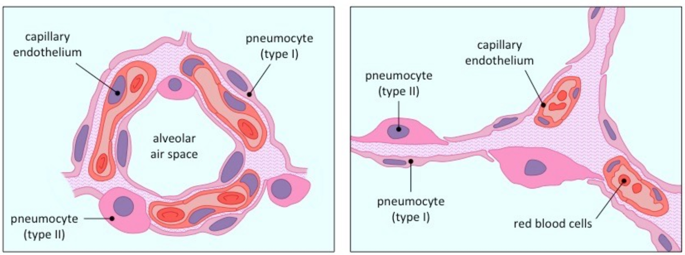
###### Figure1: Lung tissue(BioNinja)
To deal with these problems, techniques that can separately analyze different cells in the same tissue are needed. scRNA-seq is the one that tackles this problem. scRNA-seq can sequence different cells, and generate a dataset in which each sample is a cell in the tissue and the features are the gene expression of the cell. The classification of cells will be done by machine learning algorithms. Most importantly, this technique allows us to analyze more than 15000 cells in a short period of time, which significantly save researchers time. 
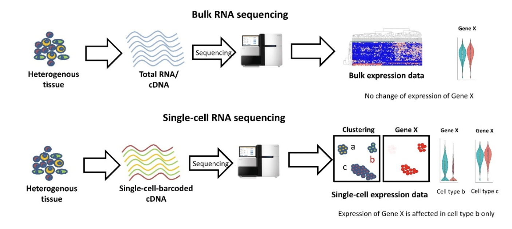
###### Figure2: Difference Between Bulk RNA-seq and scRNA-seq(Dmitry Velmeshev, 2019)
Due to the efficiency and effectiveness of the technique, it is useful to learn more about scRNA-seq technology.

## **Upstream** 
### **Sequencing Process**
Here we can see the process of sequencing: 
Encoded beads will flow through the microfluidics and meet with the cell. The microfluidics are well designed so that only one beads are allowed to pass. The combination of a cell, a bead, and reagents will form a droplet when they enter the microfluidic that is filled with oil. Then the connection of barcode and RNA will starts. After RNA gets barcoded, we will use PCR to amplify reads and sequence all reads using RNA-seq techniques.
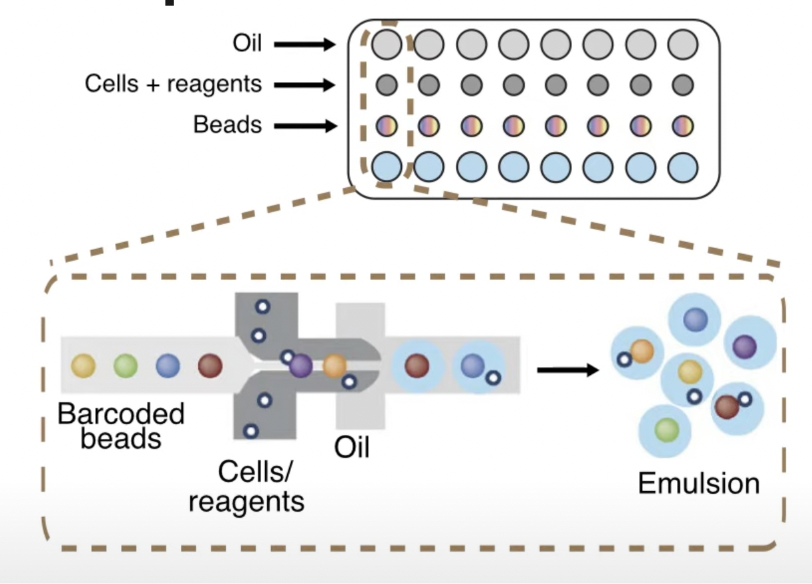
###### Figure 3: 10X seq(Eric Chow, 2020)
### The Beads and Barcodes
We can notice there are few region on our barcode. These barcodes are critical for researchers to know the origin of different RNA reads, and there are different function for different region. The 10x barcodes region will indicate RNA from the same cell, and the UMI code region can reduce the bias from amplification steps by indicating reads that are multiple copies of the same gene or actually different genes. After that, we will start our downstream analysis.
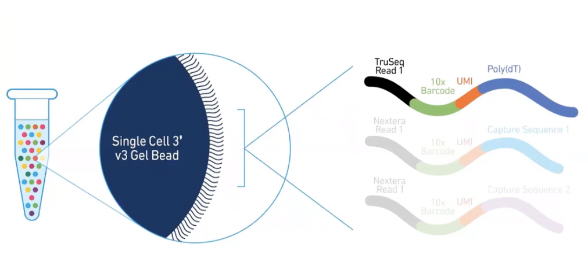
###### Figure4: Bead and Barcode(10X genomics, 2020)

## **Downstream**
The key downstream analysis in single-cell sequencing involves an *R toolkit* called **Seurat** which is named after *Georges Seurat*, a famous French artist. You can also check this [Tutorial](https://satijalab.org/seurat/articles/pbmc3k_tutorial.html) from Seurat for a detailed step by step walkthrough of the pipeline. 

The **standard pipeline** of Seurat includes:
1. Quality Check
2. Normalize Data
3. Find Vairable Genes
4. Perform Linear Dimension Reduction
5. Generate Clusters
6. Perform Differential Analysis
7. Visualize the Results

### **Quality Check**
After reading in the feature-barcode matrix from the 10X [*Cell Ranger*](https://support.10xgenomics.com/single-cell-gene-expression/software/pipelines/latest/what-is-cell-ranger) pipeline ( which aligns the reads to the reference transcriptome and generates feature-barcode matrix that is used in Seurat ), we need first to perform the quality check step to identify and eliminate some outliers and poor-quality data before any further analysis. There are three commonly used measures to consider during quality check: 
- The total number of genes expressed in a cell
    - A cell with very few unique gene expressed often indicates a low quality cell or an empty droplet.
- The number of unique genes expressed in a cell ( which strongly correlates with the total number of genes expressed in a cell )
    - A cell with very high gene count may indicates a cell doublet or multiplet which means that two or more cells are sequenced as a single cell. 
    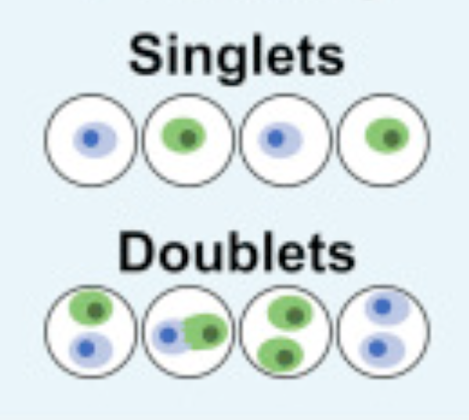
    ###### Figure5: Singlets Vs. Doublets
- The *percent* of reads coming from mitochondrial genes
    - Every cell has copies of mitochondria genes, because mitochondria has its own genome. A **dead or dying cell** will enrich the expression of mitochondria genes, so a high mitochondrial gene percentage indicates a potentially low quality cell.
    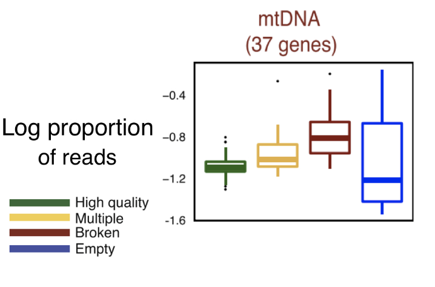
    ###### Figure6: Box plot showing the correlation between propoortion of mitochondria reads and quality of single cell data

Violin plot and scatter plot can be used to visualize the possible outliers. 
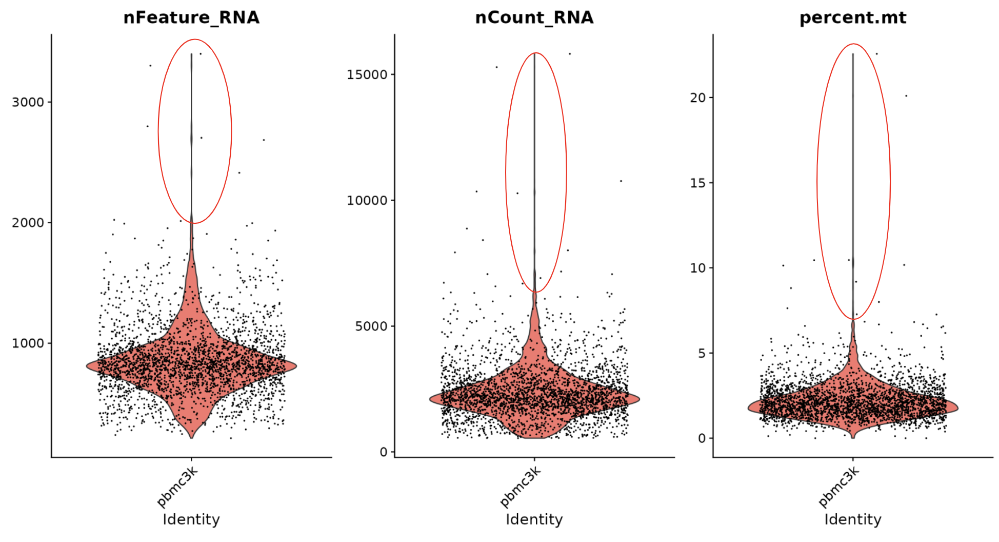
###### Figure7: Example of violin plot to visualize outliers. Red Circle indicates possible outliers
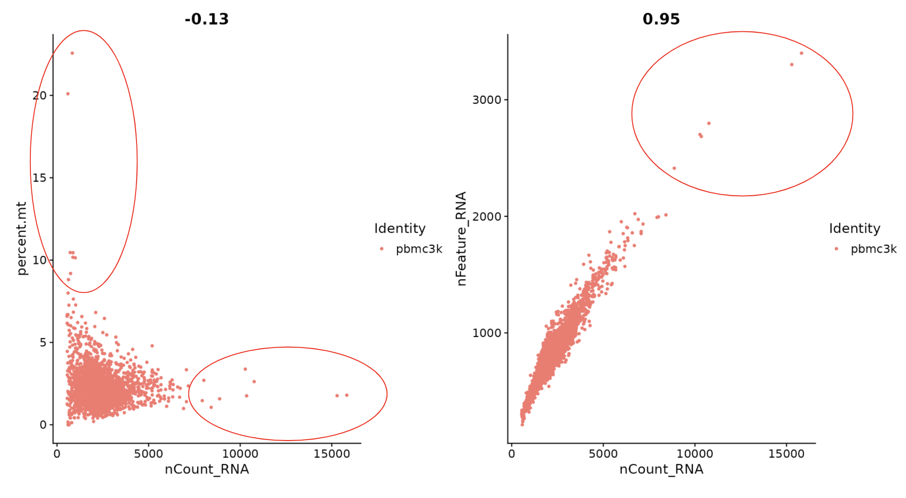
###### Figure8: Example of scatter plot to visualize outliers. Red Circle indicates possible outliers
The circled area indicates the possible outliers. For example, based on the above figures (figure 7 and figure 8), we want to consider removing cells with the number of unique genes more than 2500 and cells with percent of mitochondrial gene counts more than 5. 

### **Seurat**

After the quality check, we first preprocess the data, then perform differential expression analysis and dimension reduction.

#### Preprocessing
```
Dev_NPC <- NormalizeData(object = Dev_NPC, normalization.method = "LogNormalize", scale.factor = 10000)
Dev_NPC <- FindVariableFeatures(Dev_NPC, selection.method = "vst", nfeatures = 2000)
Dev_NPC <- ScaleData(Dev_NPC, vars.to.regress = c("nCount_RNA","percent.mt"), features = row.names(Dev_NPC))
```
This is the preprocessing R code. ```Dev_NPC``` is a Seurat object. (Seurat, 2022)

```
Dev_NPC <- NormalizeData(object = Dev_NPC, normalization.method = "LogNormalize", scale.factor = 10000)
```
For preprocessing, The input count matrix has large variations between rows and columns. To level the inputs, we use log normalization (the default normalizing method).
```
Dev_NPC <- FindVariableFeatures(Dev_NPC, selection.method = "vst", nfeatures = 2000)
```
Then, we use ```FindVariableFeatures()``` to find the 2000 best genes for next steps. We chose the default selection method ```vst```, so we decide the better genes will have larger variability in the count matrix, and thus we will have better PCA results. This process is calculated by standardizing the feature values using the observed mean and expected variance.
```
Dev_NPC <- ScaleData(Dev_NPC, vars.to.regress = c("nCount_RNA","percent.mt"), features = row.names(Dev_NPC))
```
By scaling data, we perform feature-level scaling. Each feature will have a mean of 0 and scaled by its standard deviation, which means it is regressed. Then, we scale and center the residues.

#### Dimension Reduction
_Why do we perform Dimension Reduction?_

The count matrix is a multidimensional data set, which is very hard to explore the inner patterns (especially for human eyes!!). If you remember the beautiful figures in papers like this:

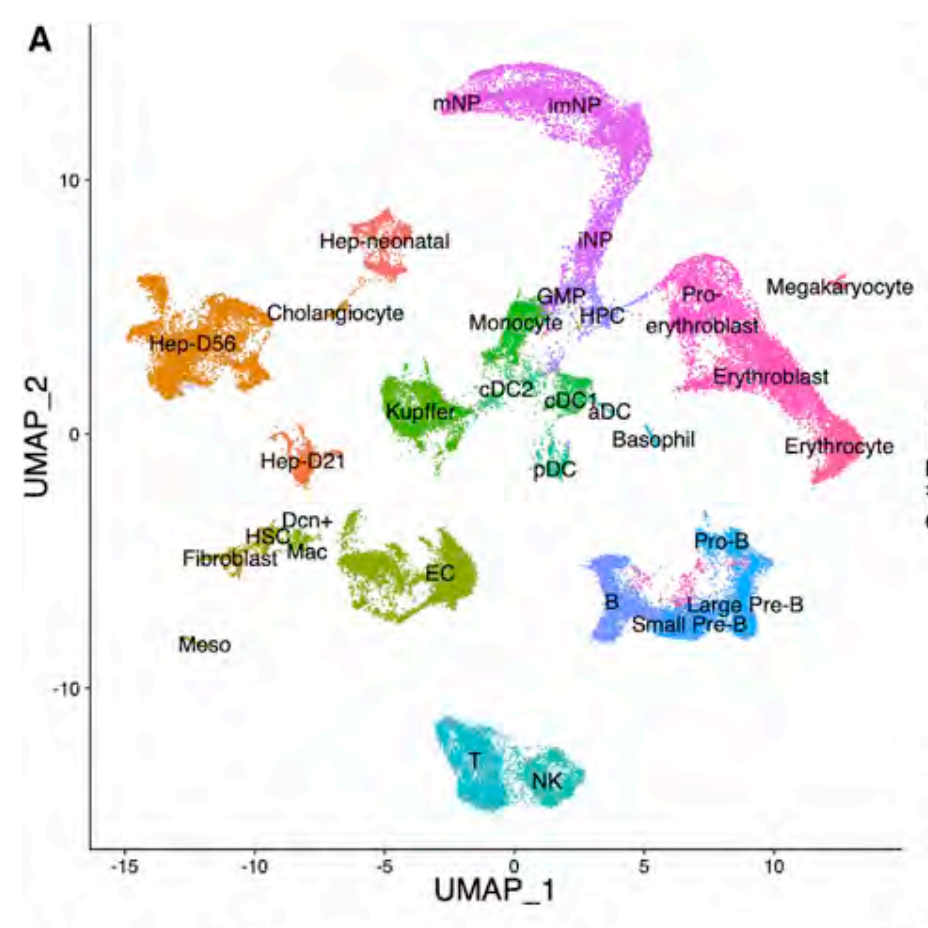
###### Figure 9: A UMAP Plot of single-cell Clusters (Liang, Yan, et al. “Temporal Analyses of Postnatal Liver Development and Maturation by Single-Cell Transcriptomics.” Developmental Cell, Cell Press, 7 Feb. 2022)


Figure 9 is a example result of dimension reduction. By using Seurat, we can visualize the count matrix using two most significant dimensions, and achieve clusters automatically. After this, we can find marker genes for each cluster and determine what they represent. As in UMAP plots, the general structure and distances between clusters also contains information, we are able to generate rich analysis results using Dimension Reduction.

```
Dev_NPC <- RunPCA(Dev_NPC, features = VariableFeatures(object = Dev_NPC), verbose = FALSE, npcs = 100) 
```

The first key step of dimension reduction is PCA -- Principal Component Analysis. With PCA we find independent and separated features and prepare for clustering. 
```
Dims <- 30
Dev_Hep <- FindNeighbors(Dev_Hep, dims=1:Dims)
Dev_Hep <- FindClusters(Dev_Hep, resolution=0.3) #resolution 0.3
```
After we reduce the data to 2 dimensions, we need to generate the clusters based on the separated data. Luckily, Seurat automatically generates clusters with two methods: ```FindNeighbors()``` and ```FindClusters()```. In ```FindNeighbors()```, Seurat applies a Shared Nearest Neighbor algorithm to decide the similarity between cells. It is a updated KNN algorithm with the shared nearest similarity calculated. After we draw the plot, we identify the plot by dividing the data points to clusters. The Louvain Method is adopted here in ```FindClusters()```. Though the clusters are generated by algorithm, we can change the number of clusters by changing the resolution -- just like zooming in and out.
```
Dev_Hep <- RunTSNE(Dev_Hep, dims = 1:Dims, tsne.method = "Rtsne", nthreads = 8, max_iter = 2000)
Dev_Hep <- RunUMAP(Dev_Hep, dims = 1:Dims)
```

To visualize the clusters, we mainly have two methods: tSNE or UMAP to better separate and visualize the clusters. They both reduce higher dimensional data to two dimensions and then we plot clusters with the data. UMAP is the newer and more comprehensive tool, which is better based on mathematical induction than tSNE. When we compare UMAP and tSNE plots, UMAP uses cross-entropy loss as loss function and results in a more authentic general structure. It is also much faster than tSNE, especially on large data sets.

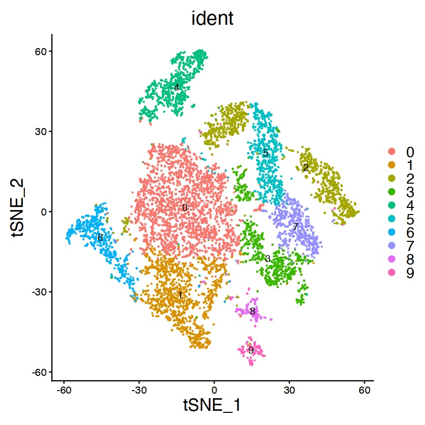
###### Figure 10: A tSNE Plot of 10 Clusters (Plotted by Yiming Gao)

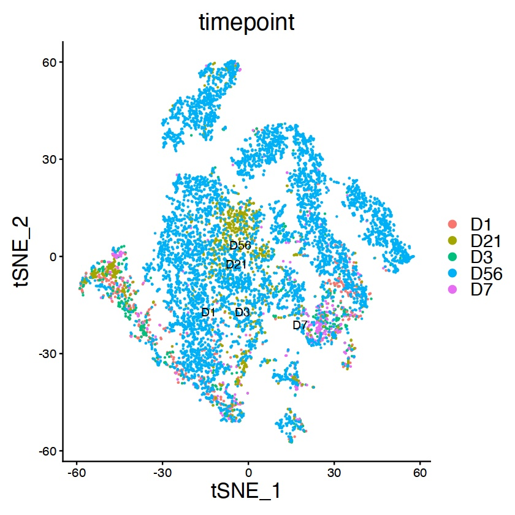
###### Figure 11: The same tSNE Plot with respect to timeline (Plotted by Yiming Gao)

Figure 10 and 11 are examples of visualizing tSNE-based clusters. We can see this plot with first, clusters based on identities and second, clusters based on timeline. When we compare the two plots, we can understand how the different clusters of cells change with respect to time.

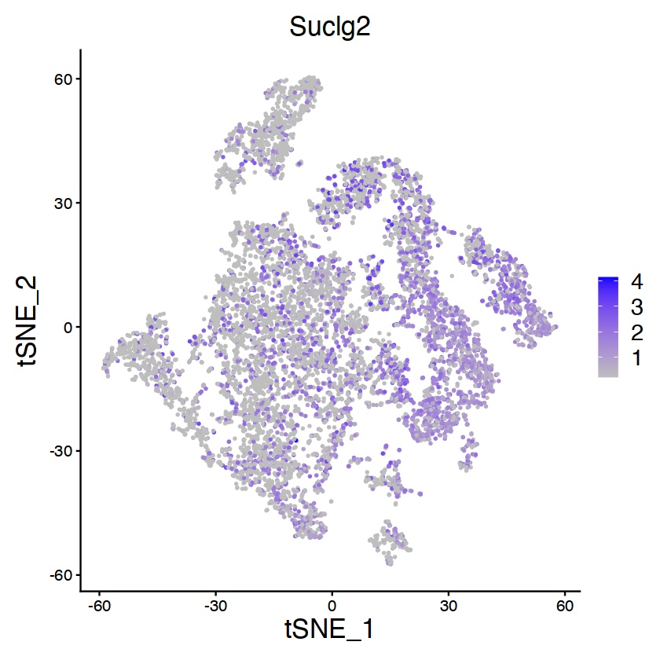
###### Figure 12: Feature of marker gene among previous clusters (Plotted by Yiming Gao)

We can use more ways to visualize the dimension reduction analysis. For example, in Figure 12, we can use marker genes (The _Feature_) and show their concentration among the clusters. Suclg2 is a marker gene of mitochondria TCA cycle, so we can see its distribution in the clusters and assume the functional relationship between different clusters of cells and mitochondria activities.

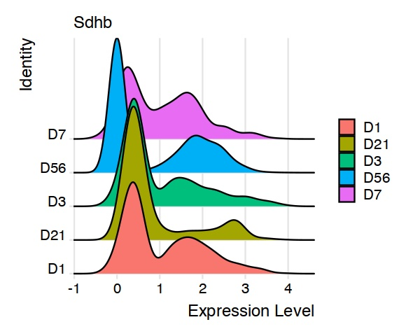
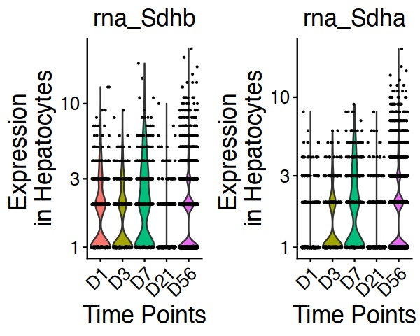
###### Figure 13: RidgePlot of Expression Levels in different days (Plotted by Yiming Gao)
###### Figure 14: ViolinPlot of Expression Levels in different days (Plotted by Yiming Gao)

In Figure 13 and 14, RidgePlots and ViolinPlots are used in showing the expression level differences between days or features.

#### Differential Expression Analysis 

Another section of Single-cell Sequencing analysis is differential expression (just like bulk RNA sequencing). To find Differentially Expressed genes, we have a convenient method: ```FindAllMarkers()```. It calculates the DE genes in each cluster and we can save the result in a csv file, just like the DESeq2 result. The head lines are shown in Figure 15.

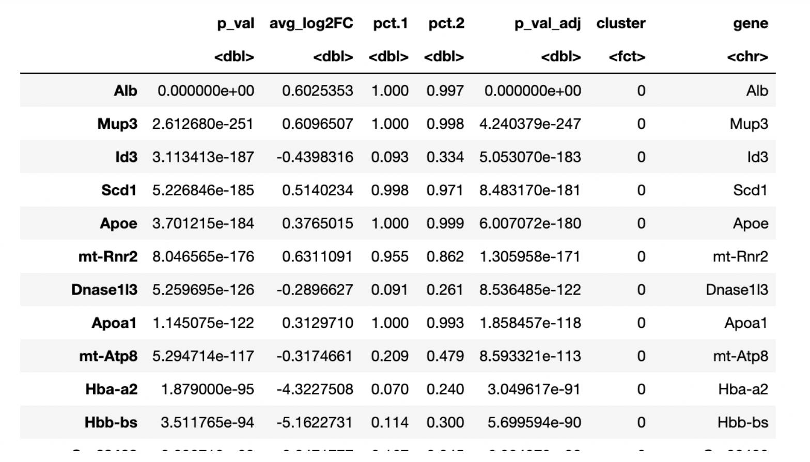
###### Figure 15: Differential Expression Analysis (Generated by Yiming Gao)

The difference, or advantage we get from single-cell sequencing compared to bulk RNA sequencing is that we can get information about each type of cell instead of all cells mixed. Seurat has designed multiple tools to utilize this advantage.

The Seurat toolkit updates fast, so some methods with similar functions (i.e. ```FindMarkers``` and ```FindAllMarkers```) have been used in different time periods. Make sure to consult the current [Seurat reference page](https://satijalab.org/seurat/reference/index.html) for advice!

In conclusion, single-cell sequencing provides differentially expressed genes and classify functions with different clusters of cells.

## **References**
1. “Brent Cornell.” BioNinja, http://www.ib.bioninja.com.au/options/option-d-human-physiology/d6-transport-of-respiratory/lung-tissue.html. 
2. “Recent Advances in Single-Cell Genomics Techniques.” Genomics Research from Technology Networks, https://www.technologynetworks.com/genomics/articles/recent-advances-in-single-cell-genomics-techniques-324695. 
3. IBioEducation, director. Single Cell Sequencing. YouTube, YouTube, 28 Aug. 2020, https://www.youtube.com/watch?v=k9VFNLLQP8c&amp;t=479s. Accessed 4 Dec. 2022. 
4. “01 Single Cell Introduction.” YouTube, YouTube, 20 Apr. 2020, https://www.youtube.com/watch?v=hWWkpe4Ewgo. 
6. “Seurat - Guided Clustering Tutorial.” • *Seurat*, https://satijalab.org/seurat/articles/pbmc3k_tutorial.html. 
7. L.Wolock, Samuel, et al. “Scrublet: Computational Identification of Cell Doublets in Single-Cell Transcriptomic Data.” *Cell Systems*, Cell Press, 3 Apr. 2019, https://www.sciencedirect.com/science/article/pii/S2405471218304745.
8. Ilicic, Tomislav, et al. “Classification of Low Quality Cells from Single-Cell RNA-Seq Data.” *Genome Biology*, U.S. National Library of Medicine, 17 Feb. 2016, https://www.ncbi.nlm.nih.gov/pmc/articles/PMC4758103/.  
9. “Cell Ranger.” *What Is Cell Ranger? -Software -Single Cell Gene Expression -Official 10x Genomics Support*, https://support.10xgenomics.com/single-cell-gene-expression/software/pipelines/latest/what-is-cell-ranger. 
10. "Function reference · Seurat" Seurat, https://satijalab.org/seurat/reference/index.html.
11. Liang, Yan, et al. “Temporal Analyses of Postnatal Liver Development and Maturation by Single-Cell Transcriptomics.” Developmental Cell, Cell Press, 7 Feb. 2022, https://www.sciencedirect.com/science/article/abs/pii/S1534580722000041. 
