# Sanger Sequencing vs Next Generation Sequencing vs Third Generation Sequencing

### By: Shria Arcot, Siddharth Gaywala, Ryan Truong - Group 13

1. [Introduction](#1)
2. [Sanger Sequencing](#2)
3. [Next Generation Sequencing](#3) 
    3.1 [Advantages of NGS](#4) 
    3.2 [Illumina Sequencing](#5) 
    3.3 [Other Modern NGS Technologies](#6)
4. [Third Generation Sequencing](#7) 
    4.1 [Advantages of 3GS](#8) 
    4.2 [Pacific Biology SMRT](#9) 
    4.3 [Nanopore Technology](#10)
5. [Conclusion](#11)

***

## 1. Introduction
DNA Sequencing is extremely important to the field of biology. DNA is made of enormous chains of nucleotides that have 1 of 4 different bases attached (adenine, cytosine, guanine, and thymine), and encode the genetic information contained in almost every living cell, through the order of these nucleotides. Therefore, sequencing DNA can provide information about genetic variation (both within and between species), how healthy organisms can function, and disease pathogenesis. Furthermore, DNA-sequencing has allowed a plethora of techniques to be developed, such as RNA-seq, ChIP-seq, MARIO, etc. Ultimately, DNA Sequencing is an extremely important technology with many applications in biology.

There are 3 categories of DNA Sequencing. Sanger Sequencing, also called First-Generation Sequencing, was developed in 1977 and is great at sequencing small amounts of DNA. Next-Generation Sequencing, developed in the 2000s, is great at investing many genomic loci. 3rd Generation Sequencing, developed around 2010, is great at constructing a more complete picture of the genome, especially for sites that are hard to sequence typically. The following chapters provide more information on how these technologies work. 

## 2. Sanger Sequencing
In 1977 Frederick Sanger developed a method by which the sequence of strands of DNA could be read, now known as Sanger Sequencing. Despite being slower and more costly for larger quantities of DNA or when sequencing multiple DNA targets, Sanger Sequencing is still used today. While it is considered less efficient than more modern sequencing methods, it did lay down the foundation for the development of future sequencing technologies such as Next Generation Sequencing. 

The basic idea behind Sanger Sequencing is utilizing Polymerase Chain Reaction (PCR) to replicate the desired strand to be sequenced with labeled chain-terminating nucleotides (ddNTPs) alongside normal nucleotides (dNTPs) to produce a series of strands that terminated at different bases, which can then be read to determine the sequence of the original strand.

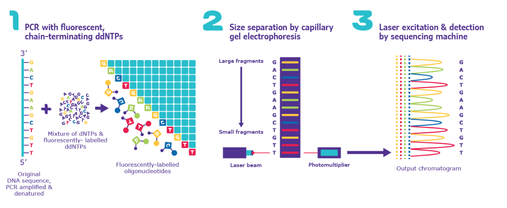
*Figure 2.1: Sanger Sequencing process steps diagram (Sigma-Aldrich).*

Steps:
1. Run PCR with original DNA strand, primers, buffer, fluorescently labeled chain-terminating ddNTPS, and normal dNTPs.
2. Separate the produced strands by size using gel electrophoresis.
3. Using laser excitation and detection determine the nucleotide identity (A,T,G,C) for each chain-terminating base in the sequence.

ddNTPs vs dNTPs:

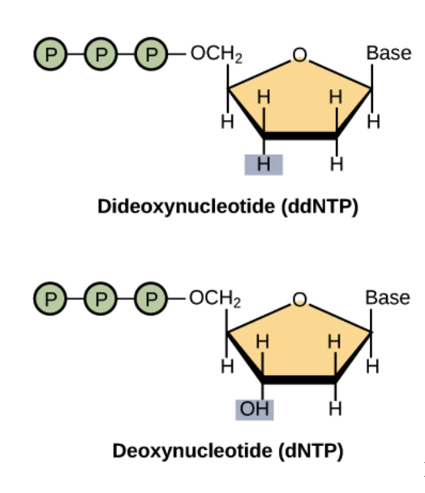

*Figure 2.2: Comparison of dNTP versus ddNTP (Khan Academy).*

dNTP stands for Deoxynucleoside Triphosphate, often generally referred to as nucleotides, and are the building blocks for DNA (Deoxyribonucleic Acid).  The hydroxyl group (OH) on the ribose sugar on the 3’ end of a dNTP is able to bond with the phosphate group on the 5’ end of another nucleotide to form a polynucleotide (polymer of nucleotides). In ddNTP, or Dideoxynucleoside Triphosphate, the hydroxyl group on the ribose sugar is replaced with a hydrogen (H), preventing it from being able to bond with another nucleotide of its 3’ end, thus terminating the DNA sequence. Since DNA is always synthesized in the 5’-3’ direction, this means, when present, ddNTPs will still be able to be added to the strand, but will terminate further synthesis. For Sanger Sequencing to be successful about 1% of the total nucleotides can be ddNTPs, otherwise it will be difficult to produce larger fragments and thus read the entire sequence of the original DNA.

How to Read Sanger Sequencing Results:
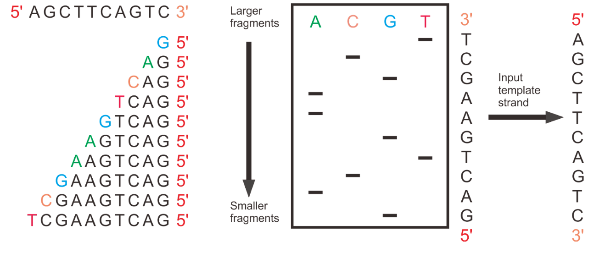
*Figure 2.3: Visualization of ddNTPS terminating strands at different lengths to enable sequence reading in Sanger Sequencing (Jack Westin).*

In Sanger Sequencing, PCR produces a variety of copies of the original DNA that terminate at different lengths due to when a ddNTP is added to the sequence. If this happens earlier in the strand then the resulting sequence will be shorter, as the strand will stop synthesizing bases past that point. Thus, after gel electrophoresis orders the strands by size, the strands are sorted by order of the chain-terminating ddNTPs’ location in the original strand sequence. The ddNTPs fluorescent label, indicating whether it is a Adenine, Guanine, Cytosine, or Thymine based on color, allows for the sequencing machine to then use lasers to read the sequence of the original strand.

Advantages of Sanger Sequencing:
* Being the first method of DNA sequencing it has a more familiar workflow that is simpler to understand
* Fast and cost-effective for strands of smaller lengths (less than 1000 base pairs) and when there are a low number of DNA targets being sequenced (less than 20)
* High accuracy (99% accuracy)

## 3. Next Generation Sequencing
Now with the ideas of Sanger sequencing brought to light, one notion that may come up is that the procedure is relatively slow and cost ineffective when there are many DNA targets that want to be sequenced. This claim has led genomic researchers to discover and invent in the early to mid 2000s another type of sequencing technique called next-generation sequencing (NGS), also known as high-throughput sequencing. The key idea of this technique lies in the term high-throughput, meaning that millions of DNA molecules can be sequenced in parallel generating millions of reads with 50 to 300 base pair lengths. Understanding how this is achieved is discussed below.

### 3.1 Advantges of NGS
**1. High throughput**

High throughput encapsulates the idea where millions of DNA copies can be sequenced at a time, in parallel. Compared to Sanger sequencing which may only be effective at targeting a few genes, this characteristic of NGS has allowed researchers to increase their scope of target and make observations they wouldn’t have been able to make previously.

**2. Speed and cost**

This idea has direct correlation to the results of having high throughput. Because much more DNA can be targeted at once, this requires less resources and time compared to Sanger sequencing.

**3. Mutation discovery**

This idea also has direct correlation to the results of having high throughput. Because much more DNA can be targeted at once, this allows the magnitude of DNA being compared to increase dramatically. Because a wider array of output exists, comparisons could be made across more points leading to the discovery of novel variants.

### 3.2 Illumina Sequencing
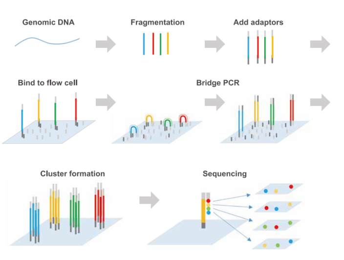
*Figure 3.2: Illumina next-generation sequencing process.*

Because Illumina’s next-generation sequencing technology has been the most popular option and standard with respect to other next generation sequencing technologies, it will serve as the model to explain how such high throughput is achieved.

**Step 1. Sample Preparation**

The first step of sequencing is preparing the DNA. This entails fragmenting the DNA into 150-200 bp lengths. After the DNA is fragmented, adapters are ligated to the DNA fragments. These adapters serve as a way for the fragmented DNA to bind to the flow cell and to further be sequenced. During this ligation, PCR (separate from bridge amplification) takes place to ensure there are enough sample copies being ligated to the adapters.

**Step 2. Cluster Generation via Bridge Amplification**

During this step, the DNA is run through the flow cell and on the surface of it, there exists two types of oligos (short, synthetic DNA). The first oligo that the DNA hybridizes to is complementary to the adapter region and a polymerase generates a complement of the original fragment. This creates a double stranded molecule consisting of the original template DNA and its complement. The double stranded molecule is then denatured and the original template DNA is washed away. The DNA strand that was generated from the oligo then folds over and hybridizes to the second type of oligo. A polymerase generates the complementary strand creating a double stranded bridge. The bridge is then denatured, creating two single stranded copies (one is the forward strand and one is the reverse) which are attached to the flow cell. The process is repeated over and over, generating what is known as a cluster via bridge amplification. The reverse strands are then cleaved and washed off. 

**Step 3. Sequencing by Synthesis**

The flow cell is then loaded into the sequencer for extension and imaging. During this step, fluorescently tagged nucleotides compete for addition to the sequencing primer, which hybridizes to the DNA strands created in step 2. The creation of clusters ensures that the fluorescent signals are strong enough to be identified and for a base to be determined. 

Connecting back to the idea of high throughput, this technique allows for millions of clusters to be generated and sequenced in parallel, meaning DNA can be efficiently read and  sequenced via this technique.

### 3.3 Othern Modern NGS Technologies

**1. Roche 454 Sequencing**

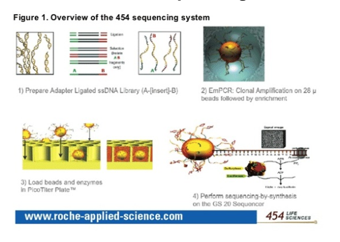

*Figure 3.3.1: 454 sequencing process.*

Roche 454 sequencing was one of the first next-generation sequencing technologies to be made commercially available. This sequencing technology focused on using beads to capture and amplify the DNA. After DNA was amplified, pyrosequencing, light detection based on a chain reaction that occurs when pyrophosphate, was utilized to determine the sequence

**2. Ion Torent**

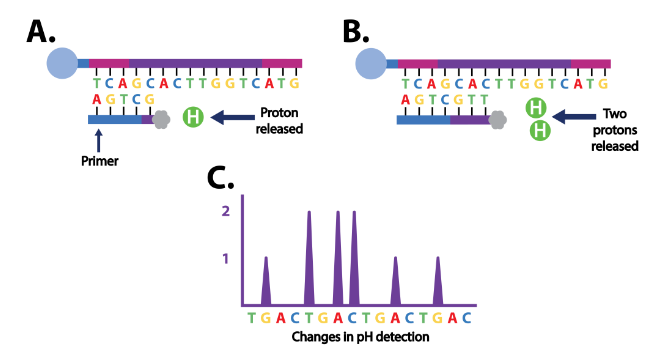

*Figure 3.3.2: Ion Torrent sequencing process.*

The key aspect for ion torrent sequencing lies in what the DNA is detecting when it is being sequenced. In this method, the hydrogen ions being released into the growing DNA template is detected and used to produce reads. 

**3. SOLiD**

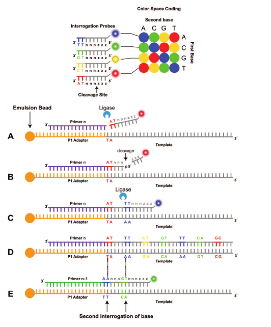

*Figure 3.3.3: SOLiD sequencing process.*

Like Roche 454 sequencing, SOLiD sequencing also utilized beads to amplify DNA. The difference in this method lies in the sequencing technique. This method utilizes ligation of fluorescently labeled DNA.

## 4. Third Generation Sequencing

Imagine trying to solve a 10,000 piece puzzle. Now imagine trying to solve a 10 piece puzzle. This is akin to trying to piece together a genome using NGS compared to 3rd generation sequencing (Fig3A). 3rd Generation Sequencing (3GS), also called long-read sequencing, has reads of about 10,000 base pairs rather than 200 base pairs. Because each read in 3GS is much longer, there are less puzzle pieces that need to fit together to construct the genome, and constructing the genome is not only easier, but also likely more accurate. It is easier to align a few long reads than it is to align many short reads.

*Figure 4: Metaphor of puzzle pieces.*

### 4.1 Advantages of 3GS

**1. Repeat Sequences**

Some studies estimate 30% of the human genome is made of repeat DNA. However, NGS often can’t sequence repeat DNA well. Since reads are only 200 base pairs long, reads made of only repeat DNA would have multiple locations they can map to, and researchers cannot determine which is the correct location. However, when reads are 10,000 base pairs, like with 3GS, repeats can more readily be identified, since the reads will likely have a unique location on the genome they can be mapped to.

Repeat sequences are often called junk DNA, but understanding repeat sequences has huge implications for understanding the genome. For example, take the case of Huntington’s disease, where disease progression is correlated with the number of CAG repeats within the Huntington’s gene. Individuals with fewer than 26 CAG repeats in this gene would likely not suffer Huntington’s disease, while individuals with more than 40 CAG repeats will likely suffer Huntington’s disease. Individuals with more than 60 CAG repeats will likely suffer early-onset Huntington’s disease.

**2. Chromosome Translocations**

Mutations aren’t only the typical insertions, deletions, and substitutions that can be identified via NGS. Some mutations are chromosome translocations, where entire segments of chromosomes are switched or moved to different locations in the genome. This is extremely hard to identify through NGS: 200 base-pair reads from the original genome and a genome with a chromosome translocation essentially look the same. However, 3GS can identify chromosome translocations. Since the reads in 3GS are longer, it is likely that reads will traverse enough of the chromosome translocation to be able to identify a chromosome translocation occurred.

For example, a chromosome translocation, deemed the Philadelphia translocation, occurs when a specific chromosome translocation between chromosome 9 and 22 occurs (Fig 3B). This creates a BCR-ABL fusion protein, where the ABL gene is now controlled by BCR and is often associated with chronic myeloid leukemia. NGS would likely not be able to identify if this change had occurred. However, because 3GS reads can kind of stretch-across this translocated segment,  the Philadelphia translocation can be identified.

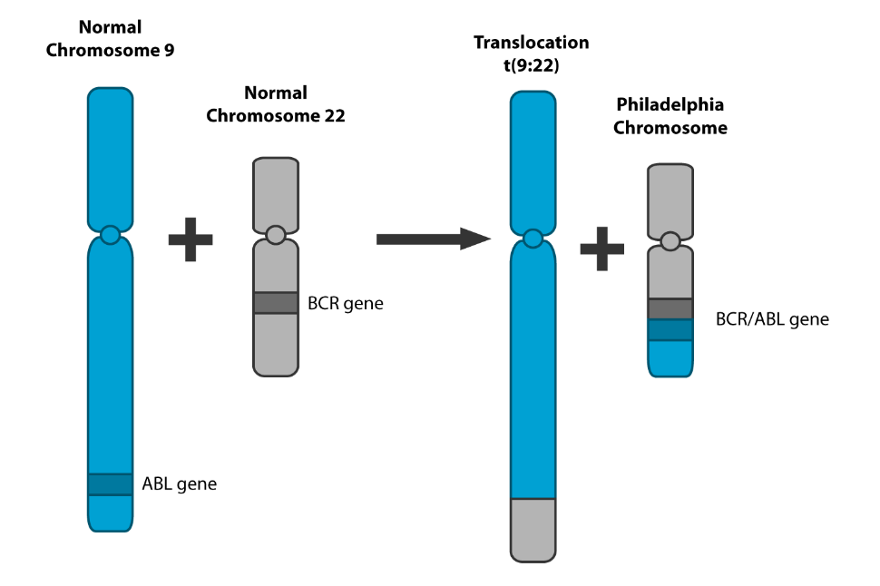

*Figure 4.1: BCR-ABL Fusion Protein Translocation (Philadelphia Chromosome).*

**3. Which chromosome an allele is on**

Mammals are homologous, meaning they have 2 sets of each chromosome. NGS can identify the presence of alleles, but it cannot determine which chromosome that allele is part of. For example, say there is an allele for a gene on chromosome 1. Then, NGS could not determine which chromosome 1 that allele came from, since the reads are so short. With 3GS, the longer reads make it easier to determine which chromosome has a certain allele, since more of the chromosome is spanned by a read. This can become important when 2 genes are less than 50 map units apart, meaning that the 2 genes are often inherited together. Then, it becomes important to know which chromosome each allele is on.

### 4.2 Pacific Biology SMRT

In single molecule real time sequencing (SMRT) is somewhat similar to NGS in that sequencing is done through sequencing by synthesis and the use of fluorescent nucleotides. A DNA polymerase is fixed in place at the bottom of a well (Fig 3C). When the correct nucleotide is inserted, a fluorescent signal is made and a camera detects it. The fluorescent group is then cleaved and diffuses away. Because this method has a high error rate that occurs at random, often the same DNA molecule is sequences many times and a consensus sequence is generated from the multiple runs.

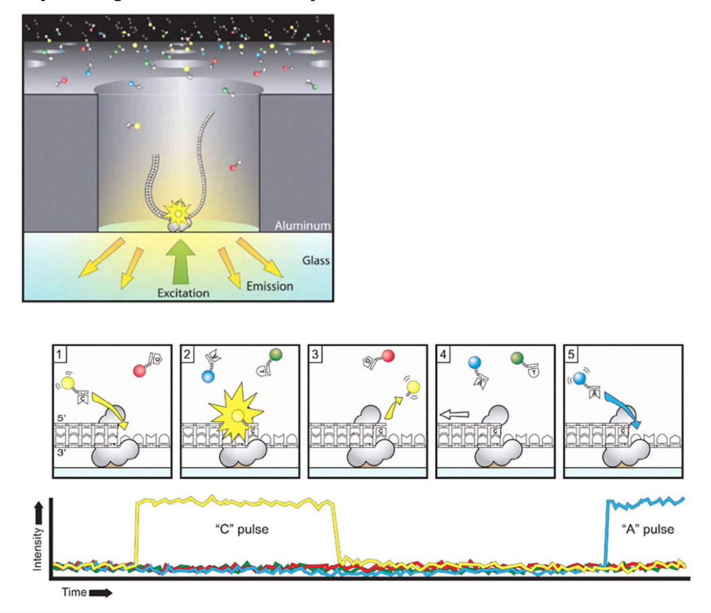

*Figure 4.2: Overview of SMRT Sequencing.*

### 4.3 Nanopore Technologies

In nanopore sequencing, single-stranded DNAs or single-stranded RNAs are passed through small pores that are embedded in lipid membranes. Since the membranes are made of lipids, which do not conduct electricity well, any currents applied to the membrane can only pass through the pore (Fig 3D). Each nucleotide (Guanine, Cytosine, Thymine, or Adenine) conducts the electricity at different degrees as well. By passing a set electric current and measuring the amount of electric current that passes through gives information about what bases are in the pore (Fig 3E). In reality, the analysis as a little more complicated because multiple bases can be in the pore at a single time. There is some hope that this technology could be used to sequence proteins in the future.

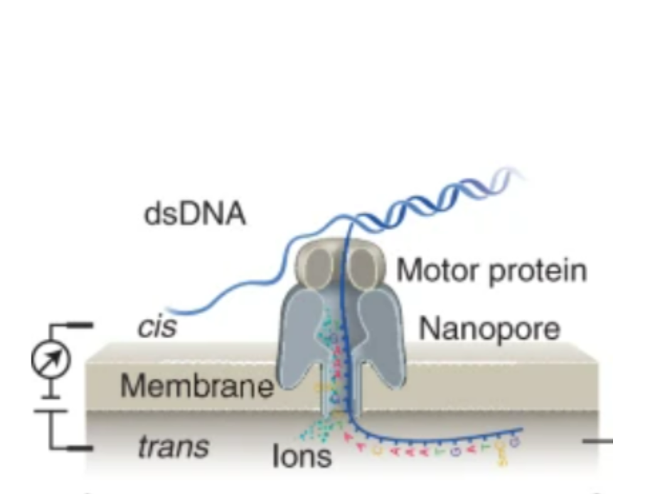

*Figure 4.3.1 Nanopore with Single-Stranded DNA passing through. Nanopore is embedded in a lipid membrane. Current is applied.*

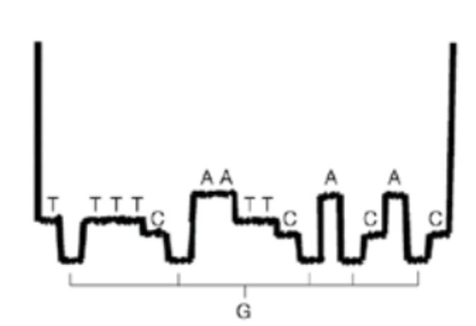

*Figure 4.3.2 Current readings from Nanopore 3GS. Each base has a different current reading.*

## Conclusion

When sequencing DNA there are a multitude of options, each of which have their own pros and cons. Sanger sequencing is a more commonly understood method that is useful for sequencing small loci of DNA. For longer strands or when there are a multitude of targets, however, Next Generation Sequencing can be more beneficial. Its high throughput enables it to be much faster and more cost effective than Sanger sequencing when sequencing large loci or trying to understand whole genomes. When looking at specific features in the genome, it may become more beneficial to be able to sequence longer strands without having to shotgun or fragment them, as is done in Sanger sequencing and NGS prior to sequencing. In this case 3rd generation sequencing can be beneficial. By sequencing larger strands wholly it allows for features like repeats and chromosome translocations to be studied more easily.

## References

1. Advancing Genomics, medicine and health together – by semiconductor DNA ... Advancing genomics, medicine and health together – by semiconductor DNA synthesis technology. (n.d.). Retrieved December 1, 2022, from https://www.genscript.com/webinars/advancing-genomics-medicine-and-health-together-by-semiconductor-dna-synthesis-technology.html 

2. Brown, S. M. (2012, September 13). Sequencing genomes from neanderthals to James Watson: The Roche 454 genome sequencer explained. Bitesize Bio. Retrieved December 1, 2022, from https://bitesizebio.com/13548/sequencing-genomes-from-neanderthals-to-james-watson-the-roche-454-genome-sequencer-explained/ 

3. Cao Yu et al. A Review on the Applications of Next Generation Sequencing Technologies as Applied to Food-Related Microbiome Studies. Frontiers in Microbiology. 8. 2017. https://www.frontiersin.org/articles/10.3389/fmicb.2017.01829. 10.3389/fmicb.2017.01829

4. CD Genomics. (n.d.). Overview of pacbio SMRT sequencing: Principles, workflow, and applications. CD Genomics. Retrieved December 1, 2022, from https://www.cd-genomics.com/pacbio-smrt-system-single-molecule-real-time-sequencing.html

5. Churko JM, Mantalas GL, Snyder MP, Wu JC. Overview of high throughput sequencing technologies to elucidate molecular pathways in cardiovascular diseases. Circ Res. 2013 Jun 7;112(12):1613-23. doi: 10.1161/CIRCRESAHA.113.300939. PMID: 23743227; PMCID: PMC3831009.

6. Frederick Sanger Facts. The Nobel Prize. (n.d.). Retrieved December 1, 2022, from https://www.nobelprize.org/prizes/chemistry/1980/sanger/facts/ 

7. "History of sequencing technology". Wikimedia Commons, 12 August 2020, https://commons.wikimedia.org/w/index.php?curid=101041189

8. Illumina. (n.d.). Introduction to NGS. What is NGS?. Retrieved December 1, 2022, from https://www.illumina.com/science/technology/next-generation-sequencing.html 

9. Illumina. (n.d.). NGS vs. Sanger Sequencing. Key differences between next-generation sequencing and Sanger sequencing. Retrieved December 1, 2022, from https://www.illumina.com/science/technology/next-generation-sequencing/ngs-vs-sanger-sequencing.html 

10. Nguyen, J. (2021, November 24). Ion torrent sequencing. Apollo Institute. Retrieved December 1, 2022, from https://apollo-institute.org/ion-torrent-sequencing/ 

11. Sigma Aldrich. (n.d.). Sanger Sequencing Steps &amp; Method. Millipore Sigma. Retrieved December 1, 2022, from https://www.sigmaaldrich.com/US/en/technical-documents/protocol/genomics/sequencing/sanger-sequencing 

12. Wang, Y., Zhao, Y., Bollas, A. et al. Nanopore sequencing technology, bioinformatics and applications. Nat Biotechnol 39, 1348–1365 (2021). https://doi.org/10.1038/s41587-021-01108-x 