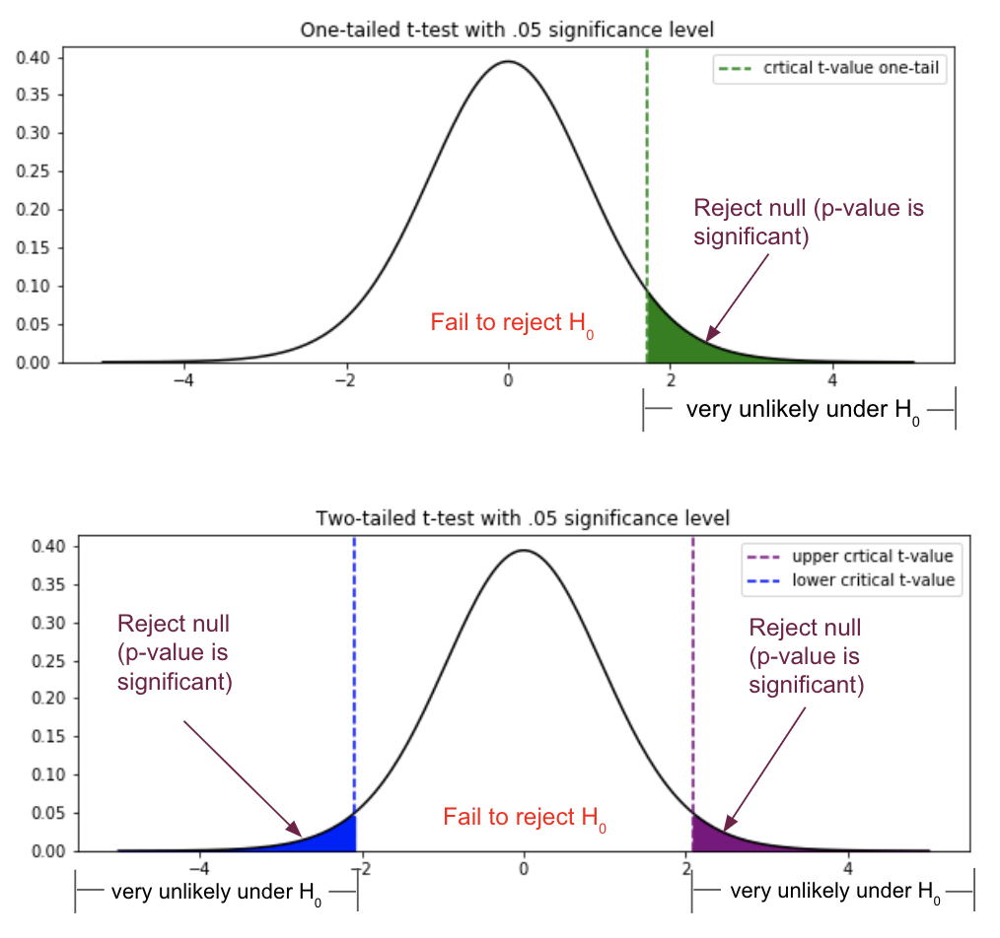

# Hypothesis Testing
Team 14: Nikhil Rao, Varshini Sathish, Sarah Davydov

---

# Table of Contents
- [Hypothesis Testing](#hypothesis-testing)
- [Table of Contents](#table-of-contents)
- [What is hypothesis testing?](#what-is-hypothesis-testing)
- [The Importance of Hypothesis Testing](#the-importance-of-hypothesis-testing)
- [The 5 Steps of Hypothesis Testing](#the-5-steps-of-hypothesis-testing)
  - [Step 1: Form the two hypotheses.](#step-1-form-the-two-hypotheses)
  - [Step 2: Collect data to test your hypothesis.](#step-2-collect-data-to-test-your-hypothesis)
  - [Step 3: Determine the test statistic.](#step-3-determine-the-test-statistic)
  - [Step 4: Calculate the p-value.](#step-4-calculate-the-p-value)
  - [Step 5: Make a Conclusion.](#step-5-make-a-conclusion)
- [Summary](#summary)
- [References](#references)
- [Images](#images)

---

# What is hypothesis testing?
Hypothesis testing is used to statistically evaluate how strongly the data supports a hypothesis. Generally, it is used to draw conclusions about a population from a smaller sample of that population. 

Examples of when one would use hypothesis testing:
1. A new drug X to treat arthritis is manufactured. Researchers want to know if drug X significantly alleviates joint pain in arthritic patients.
2. Scientists want to determine whether smoking cigarettes every day leads to lung cancer.
3. To predict the outcome of the election, Senator Zhang wants to know if the sample of voters polled is representative of the entire population.

# The Importance of Hypothesis Testing
Hypothesis testing is a vital process used to measure the validity and reliability of the outcome in an experiment. It allows one to determine whether the data from the sample is representative of the larger population by statistically proving if it is significant or not. Furthermore, it provides a framework during any decision by using a set of deductions to know whether we have enough evidence to reject our original claim or not. Therefore, it is an important process in any scientific experiment when finalizing any decisions about a dataset.

# The 5 Steps of Hypothesis Testing
1. Form the null hypothesis and the alternative hypothesis
2. Gather or generate the data
3. Calculate the test statistic
4. Calculate the p-value
5. Arrive at the conclusion

## Step 1: Form the two hypotheses.
The first step is to form the null and the alternative hypotheses, also known as H0 and H1, respectively, which must be competing. If considering the null and alternative hypothesis as sets, then the two sets should not intersect; in essence, they must be disjoint.

The null hypothesis is generally the “simpler” of the two hypotheses. It posits that there is no difference between a control group or accepted value and the group that you are testing or modifying. The alternative hypothesis is the opposite of the null hypothesis. It states that there is a significant difference between the two groups being compared or between the group and value being compared.

Example of good null and alternative hypotheses:

>H0: There is no significant difference in joint pain among patients who use drug X for their arthritis versus patients who do not use drug X.

>H1: Patients who use drug X for their arthritis experience less joint pain than those who did not use drug X.

In the example above, notice that the two hypotheses are competing. There is no scenario where there can ***and*** cannot be a significant difference in joint pain among patients who use and do not use drug X. Only one of the hypotheses can be true.

We will go over two separate examples of hypothesis testing for demonstration purposes. In these examples, you may notice that the hypotheses are specific and can be tested using empirical data.

Example 1: 
>H0: There is ***no significant difference*** in final exam scores between students who received at least 8 hours or sleep and students who received at most 6 hours of sleep the night before.

>H1: Students who receive at least 8 hours of sleep the night before an exam will score higher than students who receive at most 6 hours of sleep the night before.

&nbsp;  
Example 2:

For background, VEGF-A is a gene that promotes angiogenesis when highly expressed. The gene is often highly expressed in cancer cells, since cancer cells require oxygen to be delivered to the tumor site by blood vessels in order to survive and multiply.

>H0: There is ***no significant difference*** in expression of the VEGF-A gene in bone cancer patients compared to the baseline RNA-seq RPKM value in healthy adults.

>H1: There is a significant difference in expression of the VEGF-A gene in bone cancer patients compared to the baseline RNA-seq RPKM value in healthy adults of 100.

## Step 2: Collect data to test your hypothesis.

Once you have determined your two competing hypotheses, you either need to ensure that the data you have is sufficient to test your null hypothesis against your alternative hypothesis, or conduct an experiment that will result in data that you can use to test the null hypothesis. Statistical tests will be performed on the data to determine whether the null hypothesis can be rejected. When designing the study, experimenters should do their best to avoid confounding variables, such as the amount of study hours in our first example.

Example 1: We will randomly select students from a classroom to ask how many hours they slept the night before. The first 5 students who report having slept at most 6 hours will be included in group 1, and the first 5 students who report having slept 8 hours or more the night before will form group 2. All 10 of the students will then take a test and their responses will be recorded.

To avoid the confounding variable of study time, we also asked the students how many hours they spent studying for the exam, and made sure that the average study time for each group was approximately the same.

Table 1: Exam scores by amount of sleep
|Group| Exam Score(s) | Mean | Standard Deviation |
|:-----------:|:----------------:|:----------:|:-------:|
|At most 6 hours    | 94.40   79.69   77.91   82.36   73.73 | 81.62 | 7.804 |
|8 hours or more  | 93.06   83.20   84.18   88.26   75.62 | 84.86 | 6.47 |

Example 2: We will gather 25 adults with bone cancer through random selection and take a sample of the cancerous tissue. We will then perform single-cell RNA-seq for each individual and gather the RPKM expression values for the VEGF-A gene.

**Sorted RPKM values for the VEGF-A gene from adults with bone cancer**: 60 , 77 , 93 , 106 , 145 , 204 , 207 , 209 , 213 , 225 , 228 , 233 , 234 , 236 , 239 , 258 , 260 , 262 , 266 , 270 , 271 , 274 , 277 , 279 , 282

**Baseline average RPKM value for VEGF-A in healthy adults**: 100

## Step 3: Determine the test statistic.

The test statistic describes how closely the distribution of your data matches the distribution predicted under the null hypothesis of the statistical test used. Different statistical tests predict different distributions, so it’s important to choose the right statistical test based on your hypothesis and data.

However, all test statistics must output a single value and provide some insight into the variation of the data.

Example 1:

For the class sleep versus final exam score data, we use a two-sample one-tailed t-test. We use a two-sample test because we are comparing two groups to one another and the groups have a total of less than 30 subjects. We use a one-tailed test since we are only hypothesizing that one group (more than 8 hours of sleep) will score higher than the other group (less than 6 hours of sleep). If we had hypothesized that the two groups would be significantly different to one another, without specifying one being greater than the other, then we would have used a two-tailed test. We use a t-test since our sample size is less than 30.

For a two-sample t-test, the formula for the t-statistic is the difference between the sample means, divided by the pooled standard deviation and the square root of the sum of the reciprocals of each sample size:

$$ t = { \bar{x} - \bar{y} \over { s_p  \sqrt{ {1 \over n} + {1 \over m} } } } $$

The formula for sp2, the pooled variance, is the average of the variances of each of the samples:

$$ s_p^2 = { {s_1^2 + s_1^2} \over 2 } $$

Using these formulas, we can calculate the t statistic in our example of class exam scores.

$$ s_p = { \sqrt{{ {7.804^2 + 6.47^2} \over 2 }} = 7.168 } $$

$$ t = { 84.86 - 81.62 \over { 7.168  \sqrt{ {1 \over 5} + {1 \over 5} } } } = 0.715 $$

Example 2:

For the RNA-seq expression data, we use a one-sample two-tailed t-test. We use a one-sample test since we only have one sample in our experimental data, the VEGF-A RPKM values. We use a two-tailed test since we want to know if the data is greater than or less than the RPKM value given to us for healthy adults. We use a t-test since our sample size is less than 30.

For a one-sample t-test, the formula for the t-statistic is the difference between the sample mean and the mean of the null hypothesis, divided by the standard deviation divided by the square root of the sample size:

$$ t = { \bar{x} - \mu \over { s \over \sqrt{n} } } $$

Using this formula, we can calculate the t-statistic:

$$ t = { 216.32 - 100 \over { 66.97 \over \sqrt{25} } } = 8.69 $$

The test statistic will then be used to calculate the p-value in the next step.

## Step 4: Calculate the p-value.

The next step is to calculate the p-value, which is the probability of obtaining a test statistic equal to or more extreme than the one you calculated, given that the null hypothesis is true. The information that is needed to calculate the p-value is the test statistic and the degrees of freedom (Df), which is equal to the sum of the number of subjects in each group minus the number of groups. You can either type these values into a calculator or look at a test statistic table, such as the t table shown below, to determine the p-value. To read a test statistic table, look in the row that corresponds to the Df for your data, and find the value closest to your test statistic without going over. Then determine the corresponding p-value to the value you chose from the top of the table; this is the upper bound for the p-value for your hypothesis test. Similarly, look in the row that corresponds to the Df for your data, find the closest value to your test statistic without going under, and the corresponding p-value will serve as the lower bound to your p-value.

Example 1: The t statistic calculated in the step above was 0.715 and the degrees of freedom, which is 8 (Df = N1 + N2 - 2 = 5 + 5 - 2 = 8). Since we used a one-tailed t test, the p-value is about 0.25. 

Example 2: The t statistic calculated in Step 4 was 8.69. The degrees of freedom is 24, since a one-sample statistical test has a Df of N-1, where N is the sample size. The t table above is not large enough to list the t statistics for a Df of 8, however if it were we would look up the p-value corresponding to our t-statistic and Df as we did in the previous example, but for a two-tailed test. In this case, the p-value is 0.000024, or 2.4*10-5.

## Step 5: Make a Conclusion.
Now that we have the p-value, we can make a conclusion about the data. The conclusion should be in the form of either accepting the null hypothesis or rejecting the null hypothesis. When deciding whether to accept or reject H0, we use a significance cutoff (denoted $\alpha$) to compare our p-value to.  is the probability that one would obtain a t-statistic as extreme as observed by chance.

<figcaption align = "left"><b>This figure shows the t-distribution expected under the null hypothesis. The shaded region shows the t statistic values that would result in rejecting the null hypothesis due to a significant p-value. Assuming a significance level of 0.05, the shaded region would contain 0.05 of the t-distribution in a one-tailed t-test, and each shaded region would contain 0.025 of the t-distribution in a two-tailed t-test.</b></figcaption>
 

In most cases, a significance level of 0.05 is used. If the p-value is less than or equal to the significance level of 0.05, then there is a probability of 0.05 or less that we would obtain a t-statistic as extreme as what we did, if the null hypothesis were true.

Example 1: 
In this example, the p-value is 0.25. This means that there is a 0.25 probability that we would obtain a t-statistic as extreme as we did, assuming the null hypothesis is true. 
Since 0.25 is greater than our significance level of 0.05, we fail to reject the null hypothesis.
Therefore, in this experiment, we cannot conclude that students with more than 8 hours of sleep receive a higher final exam score than the students with less than 6 hours of sleep.

Example 2: 
In this example, the p-value calculated is 2.4*10-5 which is less than the significance level of 0.05 so we reject the null hypothesis.
Therefore, we can conclude that there is a significant difference in expression of the VEGF-A gene in bone cancer patients compared to the baseline RNA-seq RPKM value in healthy adults.

# Summary
Hypothesis testing is an important statistical tool used to measure the validity of the data in an experiment to learn more about the overall population. Thus, it is used amongst all fields of science and research. To perform a hypothesis test you must form the null and alternative hypotheses which you will use to test against the data. From the data, you will find the test statistic. From this statistic you will obtain a p-value which you will compare against the level of significance (alpha). If the p-value is less than or equal to , then your hypothesis test shows enough evidence to reject the null hypothesis, meaning your data is statistically significant. Ultimately, hypothesis testing is a robust method that allows us to make decisions about populations without guesswork.

# References
1. Anderson, D. R., Sweeney, D. J., & Williams, T. A. (n.d.). Hypothesis testing. Encyclopædia Britannica. Retrieved December 4, 2022, from https://www.britannica.com/science/statistics/Hypothesis-testing 
2. U.S. National Library of Medicine. (n.d.). VEGFA vascular endothelial growth factor A [homo sapiens (human)] - gene - NCBI. National Center for Biotechnology Information. Retrieved December 4, 2022, from https://www.ncbi.nlm.nih.gov/gene/7422 
3. Statistics How To. (2022, April 18). T test (student's t-test): Definition and examples. T Test (Student’s T-Test): Definition and Examples. Retrieved December 6, 2022, from https://www.statisticshowto.com/probability-and-statistics/t-test/ 
4. Kumar, A. (2021, December 25). Level of significance &amp; hypothesis testing. Data Analytics. Retrieved December 6, 2022, from https://vitalflux.com/level-of-significance-hypothesis-testing/ 
5. Blog, F. (2021, September 17). Hypothesis testing: Definition, Uses, Limitations, Examples. Formplus. Retrieved from https://www.formpl.us/blog/hypothesis-testing#:~:text=Importance%2FBenefits%20of%20Hypothesis%20Testing&amp;text=Hypothesis%20testing%20provides%20a%20reliable,sample%20to%20the%20larger%20population.

# Images
1. DATAtab. (n.d.). Population vs Sample. Hypothesis Test. Retrieved December 4, 2022, from https://datatab.net/tutorial/hypothesis-testing. 
2. Rumsey, D. J. (2022). Shows the locations of a test statistic and their corresponding conclusions. How to Calculate a P-Value When Testing a Null Hypothesis. Wiley. Retrieved December 4, 2022, from https://www.dummies.com/article/academics-the-arts/math/statistics/how-to-determine-a-p-value-when-testing-a-null-hypothesis-169062/. 
3. Stafford, A. (2019). One-Tailed and Two-Tailed T-Test. Do Seattle Zip Codes with Large Parks Have Higher Dog Density than Those Without? Medium. Retrieved December 6, 2022, from https://towardsdatascience.com/do-seattle-zip-codes-with-large-parks-have-higher-dog-density-than-those-without-dae3f5089ae0.