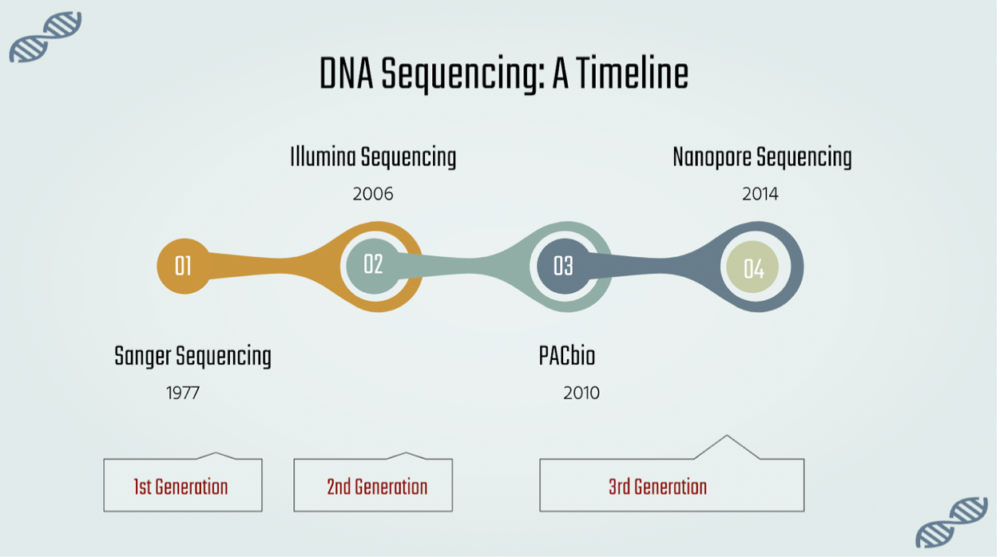
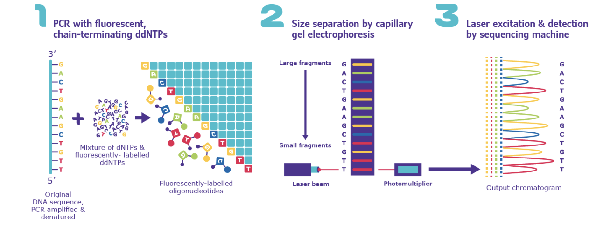
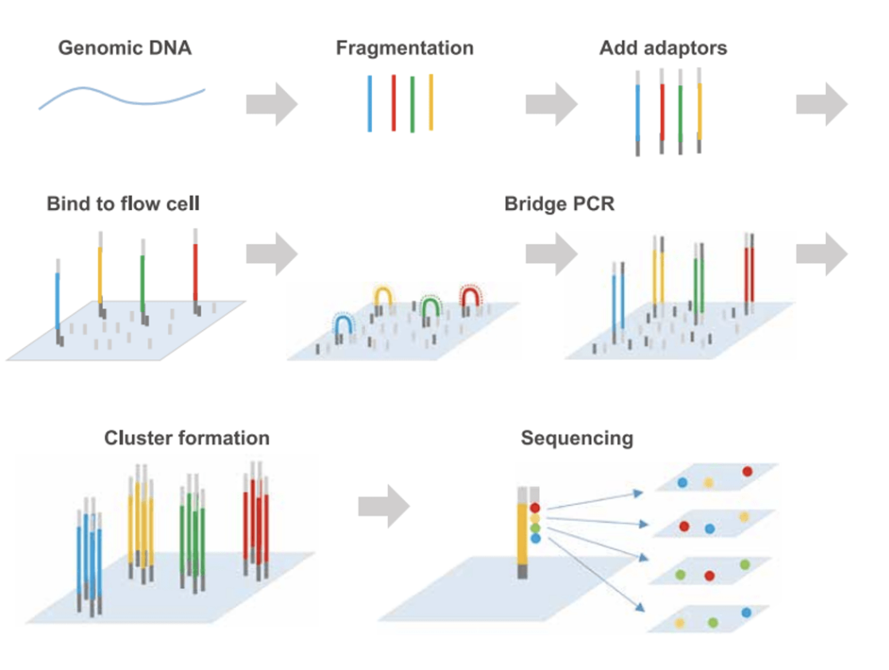
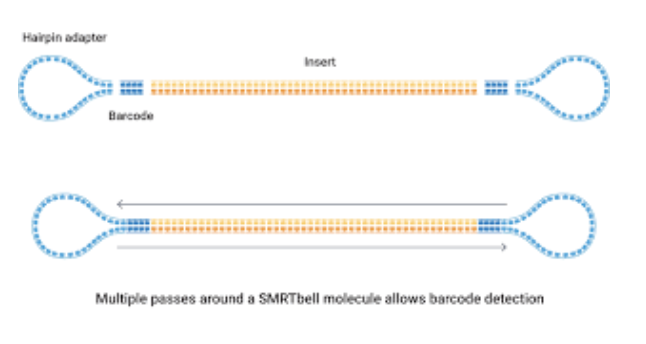
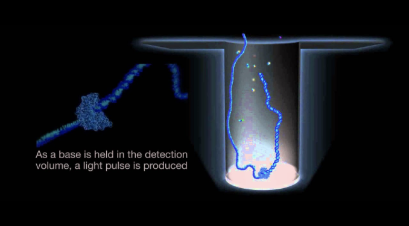
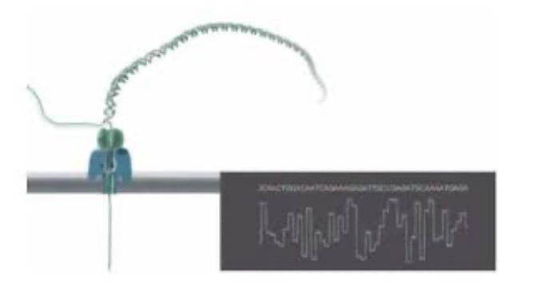

# The Evolution of DNA Sequencing

**Group 15: Siyona Suresh, Shreenithi Navaneethan, Rita Abraham**

# Introduction

DNA sequencing is an important tool to understand the genetic basis of disorders and to provide insight on curing them. DNA holds a lot of information that hasn’t been fully understood, and over the years, many techniques have been developed to sequence and study the organization of DNA. 

Over time, there have been many developments to how DNA is sequenced. The phases of development can be split into First, Second, and Third Generation sequencing. 

First Generation sequencing involved Sanger sequencing. Second Generation sequencing, also referred to as Next Generation sequencing, focuses on making the sequencing process more parallel, which in turn makes the process more efficient. This generation of sequencing includes methods like Illumina. Finally, third generation sequencing uses techniques like PacBio or Nanopore sequencing. This generation of sequencing is the one that is currently under active development. It focuses on making the sequencing process possible in real time, as well as sequencing the DNA molecule more directly instead of requiring excessive pre-processing. Each new generation of sequencing finds ways to make sequencing faster, cheaper, and more accessible.

*Figure 1: A Timeline of DNA Sequencing*

# Sanger Sequencing

Sanger sequencing was the first method of DNA sequencing to be developed in 1977 by Frederick Sanger. Sanger sequencing is otherwise referred to as first generation sequencing or the “chain termination method”. It is referred to as the chain termination method because of its usage of chain terminating nucleotides or ddNTPs. 

Sanger sequencing involves several components including DNA polymerase, primer, DNA nucleotides, template DNA, and labeled ddNTPs. The template DNA strand undergoes a PCR process with the only difference being that in Sanger sequencing it will be chain terminating PCR. Chain terminating PCR means that a low ratio of ddNTPs will be added with the dNTPs. Since ddNTPs lack a hydroxyl group on the 3’ end, that means that new nucleotides cannot be added to the 3’ end and the chain terminates. The result of chain termination is millions of copies of the template DNA that are all terminated at random lengths by fluorescently labeled ddNTPs.

Once the chain terminating PCR reaction is completed, the copies are run through capillary gel electrophoresis so that the fragments can be separated by size. The smaller fragments make it to the end of the tube fastest and the longest ones are the slowest. At the end of the electrophoresis tube, the dye attached to the end of the fragment is detected so that the sequence can be pieced together 2. 

*Figure 2: A Diagram of Sanger Sequencing (from Sigma Aldrich2)*

# Illumina Sequencing
Next generation sequencing, also referred to as second generation sequencing, encompasses several methods of DNA sequencing and is a newer type of DNA sequencing. The different methods of next generation sequencing include Illumina sequencing, Roche 454 sequencing,  PGM sequencing, and Solid sequencing. They all share several similarities such as being highly parallel, fast, and cheaper.

Illumina Sequencing was created in 2006 as a highly accurate and cost effective sequencing method. First, the template DNA sample is fragmented in small pieces, adaptors are ligated to the ends, and the DNA is amplified. Then, a flow cell, which has primers on its surface, is the site for bridge amplification reactions. In this reaction, DNA fragments bind to their corresponding primers. Next, the DNA on the flow cell is replicated to form clusters of DNA that can emit a fluorescent signal to be detected. Finally, the flow cell is loaded into a sequencer for cycles of extension and dye detection 3.

*Figure 3: A Diagram of Illumina Sequencing (From Indiana University Bloomington4)*

# PacBio Sequencing
Another term for PacBio sequencing is SMRT sequencing, which stands for Single Molecule Real Time. This method of sequencing directly identifies bases in real time during the replication process. First, the double stranded DNA template that wants to be sequenced is obtained. Then hairpin adaptors, which are loops of DNA, are attached to the two ends of the DNA strands to make the DNA circular 5. 

*Figure 4: Transformation from DNA Template to SMRTbell (from PacBio6)*

At this stage, the DNA is referred to as SMRTbell and is loaded onto a SMRT cell chip. Each SMRT chip has many zero mode waveguides that is where the sequencing takes place 5. A zero mode waveguide (ZMW) guides the light into a volume even smaller than the wavelength of light. Each ZMW has a polymerase attached to it. The polymerase attaches to the circular DNA template at the hairpin adaptor site35/sup>. 

*Figure 5: ZMW (from PacBio YouTube7)*

Fluorescent labeled nucleotides are added into the cell. Each base has its own fluorescent color that is emitted by the ZMW. As the polymerase attached different bases to the template DNA, the sequence of lights can be seen 5. This sequence can then be recorded and used to see what the final DNA sequence is.

# Nanopore Sequencing
Nanopore sequencing takes place in individual nanopores in a flow cell. 

*Figure 6: Nanopore Sequencing Device (from Oxford Nanopore Technologies)*

Each nanopore is covered in an electro-resistant membrane 8. In addition, each nanopore has its own electrode that is connected to a sensor chip. There is constantly a current that goes through the flow cell 8. DNA passes through this electrode and each time a base passes through, there is a disruption in the current. Each base has its own unique disruption pattern that is recorded. All the disruptions can be observed together and analyzed with different algorithms in order to find out what the actual sequence is 8.

*Figure 7: Disruptions from bases passing Nanopore (from Oxford Nanopore Technologies 8)*

# Pros & Cons

### Sanger Sequencing

Sanger sequencing is considered to be the “gold standard” because of its high accuracy, and is often used to verify the accuracy of other techniques. However, it has shorter reads, which would make genome assembly more difficult. The quality for the first few bases where the primer binds is low, and quality starts to degrade at the end, after 700-900 base pairs are sequenced. This means that only the middle part of the sequenced fragment would be acceptable in terms of quality. Sanger would also have a high cost to sequence large sequences, since it is not as effective compared to other methods 10.

### Illumina Sequencing

Illumina is faster than Sanger sequencing, has a high sensitivity, and has high throughput, which means that multiple dna sequences can be sequenced in parallel. However, it uses short reads, and since it requires PCR to amplify sequences beforehand, bias can be introduced where certain sequences are replicated more than others 10. 

### PacBio Sequencing

PacBio sequencing offers longer reads, detection of epigenetic markers as well as bases, no PCR bias because amplification of the sequences isn’t required before sequencing, and high accuracy 3. However, this technique is not as high throughput as Illumina, and has an error rate higher than Illumina, so it requires more iterations to achieve high accuracy. This makes the process more expensive and time consuming 11.

### Nanopore Sequencing

Nanopore sequencing offers longer reads, real time analysis of the data, and direct molecular analysis, which means that there is not as much pre-processing. This reduces bias as well as cost. Also, the machines used for nanopore sequencing are much smaller, more portable, and easier to use. On the other hand, this method tends to be more error prone, because it is harder to distinguish between signals that look similar, making it more likely for one base to be mistaken for another 12.

# Future of Sequencing

In the future, sequencing techniques will move towards getting even longer reads, reducing the cost and time required for sequencing even more 13, and sequencing epigenetic markers (such as methylation) 14. Some of the techniques discussed above do aim to accomplish some of these goals, but there is still a need for further optimization. Faster and cheaper genome sequencing would make it more practical to apply sequencing data to healthcare, such as rapid and earlier diagnosis of health conditions 13. Genome sequencing can lead to discovery of mutations caused by diseases, which can help with development of treatments 14. These are just a few possible applications — further development of sequencing methods can lead to even more advancement in healthcare and genetics.

# References
1. DNA sequencing (article) | Biotechnology. (n.d.). Khan Academy. Retrieved December 5, 2022, from https://www.khanacademy.org/science/ap-biology/gene-expression-and-regulation/biotechnology/a/dna-sequencing
2. Sanger Sequencing Steps & Method. (n.d.). Sigma-Aldrich. Retrieved December 5, 2022, from https://www.sigmaaldrich.com/US/en/technical-documents/protocol/genomics/sequencing/sanger-sequencing
3. 0.2 Sequencing technologies - 3dgenome. (n.d.). 3dgenome. Retrieved December 5, 2022, from https://zhonglab.gitbook.io/3dgenome/chap0-preparation/0.2-sequencing-technologies
4. Introduction to Illumina Sequencing – NCGAS. (2021, September 17). IU Blogs. Retrieved December 5, 2022, from https://blogs.iu.edu/ncgas/2021/09/17/introduction-to-illumina-sequencing/
5. Rhoads, A. & Au, K. (2022, February 26). PacBio Sequencing and its Applications. Retrieved December 5, 2022, from https://www.sciencedirect.com/science/article/pii/S1672022915001345
6. Decrease your cost-per-sample with multiplexing. (n.d.). PacBio. Retrieved December 5, 2022, from https://www.pacb.com/multiplexing/
7. Introduction to SMRT Sequencing. (2011, December 6). YouTube. Retrieved December 5, 2022, from https://www.youtube.com/watch?v=NHCJ8PtYCFc
8. Nanopore DNA sequencing. (n.d.). Oxford Nanopore Technologies. Retrieved December 5, 2022, from https://nanoporetech.com/applications/dna-nanopore-sequencing
9. Scott, L. (2020, April 8). Nanopore Sequencing: Controversial World Records and Whale Watching – Institute of Genetics and Cancer. Blogs. Retrieved December 5, 2022, from https://blogs.ed.ac.uk/institute-genetics-cancer/2020/04/08/nanopore-sequencing-controversial-world-records-and-whale-watching/
10. Sanger Sequencing vs. Next-Generation Sequencing (NGS). (2021, December 30). GenScript. Retrieved December 5, 2022, from https://www.genscript.com/gene-news/sanger-sequencing-vs-next-generation-sequencing.html
11. Chen, A. (2016, July 9). Single Molecule Real-Time Sequencing. Bitesize Bio. Retrieved December 5, 2022, from https://bitesizebio.com/28911/single-molecule-real-time-sequencing/
12. Nanopore sequencing – DNAdots by miniPCR. (n.d.). DNAdots. Retrieved December 5, 2022, from https://dnadots.minipcr.com/dnadots/nanopore-sequencing
13. Lindsey, H. (2017, December 1). The Future of Genomic Sequencing | AACC.org. American Association for Clinical Chemistry. Retrieved December 5, 2022, from https://www.aacc.org/cln/articles/2017/december/the-future-of-genomic-sequencing
14. Brazil, R. (2021, September 14). The future of ‘next generation’ DNA sequencing | Business. Chemistry World. Retrieved December 5, 2022, from https://www.chemistryworld.com/news/the-future-of-next-generation-dna-sequencing/4014391.article
