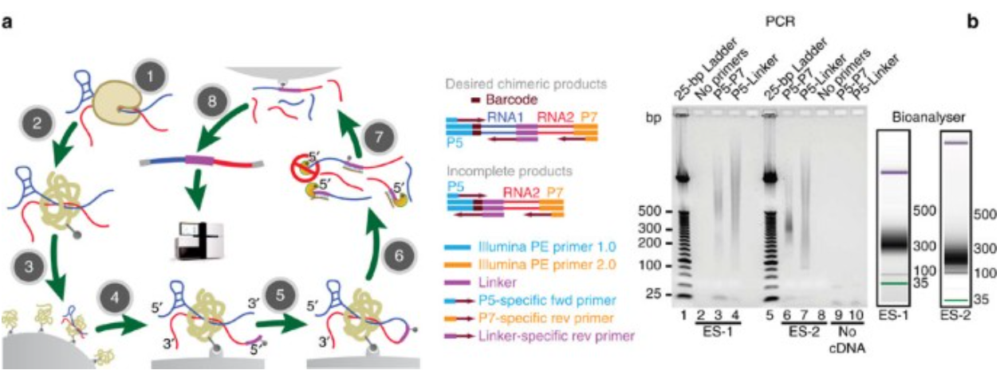
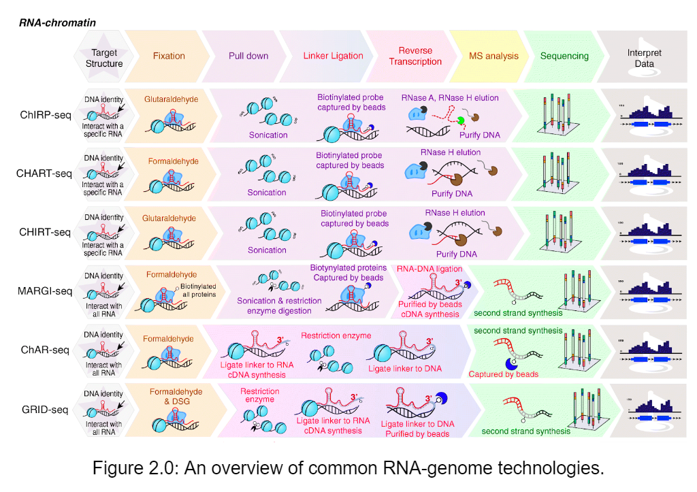
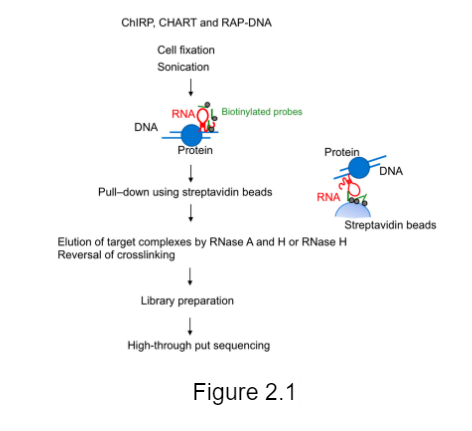
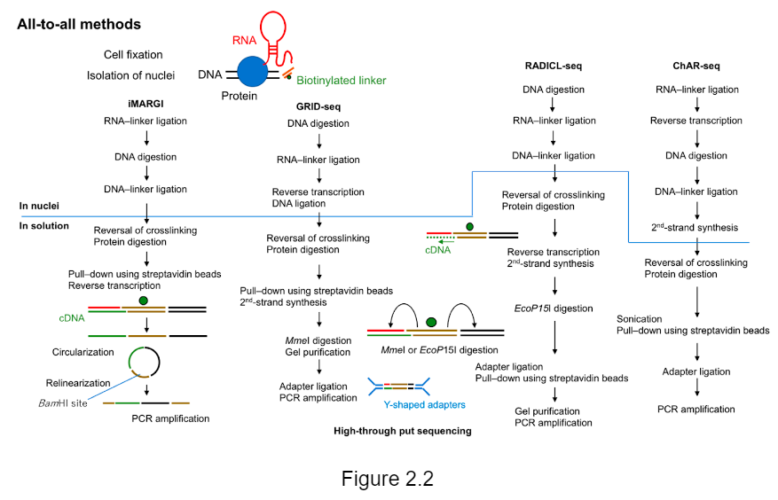
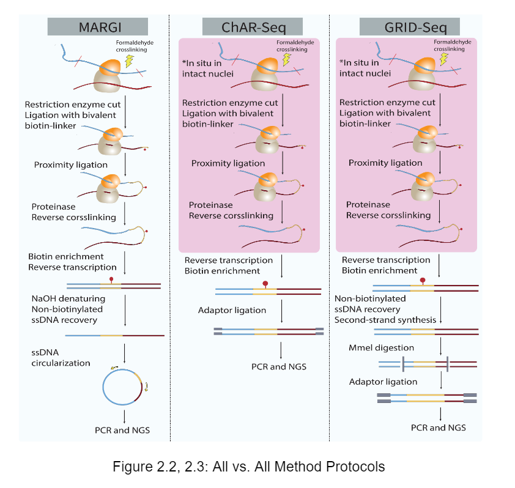
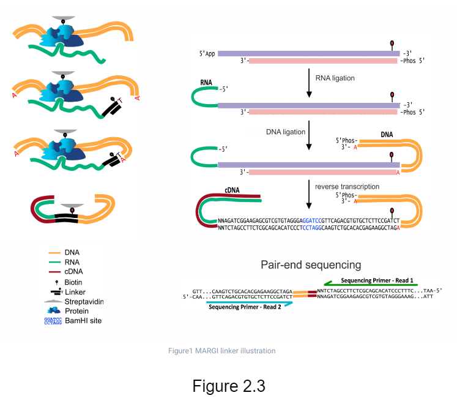
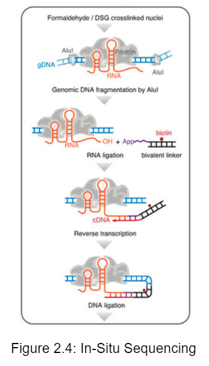
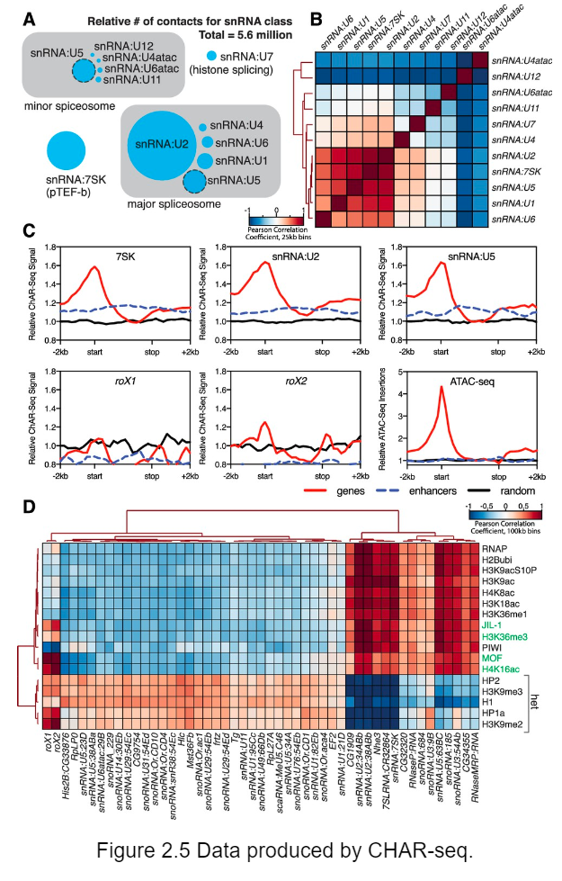
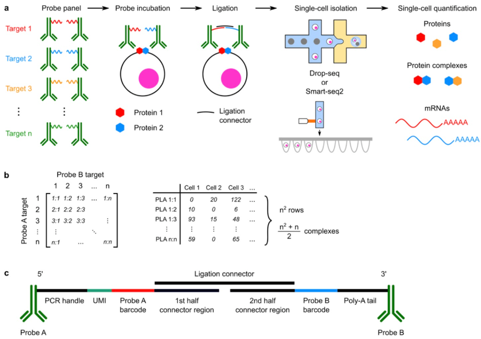

# **Group 16: Final Project Paper**
## **Mapping RNA-RNA, RNA-Chromatin, and PPI interactions**
## Names: Amit Elia, Iris Lee, Samhita Kadali
---
### Introduction
Only ~10% of genome is composed of protein coding genes, promoters, and other cis-regulatory sequences. The other 90% of the genome sequence is of unknown function and not fully annotated. A frontier challenge of bioinformatics is to identify the regulatory role of these sequences in various levels such as transcription, translation, post-translational modifications, and degradation.

Studies found that 60% of the non-coding genome is still transcribed into non-coding RNA. The function of such products can be inferred by studying RNA-RNA interactions of a novel RNA sequence with a sample of known function.

For example, tRNA-mRNA interactions helped discover correspondence between each amino-acid and its tRNA molecule (Robert Holley, 1968). miRNA-mRNA and siRNA-mRNA interactions were found to assist in inhibition of translation and degradation of the mRNA molecule (Andrew Fire, Craig Mello, 2006).

The main challenge in identifying interactomes of any type is the vast number of possible pairwise interactions between our sequences of interest. Moreover, some interactions may involve more than two objects. The main idea behind all of the methods for studying interactomes described below, is the conversion of interactions into a DNA product that can then be sequenced using NGS.

---
### RNA-RNA technologies

#### *Example: MARIO*

MARIO (Mapping RNA interactome in vivo) detects RNA-RNA interactions facilitated by any single protein in vivo. In this procedure, RNA molecules are cross-linked with their bound proteins and then ligated to a biotinylated RNA linker such that proximal RNA molecules co-bound by the same protein form a chimeric RNA in the form of RNA1–Linker–RNA2. These linker-containing chimeric RNAs are isolated using streptavidin-coated magnetic beads and subjected to paired-end sequencing (Fig. 1a and Supplementary Fig. 1). Thus, each non-redundant paired-end read reflects a molecular interaction.

The major experimental steps are as follows: (1) cross-linking RNAs to proteins; (2) RNA fragmentation, protein denaturing and biotinylation; (3) immobilization of RNA-binding proteins at low density; (4) ligation of a biotinylated RNA linker; (5) proximity ligation under a dilute condition; (6) RNA purification and RT; (7) biotin pull-down; and (8) construction of sequencing library.

---

### RNA-Genome technologies

#### Example: One to All (ChIRP, CHART, RAP)

The One-to-All methods capture all targets of one specific RNA, and is used by technologies such as Chromatin Isolation by RNA Purification (ChIRP), Capture Hybridization Analysis of RNA Targets (CHART), and RNA Antisense Purification (RAP). All three of these technologies use biotinylated complementary oligonucleotides to isolate a specific target RNA (Figure 2.1). Afterwards, sequencing or mass spectrometry is used to identify the substances, such as DNA or binding proteins, that are associated with this specific target RNA.

#### Example: All vs. All (MARGI, CHAR-Seq, GRID-Seq)

The All vs. All mapping methods, also known as Global mapping, can map across a range of RNA through bipolar linkers that connect the RNA linker and DNA linker. These joint sequences can then be referenced and examined to study interactions of each specific RNA. Global mapping technologies include MARGI, CHAR-seq, and GRID-seq, and each of these technologies uses a different linker design and protocol design (Figure 2.2).

MARGI uses pair-end sequencing with the enzyme BamHI. The MARGI technology ligates RNA sequences associated with the chromatin with the target genome sequences, thus forming joint sequences known as RNA-DNA chimeric sequences. These chimeric sequences are then converted to the genomic library and sequenced with pair-end sequencing (Figure 2.3). With MARGI sequencing, the resulting lengths of reads usually depend on different sequencing platforms. MARGI benefits from capturing RNA-genome interactions at native conditions but its requirement of a large number of cells is one of its disadvantages.

Another All vs. All technology, GRID-Seq, also uses pair-end sequencing but cuts with the restriction enzyme, Mmel.

CHAR-seq uses single-end sequencing with the enzyme DpnII and a read length of exactly 152 base pairs. We can actually observe these differences in the picture on the right, which also lists out the protocols of each global mapping technology.

CHAR-seq and GRID-seq are both in situ, meaning “in the original place.” Although this feature actually reduces nonspecific interactions, CHAR-seq’s use of long single-read sequencing may reduce the number of informative reads. GRID-seq also benefits from in situ sequencing, but its limited sequencing length of ~20 bases makes it difficult for unambiguous sequencing.

CHAR-Seq is another All-to-All method that uses single-end sequencing with the enzyme DpnII and a read length of exactly 152 base pairs. In CHAR-Seq, after the cells are cross-linked, the RNA is fragmented. This cross-linked RNA is then ligated and connected to an oligonucleotide molecule. After reverse transcribing the ligated intermediate, the other end of the intermediate is ligated to the DNA, which “links” the RNA and DNA. During second strand synthesis, also known as the process of creating the second strand of DNA, the RNA is converted into cDNA. This DNA can finally be sequenced and studied through the data provided by CHAR-Seq (Figure 2.6). Like GRID-Seq, CHAR-Seq is also performed in situ, which reduces non-specific interactions. Despite the advantages of in situ sequencing, CHAR-Seq’s use of long single-read sequencing may reduce the number of informative reads.

---

### Protein-Protein interaction technologies

#### Example: Prox-Seq

Prox-seq aims to provide multiplexed analysis of protein-protein interactions of cell membrane proteins, which will enable more accurate modeling of intra-cellular regulation. Prox-seq utilizes barcoded proximity assays and deep sequencing to measure levels of protein complexes and all pairwise interactions of target proteins in thousands of samples.

Prox-seq uses proximity ligation probes with specific barcoded oligonucleotides connected to antibodies that target proteins of interest. After binding to the protein complexes, oligos of probes that are proximal (attached to connected proteins) are ligated. The two ligated oligos are used as a template for a chimeric sequence that contains the two barcodes of the interacting proteins. The abundance of these pairwise barcoded oligos is analyzed to create a n2 database of all protein dimers. Thus we can create a heatmap visualization of how likely each protein will interact with all other proteins. This multiplexed fashion allows us to investigate a large number of proteins together and see a better picture of protein complexes and different epitopes of a protein of interest.

Another technology in development at Goren's lab in UCSD is called Prod-Seq, which aims to provide a multiplexed PPI quantification assay in-vivo in which proteins involved in chromatin regulation may be examined. It uses a synthetic DNA caliper design to quantify pairwise interactions between proteins that are in proximity followed by sequencing. The goal of Prod-Seq is to be able to extend to Protein-DNA and Protein-RNA interactions as well.

---

### Resources

1. MARIO: Nguyen, T., Cao, X., Yu, P. et al., Nature Communications, Mapping RNA–RNA interactome and RNA structure in vivo by MARIO. Nat Commun 7, 12023 (2016).  https://doi.org/10.1038/ncomms12023

2. RNA–Chromatin Interaction technologies: Kato M, Carninci P. Genome-Wide Technologies to Study RNA–Chromatin Interactions. Non-Coding RNA. 2020; 6(2):20. https://doi.org/10.3390/ncrna6020020

3. PROX-Seq: Vistain, L., Van Phan, H., Jordi, C., Chen, M., Reddy, S. T., & Tay, S. (2020), bioRxiv, Quantification of proteins, protein complexes and mrna in single cells by proximity-sequencing. https://doi.org/10.1101/2020.05.15.098780

Image Links:

https://ibb.co/hFHkrJ0

https://ibb.co/8MSKGmX

https://ibb.co/mBPXbFb

https://ibb.co/5sFT0PR

https://ibb.co/wL3m3TV
