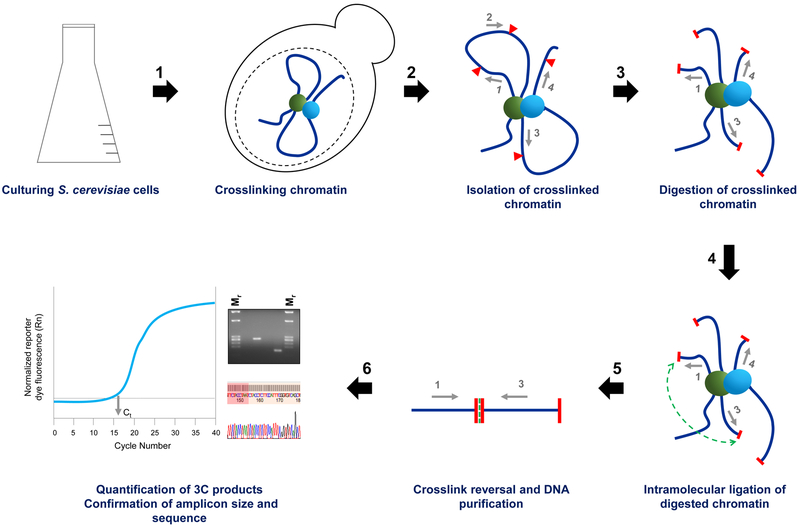
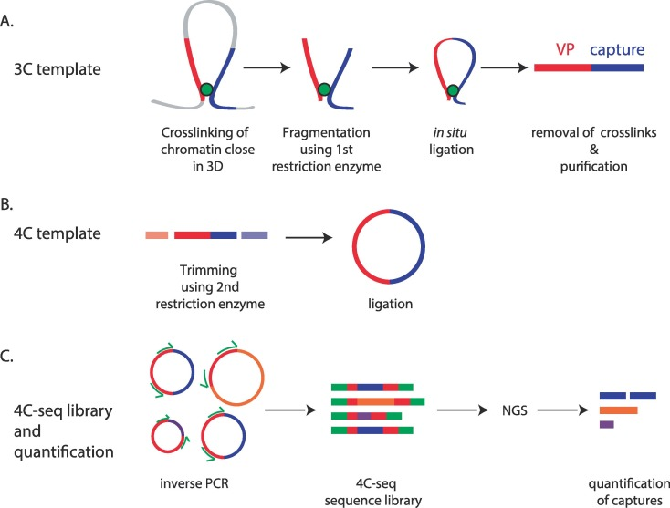
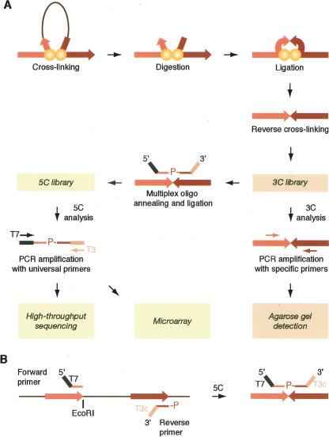
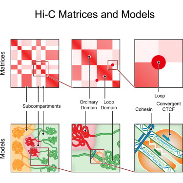
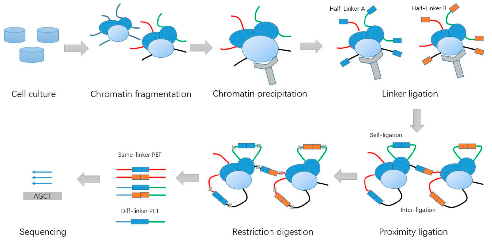
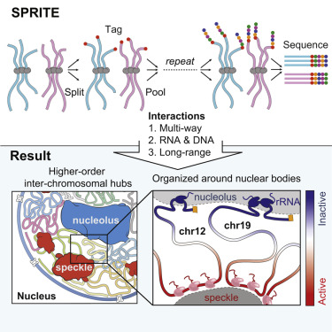

# Methods for Sequencing 3D Chromatin Structure

## Introduction

In recent years, it has become increasingly clear that distant regulatory elements are essential for the proper control of gene expression. It has also been shown that the structure of the genome is highly organized and segmented by a large array of factors, with these factors key to the determination of the activity of genes within various cell types. Technologies have been developed to probe these biological phenomena by sequencing DNA while preserving its 3D structure. 

### Classic Chromosome Capture Methods

### 3C

Chromosome conformation capture, or 3C, is currently the leading method to study gene regulation and genomic organization. 3C technology is a one versus one method, meaning that it tests interactions between a candidate promoter-enhancer pair or a restricted set of genomic loci and requires prior knowledge of selected targets (Hakim & Misteli, 2012)

There are four steps to the 3C method. First, chromatin segments near each other are crosslinked. Next, the genome is split into fragments using restriction enzymes. Third, linked chromatin segments are ligated together. Finally, the purified product after the ligation step is measured (Chowdhary, Kainth, & Gross, 2019). In 3C, PCR is performed after reversing crosslinking, with primers for the target and for the region theorized to interact with it. 

3C schematic, (Chowdhary et al., 2020)

### 4C

Chromosome conformation capture on chip, or 4C, is sometimes referred to as circular 3C, because DNA is circularized during ligation. While 3C is a one versus one method, 4C can be considered a one versus all method, since rather than a pair of genomic loci, it can detect all the genomic regions interacting with the target region or identified region of interest (Illumina, n.d).  PCR is done on these circularized DNA molecules, with a primer for the target region, and the  results are then analyzed using microarrays. Like other methods, 4C suffers from PCR bias, for similar reasons. For instance, since 4C also uses restriction enzymes, the frequency of the sites recognized by the enzyme affects assay resolution (Raviram et al., 2014).

4C schematic (Krijger et al., 2020)

### 5C

Chromosome conformation capture carbon copy, or 5C, is a many versus many method, because it can test all restriction fragments within a given region. A 3C library is generated first, and then during DNA ligation, oligonucleotides are also ligated to the reverse crosslinked products (Dostie, et al. 2006). The oligonucleotides are then selected for and sequenced. However, it is extremely hard to achieve widespread coverage using this method, for similar reasons as with 3C and 4C.  

5C schematic (Dostie et al., 2006)

### Hi-C

The Hi-C method extends the 3C approach to capture genome-wide interactions across all loci, rather than probing for interactions between two select regions. Following the cross-linking and restriction enzyme digestion steps seen in 3C, a biotin-labeled nucleotide is added to the sample; this nucleotide labels the blunt 5’ overhangs left by the HindIII restriction enzyme, marking the fragments with biotin at their junction. Labeling the cross-linked DNA fragments in this way allows for the fragments initially close to each other in the nucleus to be preferentially ligated in the proximity ligation step. Next, the crosslink is reversed, the DNA is sheared and purified, and the biotin-containing fragments are selected using streptavidin beads. A Hi-C library is then created from the sample and is analyzed via parallel DNA sequencing (Berkum, et al., 2010).

The analysis produces a catalog of interacting fragments – loci or chromosomal regions – organized as an n-by-n contact matrix, the rows and columns of which correspond to partitioned chromosome regions. Visualizing the matrix as a heatmap can help elucidate the genome-wide chromosome structural features present, such as interactions between cis and trans regulatory elements, locus-specific chromatin components, topologically associating domains (TADs), and point interactions. Given a standard logarithmic (log base 2) presentation, a positive matrix value indicates that the number of observed contacts is greater than expected, while a negative number means that they are fewer than expected (Oluwadare, et al., 2019).

Interpretation of 3D chromosome features based on Hi-C heatmap (Rao et al., 2014)

## Chromosome Capture Derivatives

As scientific technology progresses, there have been many derivatives developed to the 3C, 4C, 5C, and Hi-C chromosome capture techniques; these improvements aim to enhance various aspects of the original technology, such as reduced cost and noise reduction, though often with certain drawbacks accompanying these enhancements. Many such methods have been developed, so we will cover only a limited selection of techniques that have pioneered some significant improvements on the 3C family methods.

### Capture-C

The Capture-C family of protocols uses oligonucleotide capture technology (OCT) to enrich for interactions of interest from 3C libraries. This method produces comparatively high-yield, high-capacity results when considered with 3C and other 3C variants.

Procedurally, Capture-C adds several steps to the 3C process to facilitate the pulldown of biotinylated fragments with magnetic beads. After a standard 3C process is performed, the 3C ligated fragments are sonicated, allowing the OTC protocol to enrich for the chosen regions of interest. These enriched fragments are then sequenced (Downes, et al. 2022).

As a result of this enhancement, Capture-C analysis is more sensitive to differentiating between cis and trans interactions and lower in PCR bias than standard 3C. Additionally, Capture-C sees a reduction in cost compared to classic 3C, as the technology allows for lower required sample input (_Illumina_, n.d.).

### Micro-C

Micro-C is a derivative of Hi-C that uses the micrococcal nuclease (MNase) enzyme to digest chromatin prior to proximity ligation, rather than employing restriction enzymes for fragmentation like 3C technologies. This additional digestion step is designed to investigate proximity between pairs of nucleosomes; cutting the cross-linked genome with MNase yields mononucleosomes, from which genome structure can be mapped at nucleosome resolution. The resolution of Micro-C thus lies between the base-pair resolution of ChIP-Seq methods and that of 3C methods, which cannot capture structures smaller than roughly 1 Kb (de Souza, 2015). 

Though the two technologies perform roughly equivalently in their capture of long-range interactions, like hierarchical structural chromosome features, Micro-C produces a significantly improved signal-to-noise ratio compared to Hi-C in its detection of close-range interactions. Additionally, Micro-C’s employs single-ended analysis, rather than explicitly considering genome pairs; this allows for the genome-wide mapping of nucleosome occupancy, which can be used to study how chromatin accessibility is linked to the structural features present (Burgess, 2020).

.")

Micro-C is advantageous over Hi-C when it comes to coverage resolution, such as in the accurate detection of nucleosome-free regions (NFRs). (_Dovetail Genomics_, n.d.)

### ChIA-PET

ChIA-PET (Chromatin Interaction Analysis with Paired-End Tag) sequencing is an emerging technology that integrates elements from ChIP-based methods and 3C methods, to leverage the advantages of both. 

For context on both kinds of methods, ChIP-based methods can be used to identify transcription factor (TF) binding sites on a genome-wide scale, but cannot be used to determine the interactions between the protein binding sites or the target genes for distal TF binding sites. On the other hand, 3C-family methods and derivatives can reveal long-range chromatin interactions involved in transcription regulation, but are limited by low-throughput and cannot be used to map the entire genome in high resolution. Additionally, both ChIP-Seq and 3C methods suffer from high background noise, resulting from the detection of false positives; the noise increases with greater distance between the interacting regions being examined (Li et al., 2014).

In the workflow for ChiA-PET, the DNA-protein complexes in the sample are first crosslinked with formaldehyde and fragmented via sonication, to reduce non-specific interactions and break up chromatin. This is followed by an immunoprecipitation step, similar to the one used in Hi-C to map long-range DNA interactions, where selected antibodies are used to immunoprecipitate proteins of interest. Next, linkers are ligated to the DNA fragment ends; these two linkers are distinct from each other, distinguished by two different nucleotide barcodes, and thus separate the sample into separate aliquots. They then continue to self-ligate, based on proximity. Finally, the DNA aliquots are precipitated, digested with restriction enzymes, and sequenced.

Both ChIA-PET and Hi-C analyses produce 3D genome-wide capture. Compared to Hi-C, ChIA-PET greatly enhances the resolution, though it is limited to identifying interactions mediated by a known protein, whereas Hi-C can capture all interactions. Additionally, the sonication step in ChIA-PET reduces the non-specific noise found in ChIP-Seq, and the immunoprecipitation step reduces data complexity, often leading to easier data analysis than Hi-C. The main drawbacks of ChIA-PET are its limited sensitivity, potentially ambiguous DNA interactions due to the linkers’ self-ligation, and the large amount of starting material required by the method (Illumina, n.d).

<

(Li et al., 2019)

## Other Technologies

There exist other technologies that don’t rely on proximity ligation of pieces. Most of these are both very novel, and not in widespread use. They are however extremely useful for detecting multi-interacting loci, and therefore offer a unique perspective on the structure of the 3D genome.

### GAM

Genome Architecture Mapping (GAM) is a novel method for discovering 3D contacts. This process, unlike the others, relies on cryosectioning and microdissection. Nuclei are sliced into ultrathin cryosections. They are then laser microdissected, to isolate individual slices. This is particularly advantageous as it eliminates biases that may come from cell extraction and sorting. The main advantage is the ability to detect contacts between multiple loci, and to do this with a low cell number. Indeed with only a small number of slices, a resolution of 30Kb is achievable, given the same amount of sequencing depth as a standard HiC library. (Kempfer & Pombo, 2020). GAM however requires the use of specialized statistical models called SLICE (Statistical Inference of cosegregation). This isn’t necessarily advantageous, as further developments on this have less previous modeling to work on, and users may be unfamiliar with the peculiarities of the modeling and analysis. (Beagrie et al., 2017)

	

### SPRITE

(Quinodoz et al., 2018)

SPRITE (Split-Pool Recognition of Interactions by Tag Extension) is another non ligation based method to map complex genome contacts. Like GAM, it also does not rely on ligation. However, SPRITE takes an extremely different approach. Specifically, the sample is crosslinked. Then the sample is split into a 96 well plate. Each well on the plate is assigned a tag. Then the sample is pooled, and this process is repeated multiple times. The end result is that regions associated together in 3D space will always be in the same plate, since they are crosslinked. Therefore they will have a unique sequence of tags assigned to them.(Quinodoz et al., 2022) The main advantage of SPRITE over 3C based methods is the ability to detect loci that have multiple interactors. Additionally, SPRITE can also detect RNA-DNA contacts, something GAM has not been used for. In addition, SPRITE can also be combined with immunoprecipitation to see interactions mediated by specific proteins. One disadvantage it shares with GAM is the requirement for specific software tools that aren’t commonly used, leading to user difficulty. An advantage it has over GAM is that the sample preparation is much less technically complex than that in GAM.(Quinodoz et al., 2018)

## Directions for Future Development

HiC has traditionally been limited by large restriction fragments, which limit the resolution of the data. However,recent steps have been made to improve on this. Indeed, Micro-C in and of itself was a large step towards higher resolution based data. However, other steps have been made that further improve on Micro-C approaches, such as Micro-Capture-C, which allow sub-kilobase resolutions (Hua et al., 2021). However these methods aren’t applicable genome wide, and must be targeted to a particular region. Therefore, an important next step in chromosome capture is the improvement of genome wide resolution maps. These are particularly important for global mappings of enhancer-promoter contacts, which are usually very small regions that can not be visualized by HiC. Additionally, HiC requires deep sequencing, and is very costly to perform. This is a major barrier to its widespread use in research. Improvements on HiC cost could help revolutionize our understanding of diseases such as cancer, where epigenetic restructuring is one of the drivers of disease.

**Works Cited**

    _Illumina_. (n.d.). Retrieved December 6, 2022, from https://www.illumina.com/science/sequencing-method-explorer/kits-and-arrays/4-c-4c-seq.html

    Beagrie, R. A., Scialdone, A., Schueler, M., Kraemer, D. C. A., Chotalia, M., Xie, S. Q., Barbieri, M., de Santiago, I., Lavitas, L.-M., Branco, M. R., Fraser, J., Dostie, J., Game, L., Dillon, N., Edwards, P. A. W., Nicodemi, M., & Pombo, A. (2017). Complex multi-enhancer contacts captured by genome architecture mapping. Nature, 543(7646), Article 7646. https://doi.org/10.1038/nature21411

    Chowdhary, S., Kainth, A. S., & Gross, D. S. (2020). Chromosome Conformation Capture That Detects Novel Cis- and Trans-Interactions in Budding Yeast. Methods (San Diego, Calif.), 170, 4–16. https://doi.org/10.1016/j.ymeth.2019.06.023

    Dostie, J., Richmond, T. A., Arnaout, R. A., Selzer, R. R., Lee, W. L., Honan, T. A., Rubio, E. D., Krumm, A., Lamb, J., Nusbaum, C., Green, R. D., & Dekker, J. (2006). Chromosome Conformation Capture Carbon Copy (5C): A massively parallel solution for mapping interactions between genomic elements. Genome Research, 16(10), 1299–1309. https://doi.org/10.1101/gr.5571506

    Hua, P., Badat, M., Hanssen, L. L. P., Hentges, L. D., Crump, N., Downes, D. J., Jeziorska, D. M., Oudelaar, A. M., Schwessinger, R., Taylor, S., Milne, T. A., Hughes, J. R., Higgs, D. R., & Davies, J. O. J. (2021). Defining genome architecture at base-pair resolution. Nature, 595(7865), Article 7865. https://doi.org/10.1038/s41586-021-03639-4

    Kempfer, R., & Pombo, A. (2020). Methods for mapping 3D chromosome architecture. Nature Reviews Genetics, 21(4), Article 4. https://doi.org/10.1038/s41576-019-0195-2

    Krijger, P. H. L., Geeven, G., Bianchi, V., Hilvering, C. R. E., & de Laat, W. (2020). 4C-seq from beginning to end: A detailed protocol for sample preparation and data analysis. Methods, 170, 17–32. https://doi.org/10.1016/j.ymeth.2019.07.014

    Quinodoz, S. A., Bhat, P., Chovanec, P., Jachowicz, J. W., Ollikainen, N., Detmar, E., Soehalim, E., & Guttman, M. (2022). SPRITE: A genome-wide method for mapping higher-order 3D interactions in the nucleus using combinatorial split-and-pool barcoding. Nature Protocols, 17(1), 36–75. https://doi.org/10.1038/s41596-021-00633-y

    Quinodoz, S. A., Ollikainen, N., Tabak, B., Palla, A., Schmidt, J. M., Detmar, E., Lai, M. M., Shishkin, A. A., Bhat, P., Takei, Y., Trinh, V., Aznauryan, E., Russell, P., Cheng, C., Jovanovic, M., Chow, A., Cai, L., McDonel, P., Garber, M., & Guttman, M. (2018). Higher-Order Inter-chromosomal Hubs Shape 3D Genome Organization in the Nucleus. Cell, 174(3), 744-757.e24. https://doi.org/10.1016/j.cell.2018.05.024

    Raviram, R., Rocha, P. P., Bonneau, R., & Skok, J. A. (2014). Interpreting 4C-Seq data: How far can we go? Epigenomics, 6(5), 455–457. https://doi.org/10.2217/epi.14.47