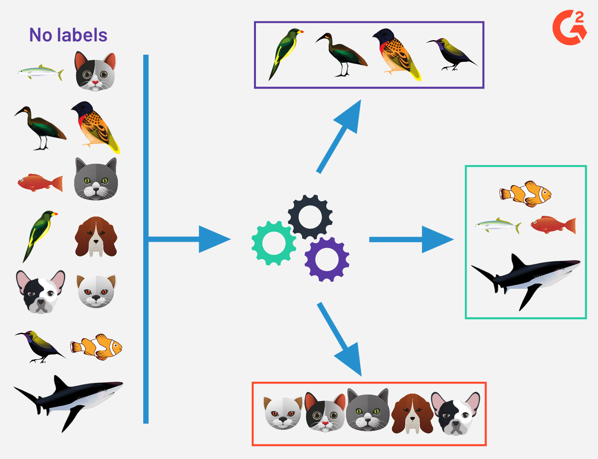
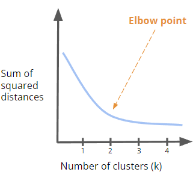
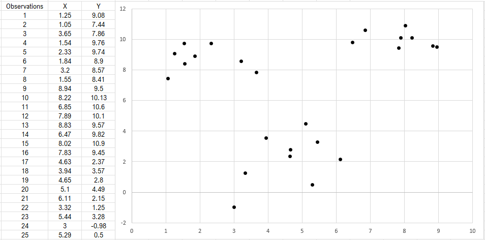
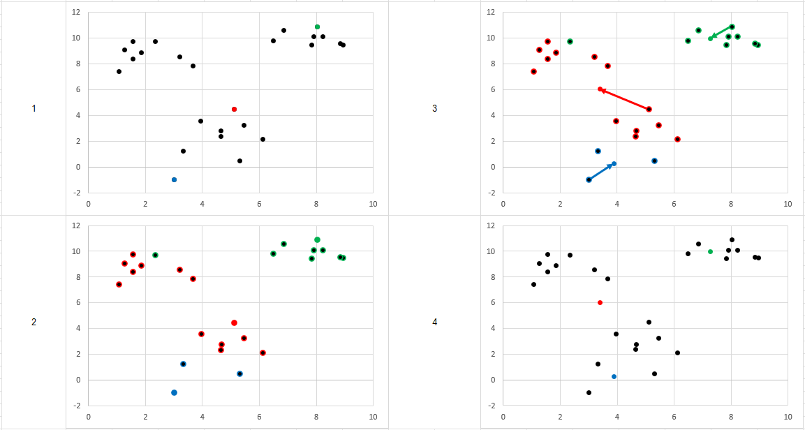
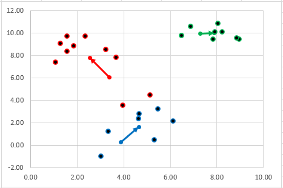
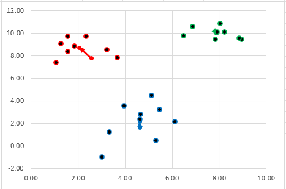
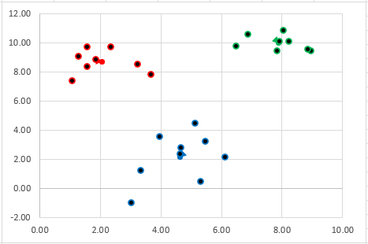
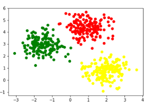
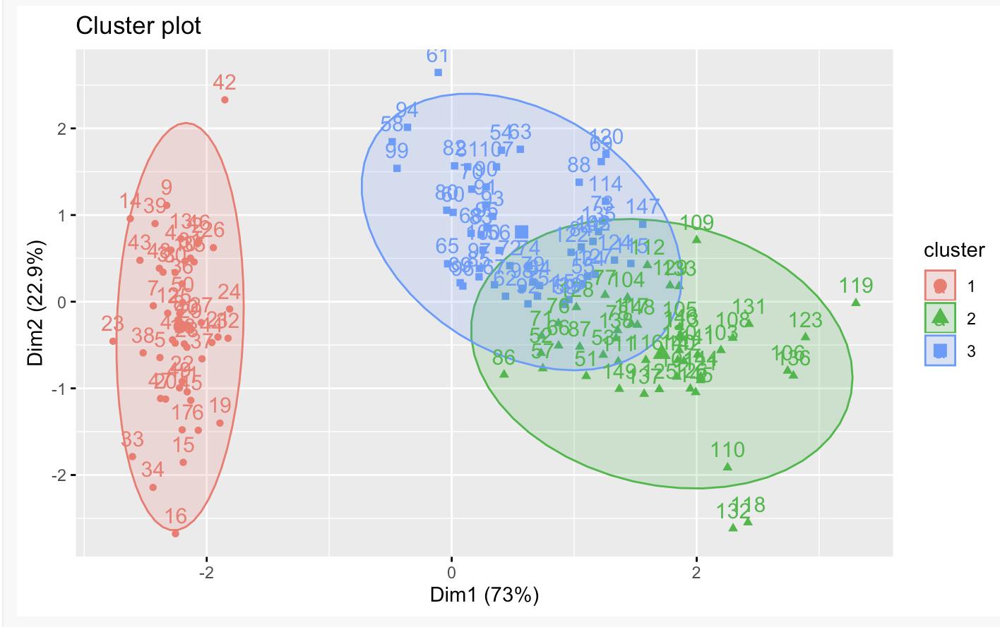
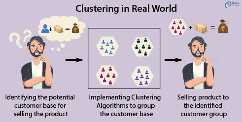

1. [Overview](#1)
2. [The Algorithm](#2)
3. [Stopping Criteria](#3)
4. [Algorithm in Practice](#4)
5. [Packages and Tools to Implement K Means](#5)
6. [Real World Applications](#6)
7. [Conclusion](#7)
8. [References](#8)

# Introduction to K-Means Clustering
### By Shruti Shirsathe, Minh-Son Tran, and Lily Steiner
## Overview<a name="1"></a>

k-Means Clustering is a topic that falls under Machine Learning. To give some context, there are different types of machine learning algorithms such as:
Supervised Machine Learning, Unsupervised Machine Learning, Semi-Supervised Machine Learning, and Reinforcement Learning.

The two main types, Supervised and Unsupervised Machine Learning are defined as the following:
* **Supervised:** Algorithm that requires an input of data, and labels for classification. In the end, it is used to make predictions and classify data.
* **Unsupervised:** Algorithm that requires only an input of data and no labels. It is used to understand the relationships between points in the dataset.
<p align="center">

</p>
[1] In this image, the input data includes information with different animals without any labels for what they are; the unsupervised algorithm takes this input and groups the data into 3 different clusters based on how closely the data is related to one another. Devin Pickell, "Supervised vs Unsupervised Learning – What's the Difference?".

K-Means clustering is an unsupervised algorithm, meaning that the goal is to look for patterns in a dataset without pre-existing labels. 
Applications are to either:
1. confirm any assumptions about the types of groups that exist in the data
2. identify unknown groups in the data

K-Means does make assumptions about the data which should be present before using the algorithm:
1. Clusters have similar variance
2. Clusters are the same size (same radius) & similar number of points
3. Clusters have a spherical shape
 
<p align="center">

</p>
[2] Alan Jeffares, "K-means: A Complete Introduction"

* * *

## The Algorithm<a name="2"></a>


1. Choose a value K as the number of cluster centers and set the cluster centers randomly. One way to choose K is by using the elbow method (below)
2. Once k and the initial centroids are chosen, we then calculate the distances between all the points in the data and the centroids, then group the points with the cluster center they are closest to.
3. Now we recalculate the centroid of these new clusters by finding the new center of gravity of the clusters; then group the data points to the new nearest centroid as we did before. 
4. We then repeat these steps until the centroid positions remain the same; if so, the algorithm has completed and you’ve found your clusters.

## Parameters & How to Choose Them <a name="3"></a>
The primary parameter for the algorithm is k, the number of clusters. Choosing an appropriate k value is essential for accurate clustering. To choose k, we can perform what is known as the "elbow" method. 

1. Perform K-means clustering with differing values of K. 
2. For each of the K values, we calculate average distances to the centroid across all data points. The specific distance metric used is WCSS ( Within-Cluster Sum of Square ). To do this, calculate the  the sum of squared distance between each point and the centroid in a cluster.
3. Plot the WCSS vs K-value and find the point where the average distance from the centroid falls suddenly (“Elbow”). This should be approximately what K-value to use. 

<p align="center">

</p>

Additionally, it's important to consider the following when implementing the algorithm:
- What type of distance metric you plan to use
- What the max iterations of the algorithm should be set to (if convergence continues to not be reached)
- How many seeds to use (how many times to run the algorithm with a unique set of starting parameters)

## Stopping Criteria<a name="3"></a>
As mentioned above, the algorithm typically terminates when centroid positions remain the same from one iteration to the next. In terms of the data, 
this is equivalent to the all datapoints remaining within the same cluster after an iteration, as their center of gravity would remain the same.

However, the algorithm is not guaranteed to reach this termination point (or convergence point). K-means clustering is designed to approximate local
minima for the optimization of squared distances from centroids. It is not an exhaustive algorithm - the total number of clustering solutions is equivalent
to the number of ways to partition n datapoints into k clusters. This is on the order of n to the k, in other words, extremely large. In certain edge cases, if
centroid selection is nondeterministic for equal distances, the algorithm can oscillate between two solutions infinitely. As well as this, developers might
see it fit to not run the algorithm for an excessively long time. Therefore, we can introduce a maximum iterations parameter as an additional stopping criterion.

Summarily, we have 3 stopping criteria:

1. Centroids do not move
2. Clusters do not change
3. Maximum iterations have been attempted

* * *

## Algorithm in Practice<a name="4"></a>

We can visualize how the algorithm functions on the following dataset. We have 2 variables, X and Y, across 25 observations shown below. The dataset has been
visualized as a 25 point scatterplot.



Let's look at the first iteration of the algorithm



1. Three centroids have been selected randomly from our dataset
2. Datapoints are partitioned into clusters based on which centroid they are nearest to. For a given datapoint $D$, the distance to a centroid $C$ is calculated by:
$$dist = \sqrt{(D.x - C.x)^2 + (D.y - C.y)^2}$$
3. Centroids move from their initial position to a new one, determined by the mean location of the datapoints within their cluster.
For a given cluster of $n$ datapoints, the coordinate position of the new centroid is given by the following, where $D.x_n$ and $D.y_n$ are the $x$ and $y$ coordinates of the $n^{th}$ datapoint respectively.
$$\left( {{\displaystyle\sum_{1}^{n}D.x_n} \over n}, {{\displaystyle\sum_{1}^{n}D.y_n} \over n} \right)$$
4. We have our new centroids and are ready to iterate again

Here are the second, third, and fourth iterations, though not to the same depth shown above.





Note that between the third and fourth iterations, none of our datapoints have moved into a new cluster. Therefore, we've satisfied our stopping criteria and the algorithm terminates. We've now successfully partitioned the 25 datapoints into one of either the red, green, or blue groups.

* * *

## Packages and Tools to Implement K Means<a name="5"></a>

### Python → scikit-learn package

The scikit learn package in python takes in parameters such as a number of clusters, an array containing your data, and random_state which indicates whether the user wants the initial centroids to be randomized. Optional params include: algorithm type, max iterations, seed count (and more). A sample implementation is shown in the cell below:

```python
from sklearn.cluster import KMeans
import numpy as np
X = np.array([[1, 2], [1, 4], [1, 0],
...               [10, 2], [10, 4], [10, 0]])
kmeans = KMeans(n_clusters=2, random_state=0).fit(X)
kmeans.labels_
array([1, 1, 1, 0, 0, 0], dtype=int32)
kmeans.predict([[0, 0], [12, 3]])
array([1, 0], dtype=int32)
kmeans.cluster_centers_
array([[10.,  2.],
       [ 1.,  2.]])
plt.scatter(s,x, c=kmeans.labels_)
plt.show()
```
[3] Example from Scikit Learn

We can plot our clusters through pyplot:

<p align="center">

</p>
### R → built-in function

Output is a summary of the means, can further visualize clusters with fviz_cluster package
```R
set.seed(123)
data("iris")
head(iris)
#>   Sepal.Length Sepal.Width Petal.Length Petal.Width Species
#> 1          5.1         3.5          1.4         0.2  setosa
#> 2          4.9         3.0          1.4         0.2  setosa
#> 3          4.7         3.2          1.3         0.2  setosa

km.res <- kmeans(iris.scaled, 3, nstart = 10)

fviz_cluster(km.res, iris[, -5], ellipse.type = "norm")
```
The data visualization looks like the following:
<p align="center">

</p>
[4] Example from Factoextra

* * *
## Real World Application<a name="6"></a>
<p align="center">

</p>
[5] Pratik Kohad, "K-Means clustering and its Real World Use Case".


An example of using K-Means clustering is when large companies use it to efficiently sell a product to an identified customer group. The starting data comes from their customer ratings and preferences. A k means algorithm is run to group the customer base by their preferences and this gives deeper insight on what types of products they prefer. This allows companies to target their exact preferences and increase the likelyhood that the customers will buy the product sold to them. By clustering customers together, companies can also predict the preferences of different customers depending on wether they are in the same cluster. If customer A and B are in the same cluster and customer B prefers a certain product, most likely company A will too because they are in the same cluster, and this way, companies and make reccommendations to customers based on other's preferences.


* * *
## Conclusion<a name="7"></a>
K-means is an unsupervised, iterative algorithm used to partition unlabeled data into distinct non-overlapping groups called clusters. It can confirm any assumptions about the types of groups that exist in the data or identify unknown groups in the data. The algorithm is already implemented in packages in R and python and this simplifies the usage for users along with visualizing the clusters. 

Key Points:
1. Easy to use & computationally efficient 
2. Assumes clusters have similar variance
3. Assumes cluster are the same size (same radius) & similar number of points
4. Assumes spherical shape of clusters 
5. Need to predefine number of clusters

An example of its usage is in companies that are trying to sell a product to their customers based on clustering their preferences or using data from other customers to predit what another customer may prefer. This algorthm is applicable in many companies, namely movie streaming platforms that reccommend movies based on user watch history and proves to show that K-means clustering is a significantly used method in diverse fields.

* * *
## References<a name="8"></a>

[1] Devin Pickell. “Supervised vs Unsupervised Learning – What's the Difference? - G2.” G2, https://www.g2.com/articles/supervised-vs-unsupervised-learning. 

[2] Jeffares, Alan. “K-Means: A Complete Introduction.” Medium, Towards Data Science, 19 Nov. 2019, https://towardsdatascience.com/k-means-a-complete-introduction-1702af9cd8c. 

[3] “Sklearn.cluster.kmeans.” Scikit, Scikit Learn, https://scikit-learn.org/stable/modules/generated/sklearn.cluster.KMeans.html. 

[4] Kassambara, Alboukadel, and Fabien Mundt. “Visualize Clustering Results - fviz_cluster.” Factoextra, https://rpkgs.datanovia.com/factoextra/reference/fviz_cluster.html. 

[5] Kohad, Pratik. “K-Means Clustering and Its Real World Use Case.” LinkedIn, 20 Aug. 2021, https://www.linkedin.com/pulse/k-means-clustering-its-real-world-use-case-pratik-kohad-1c/. 

[6] (LEDU), Education Ecosystem. “Understanding K-Means Clustering in Machine Learning.” Medium, Towards Data Science, 12 Sept. 2018, https://towardsdatascience.com/understanding-k-means-clustering-in-machine-learning-6a6e67336aa1. 
