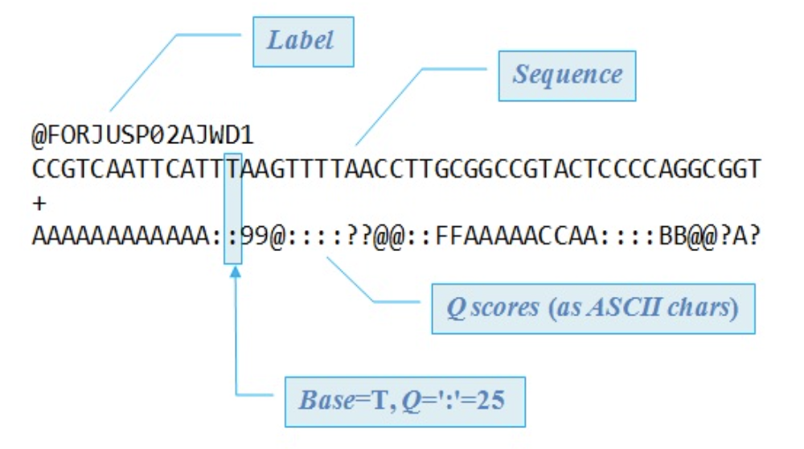
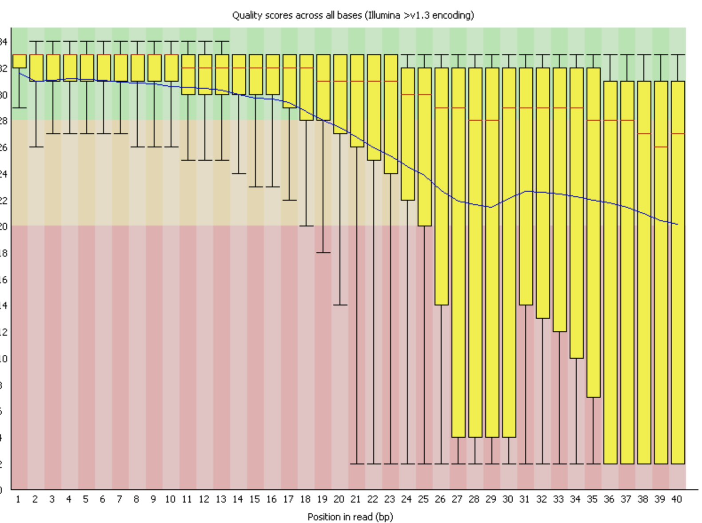
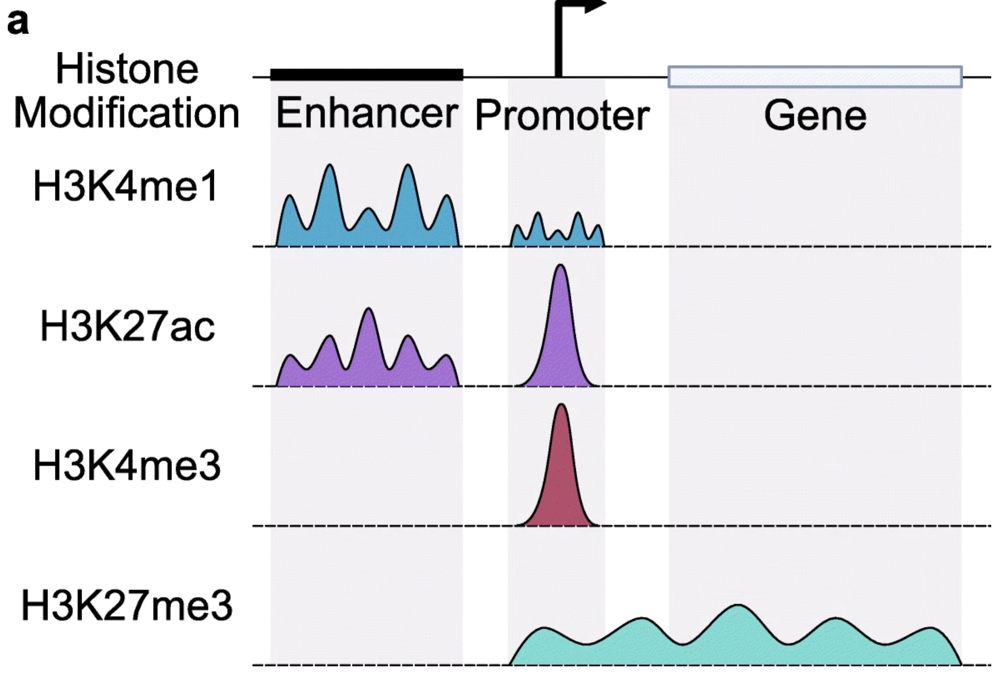
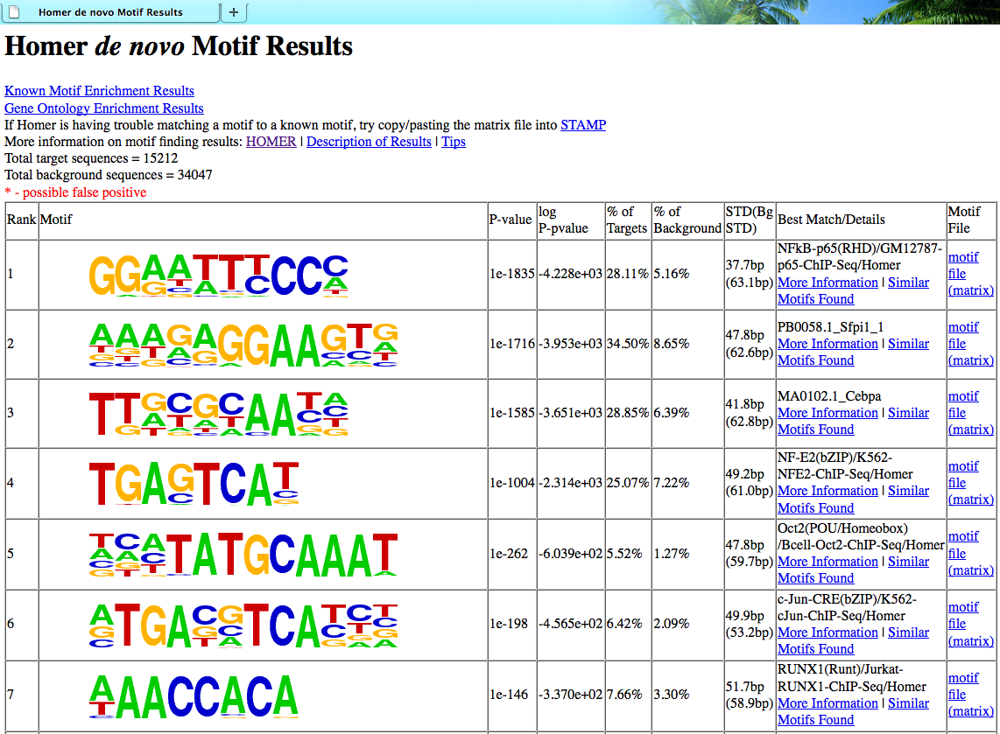

# **ChIP-Seq Pipeline and Analysis**    Nathan Onpaeng, Je An, Adrian Layer               

## Introduction to ChIP-seq
---
**Definition: ChIP sequencing is the union of ChIP assays and sequencing in order to identify and analyze DNA binding sites for transcriptional regulators in the epigenome such as histone modifications, DNA methylation, etc.[1]** 
---
This may seem confusing at first, however, there must be an introduction or review of some important biological terminologies in order to fully understand this sequencing tool. Transcription factors are proteins that are involved in the regulation of transcription. Transcription factors bind to specific genes to turn them on or off so with a sequencing tool, we are able to know which specific seqeuences of DNA interact with certain proteins. This allows for further discoveries and innovations in fields such as drug discovery and disease research. ChIP stands for chromatin immunoprecipitation and it is where DNA-bound protein undergoes immunoprecipitation using a specific antibody. Protein-DNA interaction sites are also imperative to understand since it is the studied location where protein binds to DNA. With the introduction of these concepts complete, we can now piece together the puzzle and fully understand the definition of ChIP-sequencing. 

## Challenge: The primary concern we have when attempting ChIP sequencing is this: 
---
**How can we isolate those target sections of DNA which are bound to our proteins of interest?**

We already know the reason why we need to know which sites are specifically interacting with specific proteins - this information is invaluable. In the next section, it will become clear exactly how we will select for our target DNA.

## ChIP-seq Workflow
---
### Step 1 - Formaldehyde cross-linking
Cross-linking is the process of joining two or more molecules via a covalent bond. In our first step, we will cross-link our whole cells with formaldehyde. Formaldehyde is electrophilic, and an aldehyde - the smallest of its kind. It is able to be nucleophilically attacked by a variety of molecules. While using formaldehyde as a probe for macromolecular structure, scientists discovered that formaldehyde can be used to cross-link histones to DNA. This is the discovery that eventually led to ChIP. In our workflow, we cross-link with formaldehyde to “fix” the interactions between DNA and protein. If we do not do this, some of the later steps in our ChIP workflow can disrupt these interactions and make them impossible to study - therefore, the cross-linking step of ChIP is absolutely essential[9].

  

https://pubs.rsc.org/en/Image/Get?imageInfo.ImageType=GA&imageInfo.ImageIdentifier.ManuscriptID=D2SC00188H&imageInfo.ImageIdentifier.Year=2022

### Step 2 - DNA Isolation via Lysis
Next, we will lyse our cells (dissolve the cell membrane) in order to isolate our DNA. Lysis will be done with either a detergent-based Lysis solution or mechanically - though this can result in more damage than necessary, so unless it is required, mechanical lysis is unadvised.

### Step 3 - Preparing Our Chromatin
After lysis, our exposed DNA will be cut by either sonication or restriction enzymes. Sonication is a process by which sound energy is applied to a substance, agitating the particles to the point where they fragment. Of course, restriction enzymes are proteins that recognize specific nucleotide sequences and cut DNA at those specific locations. Of the two options, sonication is more time efficient - nuclease might have to be run overnight in order to sufficiently cut the genome. However - one thing that should be considered with sonication is the true randomness in sizes of the fragments it produces. With restriction enzymes, the lengths of fragments will be much more uniform, so there is a tradeoff[13].

  

https://commercio.nyc3.digitaloceanspaces.com/goldbio-2018/pages/Text%20Only%20(2).png

### Step 4 - Immunoprecipitation: Addition of the Protein-Specific Antibody and Bead
Next, we will add a protein-specific antibody to our DNA, corresponding to our protein of interest. Selection of the correct antibody is vital - if done incorrectly, we will fail to select for our DNA-protein interaction complex of interest, and the directive of our ChIP-seq will fail. Thankfully, due to much research by the scientific community, most proteins we need to target by now will have a corresponding antibody on file in some database. In the event that there is no corresponding antibody available, proteins can be expressed in the sample that are fused to affinity tags (such as His or Myc). Antibodies can then be used that correspond to these affinity tags[13].

  

https://www.genome.gov/sites/default/files/tg/en/illustration/antibody.jpg  

Prior to addition of the antibody, a bead will be conjugated to it - either magnetic or agarose. Magnetic beads are easier to see in solution, while agarose beads have better binding capabilities. The addition of the bead is crucial, and will come into play during our wash step.

### Step 5 - Wash
After our complexes are formed, we will use a magnet to pull our complexes to the side of the solution (in the case of using a magnetic bead) and then wash repeatedly. In the case that we have used an agarose bead, protein A or G or a combination of both is used to make our complexes insoluble, and then washing is done as normal[13]. In both cases, it is absolutely essential that the wash step be thorough and complete. If this is not the case, we can end up with confounding results.

  

https://www.leinco.com/wp-content/uploads/2020/04/immunoprecipitation-02-scaled.jpg

### Step 6 - Cross-link Reversal and DNA purification
After our wash step, we will then reverse our cross-links, and process our DNA with an enzyme such as protease, which will digest our bound protein. This process leaves us with clean, unbound DNA which was previously bound to our protein of interest - which we are now ready to sequence.

### Step 7 - Sequence and Map to Library
Typically, sequencing adapters will be added to the two ends of each fragment, allowing the Illumina sequencer to sequence them. After sequencing, we will then map our reads to our reference genome.

## What Does ChIP Output?
---
### Single-end Reads vs. Paired-end Reads
Chip outputs both single-end reads and paired-end reads. While single end reads are more economical, paired-end reads improve library complexity and mapping efficiency over repetitive regions.

### FASTQ Files
Each read in the FASTQ file format consists of four lines: The label, the actual nucleotide sequence itself, a connecter sequence, and the quality scores as ASCII characters - with ‘!’ corresponding to the lowest possible quality bases, while ‘~’ corresponds to the highest quality bases.

  

https://www.drive5.com/usearch/manual/fastq_fig.jpg

Quality can also be assessed via Phred quality score, a measure that extends from 0 to 40. Typically, any base with a quality score above 28 would be considered of good quality. It should also be noted that reads tend to drop off in quality towards the beginning and ends of reads.

Below are the base-by-base quality scores of a read represented in FastQC, a program used for analyzing the quality of reads.

  

https://www.bioinformatics.babraham.ac.uk/projects/fastqc/Help/3%20Analysis%20Modules/per_base_quality.png

### Mapping Outcomes
In terms of mapping outcomes, there are four possibilities. Uniquely mapped reads, Multiple mapped reads, Low Quality reads, and no mapping. In the past, there were techniques that attempted to “save” multiple mapped reads - however, as technology has evolved and sequencing costs have continued to decrease, most researchers will now opt to only use uniquely mapped reads for their analysis, due to the very low cost of sequencing.

## Softwares that Analyze ChIP-Seq
---
There are many softwares that will analyze our output from ChIP-seq, and we will go over two in detail that perform different actions. 

### IGV / UCSC Genome Browser:  
When we recieve the output from our ChIP-Seq, it is crucial that we are able to visuallize it when compared to a reference genome[3]. With inputting our outputs into a visuallization browser such as IGV or the UCSC Genome Browser, we can see the enrichment and transcript levels of various transcriptional regulators.  

Below is an example of how the outputs will show in a visualization brower and the peaks localization near important genes. We will discuss in a future section on how these visualizations are key for inferences for our dataset.

https://genomebiology.biomedcentral.com/articles/10.1186/s13059-022-02707-w

### HOMER:  

Given that the reads in our ChIP-seq output is of various transcriptional regulators, such as transcription factors, it is important to know where these transcription factors are located. In HOMER[2], we can determine which motifs are the most enriched in the reads we are getting. The output of HOMER can also tell us which transcription factor it is and information on how the corresponding is important. Furthermore, HOMER was develeoped by UCSD's very own Professor Benner!

*Example output from HOMER*

## Inferences Made with ChIP-Seq
---
With the outputs of the above software, we can make some key inferences about dataset that simply looking at raw reads would not tell us. Firstly, with the help of visualization browsers, we are able to find the relative locations of different transcriptional regulators on a genome-wide scale[5]. This can help us make some inferences about key regulatory networks based on the localization and abundance of the reads. The abdunance is represneted by the 'peaks' in our visualization. 

One example is the indication of a H3K27me3 modification, which can infer downregulation. If there are a lot of peaks of H3K27me3 modifications, then this may correlate with low transcript levels as a regulation factor.

Inferences such as these, with the use of the the aforementioned software, has contributed greatly to the ENCODE[15] project. More than hundred of transcriptional regulators have been marked inside of the human genome due to these technologies, and has revolutionized the future of genome building. 

## Advantages and Disadvantages
---

### Advantages:
Some of the main advtanages that ChIP-seq has is that it is highly specific on what it's purpose is of detecting the DNA-protein complexes and various transcriptional regulators[4]. With the help of some softwares, we can make key inferences on the dataset and uncover key regulatory networks. Since ChIP-seq is highly specific, it allows for a base-level resolution in reads genome wide. Additionally, the cost and effeciency of sequecning is evolving rapidly, so as that continues to develop, ChIP-seq will become more and more accessible.

### Disadvantages:
One disadvantage that ChIP-seq has is that oftentimes the quality of reads is equal to the quality of the antibody used to bind to the proteins during immunoprecipitation. Verifying if these antibodies are of quality can take time and more money, but it is essential to have a good antibody to recieve proper outputs.[6]

Overall, ChIP-seq is a crucial tool in bioinformatic analysis, and will continue to be due to it's high specificity and it's ablilty to gather data to make inferences about key regulatory networks

## References:  
---
1.) Chromatin Immunoprecipitation Sequencing (Chip-Seq), https://www.illumina.com/techniques/sequencing/dna-sequencing/chip-seq.html. 

2.) Homer. Homer Software and Data Download. (n.d.). Retrieved December 6, 2022, from http://homer.ucsd.edu/homer/ngs/peaks.html 

3.) Mistry, M. (2017, July 29). Qualitative assessment of Peaks. Introduction to ChIP-Seq using high-performance computing. Retrieved December 6, 2022, from https://hbctraining.github.io/Intro-to-ChIPseq/lessons/11_qualitative_assessment_IGV.html 

4.) Park, P. J. (2009, September 8). Chip–SEQ: Advantages and challenges of a maturing technology. Nature News. Retrieved December 6, 2022, from https://www.nature.com/articles/nrg2641 

5.) Qin, Q., Fan, J., Zheng, R., Wan, C., Mei, S., Wu, Q., Sun, H., Brown, M., Zhang, J., Meyer, C. A., &amp; Liu, X. S. (2020, February 7). Lisa: Inferring transcriptional regulators through integrative modeling of Public Chromatin Accessibility and ChIP-Seq data - genome biology. BioMed Central. Retrieved December 6, 2022, from https://genomebiology.biomedcentral.com/articles/10.1186/s13059-020-1934-6#:~:text=High%2Dquality%20TR%20ChIP%2Dseq%20data%2C%20when%20available%2C,genes%20in%20particular%20cell%20types. 

6.) Sara RydingReviewed by Dr. Liji Thomas. (2019, February 26). ChIP-seq advantages and limitations. News. Retrieved December 6, 2022, from https://www.news-medical.net/life-sciences/ChIP-seq-Advantages-and-Limitations.aspx 

7.) 2.FASTQC Box Plots of Quality Scores per Read Position of Illumina ... https://www.researchgate.net/figure/FastQC-box-plots-of-quality-scores-per-read-position-of-Illumina-data-Y-axis-Phred_fig14_272019619. 

8.) “Antibody.” Genome.gov, https://www.genome.gov/genetics-glossary/Antibody. 

9.) DT;, Hoffman EA;Frey BL;Smith LM;Auble. “Formaldehyde Crosslinking: A Tool for the Study of Chromatin Complexes.” The Journal of Biological Chemistry, U.S. National Library of Medicine, https://pubmed.ncbi.nlm.nih.gov/26354429/. 

10.) “FASTQ Files.” FASTQ Files, https://www.drive5.com/usearch/manual/fastq_files.html. 

11.) “How to Break up DNA for NGS Library Prep.” GoldBio, https://goldbio.com/articles/article/how-to-fragment-DNA-for-NGS. 

12.) “Immunoprecipitation Protocol.” Leinco Technologies, 1 Apr. 2020, https://www.leinco.com/immunoprecipitation/. 

13.) “A Step-by-Step Guide to Successful Chromatin Immunoprecipitation (CHIP) Assays: Thermo Fisher Scientific - US.” A Step-by-Step Guide to Successful Chromatin Immunoprecipitation (ChIP) Assays | Thermo Fisher Scientific - US, https://www.thermofisher.com/us/en/home/life-science/antibodies/antibodies-learning-center/antibodies-resource-library/antibody-application-notes/step-by-step-guide-successful-chip-assays.html. 

14.) Wei, Yu-Bai, et al. “Biomimetic Mimicry of Formaldehyde-Induced DNA–Protein Crosslinks in the Confined Space of a Metal–Organic Framework.” Chemical Science, The Royal Society of Chemistry, 21 Mar. 2022, https://pubs.rsc.org/en/content/articlelanding/2022/sc/d2sc00188h. 

15.) Wikimedia Foundation. (2022, June 30). Encode. Wikipedia. Retrieved December 6, 2022, from https://en.wikipedia.org/wiki/ENCODE 
