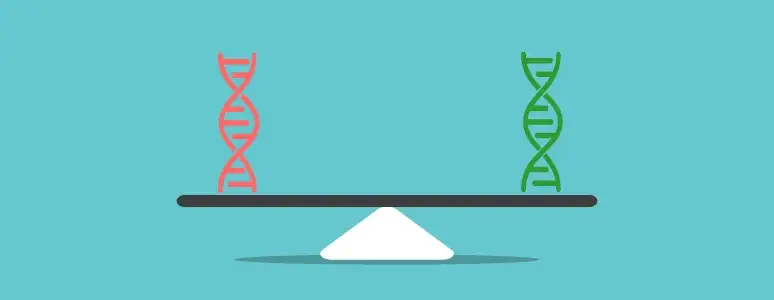
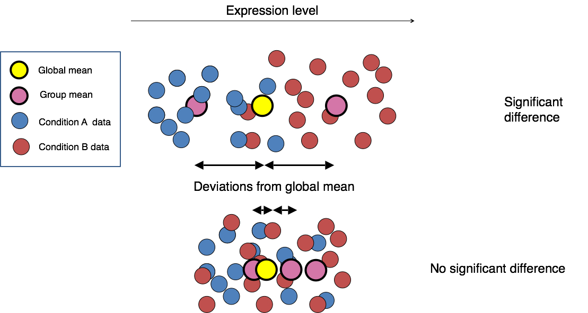
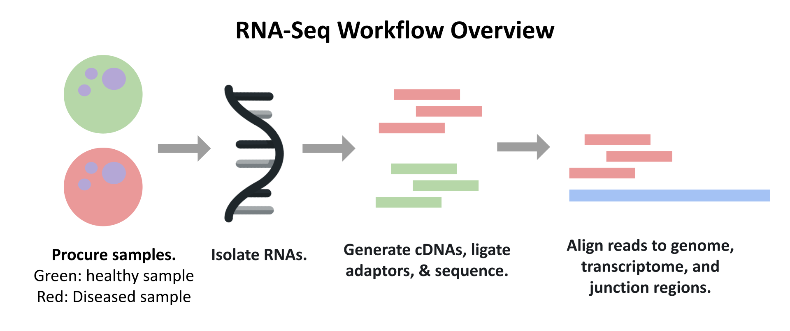
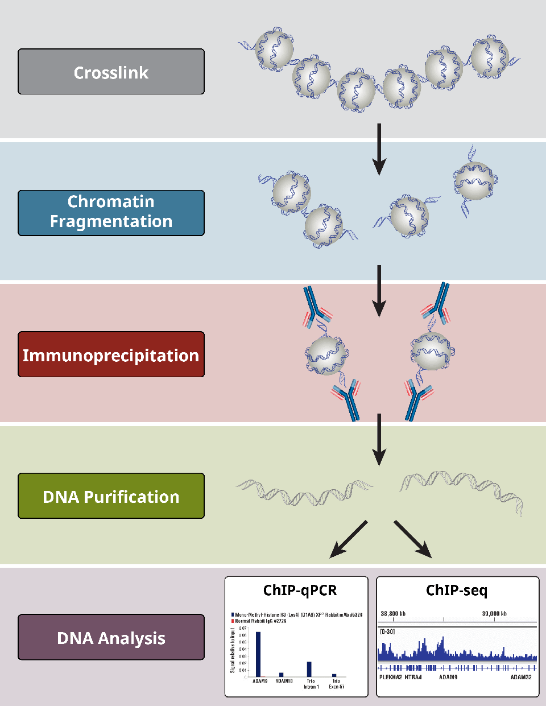
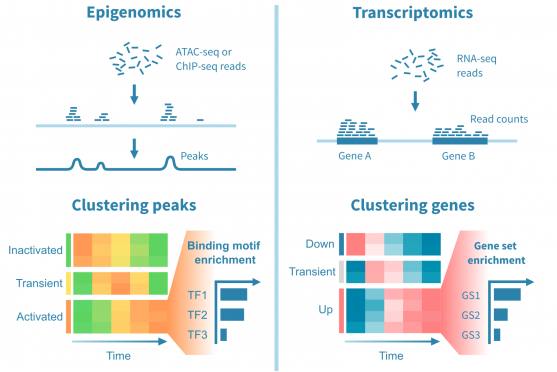
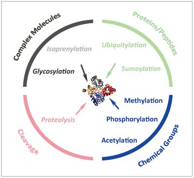
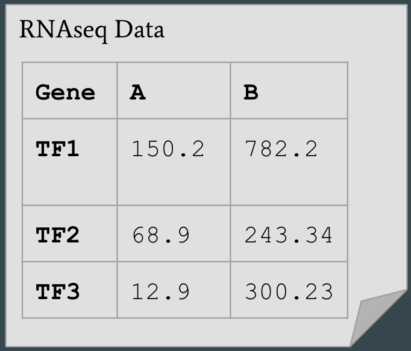
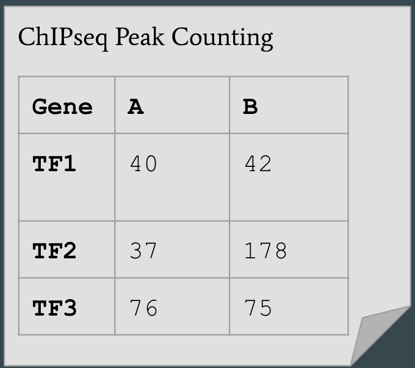

# Differential Expression Analysis Using both RNAseq and ChIPseq

Manan Chopra, Archishma Kavalipati, Louisa Black

  

  <i><b>Figure 1</b>: Perfectly balanced... looks like 0 fold change! [1]</i>

 

The goal of this chapter is for readers to come away with **four key understandings:**

1. [What is Differential Analysis (DA) and why do we care about it?](#DA)
2. [What is RNAseq, and how do we use it to do DA?](#RNA)
3. [What is ChIPseq, and how do we use it to do DA?](#ChIP)
4. [How does using both RNAseq and ChIPseq together enhance our DA?](#combo)

We will go over all these points in detail, and provide a summary at the end. Let's get started with talking about DEA!

## What is Differential Analysis (DA)? <a name="DA" />

  

  <i><b>Figure 2</b>: Depiction of DA. In this image, the circles can represent any metric. We will go over DA of expression data from RNAseq, as well as DA of TF-binding data from ChIPseq. [2]</i>

 

Differential analysis (DA) is an analysis technique that excels at extracting 'significant' data points from a dataset. These points are deemed significant because of their difference in value between two samples of interest. For example, this could refer to the difference in a certain gene's expression between a healthy tissue sample and a tumor tissue sample. This would be an example of Differential **Gene Expression** Analysis, and is often done using RNAseq. Another example of DA would be analyzing the difference in transcription factor (TF) binding between the two sample, healthy and tumor. Through similar logic, we can perform DA on any metric of biological relevance, for which we have information from two datasets.

### What's the point?

It is always a good idea to ask the question: 'Why do we care?'. In this case, we care because oftentimes experimental science boils down to: _What is causing this sample to behave differently than this other sample?_. A good way to answer this question is to investigate everything that is different between the two samples. If two restaurants are selling bean and cheese burritos but one is clearly tastier, we might want to perform Differential Ingredient Analysis to investigate. Similarly, between the healthy and tumor tissue samples mentioned earlier, finding a gene that is expressed highly in tumor cells versus healthy cells could lead us to perform knockdowwn studies on this gene, and provide information on the disease pathway. We could do the same with TF binding data to investigate the binding of different TFs in healthy and tunor tissue.

 

In the next sections, we will go over RNAseq and ChIPseq, and delve deeper into how we would perform DA with data sourced from the two technologies.

## What is RNAseq? <a name="RNA" />

RNA-Seq can be thought of as a basic process to **measure gene expression**. Because genes are transcribed to produce RNA products, the amount of RNA transcripts present in a cell can tell us important information about which genes are active and the levels of their activity. In the case of differential expression analysis, we can use RNA-Seq outputs, in the form of normalized read count data, to compare the levels of gene expression between different samples and arrive at conclusions based on this data.  

For example, let's consider a situation where we have cell samples from two different patients: one healthy, one diseased. If you have a target gene in mind, you can run the RNA-Seq workflow for each sample to find whether your gene of interest is differentially expressed in one sample versus another. These findings can be used in further studies and validated through knockout experiments. 

### RNAseq Workflow

*Figure: RNA-Seq workflow overview*

  

A typical RNA-Seq workflow follows the following steps:  
1. **Procurement of samples**  
    Example: Getting cells from healthy and diseased tissue
1. **Isolation of RNA**  
    Because RNA is the product we are measuring, it is important to target and isolate the specific transcripts we want to measure. 
1. **Fragmentation of RNA, generation of complementary DNA sequences, adaptor ligation and amplification**  
    Due to the lack of stability in RNA molcules, an enzyme called Reverse Transcriptase must be used to convert the RNA fragments into complementary DNA sequences, or cDNA, for further experimental processing. Adaptors, which can be thought of as barcodes containing a specific signal, are then ligated to the cDNA molecules. Each "barcode" allows the sequence to be identified post-sequencing steps, so each read can be appropriately matched to the sample it originated from.        
1. **Sequencing**  
    Sequencing is the process of converting the biological data derived from the previously described experimental steps to digital output files, which contain pertinent information about each sequence. These files are typically in FASTQ format, and they can be used in a variety of downstream analyses. 
1. **Read alignment to genome, transcriptome, and junction regions**  
    Alignment, also commonly referred to as mapping, is the process of taking the reads generated from sequencing and finding the regions they correspond to in the genome/transcriptome. 
1. **Downstream Analysis Steps**  

### What we can learn

### DA Tools/Methods for RNAseq

## What is ChIPSeq? <a name="ChIP" />

ChIP-seq is a form of sequencing that combines chromatin immunoprecipitation followed by next-generation sequencing. ChIP-seq allows us to locate DNA binding sites where specific transcription factors and other proteins can bind. Being able to locate specific binding sites of transcription factors and proteins can allow us to determine which location in the DNA is specifically being activated and effected and to study the function of transcription factors and proteins. We can further interpret regulatory events that could be important in many biological processes that could be positive or negative. 

### ChIPseq Workflow

*Figure: ChIP-Seq workflow overview*

  

The ChIPseq Workflow consists of four steps:
1. Crosslink 
We want to perform a crosslink between the target protein and the DNA. In essence, we are attaching together the DNA to nearby proteins. Crosslink is the joining of two or more molecules by a covalent bonds, and the reagents used are molecules that contain reactive ends that are capable of binding to specific function groups on proteins or other molecules. 

2. Chromatin Fragmentation
We then shear the DNA into smaller fragments. Fragmentation allows the protein and DNA complexes that are high in molecular weight chromatin are soluble and accessible for further processing. 

3. Immunoprecipitation 
Immunoprecipitation is the process of precipitating a protein antigen out of a solution by using an antibody that is highly specific to a certain protein. This allows us to isolate and focus on a specific protein from a sample that might contain many different proteins. 

4. Purification 
We then purify the DNA fragments and undergo sequencing library preparation. Purifying consists of reverse crosslinking protein-DNA complexes, and is done so under heat and in the presence of Proteinase K (protects DNA from nucleases). Contaminant proteins are digested and DNA is held. 

Library preparation can vary. A common choice is to use paired-end Illumina Sequencing that utilizes poly-A tails capped with adapters.

### What we can learn

### DA Tools/Methods

## What do we gain by using both technologies together? <a name="combo" />

  

  <i><b>Figure x</b>: This figure depicts the type of output we would get from both ChIPseq (epigenomics) and RNAseq (transcriptomics). In the next few sections, we will discuss how these outputs play well with each other. [x]</i>

 

In previous sections, we went over how to apply the concept of DA to analyze the different types of data that we obtain as a result of RNAseq and ChIPseq. In this section, we will discuss the motivations behind combining the two technologies, and why this gives us a more robust view of the biological function of the system we are investigating.

### Limitations of RNAseq Alone

  

  <i><b>Figure y</b>: This figure summarizes the main mechanisms for post-translational modification of proteins. As we will discuss in this section, RNAseq gene expression data does not account for protein regulation. [y]</i>

 

There is no doubt that RNA sequencing for gene expression data has been one of the most important scientific technologies developed in the last century. The onset of 'the sequencing era' has produced enormous amounts of new knowledge and understanding about a wide variety of systems. However, the technology does not come without its limitations. The most worrisome of these drawbacks is shown in Figure y: post-translation modifications (PTMs). As discussed earlier, RNAseq counts gene expression based on transcripts present at the time of RNA extraction. While this is definitely a decent indicator of a genes importance, it fails to account for the possibility that some of these analyzed transcripts will get translated into proteins, which will then get degraded through some PTM and never havea functional impact. As a result, we could have a gene we think to be important because its expression is differential. when in reality its functional impact does not change. 

Luckily for us, ChIPseq is perfectly suited to help us resolve this uncertainty, albeit only with TF (or other DNA-binding protein) analysis. As discussed before, ChIPseq is a tool for examining the binding of DNA-binding proteins such as TFs, so we can use it only when analyzing this subset of genes. Because of the importance of TFs as regulators of gene expression, however, more often than not we find ourselves interested in these proteins, and so the use of RNAseq + ChIPseq is still relevant. 

We will now dive into exactly how ChIPseq can help us validate our RNAseq findings.

### ChIPseq to the Rescue!

Based on what we discussed previously, it seems that the most concerning limiation of RNAseq that we want to neutralize is its inability to account for post-translation modifications (PTMs). Essentially, this boils down to the fact that RNAseq is not a functional assay; high gene **expression** does not necessarily imply that the gene is going to be highly **functionally active**. ChIPseq, on the other hand, does exactly this, for investigating specific transcription factors (TFs). Keeping in mind the way these two technologies work, we can craft the following broad protocol for this combined workflow:

1. Obtain RNA and DNA from samples of interest
2. Perform RNAseq to get gene expression for the entire genome
3. Perform differential expression analysis to get the top differential DNA-binding proteins 
4. Perform ChIPseq for these proteins of interest
5. Perform differential peak analysis to analyze the differential binding activity of these proteins
6. Compare differential analysis outputs from RNAseq and ChIPseq to make conclusions and prompt further studies.

This workflow would enable us to investigate gene regulatory networks, and how different TFs interact with different loci in different samples to prompt phenotypical changes. Let's look at an example using a toy dataset that will help solidify our understanding of the interaction between RNAseq and ChIPseq.

### Example

  

  <i><b>Figure z</b>: An oversimplified example dataset meant to help illustrate the pitfalls of RNAseq alone, and how ChIPseq can help us overcome this. We have an RNAseq gene expression output for three TFs on the left, across two samples A and B, as well as peak counts for the same three TFs and same two samples after running ChIPseq.</i>

 

Let's start by drawing a conclusion as if the ChIPseq data didn't exist. We would probably conclude that all three proteins (TF1,2, and 3) were signficantly upregulated in sample B compared to A, due to their differential expression. We would suggest investigating these proteins further, perhaps with knockdown/knockin studies. 

Now, let's take the ChIPseq data into account. Just by looking over the data, we see that TF1 and 3 seem to generally maintain their binding levels across A and B, despite the fact that they are being overexpressed. However, TF2 shows a sharp uptick in binding activity that matches its expression uptick from the expression numbers. Now that we've taken this into account, we would likely conclude that TF2 is in fact the most relevant protein to the underlying biological differences between A and B, and would want to focus our research efforts on elucidating the role of TF2 in this system. 

To recap, RNAseq data alone does not give us a sufficient functional analysis, but by including ChIPseq downstream in the workflow, we can functionally validate our RNAseq results.

## Conclusion

Next-generation sequencing has brought on a new age of biology, but it is important to keep in mind the biological context with which we perform these experiments, lest we get carried away with the technology itself. In this chapter, we learned about Differential Analysis, and how it is performed on the data collected by RNAseq and ChIPseq, and how these technologies work. We then discussed the use of both sequencing methods in the same workflow, and how they work together to provide a more complete picture of the functional differences between samples of interest. It is important to note that these are not the only pair of sequencing technologies that compliment each other. Because of its broad output, RNAseq is extremely compatible with many other sequencing technologies, including:

- ATACseq, which tells us the accessibility of chromatin on a genome scale
- CLIPseq, which explores RNA-Binding Protein - RNA binding
- scRNAseq, which explores the RNA profiles of individual cells
- many more, and more being invented all the time!

This chapter hopefully gave you a basis for understanding not only the specific technologies discussed, but the importance of evaluating the usefullness of your data, and how to leverage different methods to arrive at the best conclusion possible.

## References

1. Perrin, H. (2018, April 30). Visualize differential gene expression with ViDGER. Medium. https://medium.com/@HeleneOMICtools/visualize-differential-gene-expression-with-vidger-ee922e1c2a8
2. Harvard Chan Bioinformatics Core. (2017, May 12). Gene-level differential expression analysis with DESeq2. Introduction to DGE - ARCHIVED; GitHub Pages. https://hbctraining.github.io/DGE_workshop/lessons/04_DGE_DESeq2_analysis.html 
 
x. Liuksiala, T. (2022, November 4). Integrative analysis of RNA-seq and ChIP-seq data. Genevia Technologies. https://geneviatechnologies.com/blog/integrative-analysis-of-rna-seq-and-chip-seq-data/

y. Wang, Y.-C., Peterson, S. E., & Loring, J. F. (2014). Protein post-translational modifications and regulation of pluripotency in human stem cells. Cell Research, 24(2), 143–160. https://doi.org/10.1038/cr.2013.151
