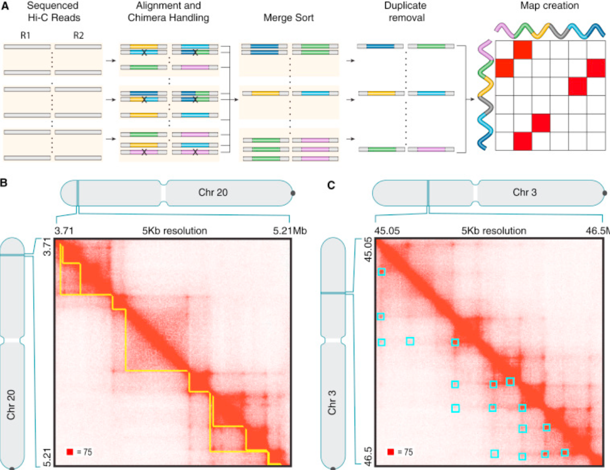

# Hi-C Overview and DNA Loop Detection

### By Rueshil Fadia, Leo Tricoire, and Rohil Ahuja

1. [Introduction to the 3D Genome and Hi-C](#1) <br>
    1.1 [Cis-Regulatory Elements](#2) <br>
    1.2 [Chromatin Loops](#3) <br>
    1.3 [DNA-Histone Interactions](#4) <br>
    1.4 [Introduction to Hi-C](#5) <br>
    1.5 [Steps of Hi-C](#6) <br>
2. [Computational Analysis and Tools for Hi-C Data](#7) <br>
    2.1 [Computational Workflow](#8)<br>
    2.2 [Contact Matrix and Heatmap Analysis](#9) <br>
3. [Computational Detection of Chromatin Loops](#10)  <br>
    3.1 [General Overview of Chromatin Loop Detection](#11) <br>
    3.2 [Detection of Chromatin Loops Using the Juicer Pipeline](#12) <br>
    3.3 [Specific Example of Chromatin Loop Detection](#13) <br>
    3.4 [Edge List](#14) <br>
    3.5 [Detecting Loops](#15) <br>
    3.6 [Code for Detecting Loops](#16) <br>
    3.7 [Practical Applications for Chromatin Loops](#17) <br>

***

## 1. Introduction to the 3D Genome and Hi-C <a name="1"></a>
In order for millions of nucleotides to fit inside the nucleus of each cell, mechanisms for directed packing have been adopted. These mechanisms involve a highly complex organization of the genome and a wide diversity of interactions at different scales.

### 1.1 Cis-Regulatory Elements <a name="2"></a>
Each gene contains multiple regulatory elements that interact with protein and contribute to DNA folding. When these regulatory elements regulate the transcription of nearby genes physically located on the same DNA molecule, they are called cis-regulatory elements. On the other hand, trans-regulatory elements regulate the transcription of distant genes located on another DNA molecule. 

Examples of these cis-regulatory elements include:  

Promoter: This is a region of DNA just upstream of the protein-coding region. RNA polymerase 3 initiates transcription by binding to the promoter of that specific gene. The promoter interacts with enhancers and silencers for further transcriptional regulation [1].

Enhancers: Distal short regulatory elements that are activated via transcription factor binding. Enhancers loop back to interact with the promoter and enhance the transcription of that specific gene [1]. 

Silencers: Distal short regulatory elements that are also activated by transcription factor binding. Silencers repress transcription by interacting with the promoter in a mechanism likewise to enhancer [1]. 

### 1.2 Chromatin Loops <a name = "3"></a>
In order to cause the regulatory effects they are meant to, enhancers and promoters evolved in a way to create “loops” to increase the spatial proximity of these elements. These are called chromatin loops.

 <br>
*Figure 1.1: Different subtypes of chromatin loops [2]*

A well-known example of a formation of a chromosome loop is the locus control region (LCR) of the β-globin cluster, which interact very strongly with target genes where the β-globin is active, such as erythroid cells, but has very little interaction with other cell lineages [2]. 

### 1.3 DNA-Histone Interactions <a name = "4"></a>
On a larger scale, DNA organizes itself by wrapping around proteins known as histones. DNA wrapped around eight histone proteins make up nucleosomes. Bundles of these nucleosomes make up chromatin, which are then aggregated to make chromosomes. DNA-Histone interactions also regulate gene expression. For example, Lysine residues on the histones may be acetylated as seen on Figure 1.2 below.

 <br>
*Figure 1.2: Acetylation of Lysine [3]*

On Figure 1.2, the histone originally had a positive charge, a source of strong affinity to negatively charged DNA. Thus, the chromatin was condensed and generally unaccessible for transcription. This form is better known as heterochromatin. The loss of this positive charge weakens the DNA-histone interactions and decondenses the chromatin. The chromatin is now more accessible for transcription and is better known as euchromatin. 

### 1.4 Introduction to Hi-C <a name = "5"></a>
One of the biggest challenges in the analysis of 3D genome and global chromatin conformation lies in the fact that the genome is folded into multiple hierarchical structures including chromosome territories, compartments, TADs, and chromatin loops. 

Hi-C technology is used in order to visualize the physical interaction in the genome. Hi-C is unique in that it maps all the genome-wide interactions at one time. Hi-C builds off of 3C technology which is the original technology to visualize chromatin contact. 3C is limited in that it can only detect interactions between specifically known fragments [4].

The development of Hi-C technology and new computational tools lead to a big step forward in the understanding of the 3D genome. Hi-C data analysis has enabled the identification of compartments separating active/permissive chromatin from inactive/inert chromatine. Furthermore, it has helped identify chromosome territories, and demonstrated that interactions between loci on the same chromosome are much more frequent that interactions between different chromosomes [1]. 

### 1.5 Steps of Hi-C <a name = "6"></a>
 <br>
*Figure 1.3: Hi-C step-by-step [5]*

The steps of Hi-C are as follows:
1. Formaldehyde is used to crosslink the DNA. This freezes all the cell’s interactions including DNA-DNA interaction, DNA-Protein interactions and Protein-Protein interactions. 
2. In order to access the nuclear material, the cell is lysed.
3. HindIII or another restriction enzyme is used to cut the DNA to create sticky ends (an overhang).
4. The sticky ends anneal to complementary biotinylated nucleotides. Biotin is a selectivity marker for this ligation process. 
5. DNA fragments are ligated together in a process called proximity ligation. All the DNA strands that were close in proximity, and thus were interacting, are now ligated together. 
6. Phenol-chloroform is used to purify these fragments and an exonuclease is used to remove the biotinylated nucleotides of the DNA fragments that were not ligated. In a future step, only the strands with biotinylated nucleotides will be sequenced. 
7. The DNA is cut into fragments of several hundred base pairs. This is an appropriate length for sequencing. 
8. The DNA is sonicated to reverse the crosslinks. 
9. The DNA fragments are ran through streptavidin because of its high-binding affinity with biotin. This streptavidin pull-down selects for the biotinylated fragments which indicates where the DNA was linked to other DNA strands. This allows to keep only the chimeric products. The Biotin-Streptavidin complex is cleaved from the DNA strand. 
10. Sequencing adapters are added and then PCR amplifies the chimeric products. 
11. Finally, the chimeric products are sequenced and bioinformatics analysis can be performed. [4]

## 2. Computational Analysis and Tools for Hi-C <a name = "7"></a>

### 2.1 Computational Workflow <a name = "8"></a>
After sequencing the Hi-C chimeric products, a series of computational steps occur in order to obtain a contact matrix which can be used to analyze genome interactions. An overview of the process to obtain this matrix is provided in Figure 2.1.  

 <br>
*Figure 2.1: Hi-C Data Process, from FASTQ file to contact matrix [6]*

Hi-C data processing workflow starts with FASTQ files of paired-end reads obtained from sequencing. These paired-end reads are supposed to map to two different regions of the genome, and thus they are aligned separately. However, the alignment of Hi-C reads that span the ligation junction will not have exact sequence identity with the genome. Instead, two portions of the read will align with two non-adjacent regions of the genome. These reads that span the ligation junction are known as “chimeric reads” [6]. Several pipelines such as HiC-inspector, HiC-Box, HiCdat, HIPPIE, and Juicer choose to ignore the possibility of a chimeric reads. This works well with short reads as they have a low probability to span the ligation junction. Hi-C Pro handles these by splitting the chimeric reads at the junction and then remapping these partial tags to the reference genome. This strategy is illustrated on Figure 2.2A below [7].

As each end of the paired-end reads are mapped separately, it is then needed to do pairing to assign the aligned reads (BAM files) to their fragment of origin, and to obtain Paired-End Tags (PETs). SAMtools can be used to sort the results in a file (text file for example).

After, the filtering step aims to remove invalid PETs, reads with low alignment quality, and multiple read pairs mapped in the same positions. There are several algorithms used to filter invalid PETs. One of the strategies is to use restriction enzyme digested fragments to classify PETs according to their direction and their locations to the digested sites [7]. PETs and invalid PETs are illustrated on Figure 2.2B.

 <br>
*Figure 2.2: Read pair alignment with Hi-C Pro (A) and selection of valid PETs (B) [8].*

Once invalid PETs are removed, the genome is binned into small regions of fixed size and each valid PET is assigned to a unique bin. The rationale behind summarizing read counts at the level of genomic bins is to achieve a more robust and less noisy signal in the estimation of contact frequencies [6]. The choice of the bin size defines the final resolution. Data is typically binned into sizes ranging from 40kb to 1MB. There are several ways to determine the resolution. It can be defined as the smallest bin size for which more than 1000 reads can be observed in at least 80% of the bins. More precise strategies are usually used depending on the specificity of the dataset [9]. The binning results can be stored in a matrix format [7]. 

The final computational step is normalization. Binning and normalizing are usually executed by the same tool. There are different normalization strategies to remove different types of biases. They can be divided into two groups: implicit and explicit normalization. Explicit normalization methods are based on a set of specific known biases, including the fragment length, the GC content and mappability. Correction factors are computed for each bias and then applied to read counts per genomic bin. This method can be executed by the HiCNorm model. Meanwhile, implicit (or matrix-balanced) methods do not rely on specific assumptions but assume uniform visibility for all genomic loci, and hence assures equal row and column sums. It includes iterative correction and eigenvector decomposition (ICE) and Knight and Ruiz’s algorithms [6] [7] [9]. 

## 2.2 Contact Matrix and Heatmap Analysis <a name = "9"></a>
A contact matrix is an *n* x *n* matrix where M<sub>ij</sub> is the number of reads (summarized at the level of genomic bins) supporting interaction between two different loci. 


*Figure 2.3: Contact Matrix and Heatmap Displays [10]*

This contact matrix can be visualized as a heatmap, with intensity indicating contact frequency. Higher intensities are observed on the diagonal as contact frequency is logically more important for loci that are closed to each other.

Once the contact matrix is displayed, downstream analysis can be performed. These analyses occur at multiple levels of resolution, including the identification of compartments, TADs, and point of interactions such as Chromatin loops. The rest of this chapter will be focused on the detection of chromatin loops. 

 <br>
*Figure 2.4: Heatmap Analysis [1]*

## 3. Computational Detection of Chromatin Loops <a name = "10"></a>

### 3.1 General Overview of Chromatin Loop Detection <a name = "11"></a>
From the heatmap, as shown on Figure 2.4, chromatin loops can be easily identified. They are usually identified at the corners of TADs in mammalian cells [1], and have a punctual high contact frequency. The computational identification of chromatin loops requires the definition of a background model to compare actual values with expected values (background values without loops) in order to discern interaction frequencies higher than expected. This higher contact frequency can be biologically explained by the fact that chromatin loops bring two distant loci close to each other. The background can be estimated using local signal distribution or modeled using global (chromosome-wide or genome-wide) approaches [6]. 

### 3.2 Detection of Chromatin Loops Using the Juicer Pipeline <a name = "12"> 
The Juicer pipeline is commonly used to detect chromatin loops. Juicer enables the transformation of raw sequenced data into normalized contact matrices with one click. The contact matrices are compressed into hic files at many resolutions. They can be visualized using Juicebox. Then, loops can be identified by using the HiCCUPS algorithm, which searches for clusters of contact matrix entries in which the contact frequency is high compared to the local background [12].

 <br>
*Figure 3.1: <br> A) Sequenced reads are aligned to the genome, color indicating genomic position. Invalid PETs are excluded. Valid PETs are sorted by position and merged into a single list and duplicate reads are removed. The hic file stores contact matrices at many resolutions and can be loaded into Juicebox for visualization. <br> B) Contact domains (yellow) are annotated using the Arrowhead algorithm. <br> C) Loops (cyan) are annotated using HiCCUPS. [12]*

### 3.3 Specific Example of Chromatin Loop Detection <a name = "13"></a>

In addition to the Juicer pipeline, it is possible to discover chromatin loops manually. We will use the contact matrix obtained from the Hi-C analysis, to find chromatin loops from data. The data can be represented in two different ways, an edge list and a standard matrix. The standard matrix was described above and the edge list is another representation. Both are shown in the figure below.


*Figure 3.2: Shown on the left is the edge list representation of the contact matrix. Shown on the right is the matrix representation of the contact matrix. [10] [13]* 

### 3.4 Edge List <a name = "14"></a>
In the edge list, the first two columns represent the genomic positions of the bins, and the third column represents the number of reads that supports an interaction between these two bins. In the edge list representation, if two bins are not listed, this implies that there are 0 reads supporting interaction between the two bins.

### 3.5 Detecting Loops <a name = "15"></a>
In order to find loops from this particular file, we will need to compute the p-values for all bin pairs (*i*,*j*). To compute these p-values, the first step is to create a separate matrix for expected values, assuming there are no DNA loops. This can be computed based on the distribution of the data, and is called a background model. Using these expected values, we can determine the loop based on a set of criteria. This matrix will called $E$, and the observed matrix will be called $M$.
This criteria is as follows:
1. $10 < j - i < 1000$
2. $\frac{M_{ij}}{E_{ij}} > 1.5$
3. $E_{ij} > 0$

We know that loops involve regions that are located far apart from each other on the linear genome, so our first criteria is identifying two bins that are far apart, with the difference of $j$ and $i$. After that, we can check if the observed is higher than the expected, as regions so far apart are not expected to have high levels of interaction, seen by the second criteria, the ratio of the observed to the expected equation. If an entry satisfies these criteria, we compute a p-value from the probability density function of the distribution and find bins that have low p-values. These are classified as loops. [13]

### 3.6 Code for Detecting Loops <a name = "16"></a>
For analysis, our data format will determine our first step. If we have an edge list, we will first need to convert it to a matrix. This can be done by first reading in the edge list, and converting it to a matrix using a command like: <br>
```python
M = csr_matrix(((Mdata.iloc[:,2], (Mdata.iloc[:,0]//10000, Mdata.iloc[:,1]//10000))))
```
The $10,000$ in this case represents the resolution, or length of bins. After establishing our initial variables, we can use a for loop to go through each bin and check each individual criteria before declaring the two regions as a loop. We can find the number of loops as such:
```python
loop_count = 0
for i in range (1,4812):
    for j in range (1,4182):
        if 10<j-i<1000 and E[i,j]>0 and (M[i,j]/E[i,j])>1.5:
            p_value=poisson.sf(M[i,j]-1,E[i,j])
            if p_value<1e-10:
                loop_count=loop_count+1
print(loop_count)
```
In this particular example, we are assuming that the values follow a poisson distribution, so we compute the p-value based on the poisson equation. <br> 

Additionally, if we find ourselves wanting to check the location of these loops, we can add a statement like this under the incrementation of the loop count. [13]

```python
print("Starting Bin: " + i)
print("Ending Bin: " + j)
```              

### 3.7 Practical Applications of Chromatin Loops <a name = "17"></a>

Detecting Chromatin loops can have several useful applications. It helps provide a better understanding of genome interactions and different genomic functions such as transcription activation or repression. It is also relevant in DNA recombination and can be used to detect diseases, such as cancer. For example, upregulated genes associated with metastasis can be explained by an abnormally high number of specific enhancer-promoter loops of key transcriptional factors [11].

Loops have been shown at Dlx5-Dlx6 locus in mice, where the methyl-binding protein MeCP2 is needed for the creation of an inhibitory chromosome configuration. This shows a loop that is directly responsible for inhibition or repression of transcription. [14]

In immunology, VDJ recombination is an essential part of creating a unique functional antigen receptor. This VDJ recombination is carried out by RAG proteins, which need to physically cut and paste different regions together. The V region is extremely large, and 3C techniques have provided evidence of looping in 3' regulatory regions. This looping is often the reason that distal genes in the V region can be combined together, which leads to more diverse receptors. [15]

Finally, the HOX genes are another example of the effect of looping. The Hox genes encode for transcription factors and are important in body formation. Interestingly, these genes have been shown to have little interaction with the surrounding sequences. HoxD is one particular gene which depends on long-distance regulatory sequences for activation. These active HoxD genes very frequently loop towards genome-poor sides to contact the regulatory elements, much more frequently than the inactive genes. Based on this, researchers have been able to uncover new regulatory elements, such as enhancers, and researchers can use these looping properties of Hox to discover many more regulatory elements in this gene desert. [15]

## References

1. 3D Genome eBook, Zhonglab, Chapter 1.1: from 2D to 3D nuclear structure, https://zhonglab.gitbook.io/3dgenome/chapter1-why-we-care-about-3d-genome/3d-nuclear-structure

2. Bonev, B., Cavalli, G. Organization and function of the 3D genome. Nat Rev Genet 17, 661–678 (2016). https://doi.org/10.1038/nrg.2016.112

3. A., M., Latario, C.J., Pickrell, L.E., & Higgs, H.N. (2020). Lysine acetylation of cytoskeletal proteins: Emergence of an actin code. The Journal of Cell Biology, 219.

4. Lieberman-Aiden, E., van Berkum, N. L., Williams, L., Imakaev, M., Ragoczy, T., Telling, A., Amit, I., Lajoie, B. R., Sabo, P. J., Dorschner, M. O., Sandstrom, R., Bernstein, B., Bender, M. A., Groudine, M., Gnirke, A., Stamatoyannopoulos, J., Mirny, L. A., Lander, E. S., & Dekker, J. (2009). Comprehensive mapping of long range interactions reveals folding principles of the human genome. Science (New York, N.Y.), 326(5950), 289. https://doi.org/10.1126/science.1181369

5. “Hi-C Service.” Active Motif, https://www.activemotif.com/catalog/1317/hi-c-service. 

6. Pal, K., Forcato, M. & Ferrari, F. Hi-C analysis: from data generation to integration. Biophys Rev 11, 67–78 (2019). https://doi.org/10.1007/s12551-018-0489-1

7. Zhijun Han, Gang Wei. Computational tools for Hi-C data analysis. Quant. Biol., 2017, 5(3): 215‒225 https://doi.org/10.1007/s40484-017-0113-6

8. Servant, N., Varoquaux, N., Lajoie, B.R. et al. HiC-Pro: an optimized and flexible pipeline for Hi-C data processing. Genome Biol 16, 259 (2015). https://doi.org/10.1186/s13059-015-0831-x

9. Schmitt, A., Hu, M. & Ren, B. Genome-wide mapping and analysis of chromosome architecture. Nat Rev Mol Cell Biol 17, 743–755 (2016). https://doi.org/10.1038/nrm.2016.104

10. Zejia Cui, Cheng Li Lab 3D Seminar 2021

11. Ren, B., Yang, J., Wang, C. et al. High-resolution Hi-C maps highlight multiscale 3D epigenome reprogramming during pancreatic cancer metastasis. J Hematol Oncol 14, 120 (2021). https://doi.org/10.1186/s13045-021-01131-0

12. Durand, N. C., Shamim, M. S., Machol, I., Rao, S. S., Huntley, M. H., Lander, E. S., & Aiden, E. L. (2016). Juicer Provides a One-Click System for Analyzing Loop-Resolution Hi-C Experiments. Cell Systems, 3(1), 95-98. https://doi.org/10.1016/j.cels.2016.07.002

13. BENG 183 HW #4

14. Kadauke, S., & Blobel, G. A. (2009). Chromatin loops in gene regulation. Biochimica et biophysica acta, 1789(1), 17. https://doi.org/10.1016/j.bbagrm.2008.07.002

15. Holwerda, S., & De Laat, W. (2012). Chromatin loops, gene positioning, and gene expression. Frontiers in Genetics, 3. https://doi.org/10.3389/fgene.2012.00217
