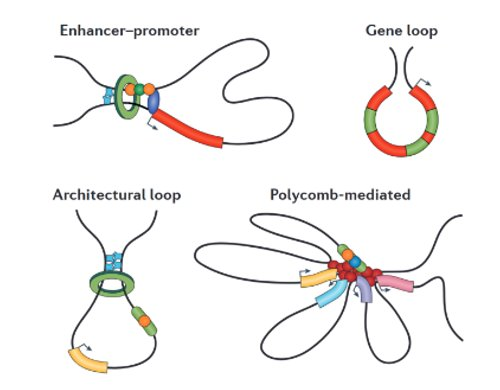
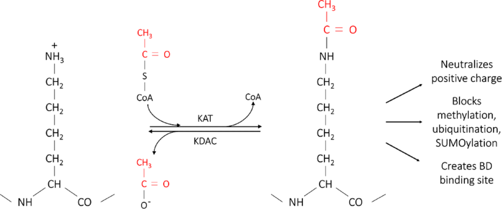
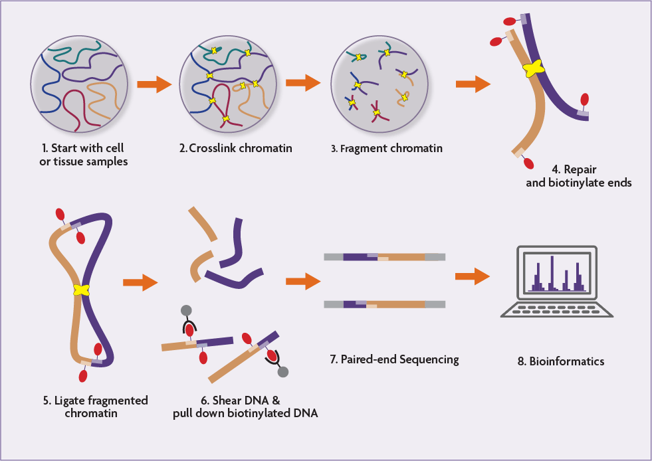
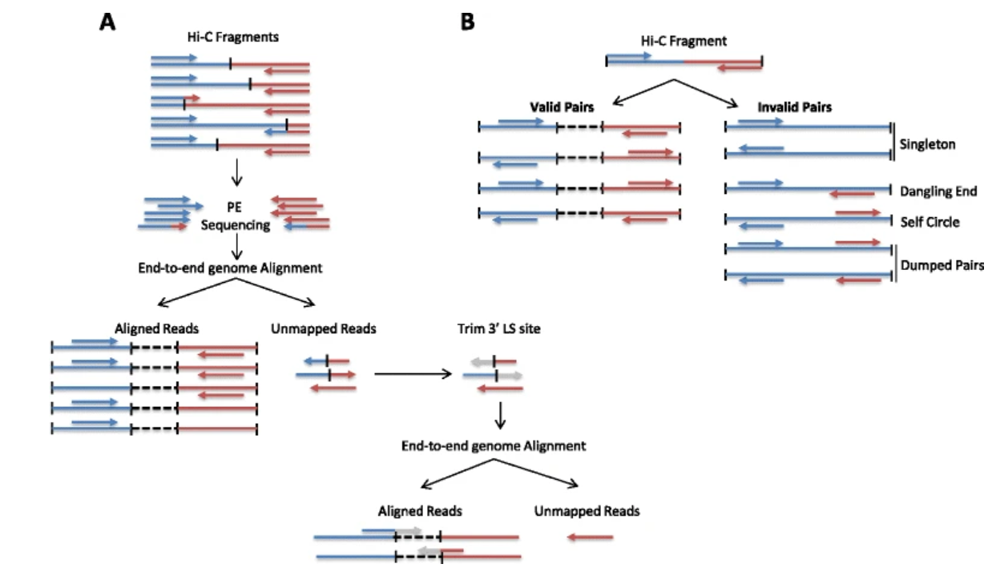
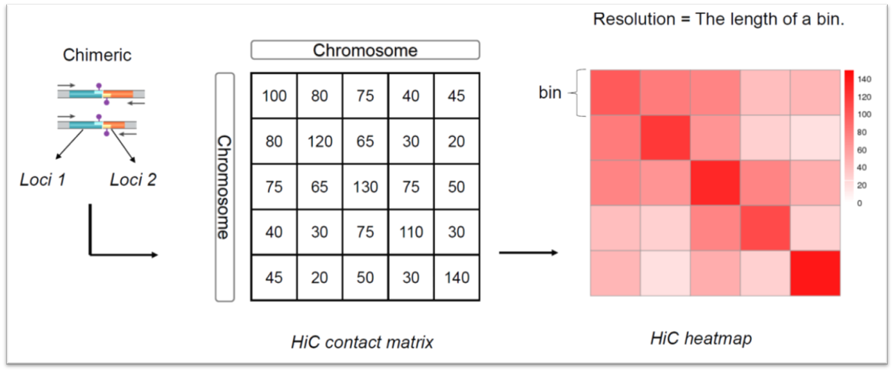
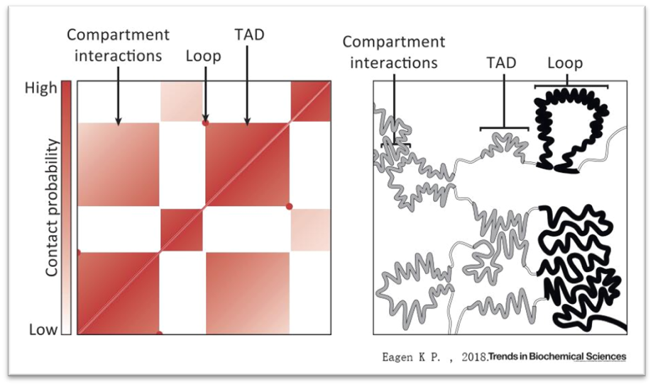
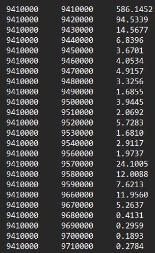
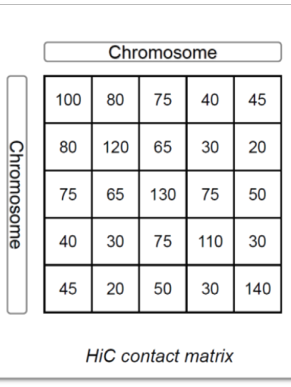

# Hi-C Overview and DNA Loop Detection

### By Rueshil Fadia, Leo Tricoire, and Rohil Ahuja

1. [Introduction to the 3D Genome](#1) <br>
    1.1 [Cis-Regulatory Elements](#2) <br>
    1.2 [Chromatin Loops](#3) <br>
    1.3 [3-D Organization](#4) <br>
    1.4 [Intro to Hi-C](#5) <br>
    1.5 [Steps of Hi-C](#6) <br>
2. [Computational Analysis and Tools for Hi-C Data](#7) <br>
3. [Contact Matrix and Heatmap Analysis](#8) <br>
4. [Computational Detection of Chromatin Loops](#9)  <br>
    4.1 [Edge Lists](#10) <br>

***

## 1. Introduction to the 3D Genome<a name="1"></a>
In order for millions of nucleotides to fit inside the nucleus of each cell, mechanisms for directed packing have been adopted. Each gene contains multiple regulatory elements that interact with protein and contribute to DNA folding. There are different types of regulatory elements Cis-regulatory elements (CRE): sequence of non-coding DNA which regulate the transcription of nearby genes physically located on the same DNA molecule (as opposed to Trans-regulatory elements which regulate the transcription of distant genes, and which will always exert their control over the distant genes even if they are moved to another DNA molecule.

### 1.1 Cis-Regulatory Elements <a name="2"></a>
Examples of these cis-regulatory elements include:  

Promoter: This is a region of DNA just upstream of the protein-coding region. RNA polymerase 3 initiates transcription by binding to the promoter of that specific gene. The promoter interacts with enhancers and silencers for further transcriptional regulation

Enhancers: Distal short regulatory elements that are activated via transcription factor binding. Enhancers loop back to interact with the promoter and enhance the transcription of that specific gene. 

Silencers: Distal short regulatory elements that are also activated by transcription factor binding. Silencers repress transcription by interacting with the promoter in a mechanism likewise to enhancer. 

### 1.2 Chromatin Loops <a name = "3"></a>
In order to cause the regulatory effects they are meant to, enhancers and promoters evolved in a way to create “loops” to increase the spatial proximity of these elements. These are called a chromatin loop.

 <br>
*Figure 1.1: Different subtypes of chromatin loops.*


A well-known example of a formation of a chromosome loop is the locus control region (LCR) of the β-globin cluster, which interact very strongly with target genes where the β-globin is active, such as erythroid cells, but has very little interaction with other cell lineages.

### 1.3 3-D Organization <a name = "4"></a>
On a larger scale, DNA organizes itself by wrapping around proteins known as histones. DNA wrapped around eight histone proteins make up nucleosomes. Bundles of these nucleosomes make up chromatin, which are then aggregated to make chromsomes. DNA-Histone interactions also regulate gene expression. For example, Lysine residues on the histones may be acetylated as seen in the picture below:

 <br>
*Figure 1.2 Acetylation of Lysine (Casey, M.A.) https://www.semanticscholar.org/paper/Lysine-acetylation-of-cytoskeletal-proteins%3A-of-an-M.-Latario/55bdfc64182ed1404c7f7f091858720fd8147b97*


The histone originally had a positive charge, a source of strong affinity to the negatively charged DNA. Thus, the chromatin was condensed and generally unaccessible for transcription. This form is better knon as heterchromatin. The loss of this positive charge weakens the DNA-histone interactions and decondenses the chromatin. The chromatin is now more accessible for transcription and is better known as Euchromatin.  

### 1.4 Intro to Hi-C <a name = "5"></a>
One of the biggest challenges in the analysis of 3D genome and global chromatin conformation lies in the fact that the genome is folded into multiple hierarchical structures, from compartments to TADs, and chromatin loops. The development of Hi-C technology and new computational tools lead to a big step forward in the understanding of the 3D genome.

Hi-C technology is used in order to visualize the physical interaction in the genome. Hi-C is unique in that it maps all the genome-wide interactions at one time. Hi-C builds off of 3C technology which is the original technology to visualize chromatin contact. 3C is limited in that it can only detect interactions between specifically known fragments.

### 1.5 Steps of Hi-C <a name = "6"></a>
 <br>
*Figure 1.3 HI-C step-by-step (activemotif)*

The steps of Hi-C are as follows:
1. Formaldehyde is used to crosslink the DNA. This freezes all the cell’s interactions including DNA-DNA interaction, DNA-Protein interactions and Protein-Protein interactions.
2. In order to access the nuclear material, the cell is lysed
3. HindIII or another estriction enzymes will be used to cut the DNA to create sticky ends (an overhang).
4. The sticky ends are filled in with biotynlated nucleotides. Biotin will be a selectivity marker for this ligation process.
5. DNA fragments are ligated together in a process called proximity ligation. All the DNA strands that were close in primiximity and thus were interacting are now ligated together.
6. Phenol-chloroform is used to purify these fragments and an exonuclease is used to remove the biotiylnated nucleotides of the DNA fragments that were not ligated. In a future step, only the strands with biotynlated nucleotides will be sequenced.
7. The DNA will be cut into fragments of several hundred base pairs. This is an appropriate length for sequencing.
8. The DNA is sonicated to reverse the crosslinks.
9. The DNA fragments are ran through streptavidin because of its high-binding affinity with bition. This streptavidin pull-down selects for the biotynlated fragments which indicates where the DNA was linked to other DNA strands. The Biotin-Streptavidin complex is cleaved from the DNA strand.
10. Sequencing adapters are added and then PCR amplifies the DNA sample.
11. Finally, the DNA gets sequenced and mapped back to the genome.

## 2. Computational Analysis and Tools for Hi-C <a name = "7"></a>
Once the Hi-C chimeric products (fragments containing two different parts of the genome ligated together) are sequenced, comes a series of computational steps in order to obtain a contact matrix which can be used to analyze genome interactions. These multiple steps are summarized on Figure 1. 

 <br>
*Figure 2.1 Hi-C Data Process, from FASTQ file to contact matrix*

Hi-C data processing workflow starts with FASTQ files of paired-end reads obtained from sequencing. These paired-end reads are mapped in the genome. They are aligned separately as they are supposed to map in different regions of the genome. However, the alignment of Hi-C reads may be challenging in case the read spans the ligation junction, and therefore having two portions of the read itself matching different genomic parts. These are called “chimeric reads” [1]. There are several strategies to handle them. The simplest way is to totally ignore them. This is a strategy that is used by several pipelines, such as HiC-inspector, HiC-Box, HiCdat, HIPPIE, and Juicer. It works well with short reads as they have a low probability to span the ligation junction. Another strategy would be to split the chimeric reads at the junction and then remap these partial tags to the reference genome. This technique is performed by the pipeline HiC-Pro. This strategy is illustrated on Figure 2A.

 <br>
*Figure 2.2 Pair Alignment and Filtering*

As each end of the paired-end reads are mapped separately, it is then needed to do pairing to assign the aligned reads (BAM files) to their fragment of origin, and to obtain Paired-End Tags (PETs). SAMtools can be used to sort the results.

Afterwards comes the filtering step, with the objective of removing invalid PETs, reads with low alignment quality, and multiple read pairs mapped in the same positions. PETs and invalid PETs are illustrated on Figure 2B. There are several algorithms used to filter invalid PETs. One of the strategies is to use restriction enzyme digested fragments to classify PETs according to their direction and their locations to the digested sites [2].

Once invalid PETs are removed, the genome is binned into small regions of fixed size and each valid PET is assigned to a unique bin. The rationale behind summarizing read counts at the level of genomic bins is to achieve a more robust and less noisy signal in the estimation of contact frequencies [1]. The choice of the bin size defines the final resolution. Data is typically binned into sizes ranging from 40kb to 1MB. There are several ways to determine the resolution. It can be defined as the smallest bin size for which more than 1000 reads can be observed in at least 80% of the bins. More precise strategies are usually used depending on the specificity of the dataset [3]. The binning results can be stored in a matrix format [2].

The final computational step is normalization. Binning and normalizing are usually executed by the same tool. There are different normalization strategies to remove different types of biases. They can be divided into two groups: implicit and explicit normalization. On one hand, explicit normalization methods are based on a set of specific known biases, including the fragment length, the GC content and mappability. Correction factors are computed for each bias and then applied to read counts per genomic bin. This method can be executed by the HiCNorm model. On the other hand, implicit (or matrix-balanced) methods do not rely on specific assumptions but assume uniform visibility for all genomic loci, and hence  assures equal row and column sums. It includes iterative correction and eigenvector decomposition (ICE) and Knight and Ruiz’s algorithms.

## 3. Contact Matrix and Heatmap analysis <a name = "8"></a>
A contact matrix is an *n* x *n* matrix where M<sub>ij</sub> is the number of reads (summarized at the level of genomic bins) supporting interaction between two different loci. 


*Figure 3.1 Contact Matrix and Heatmap Displays[4]*

This contact matrix can be visualized as a heatmap, with intensity indicating contact frequency. Higher intensities are observed on the diagonal as contact frequency is logically more important for loci that are closed to each other.

Once the contact matrix is displayed, downstream analysis can be performed. These analyses occur at multiple levels of resolution, including the identification of compartments, TADs, and point of interactions such as DNA loops. The rest of this chapter will be focused on DNA loops detection.


*Figure 3.2 Heatmap Analysis*

## 4. Computational Detection of Chromatin Loops <a name = "9"></a>
We will use the contact matrix obtained from the Hi-C analysis, to find chromatin loops from data. The matrix can be represented in two different ways, an edge list and a standard matrix. The standard matrix was described above and the edge list is another representation. Both are shown in the figure below.



*Figure 4.1: Shown on the left is the edge list representation of the contact matrix. Shown on the right is the matrix represetnation of the contact matrix.* 

### 4.1 Edge List <a name = "10"></a>
In the edge list, the first two columns represent the genomic positions of the bins, and the third column represents the number of reads that supports an interaction between these two bins. In the edge list representation, if two bins are not listed, this implies that there are 0 reads supporting interaction between the two bins.

### 4.2 Detecting Loops <a name = "11"></a>
In order to find loops from this particular file, we will need to compute the p-values for all bin pairs (*i*,*j*). To compute these p-values, the first step is to create a separate matrix for expected values. This can be computed based on the distribution of the data. Using these expected values, we can determine the loop based on a set of criteria. 
This criteria is as follows:
1. $10 < j - i < 1000$
2. $\frac{M_{ij}}{E_{ij}} > 1.5$
3. $E_{ij} > 0$
<br>
We know that loops involve regions that are located far apart from each other on the linear genome, so our first criteria is to identifying two bins that are far apart, shown by the first criteria, with the difference of j and i. After that, we can check if the observed is higher than the expected, as regions so far apart are not expected to have high levels of interaction, seen by the second criteria, the ratio of the observed to the expected equation. If an entry satisfies these criteria, we compute a p-value from the probability density function of the distribution and find bins that have low p-values. These are classified as loops.

### 4.3 Code for Detecting Loops <a name = "12"></a>
As mentioned above, the first step is to create a matrix or an edge list of expected values for interactions between bins. After this, the next step is dependent on the representation of the contact matrix. If we have an edge list, we will first need to convert it to a matrix. This can be done by first : <br>
```python
M = csr_matrix(((Mdata.iloc[:,2], (Mdata.iloc[:,0]//10000, Mdata.iloc[:,1]//10000))))
```
