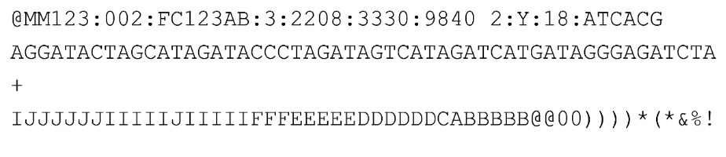
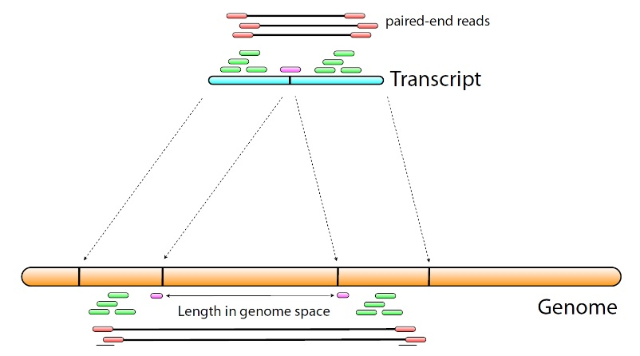
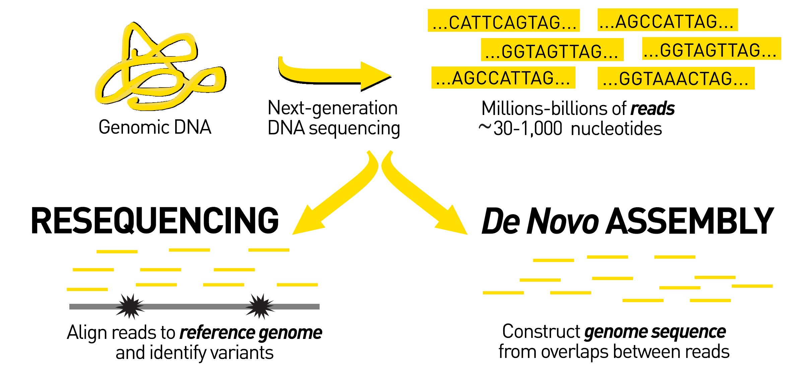
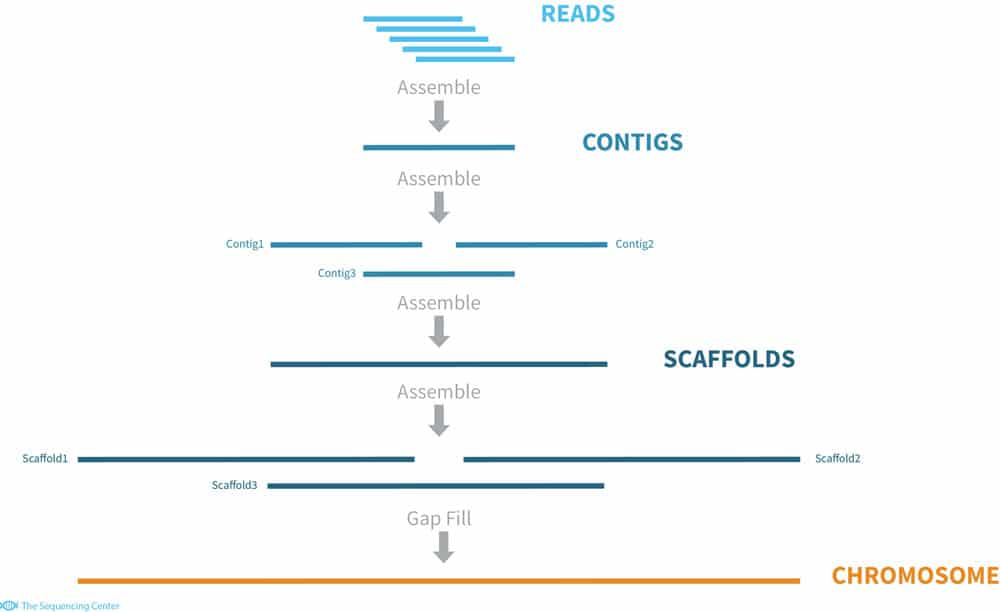
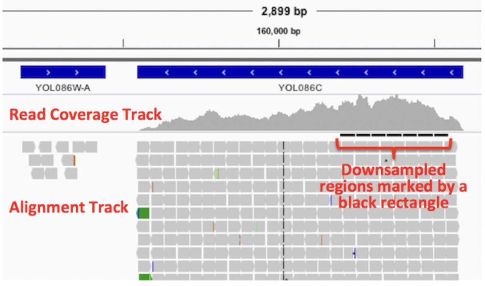
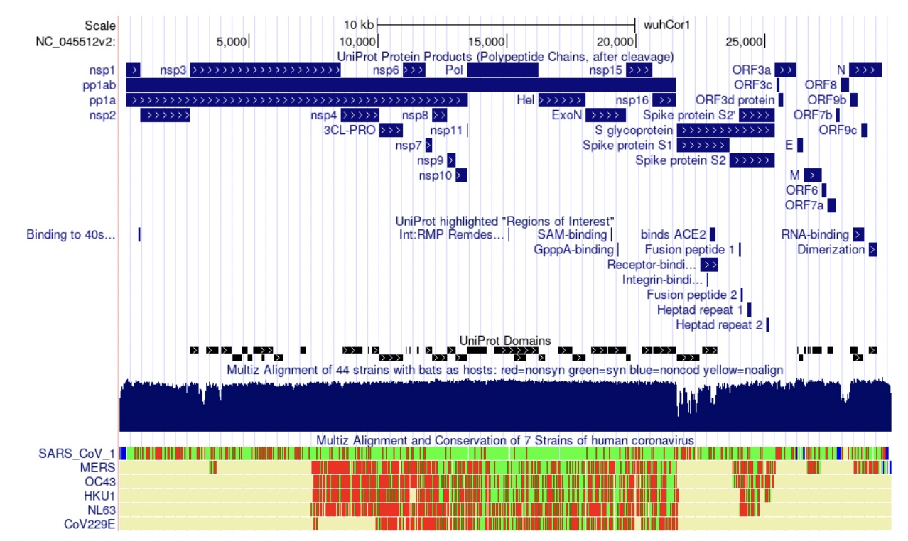
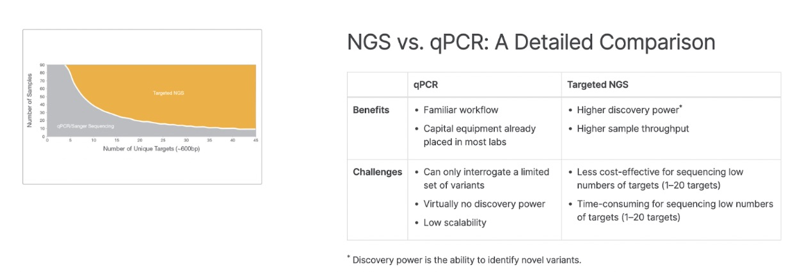

<h1 align="center">
Alignment of Fastq Files
</h1>

<h3 align="center">
Members: Alex Sun, Sai Hosuru, Gino Prasad
</h3>

<h3 align="center">
Group: 25
</h3>

***

Table of Contents:
1. [Introduction and Background](#1)
2. [Input](#2) 
  2.1 [FastQ File](#2.1) 
  2.2 [How the FastQ File is Formatted](#2.2) 
3. [How are Reads Aligned?](#3) 
  3.1 [Alignment to a Reference Genome / Transcriptome](#3.1) 
  3.2 [De Novo Assembly](#3.2) 
4. [What Alignment Softwares are Avaliable?](#4) 
  4.1 [Alignment and Quantification](#4.1)\
  4.1 [Alignment Software](#4.2) 
  4.2 [Quantification Software](#4.3) 
5. [Output](#5) 
  5.1 [SAM/BAM Files](#5.1) 
  5.2 [Visualization of Alignment](#5.2) 
  5.3 [Gene Expression Quantification](#5.3) 
6. [Summary](#6)
7. [References](#7)

***

## 1. Introduction and Background 
Once RNA sequencing is done on Sanger, NGS, or 3GS systems, the output file containing all the reads sequenced is known as a FastQ file. In this chapter, the FastQ file system will be explained, alongside the process of alignment. The chapter will also introduce commonly used aligner and quantifier programs, while going over the use-cases for aligned data.

## 2. Input 

### 2.1 FastQ File 
The input for alignment is a text file which contains cleaned sequenced data. This means that all the base pairs with bad Phred Quality scores and insufficient GC content and problematic duplication rates are removed, resulting in data we can form conclusions upon. The sequencing is done by utlizing clusters(differentialy expressed genes clasasified using similarly expressed patterns) on a flow cell(a type of cell that is used to absorb DNA fragments). Then this data is not stored on a regular text file, but a FASTQ file.

### 2.2 How the FastQ File is Formatted 
FASTQ file contains the total number of clean reads that are generated and each read in the file will be represented using 4 lines.

<b>Figure 1:</b> A read expressed in FASTQ file (ZYMO RESEARCH)

  

**Line 1: Sequence Identifier:**

In general this line will start of with the character @ as identification symbol. THen is followed by the which instrument was used, the run number on the instrument, flowcell ID, which lane it used, the title of the read, the X and Y coordinates of the cluster, read number, whether the read is filtered or not, control number and sample number. All of this is represented in one line in this format:

@< instrument >:< run number >:< flowcell ID >:< lane >:< tile >:<  x-pos>:< y-pos > < read >:< is filtered >:< control number >:< index >

<b>Figure 2:</b> Descriptions of different aspects of Line 1 (Casey, R. 2021)

  
Based on the example picture above,
<ol type="1">
	<li> MM123 is the Instrument </li>
	<li> 002 is the run session </li>
	<li>FC123AB is the flow cell ID</li>
	<li>3 is the lane </li>
	<li>2208 is the title </li>
	<li>3330 is the X position</li>
	<li>9840 is the Y position </li>
	<li>2 is the read number </li>
	<li>Y means it is filtered </li>
	<li>18 is the control number</li>
	<li>ATCACG is the sample number</li>
</ol>

**Line 2: Sequence:**

This line contains the entire base pair sequence of the read.

**Line 3: Separator:**

This acts a separator that divides line 2 and 4

**Line 4: The Phred Quality Scores:**

This is a string of +33 encoded ASCII letters that represent the each base pair’s probability of being the correct base pair. Each character in this tring represents each base in line 2. The higher the Phred Quality score, the lower the probability of the base pair being incorrect.

<b>Figure 3:</b> ASCII letters potraying Phred Qulaity Scores in integers (Edgar, R.)

  

## 3. How are the Reads Aligned? 

### 3.1 Alignment to a Reference Genome / Transcriptome 
Let us look at pair end sequences and see the manual process of alignment.

<b>Figure4:</b> Pair end sequencing potrayed visually (Zhong,2022) 

  

As you can see in this picture , we will start of with paired-end reads and map them to the transcript to identify the gene annotations and see what functions these genes have. Then we will map them to the Genome Reference based on sequence matching. As you can see we have two types of alignment.

**Same Exon Alignment** 
This means that the entire read is aligned to one part of the exon.  

**Different Exon Alignment** 
This means that some part of the read is matched to one exon and the other part is matched to another exon.

We are going for local alignment here because the reads can start anywhere in the genome. If it was global alignment, then that means the read will have to start in the beginning. At the end we can can see which exon has more reads aligned to them to see which gene is more abundant.

**Conducting alignment Mechanically** 
One of the many ways to accomplish this tedious task using software is by utlizing the program call STAR.

The command in the terminal for this is

`
STAR --runMode genomeGenerate
--genomeDir [index folder]
--genomeFastaFiles [FASTA file]
--sjdbGTFfile[GTF file]
--sjdbOverhang[read length-1]
`

The first command is the file that contains the actual genome reference. \
The second command is the input FASTQ file which contains the sequenced reads. \
The third command is the GTF file which is the transcript file so we can identify the gene annotations. \
The fourth command is used to detect the possible splicing sites. Which basically means that it tells the software the maxim length of a sequence that can be found on one side of a splicing site. \
Running this will give us a BAM file of the contents we are looking for.

### 3.2 De Novo Assembly 

<b>Figure 5.</b> Overview of De Novo Assembly (Sharman, S. 2019)

  

De novo sequencing and assembly is typically applied to organisms where no reference genome is available or the available reference is of poor quality.

<b>Figure 6.</b> Assembly of reads into a reference (Casey, R. 2022)

  

Figure 7 demonstrates the assembly of sequence reads ito contigs, which are then further assembled into larger contiguous portions. The coverage quality of the de novo sequence data depends on the size and continuity of the assembled portions - if no contigs are able to fill a gap or if a low read count is assembled into a contig, errors may be introduced into the end reference.

Genomes that have not been sequenced before must be assembled via a de novo approach following sequencing. This assembly can then be used for additional analyses and the basis for future resequencing projects. Examples of this in the industry would be the sequencing of newly discovered species, or the recompilation of a new reference genome/transcriptome for an existing species.

## 4. What Alignment Softwares are Avaliable? 

### 4.1 Alignment and Quantification 
All assemblers can take a Fastq file and translate it into a SAM/BAM output file. However, there are differences between NGS and 3GS assemblers, and the read generation technology must be considered when choosing a specific assembler. Assemblers generally perform the same function, but with each assembler having specific option flags for their assembly, there may be some that are better suited for specific pipelines.

 Included below is a list of commonly used aligners, and also quantifiers, which take the output of aligners and help translate it into more humanly readable data - such as gene expression levels, visualization graphs, and qc/qa metrics.

### 4.2 Alignment Software 
**TopHat 2**
>TopHat is a popular spliced aligner for RNA-sequence (RNA-seq) experiments. TopHat2 can align reads of various lengths produced by the latest sequencing technologies, while allowing for variable-length indels with respect to the reference genome. In addition to de novo spliced alignment, TopHat2 can align reads across fusion breaks, which can occur after genomic translocations.

TopHat2 is available at http://ccb.jhu.edu/software/tophat.

**STAR**
>In addition to unbiased de novo detection of canonical junctions, STAR can discover non-canonical splices and chimeric (fusion) transcripts, and is also capable of mapping full-length RNA sequences.

STAR is available at https://github.com/alexdobin/STAR

**HISAT2**
> HISAT2 is a fast and sensitive alignment program for mapping next-generation sequencing reads (both DNA and RNA) to a population of human genomes as well as to a single reference genome. HISAT2 is based on a graph FM index, an extension of BWT. In addition to using one global GFM index that represents a population of human genomes, HISAT2 uses a large set of small GFM indexes that collectively cover the whole genome.

HISAT2 is available at http://daehwankimlab.github.io/hisat2/

### 4.3 Quantification Software 
**Salmon**
> Salmon is a tool for quantifying the expression of transcripts using RNA-seq data. Salmon performs its inference using an expressive and realistic model of RNA-seq data that takes into account experimental attributes and biases commonly observed in real RNA-seq data.

Salmon is available at https://combine-lab.github.io/salmon/

**RSEM**
>RSEM is a software package for estimating gene and isoform expression levels from RNA-Seq data. The RSEM package provides an user-friendly interface, supports threads for parallel computation of the EM algorithm, single-end and paired-end read data, quality scores, variable-length reads and RSPD estimation. The unique feature of RSEM is, the read depth plots can be stacked, with read depth contributed to unique reads shown in black and contributed to multi-reads shown in red.

RSEM is available at https://github.com/deweylab/RSEM

## 5. Output 

### 5.1 SAM/BAM Files 

### 5.2 Visualization of Alignments 
#### What visualization tools are available?

#### IGV
IGV is a tool for viewing genomic data, including FASTA and BED files. For our particular analysis of alignment data, we will be inputting a BED file of aligned reads.

<b>Figure 7:</b> BED File visualization with IGV (Broad Institute, 2021)

  

There are 2 tracks shown here: coverage and alignment. The coverage track shows for every base position, how many of the aligned read fragments include (“cover”) that base position.
The alignment track indicates how similar the aligned sequenced reads are to the genetic sequence of the reference. Here, since there are a high number of reads in this region which differ from the reference(displayed by the black bars), this indicates a potential SNV(single nucleotide variation).

#### UCSC Genome Browser

The UCSC Genome Browser is another visualization method similar to IGV which can take in BED format genetic information and visualize the alignment with a reference genome.

<b>Figure 8:</b> Visualization of SARS-CoV-2 Multiple Sequence Alignment with UCSC Genome Browser (UCSC Genomics Institute, 2022) 

  

The above image is a visualization of SARS-CoV-2 data generated using NGS sequencing. Using multiple sequence alignment, this SARS-CoV-2 data is compared to the sequenced genome of related species in the Coronavirus family.

The top track indicates the location of coding proteins, as well as the location of promoters and non-coding elements.
The second track to the bottom is the copy number plot, which visualizes the read coverage from the SARS-CoV-2 NGS data.
The bottom track is a visualization of the alignment, where green sections indicate genomic regions that are conserved among the Coronavirus family, and red sections indicate genomic regions that differ.

### 5.3 Gene Expression Quantification 
A very common application of gene alignment is performing gene expression quantification using RNA-seq with NGS sequencing.

Some very common tools applied after alignment are:
- FeatureCounts: This tool takes in the list of known gene annotations (GTF) from the reference genome and counts the number of fragments aligned to this location.
- DeSeq2, this tool parses the gene expression matrix, and applies normalization techniques to determine which genes are differentially expressed.

<b>Figure 9:</b> Comparison of the discovery power between qPCR and RNA-seq analysis (Illumina, 2022) 

  

## 6. Summary 

Combining gene expression with normalization techniques provides a very powerful tool for performing broad differential gene expression. When compared to qPCR which can only quantify the expression of a finite number of genes using microarrays, gene expression quantification with RNA-seq offers a significant advantage in discovery power.

## 7. References 
1. Casey, R. (2021, May 19). Ryan Casey. The Sequencing Center. Retrieved December 5, 2022, from https://thesequencingcenter.com/knowledge-base/fastq-files/
2. Viewing alignments. Viewing Alignments | Integrative Genomics Viewer. (n.d.). Retrieved December 5, 2022, from https://software.broadinstitute.org/software/igv/AlignmentData
3. Advantages of next-generation sequencing vs. qPCR. Illumina. (n.d.). Retrieved December 5, 2022, from https://www.illumina.com/science/technology/next-generation-sequencing/ngs-vs-qpcr.html
4. Edgar , R. (n.d.). Quality (phred) scores. Retrieved December 5, 2022, from https://www.drive5.com/usearch/manual/quality_score.html
FASTQ file format. ZYMO RESEARCH. (n.d.). Retrieved December 5, 2022, from https://www.zymoresearch.com/blogs/blog/fastq-file-format
5. Dobin, A. (2019, January 23). Star Manual 2.7 - Cornell University. Retrieved December 6, 2022, from https://physiology.med.cornell.edu/faculty/skrabanek/lab/angsd/lecture_notes/STARmanual.pdf
6. Genome browser user guide. Genome Browser User's Guide. (n.d.). Retrieved December 5, 2022, from https://genome.ucsc.edu/goldenPath/help/hgTracksHelp.html
7. Sharman, S. (2021). Sequencing from scratch: Reference genomes and de novo sequence assembly. HudsonAlpha Institute for Biotechnology. Retrieved December 6, 2022, from https://www.hudsonalpha.org/sequencing-from-scratch-reference-genomes-and-de-novo-sequence-assembly/
8. Casey, R. (2022, September 26). Richard Casey. The Sequencing Center. Retrieved December 6, 2022, from https://thesequencingcenter.com/knowledge-base/de-novo-assembly/
