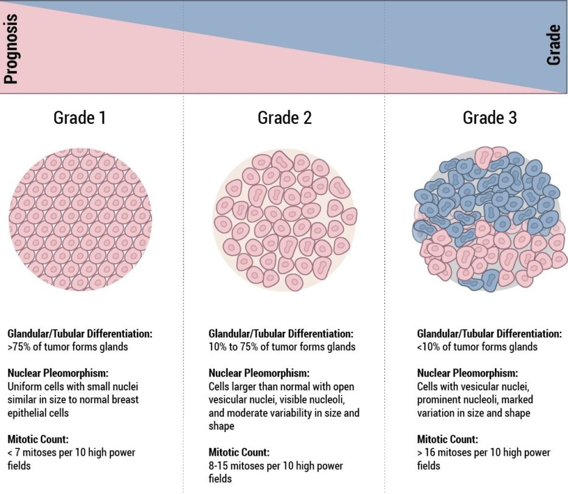
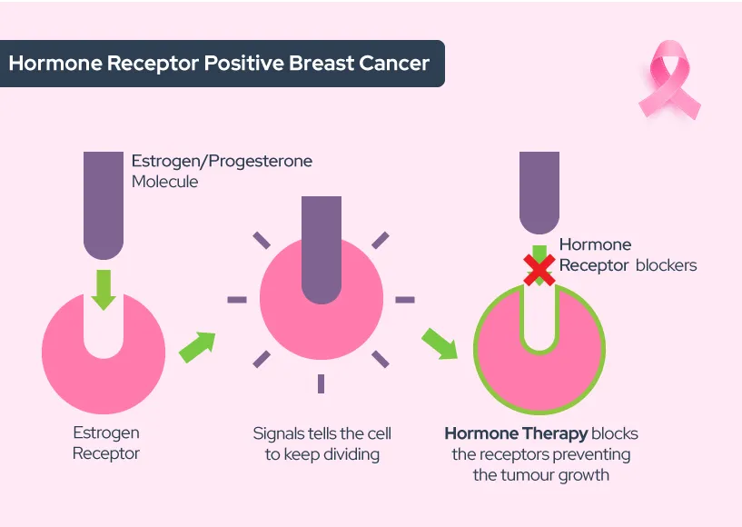
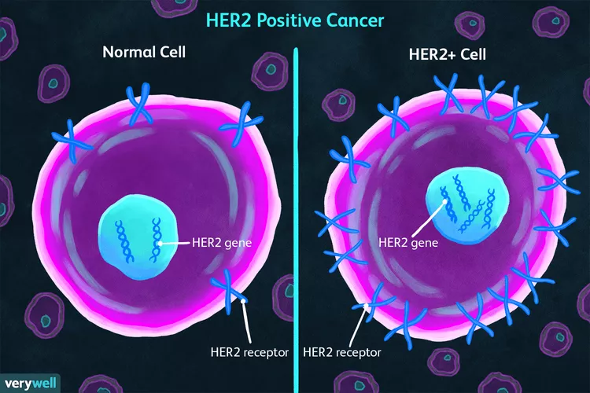



**2. Breast Cancer: Therapies and Treatments in the Past**
---

Breast cancer was documented even before ancient Greece, with the first ever record being documented on a papyrus dating back to 2500 BCE (Goldman). Actual medical diagnosis of breast cancer was not until the renaissance in the 1700s, where John Hunter from Scotland identified lymphs as causes of breast cancer (Thomas).

### **Main Treatments of Breast Cancer in the 19th Century**
Common method of treating breast cancer in the 19th century are as follows:
  - **Lumpectomy:** Surgical removal of tumor where only the tumor tissue is removed including the surrounding breast tissue. This type of surgery was also known as breast conserving surgery as it left most of the breast tissue intact. However, many patients required radiation therapy afterwards to prevent reemergence of cancer (Goldman).

  - **Mastectomy:** Complete removal of the breast tissue in which cancer cells have proliferated, including the nipple, areola, and skin. Additional removal of lymph nodes in the under arm was also conducted, known as radical mastectomy which was first done by William Halsted in 1882, as it was known from the 1700s that tumors originated from lymph nodes (Thomas).

  - **Radiation Therapy:** Destruction of cancer cells by specifically targeting areas on the breast tissue with X-ray. First conducted in 1937 along with mastectomy and steadily proved to show great effects. It was later found out that short specific treatments of radiation therapy resulted in equal effects to that of long term therapy, increasing patient mortality (Goldman).

### **Drug Treatments of the late 20th century**

In addition to surgeries that were being modified overtime in the 19th century, different drugs were also introduced in the late 20th century that targeted specific receptors and hormones. Most notable drugs include:

  - **Tamoxifen:** Introduced in 1978 as an anti-estrogen drug to prevent development of breast cancer. Known as the first in a new class of drugs called selective estrogen receptor modulators (SERM). In 1998 Tamoxifen is found to decrease risk of developing breast cancer in women by 50% and is approved by FDA to be used as preventive therapy (Goldman)
  - **Anastrozole**: Approved in 1996 to blocks production of estrogen
  - **Herceptin:** Also approved by FDA in 1998 which targets cancer cells that are over-producing HER2
  - **Raloxifene:** Found in 2006 as SERM drug to reduce breast cancer risk for postmenopausal women and has lower chance of serious side effects compared to Tamoxifen

**3. Genomics in Breast Cancer Classification and Treatments Today**
---

What is **Precision Medicine**?

[*Yotube Video on Precision Medicine*](https://www.youtube.com/watch?v=HQKFgfMO5Sw)

Precision Medicine collects data on health, disease, environmental factors, family history and such and performs intersectional analysis to create best treatment for patients with specific criterias for a specific disease rather than singular common treatment for all patients with that disease.

**Precision Oncology:** Using a cancer’s genomic makeup to determine treatment methods rather than focusing on symptoms of “average” cancer.

- **Older Focus**:
Based on tumor size, tumor grade (how they look compared to normal cells), and axillary lymph nodes (buildups of cells in lymph system). Tumor size is easy to quantify, but tumor grade is subjective especially if tumor is heterogenous. Axillary lymph nodes have a weak correlation with cancer metastasis, where 30% without will develop metastasis in a decade while 50% were cured with only a local treatment

- **Modern Approach**:
  - Categorize with Genomics and use various bioinformatic techniques to learn more: Early studies have determined multiple categories 
-  Major categories of breast cancer based on gene expression abnormalities:
   - Hormone receptor (HR) expressing (either estrogen receptor (ER+) or progesterone receptor (PR+) expressing) 70% in developed countries
   - Human epidermal receptor expressing (HER2+) 20%
   - Triple negative (ER-, PR-, HER2-), further divided into 6 categories 10%
4. Various combinations of ER, PR and HER2 expressing all have different treatment approaches

- HR+ (ER+/PR-, ER-/PR+, ER+/PR+) indicates that hormone receptors are abnormally expressed in the cancer cells, indicating that the cancer is using the hormones to grow. They target the cancer by blocking production of the specific hormone (ER or PR) or blocking hormone receptors 

- HER2 is a protein that promotes cell growth. HER2+ cancers grow and spread more quickly than HER2- cancers

- Immunotherapy: target the proteins binding sites with antibodies to prevent them protein binding

- Triple Negatives: have a cancer phenotype while being ER-, PR- and HER2-:
  - Difficult to classify/treat due to low prevalence and unknown mechanisms
  - Use more general cancer treatments to deal with the cancers

