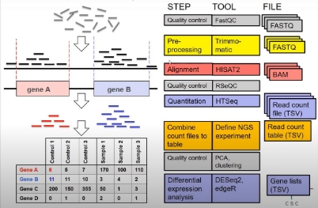
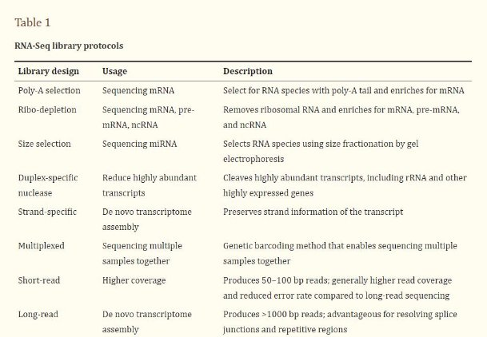
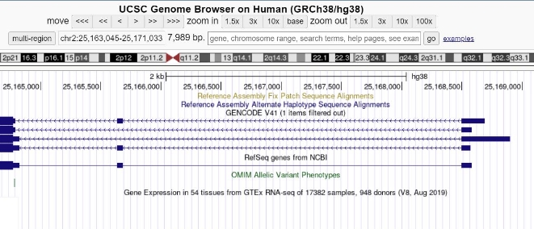
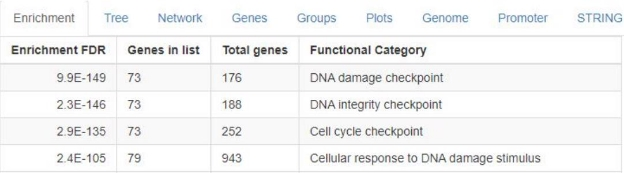
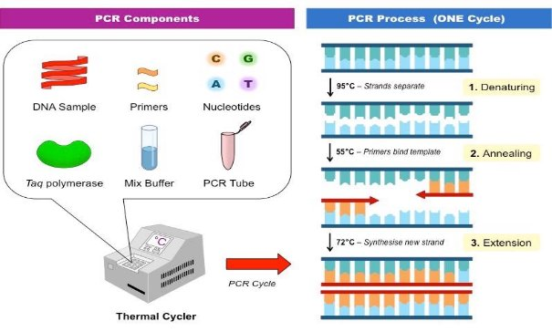
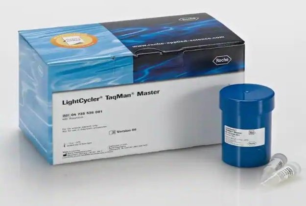



|**Analysis and Comparison of RNA-Seq and**|
| - |
|**qPCR for Differential Gene Expression**|
||
||
1. **RNA-Seq Overview**

With its introduction, RNA sequencing quickly became widely used as it was a more robust and versatile technology than the other next-generation sequencing methods at the time. Because it was not

limited to known genomic sequences, RNA-seq allowed for novel organisms to be sequenced without the need

for a reference genome.

The qualitative applications of RNA-seq alone allowed scientists to determine RNA variations across the entire transcriptome of a cell tissue sample, including alternative splicing variants, as well as single point mutations. More

importantly, the ability to calculate the absolute quantification of dna expression allowed for comparison experiments between multiple samples of interest for different groups.

Due to the wide range of practical applications of this technology, the RNA sequencing pipeline can vary greatly. However, most experiments following this RNA-seq workflow will typically contain the following experimental and computational procedure.

1. **Library Preparation, Sequencing, and Mapping**

After cell lysis, RNA extraction, and filtering, the sample must be converted to cDNA through the use of enzymes. cDNA is preferred over RNA because its structure is more stable. Following amplification by PCR, it will then be synthesized into a library by fragmentation, with each piece of cDNA ligated with sequencing adapters, and then subjected to either single or paired end sequencing. Depending on the needs of the researcher, there are a handful of library designs(Table 1) to accommodate the various types of experiments that RNA-seq can be applied to. Many of the protocols listed will enrich the sample for mRNA molecules, while selectively depleting ribosomal RNA. This is beneficial because rRNA, which most often accounts for the vast majority of the sample, reduces the depth of sequencing coverage, which can limit the detection of less common RNA species in the sample. An in-depth awareness of each protocol’s uses and limitations will be absolutely critical for the RNA library synthesis step.

For the next part of the RNA-seq pipeline, the resulting transcriptome can then be computationally mapped to the sample genome using software chosen from a wide arrangement of commonly used tools such as STAR, BWA-MEM, or SOAP. An aligner should be chosen specifically for the needs and objectives of an experiment with its different advantages and disadvantages in mind with regards to speed, memory utilization, alignment yield, basewise accuracy, and performance. Listed in the figure below are the commands to download and compile STAR, which is an RNA sequencing package that is based on seed searching in uncompressed suffix arrays, seed clustering, and stitching procedures. Although it is memory intensive, it is capable of rapidly detecting complex arrangements of RNA.

2. **Data Analysis Workflow**

After filtering, aligning, and normalizing our multiple sample files, we can finally do the analysis of differentially expressed genes across the experimental conditions, which are chosen based on the primary objective of the study. For example, the first data processing step might be to correlate genes with associated diseases by comparing the transcriptome to that of a control group by creating statistical models. A mean-difference plot can be calculated and generated for visual clarity, or even a heatmap in which clustered gene sets are categorized for a particular biological function, interaction, or pathway. This can be done using Python plotting commands from the standard library.

Furthermore, read alignment visualization with genome viewers and browsers that can be accessed freely online can also fit the goals of an RNA sequencing experiment. Online genome browsing tools show where exactly in the genome the reads can be found.

Finally, a pathway enrichment analysis can be performed. This involves performing research on the biomolecular functions of the genes found to be differentially expressed. ShinyGo is a gene ontology enrichment analysis tool that takes a list of genes, a species, and a p-value cutoff as input and displays the functional categories of the input.

One last quick note is that expression quantitative trait loci studies in particular will often have many complicating factors. These complexities can include both spatial and temporal specificities in gene expression. In other words, the difficulties in explaining differences in expression between samples can be attributed to numerous complicating factors that include the cell and tissue sampling location, as well as the time in their developmental stages the cells were taken.

2. **qPCR Overview**

Scientists utilize a variety of tools in biological research to assist nucleic acid amplification and detection techniques. While some of these tools provide sufficient qualitative analysis, other applications may demand a quantitative approach. qPCR, more commonly known as real-time polymerase chain reaction, can be used for both qualitative and quantitative analysis. This section provides an overview on what qPCR is, how reverse transcription comes into play during the gene expression process, and practical applications as well as instrumentation for qPCR techniques.

1. **Better Understanding qPCR**

In order to understand real-time polymerase chain reactions, it is imperative to grasp the fundamentals of standard polymerase chain reactions, which qPCR heavily derives from.

The polymerase chain reaction process seeks to replicate DNA in a short period of time. The components used in PCR are the DNA of interest, primers, Taq Polymerase, a PCR buffer, and dNTPs. The process involves the addition of oligonucleotide primers that binds to the DNA sample of interest. Taq polymerase, a DNA polymerase, extends the fragments (primers). This process occurs in a number of cycles, around 25-30 cycles, for the amplification of desired DNA. There are three major steps involved in PCR which repeats continuously to amplify the desired DNA: denaturing, annealing, and extension.

Denaturing is when the complementary strands of DNA are separated by heating at 95 degrees celsius. This results in two single stranded DNA that will be used in the annealing step. In the annealing step, two primers (the forward and the reverse primers) bind to the single stranded DNA. This process takes place when the temperature is reduced to 55 degrees celsius because the reduction of temperature favors the attachments of primers. The last step is extension, in which new DNA is synthesized by the incorporation of nucleotides by Taq polymerase which is a thermostable DNA polymerase, thus allowing for the DNA to be extended.

qPCR itself is a derivative of the standard PCR process. Both utilize a primer and polymerase enzymes to replicate a specific sequence of DNA or RNA multiple times as well as maintain the same major steps of denaturing, annealing, and extension. The difference with qPCR is that it measures the exact amount of a target sequence present throughout the experiment via fluorescent probes in the target sequence. Standard PCR does not tell us how much of that target sequence we started with since it’s amplified to a very large number and measurements are conducted at the end of the process. qPCR in that sense is a much more precise tool and is especially useful for when you must know the exact amount of target DNA with a known data set.

2. **Gene Expression and Reverse Transcription**

Reverse transcription occurs when enzymes called reverse transcriptase make DNA copies from RNA. It’s known as reverse because in contrast to the DNA-to-RNA flow of the central dogma, they transcribe RNA templates into cDNA molecules. When utilizing qPCR in the gene expression process, it becomes known as a process called RT-qPCR, or real-time quantitative reverse transcription polymerase chain reaction. RT-qPCR combines the effects of reverse transcription and quantitative PCR or real-time PCR to amplify and detect the quantification of RNA during differential gene expression analysis. The process is performed by reverse transcription of total RNA or mRNA to complementary DNA (cDNA) by the enzyme reverse transcriptase, followed by amplification and detection of specific targets of this cDNA using a technique called quantitative PCR (qPCR) or real-time PCR. At each cycle during this PCR, the quantity of DNA is measured in real-time by using a variety of fluorescent chemistries within a fluorescent probe. The selection of fluorescent chemistry is dependent upon factors such as the application, cost, and whether the assay is a singleplex or multiplex assay. DNA-binding dyes are preferred for singleplex, low-throughput assays since they are

easier to design, have lesser set-up time, and are more cost-efficient. Fluorescent probes are more commonly employed in high-throughput, multiplex assays that require higher specificity.

Now that we know the background, we should look to understand why RT-qPCR is the technique of choice for the quantification of qPCR. The use of RT-qPCR has supplanted other approaches such as Northern Blotting and RNase protection assays. Specifically, qPCR is the method of choice for analyzing gene expression for a few or moderate number of genes, ranging from a small number to samples in the thousands. Often, a whole-genome discovery experiment is not required, as the gene or pathway of interest is already known. In that case, the data collection can begin with qPCR which again, works best with a known data set to produce the most unbiased result.

3. **Practical Applications and Instrumentation**

RT-qPCR has a variety of applications that include but are not limited to:

- Quantifying gene expression levels
- validate RNAi to study loss of function of selective genes
- detect pathogens such as viruses for the diagnosis of infectious diseases
- detect genetically modified organisms (GMOs)
- Detection of mutations
- Analysis of microbial diseases and epidemiological studies

Real-time reactions are carried out in a thermocycler that permits measurement of a fluorescent detector molecule, which decreases post-processing steps and minimizes experimental error. This process is most commonly achieved through the utilization of fluorescence-based technologies. Some of the more prominent technologies include TaqMan’s probe sequences that fluoresce upon hydrolysis or LightCycler’s hybridization of fluorescent hairpins and intercalating dyes. These approaches require less RNA than end point assays, possess a wider dynamic range than gel-based densitometry (five orders of magnitude vs. two orders of magnitude), and are more resistant to nonspecific amplification.

3. **Comparison across multiple aspects**

Now it’s time to address the question: Which technique is more effective for differential gene expression analysis between RNA-Sequencing and real-time quantitative polymerase chain reaction? There is no single answer to this question but we can break this down to multiple components and scenarios to see which aspects one technique may excel over the other in.

The first aspect to discuss is commonality and flexibility in usage. RNA-Sequence is typically the much more frequented technique in general. It provides both strong qualitative and quantitative analysis compared to qPCR’s niche focus but stronger performance on the quantitative approach. The components for the procedure are much easier to come by as well. For example, RNA-Sequencing does not have any special requirements such as fluorescent probes while qPCR operates under fluorescent technology requisites. To touch upon further regarding RNA-Sequencing’s greater versatility, RNA-Sequencing works with both known and unknown data sets while qPCR requires a known data set beforehand. Finally, when it comes to cost effectiveness, recent years have birthed equipment investments such as Next-Generation Sequencing (NGS). Whereas once RNA-sequencing was affordable only to high-budget groups, RNA-seq is now so cheap that it has to be considered even when one is interested in the expression levels of only a fraction of the transcriptome. RNA-seq is by far a superior choice for analyzing expression levels of the whole transcriptome or scenarios of high coverage and data volume is required. On the contrary, RT-qPCR is much more economically efficient when handling data sets smaller in volume. RT-qPCR is a medium-throughput technique, analyzing more than one transcript at a time whereas RNA-seq is a high throughput technique, which measures the levels of thousands of transcripts per assay.Thus, it is critical to balance cost effectiveness and data volume. Finally, when it comes to precision, RNA-seq is much more general in its approach, providing a snapshot of or approximation of target sequence/mRNA in the sample whereas qPCR determines exact amounts of amplified DNA in samples. To conclude, in cases where you have large data volume and don’t require a precise quantitative approach, RNA-sequence is the go-to; it is a “catch-all” approach. If you are looking to quantify the expression of a few genes with a known sequence (a more “targeted” approach), you would utilize qPCR.

|Commonality / Flexibility|RNA-Sequencing does not require pre-designed probes while qPCR requires fluorescent probes in the target sequence|
| - | :- |
|Precision|RNA-Sequencing only gives a snapshot or approximation of target sequence/mRNA in the sample. qPCR determines exact amounts of amplified DNA in samples.|
|Data Set|RNA-Sequencing works with both known and unknown data sets while qPCR requires a known data set.|
|Quantity|RNA-Sequencing is effective at high coverage and data volume, whereas qPCR is not.|
|Cost and Efficiency|Rna-Sequencing uses NGS technology, which is significantly cheaper for high throughput.|
**Reference**

Blog, RNA-Seq. “Cost Comparison for QRT-PCR and RNA-Seq: RNA-Seq Blog.” *RNA*,

7 Apr. 2014, <https://www.rna-seqblog.com/cost-comparison-for-qrt-pcr-and-rna-seq/.>

“Gene Expression Analysis: RNA-Seq or Real-Time PCR?” *Gene Expression Analysis:*

*RNA-Seq or Real-Time PCR? - Nordic Biosite*, <https://nordicbiosite.com/blog/gene-expression-analysis-rna-seq-or-real-time-pcr.>

|*NGS  vs. QPCR*,|
| - |
|[https://www.illumina.com/science/technology/next-generation-sequencing/ngs-vs-](https://www.illumina.com/science/technology/next-generation-sequencing/ngs-vs-qpcr.html#:~:text=Differences%20Between%20NGS%20and%20qPCR&text=qPCR%20technologies%2C%20the%20key%20difference,prior%20knowledge%20of%20sequence%20information.)|
|[qpcr.html#:~:text=Differences%20Between%20NGS%20and%20qPCR&text=qP](https://www.illumina.com/science/technology/next-generation-sequencing/ngs-vs-qpcr.html#:~:text=Differences%20Between%20NGS%20and%20qPCR&text=qPCR%20technologies%2C%20the%20key%20difference,prior%20knowledge%20of%20sequence%20information.)|
|[CR%20technologies%2C%20the%20key%20difference,prior%20knowledge%20](https://www.illumina.com/science/technology/next-generation-sequencing/ngs-vs-qpcr.html#:~:text=Differences%20Between%20NGS%20and%20qPCR&text=qPCR%20technologies%2C%20the%20key%20difference,prior%20knowledge%20of%20sequence%20information.)|
|[of%20sequence%20information.](https://www.illumina.com/science/technology/next-generation-sequencing/ngs-vs-qpcr.html#:~:text=Differences%20Between%20NGS%20and%20qPCR&text=qPCR%20technologies%2C%20the%20key%20difference,prior%20knowledge%20of%20sequence%20information.)|

“QPCR, Microarrays or RNA Sequencing - What to Choose?” *BioSistemika*, 18 Mar.

2022, [https://biosistemika.com/blog/qpcr-microarrays-rna-sequencing-choose-one](https://biosistemika.com/blog/qpcr-microarrays-rna-sequencing-choose-one/.).

*RNA Sequencing and Analysis*

[*https://www.ncbi.nlm.nih.gov/pmc/articles/PMC4863231/](https://www.ncbi.nlm.nih.gov/pmc/articles/PMC4863231/)*’*

|*RT-QPCR – Quantitative Reverse Transcription PCR,*|
| - |
|[https://www.sigmaaldrich.com/US/en/technical-documents/technical-article/geno](https://www.sigmaaldrich.com/US/en/technical-documents/technical-article/genomics/qpcr/rt-qpcr.)|
|[mics/qpcr/rt-qpcr.](https://www.sigmaaldrich.com/US/en/technical-documents/technical-article/genomics/qpcr/rt-qpcr.)|

ShinyGO, a graphical tool for genome enrichment analysis.

[*http://bioinformatics.sdstate.edu/go/*](http://bioinformatics.sdstate.edu/go/)

*Twenty-Five Years of Quantitative PCR for Gene Expression Analysis*. <https://www.future-science.com/doi/10.2144/000112776.>

**Images Used**

“RNA Sequencing Workflow”, *<https://www.ncbi.nlm.nih.gov/pmc/articles/PMC4863231/>’,*

4 Dec. 2022

“RNA Sequencing Library Protocols”,

[*https://www.ncbi.nlm.nih.gov/pmc/articles/PMC4863231/](https://www.ncbi.nlm.nih.gov/pmc/articles/PMC4863231/)*’,* 4 Dec. 2022

“STAR Commands and Compile”, <https://github.com/alexdobin/STAR>, 4 Dec. 2022 “UCSC Genome Browser”, <https://genome.ucsc.edu/>, 4 Dec. 2022

“ShinyGo Results”, <http://bioinformatics.sdstate.edu/go/>, 4 Dec. 2022

“PCR Process”,

[https://ib.bioninja.com.au/standard-level/topic-3-genetics/35-genetic-modification- and/pcr.html](https://ib.bioninja.com.au/standard-level/topic-3-genetics/35-genetic-modification-and/pcr.html), 30 Nov. 2022

“Fluorescent Signal in QPCR”,

<https://goldbio.com/articles/article/all-about-probe-based-qPCR>, 30 Nov. 2022

“TaqMan and LightCycler”,

[https://www.fishersci.com/shop/products/lightcycler-taqman-master-1/507203206 ](https://www.fishersci.com/shop/products/lightcycler-taqman-master-1/507203206), 30 Nov. 2022

**Author Contributions**

**Brandon Nguyen** - 2. qPCR Overview 3. Comparison across multiple aspects **Daniel Nguyen -** 1. RNA-Seq Overview
13
