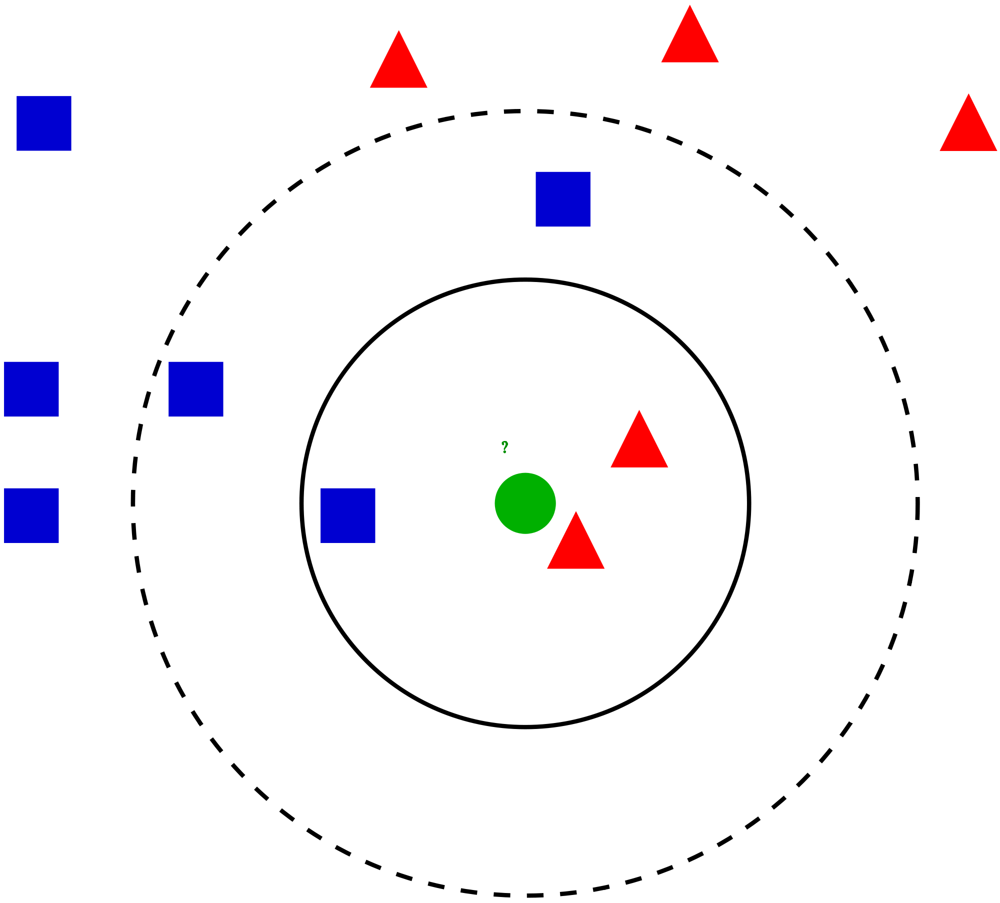
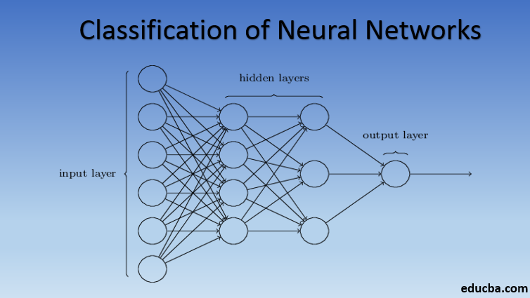

Tian Liu, William Hulsy,  Ella Sofie Vangsnes Bergli (Group 29)

BENG 183

Final Paper
## Machine Learning Paper
### Introduction to Machine Learning 

Machine learning is a branch of artificial intelligence, and is a tool used to make predictions based on data. The machine can learn by recognizing patterns in data and converting them into predictions. This allows the machine to accomplish a task without being programmed for that specific purpose. Systems using machine learning gradually improve both predictions and accuracy by running multiple iterations. The foundation of machine learning is statistics. In this case, a series of algorithms that are capable of processing large amounts of data to find the best results.** **The huge advantage of using machine learning is that the system can adapt to changes in the data as they occur (bbva, 2019). 

Figure 1: Machine learning (Miro Medium) 
#### Application in bioinformatics

Machine learning plays a central role in bioinformatics. Bioinformatics is facing issues with processing large amounts of data produced by new technology. Machine learning is one of the tools used to convert this data into meaningful information. 

One example is genome sequencing, which is an important tool in medical diagnostics. Machine learning is utilized in newer genome sequencing techniques like next-generation sequencing. The implementation of machine learning now makes it possible to sequence the whole human genome in one day. 

Another example is gene editing. Researchers at Sanger university use machine learning to predict which mutations CRISPR will cause in the cell. The algorithm was trained by processing 1 billion mutations, and can now predict the outcome of a repair. This can both increase the efficiency of CRISPR research, as well as ease the translation process (Liu, 2018). 

One last example is the application in healthcare. Machine learning has been an important tool in; drug discovery and manufacturing, personalized medicine and medical imaging and diagnosis. This includes playing a central role in developing a technology called computer vision. The technology has a wide range of applications and is being used to analyze 3D medical images (Lisowski, 2021). 

Figure 2: Application of bioinformatics (Addepto)
#### Supervised vs unsupervised learning

Machine learning can be divided into two main categories, supervised learning, and unsupervised learning. The main difference between these two is whether the dataset is labeled or not. 

Supervised learning operates with an already labeled dataset. It uses the labeled dataset to train an algorithm to classify data within these labels. The model iteratively improves the classifications by learning to weigh each feature of the data. In contrast, unsupervised learning uses an unlabeled dataset. Unsupervised learning group data based on unknown similarities within the data and does not require human supervision. . 

Figure 3: Supervised learning (WsCube Tech)

Supervised learning is more common than unsupervised learning and produces more accurate results. However, it can be very complex and therefore time consuming and expensive. On the other hand, unsupervised learning is less complex and takes place in real time, but the results are less accurate (Burns, 2021). 

Figure 4: Unsupervised learning (WsCube Tech) 

There are multiple types of supervised and unsupervised learning. This includes regression, dimensional reduction, and association. However, classification and clustering are the main types of respectively supervised and unsupervised learning, and the focus in this paper (Alteryx, viewed 2022). 
#### Introduction to Classification

Classification is a method which sorts objects into predefined classes. The process starts with a training data set and a fixed set of labels. The training data is assigned into the different classes/labels by the user. The target data is then classified based on the classification of the training data. The goal of the algorithm is to classify the target data correctly. Common classification algorithms include K-Nearest Neighbors, Logistic Regression and Random Forest. 

Classification is utilized in situations where the target data is known to be within one of the predefined classifications, and the goal is to find out which one. This could be an algorithm that helps diagnose cancer patients with leukemia. The algorithm classifies a patient with either AML (acute myeloid leukemia) or ALL (acute lymphoid leukemia) based on data from previously diagnosed patients. 

Figure 5: Classification (Javatpoint) 
#### Introduction to Clustering

Clustering is a method of sorting data based on similarities. This method does not have predefined classes, nor a training data set. The target objects will be sorted into groups/clusters based on similarities between them and differences from other clusters. Common clustering methods include UPGMA, Complete Linkage and Single Linkage. 

Clustering is utilized when the goal is to find possible unknown similarities between samples. This could be an algorithm that finds genes who share a closely related expression pattern, or finds patients that share the similar expression pattern. 

Figure 6: Clustering (Javatpoint) 
### Classification

Classification in machine learning can be effectively described as separating a set of data into categories defined by the user. It is the most prominent type of supervised learning, for it requires data input from the user to effectively function. All classification algorithms use this data input, the training data set, in some method to devise a strategy on how to best predict the class a certain piece of data belongs to. This data, and the rest of its kind, are the test set - they are the desired target to be sorted. 

Classification is not one simple task, and encompasses multiple types of sorting. The simplest of these is binary sorting - the case in which the algorithm must decide where the test data point fits between two groups, often represented by the binary digits 0 and 1. More complex is multi-class sorting, where the number of groups can be significantly larger, making it more difficult to come to a decision - these groups do not necessarily have to be similar in size or scope, making it harder for a human to easily visualize. Multi-label sorting is when those groups are not necessarily mutually exclusive, meaning prospective algorithms must sort data points with many different possible labels attached. (Brownlee, 2020).

Classification algorithms can generally be separated into two types, based on how they learn -  or more accurately, based on how they process the training set. Lazy learners generally learn by storing the dataset outright, making their training time next to nothing. They generally classify points of the test set by devising some manner of comparing data points, and then by determining what the classifications are for the “closest” members of the training set. Because of this method, they generally have to iterate for every member of the training set during each classification, making them slower on the prediction front - lazy algorithms tend not to scale as well with a huge input in the test set. Eager learners are the opposite  - they utilize the training data to build some sort of model before the test set is inputted, and run test data points through the model rhythmically to classify them. This testing phase is logically generally shorter than the time it takes to train the models, as they generally need less iterations to come to a satisfactory conclusion. This generally gives them the advantage when processing large amounts of data (Asiri, 2022).

Figure 7: Example of k-Nearest Neighbor Classification (Ajanki, 2007)

One of the most well known types of lazy learning algorithms is the k nearest neighbor algorithm. True to its class, its training method is merely to store the inputted training data, and the algorithm requires some sort of distance algorithm to be implemented for it to work. Euclidean distance - the square root of squared differences - is the most common, though others are also used on occasion. The way the algorithm works is that, for a given k value, for each point of the test the algorithm searches through the training set and finds the k closest training set points. Whichever classification holds a plurality of the neighbors, is what the algorithm predicts the test point’s classification is. Choosing a proper k value can be tricky, as lower k values tend to have higher error rates, but larger k values make it tricky to make classes distinct from one another - though to avoid ties odd numbers are generally considered more effective. This algorithm has uses both in and outside the bioinformatics sector, ranging from predicting what customers will buy online based on what they’ve already bought, to predicting whether individuals are at risk for developing cancer symptoms based on patterns of expression of certain genes. (IBM)

Figure 8: Decision Tree Example (Gupta, 2022)

Decision trees are a common type of eager learners, using their input data to attempt to model the curve of the input data with if/else binary decisions. Generally, more complex trees and more complex decisions means the model is a better fit for the data. Once the model is completed, the test data is passed through it to predict its classification. This model is very user-friendly, as it's simple to interpret where data is going to go and compared to other eager learning algorithms, it's relatively simple to set up. However, decision trees have a few glaring problems - they can be prone to bias if classes have very different sizes from each other, and random fluctuations of data, the biggest one being what order the data is entered into the tree, can cause differences to arise. One way to counteract this is the random forest, which effectively merely creates a lot of trees using the data entered in random ways, and classifies the test point on what the plurality of decision trees decide. While this does have an increase in time complexity and makes the model much harder for humans to easily interpret, the gains made in accuracy to avoid bias are hugely beneficial. Decision trees and their evolutions are commonly used in data mining software because of their ability to process large amounts of data relatively quickly, including those that process a lot of genetic data like large sequences (scikit) (Yiu, 2021).

Figure 9: Classification of Neural Networks (Pedamkar, 2022).

Neural networks are a more complex type of eager learning algorithm, and act in a way to attempt to mimic the way humans make decisions. The neural model is a series of layers, like the input and output layer that users can access, but several levels of hidden layers. Each layer sends data to layers ahead of them through a series of thresholds being met or not met to decide what input to send. When used for supervised classification, neural networks can learn by inferring the rules of what to properly classify data as through the training set, being able to compare the results it has predicted and the training set’s actual results. Through this it can refine its classification predictions to the desired result and be ready to operate on the test set. While this method is very costly timewise to set up, and obviously is quite obscured from users as to its inner workings, it has invaluable results, being able to solve many different types of issues with enough effort. It’s extremely valuable in the field of A.I. development, as it’s crucial to their decision-making process. In terms of the medical field, its most common usage is analyzing images like X-rays, trying to see if it can sense cancers or other conditions from operating its model on the test set images (ScienceDirect).
### Clustering

The form of unsupervised machine learning technique that will be explored in this paper is clustering. Clustering is the process of taking n items and dividing them into k subgroups such that items within one subgroup are more similar to each other than they are to outside. Clustering is a useful tool because it can help determine the intrinsic grouping among the dataset. It can also be used to find structure, underlying processes, generative features, or inherent groupings (Piry 2022). There is no clustering algorithm that is the most optimal for every circumstance, but different clustering algorithms are optimized for different use-cases and situations. 

Figure 10. Clustering (Piry 2022)

Two clustering algorithms will be discussed:

1. K-means Clustering
2. Hierarchical Clustering
#### K-means

K-means is an iterative algorithm that partitions the dataset into k clusters where each data point is assigned to one group (Dabbura 2022).  It tries to keep intra-cluster data points as similar to each other as possible while keeping the clusters as different as possible. The inputs to K-means are the dataset and the value k which is the number of desired clusters. The output will be an assignment of each data point to a cluster. K-means has many applications in the field of bioinformatics like cluster gene expression data, cluster protein sequences, or construct systems development of trees. 

The steps of the K-means implemented as Lloyd’s algorithm are as follows:

1. Initialize k centroids by selecting k random points from the dataset
2. Until there is no change to the centroids or specified number of iterations
    1. Calculate the squared euclidean distance between each data point and every centroid
    2. Assign each datapoint to the centroid that is closest to it
    3. Reassign the centroid by taking the average of the data points assigned to that cluster 

Figure 11. K-means example (Chauhan 2022)

In the above example, the points are assigned to four clusters and seems to do so well; however, the distinction between clusters is not always so apparent. Choosing the right k can affect the performance of the program. There are many commonly used methods to determine the right k for K-means. This paper will go into the elbow method for choosing k. In the elbow method, for different values of k, the **Within-Cluster Sum of Squared Errors** is calculated (**WSS**). The WSS of a particular k is calculated by computing the distance for each point to its assigned centroid and summing all those distances. The k where the WSS finishes rapidly decreases is chosen as the optimal k. 

Figure 12. Elbow Point

#### Hierarchical Clustering

Hierarchical Clustering is another form of clustering that tries to build a hierarchy. Hierarchical Clustering differs from KMeans in that clusters are built by combining objects into clusters, and those clusters are also combined into even bigger clusters thus creating a hierarchy. In KMeans objects are combined into fixed clusters centering around the centroid, and clusters are not combined. There are two types of hierarchical clustering methods: agglomerative and divisive with agglomerative being more commonly used. In agglomerative hierarchical clustering, each data point is treated as a separate cluster initially, and the most similar clusters are combined in each iteration. Divisive hierarchical clustering is the opposite where all of the data points are in a single cluster initially, and the least similar data point is separated and considered its own cluster. The input to this algorithm is just the dataset, and the output will be a dendrogram that contains the hierarchical relationships (Patlolla 2018).

The steps of agglomerative hierarchical clustering are as follows:

Compute similarity between all possible combinations of two profiles in the dataset 

Initialize each data point as a cluster

1. Combine the two most similar clusters and update similarity matrix
2. Recalculate similarity between new cluster and all remaining clusters with clustering method
3. Repeat steps 1 and 2 until only one cluster remains 

Figure 13. Hierarchical clustering example (Patlolla 2018)

In the above example, there are six items that will be grouped in a hierarchical fashion. B and C are the most similar so they are merged into one cluster BC. D and E are the most similar after the similarity matrix is recalculated so they are combined into cluster DE. Cluster DE and F are closest in the next iteration so they are combined into DEF, and that cluster is combined with the BC cluster to form BCDEF in the next iteration. Finally, A is combined with that cluster to form one large cluster. 

There are many distance measures that can be used to find the similarities between two profiles. 

**Euclidean distance** is the most widely used and just uses the Pythagorean Theorem to calculate the distance between two points.

**Manhattan distance** is a distance metric that only uses the vertical and horizontal components and is useful if the point were on a grid-like system like street maps (Great Learning Team).

**Cosine Similarity** is a similarity function between two vectors of an inner product space that is measured by calculating the cosine of the angle between the two vectors. The values range from -1 to 1 where the higher the value, the more similar two points are. This similarity function is particularly useful when the magnitude of the vectors are not important like working with text data (Emmery 2017).

**Jaccard Similarity** is a similarity function for two sets that compares which items are shared and distinct. The value ranges from 0 to 1 where if the two sets share more items, the jaccard index is higher. It is especially useful when features are qualitative or binary (Great Learning Team).

The above distance measures are used to find the similarity between two profiles; however, a clustering method is required in order to compare two clusters. **UPMGA** (**Unweighted Pair Group Method with Arithmetic Mean**) is a clustering method where the average distance is calculated from each point in a cluster to every other point in the other one. The two clusters that have the lowest average distance are merged. **Single Linkage** uses the minimum distance between any two points in two clusters and produces clusters in long chains and is useful for identifying outliers. **Complete Linkage** on the other hand is the opposite and uses the maximum distance between any two points in two clusters and tends to produce tight clusters. **Ward’s Method** uses how much the sum of squares will increase when two clusters are merged as the metric. The sum of squares for each cluster is initially zero and grows as clusters are merged. Ward’s method will minimize the growth of the sum and aim to combine smaller clusters if possible (Shalizi 2009). **Centroid Linkage** uses the distance between the centroids of the clusters to determine the similarity. **Average Linkage** uses the average distance for all pairs of data points between the two clusters. Some of the clustering methods are visualized below. 

#### Conclusion

In conclusion, machine learning is a powerful tool used to recognize patterns in data and convert them into predictions. Machine learning can be divided into supervised and unsupervised learning with classification and clustering as the most central subcategories. Classification can work within the user-defined bounds of existing categories, predicting each test data point based on the training data in some method. Classification algorithms have many different ways of interpreting and interacting with their training data to prepare to sort the test data. Clustering is an unsupervised learning technique that processes n items and divides them into k subgroups based on similarities. Two important clustering methods are K-means clustering and Hierarchical clustering.  

**References **

1. _1.10. decision trees_. scikit. (n.d.). Retrieved December 6, 2022, from [https://scikit-learn.org/stable/modules/tree.html ](https://scikit-learn.org/stable/modules/tree.html)
2. Addepto. [https://addepto.com/wp-content/uploads/2021/09/900x300-6-1.png](https://addepto.com/wp-content/uploads/2021/09/900x300-6-1.png)
3. Ajanki, Antti (2007, May 28). _Example of k-Nearest Neighbor Classification _[svg digital image]. Wikipedia, https://en.wikipedia.org/wiki/K-nearest_neighbors_algorithm#/media/File:KnnClassification.svg
4. Alteryx. (Viewed 2022, November). Supervised vs Unsupervised Learning. [https://www.alteryx.com/glossary/supervised-vs-unsupervised-learning](https://www.alteryx.com/glossary/supervised-vs-unsupervised-learning) 
5. Asiri, S. (2022, November 12). _Machine learning classifiers_. Medium. Retrieved December 6, 2022, from [https://towardsdatascience.com/machine-learning-classifiers-a5cc4e1b0623](https://towardsdatascience.com/machine-learning-classifiers-a5cc4e1b0623) 
6. bbva. (2019, November 11th). Machine learning: What is it and how does it work?. [https://www.bbva.com/en/machine-learning-what-is-it-and-how-does-it-work/](https://www.bbva.com/en/machine-learning-what-is-it-and-how-does-it-work/) 
7. Bonthu, H. (2021, June 12). _Single-link hierarchical clustering clearly explained!_ Analytics Vidhya. Retrieved December 6, 2022, from https://www.analyticsvidhya.com/blog/2021/06/single-link-hierarchical-clustering-clearly-explained/ 
8. Brownlee, J. (2020, August 19). _4 types of classification tasks in machine learning_. MachineLearningMastery.com. Retrieved December 6, 2022, from [https://machinelearningmastery.com/types-of-classification-in-machine-learning/](https://machinelearningmastery.com/types-of-classification-in-machine-learning/) 
9. Burnes, Ed. (2021, March). machine learning. _TechTarget_. [https://www.techtarget.com/searchenterpriseai/definition/machine-learning-ML](https://www.techtarget.com/searchenterpriseai/definition/machine-learning-ML)
10. Chauhan, A. (2022, November 26). _Fully explained K-means clustering with python_. Medium. Retrieved December 6, 2022, from [https://pub.towardsai.net/fully-explained-k-means-clustering-with-python-e7caa573176a ](https://pub.towardsai.net/fully-explained-k-means-clustering-with-python-e7caa573176a)
11. _Classification Neural Network_. ScienceDirect. (n.d.). Retrieved December 6, 2022, from [https://www.sciencedirect.com/topics/engineering/classification-neural-network](https://www.sciencedirect.com/topics/engineering/classification-neural-network)  
12. Dabbura, I. (2022, September 27). _K-means clustering: Algorithm, applications, evaluation methods, and drawbacks_. Medium. Retrieved December 6, 2022, from [https://towardsdatascience.com/k-means-clustering-algorithm-applications-evaluation-methods-and-drawbacks-aa03e644b48a](https://towardsdatascience.com/k-means-clustering-algorithm-applications-evaluation-methods-and-drawbacks-aa03e644b48a) 
13. Emmery, C. (2017, March 27). _Euclidean vs. cosine distance_. Chris Emmery. Retrieved December 6, 2022, from [https://cmry.github.io/notes/euclidean-v-cosine](https://cmry.github.io/notes/euclidean-v-cosine)
14. Great Learning Team (2022, October 31). _What is hierarchical clustering? an introduction to hierarchical clustering_. Great Learning Blog: Free Resources what Matters to shape your Career! Retrieved December 6, 2022, from [https://www.mygreatlearning.com/blog/hierarchical-clustering/#howclusteringworks](https://www.mygreatlearning.com/blog/hierarchical-clustering/#howclusteringworks)
15. Gupta, Saloni. (2022, October 3). _A decision tree for the concept PlayTennis._ [png digital image]. GeeksForGeeks. [https://media.geeksforgeeks.org/wp-content/cdn-uploads/Decision_Tree-2.png](https://media.geeksforgeeks.org/wp-content/cdn-uploads/Decision_Tree-2.png) 
16. Javatpoint. [https://static.javatpoint.com/tutorial/machine-learning/images/clustering-in-machine-learning.png](https://static.javatpoint.com/tutorial/machine-learning/images/clustering-in-machine-learning.png)
17. Javatpoint. [https://static.javatpoint.com/tutorial/machine-learning/images/supervised-machine-learning.pn](https://static.javatpoint.com/tutorial/machine-learning/images/supervised-machine-learning.png)g 
18. _K-means clustering analysis_. Cd Genomics - Biomedical Bioinformatic. (n.d.). Retrieved December 6, 2022, from [https://bmb.cd-genomics.com/k-means-clustering-analysis.html](https://bmb.cd-genomics.com/k-means-clustering-analysis.html) 
19. Liu, Angus. (2018, November 30th). Making CRISPR-Cas9 gene editing safer with artificial intelligence. _Fierce Biotech_. [https://www.fiercebiotech.com/research/using-machine-learning-to-predict-crispr-cas9-editing-outcomes](https://www.fiercebiotech.com/research/using-machine-learning-to-predict-crispr-cas9-editing-outcomes) 
20. Lisowski, Edwin. (2021, September 21st). The role of machine learning in bioinformatics and biology. _addepto_. [https://addepto.com/blog/the-role-of-machine-learning-in-bioinformatics-and-biology/](https://addepto.com/blog/the-role-of-machine-learning-in-bioinformatics-and-biology/) 
21. Miro Medium. [https://miro.medium.com/max/1400/1*c_fiB-YgbnMl6nntYGBMHQ.webp](https://miro.medium.com/max/1400/1*c_fiB-YgbnMl6nntYGBMHQ.webp)
22. Oyelade, J., Isewon, I., Oladipupo, F., Aromolaran, O., Uwoghiren, E., Ameh, F., Achas, M., & Adebiyi, E. (2016, November 30). _Clustering algorithms: Their application to gene expression data_. Bioinformatics and biology insights. Retrieved December 6, 2022, from https://www.ncbi.nlm.nih.gov/pmc/articles/PMC5135122/ 
23. Pedamkar, Priya (2022) _Classification in Neural Networks _[digital png image]. educaba.com. [https://cdn.educba.com/academy/wp-content/uploads/2019/09/classification-of-neural-networks.png](https://cdn.educba.com/academy/wp-content/uploads/2019/09/classification-of-neural-networks.png)
24. Priy, Surya. (2022, August 23). _Clustering in machine learning_. GeeksforGeeks. Retrieved December 6, 2022, from [https://www.geeksforgeeks.org/clustering-in-machine-learning/ ](https://www.geeksforgeeks.org/clustering-in-machine-learning/)
25. Saji, B. (2022, December 5). _K means clustering: K means clustering algorithm in machine learning_. Analytics Vidhya. Retrieved December 6, 2022, from https://www.analyticsvidhya.com/blog/2021/01/in-depth-intuition-of-k-means-clustering-algorithm-in-machine-learning/ 
26. Shalizi, C. (2009, September 14). _Distances between Clustering, Hierarchical Clustering_. cmu. Retrieved December 6, 2022, from https://www.stat.cmu.edu/~cshalizi/350/lectures/08/lecture-08.pdf 
27. _What is the K-nearest neighbors algorithm?_ IBM. (n.d.). Retrieved December 6, 2022, from [https://www.ibm.com/topics/knn](https://www.ibm.com/topics/knn)
28. WsCube Tech. [https://i.ytimg.com/vi/9oCZw-lNXUI/maxresdefault.jpg](https://i.ytimg.com/vi/9oCZw-lNXUI/maxresdefault.jpg)
29. WsCube Tech. [https://i.ytimg.com/vi/OIVja_NSJ0w/maxresdefault.jpg](https://i.ytimg.com/vi/OIVja_NSJ0w/maxresdefault.jpg)
30. Yiu, T. (2021, September 29). _Understanding random forest_. Medium. Retrieved December 6, 2022, from [https://towardsdatascience.com/understanding-random-forest-58381e0602d2 ](https://towardsdatascience.com/understanding-random-forest-58381e0602d2)

    

     
