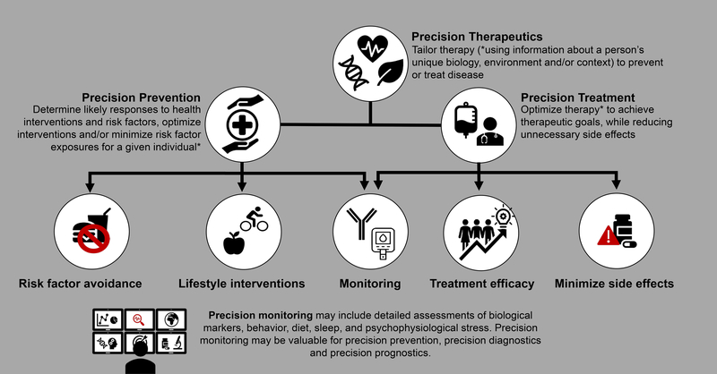
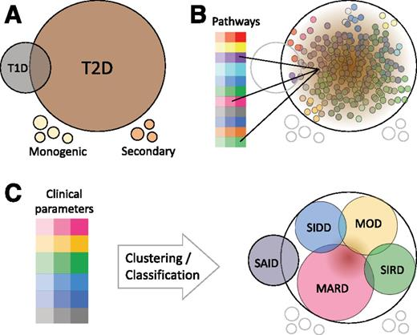
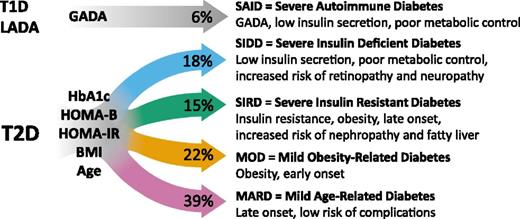

# **Precision Medicine in Diabetes**
### By: Anika Sharma, Devika Torvi, Neha Gottipalli - Group 2

# Introduction
## What is Diabetes?
Diabetes is a chronic health condition where one’s blood glucose is too high. This is of important because blood glucose is your main source of energy. When one has diabetes, their body is not producing enough insulin, which is the pancreatic hormone that regulates sugar levels. Hence, without enough insulin, the glucose will remain in your blood and not reach your cells. This ism concerning because it can lead to serious health problems including heart disease, loss of vision, and kidney disease. Although there is no cure for diabetes, there are steps and precautions that one could take, such as conscious eating and exercising1.

### *Type 1 vs. Type 2 Diabetes*
There are two types of diabetes. Type 1 Diabetes is a genetic condition that is often diagnosed early in one's lifetime. Of the  population that has diabetes, only a small chunk of approximately 5-10% have this type. It is currently unknown how to prevent this type of diabetes. Type 2 Diabetes, on the other hand, is a condition that generally develops over time due to lifestyle. This type of diabetes can be delayed and prevented by eating healthy and exercising. Often, symptoms are not noticeable, so it is important to monitor your sugar levels1. 

## What is Precision Medicine?
**Precision Medicine** is a form of medicine that uses specific genes and proteins in a human’s body via genetic or molecular profiling to optimize the benefits of treatment3. It is useful because it helps doctors identify which treatment would work best for you, allowing you to avoid unnecessary treatments that could cause potential side effects4.

### *Overview of Precision Medicine Pipeline*

##### **Figure 1** Precision medicine and the therapeutics associated with it can be broken down into precision prevention and treatment. Precision prevention means assessing what the risks and outcomes related to the therapy are. This is done via monitoring, lifestyle interventions, and risk factor avoidance. Precision treatment revolves around optimizing the treatment to ensure that the goals are likely to be met with the least amount of negative consequences. When this occurs, treatment efficacy and the minimization of side effects is taken into account. Also, just like with prevention, monitoring is an important way of accomplishing this. Monitoring is used for precision prevention, diagnostics, and prognostics. It delves into biological markers and lifestyle factors such as sleep and diet. 

 

# Need for a Precision Medicine Initiative

Unlike Type 1 Diabetes, Type 2 Diabetes (T2D) is based on an exclusionary diagnosis. This means that a case of diabetes can be classified as T2D only if Type 1 diabetes and monogenic diabetes has been ruled out. This leads to around 90% of diabetes patients being diagnosed with T2D. As a result, there is a significant heterogeneity within Type 2 Diabetes that the typical treatment approaches do not address8. 

The first prescribed treatment for T2D is usually Metformin, a drug that regulates glucose levels by lowering the amount of glucose absorbed from food and enhances insulin sensitivity. However, this prescription can result in potentially hamrful side effects without accurately treating the root cause of the T2D case. T2D cases can be affected by a variety of risk factors including the patient's insulin resistance, insulin deficiency, lifestyle, and various genetic indicators8. 

A precision medicine initiative would allow physicians to further classify patients under the umbrella term of "Type 2 Diabetes", ensuring more specificity in the treatment options presented to them. 

# Precision Diabetes Medicine Mechanism

In the past, there has  been a lot of ambiguity surrounding genetic indicators of Type 2 Diabetes due to confounding variables such as lifestyle factors. In recent years, technologies such as GWAS and ChIP-based genotyping arrays have been able to identify biological variants that significantly impact affect the one's risk factor for T2D, as well as one's treatment response.  Additionally, it has increased researchers ability to specifically trace a patient's biological idiosyncrasies to their T2D risk factors8. 

##### **Figure 2** The precision medicine pipeline as it relates to diabetes. Using K-means clustering, researchers were able to derive the five subclassifications of Type 2 Diabetes displayed above9.
 
Utilizing the datasets resulting from these technologies, clusters can be derived using a clustering analysis pipeline. An example of this is the k-means clustering algorithm which has been able to derive five subclassifications of T2D from available genomic data. With the clusters formed from the data, researchers can classify them based on factors such as insulin resistance, insulin deficiency, or other risk factors. The clusters can better gauge a patients response to potential treatment options and possibly propose a treatment option in the future.

 

## *T2D Subtypes*

A study done in the Lund Insititute for Diabetes aimed to identify appropriate subclassifications for T2D that could provide more clinical context about each patient's diagnosis. In the cohort, they stratified the subjects into groups based on the following variables9:
* HbA1c (glycosylated hemoglobin) levels
* BMI
* Age
* Age at Diabetes Onset
* HOMA-B ($\beta$ cell function) levels
* HOMA-IR (resistance) levels

Usin the k-means clustering method, clusters of similar sizes became identifiable, with each cluster having different clinical characteristics, diabetes-related risks, and treatment responses.  

### **Five Subtypes and Clinical Characteristics9**
**SIDD** : Early disease onset, low insulin secretion, relatively low BMI, high HbA1c

**SIRD** : High HOMA2-IR and HOMA2-B, high BMI, low HbA1c

**MOD** : High BMI

**MARD** : Late-Onset Diabetes

##### **Figure 3** Subclassifications of Diabetes based on factors such as insulin resistance, sensitivity, BMI, age, and glucose levels8

 

# Pros and Cons of Precision Diabetes Medicine

There are several advantages and disadvantages to precision diabetes medicine. For example, one advantage is that treatments that are derived from precision medication are less likely to have side effects because it is tailored to a specific disease subtype5; in fact, all of the testing done in precision medicine in diabetes can help determine new disease subtypes. This way, the tests can make the treatment more specific, which will target the disease better. 

Additionally, precision medicine can be used as a means of early diagnosis. For example, if a patient is beginning to exhibit a genetic change that is common in a certain disease that patient can be diagnosed early7. Furthermore, precision medicine can operate to depict population health, allowing us to know which countries or groups of genetically similar people in particular are expected to develop a certain disease7. 

However, there are also drawbacks presented to precision medicine advancements. The nature of the approach means that precision medicines are likely to be approved for use only in specific subpopulations, limiting the number of patients eligible for treatment with a given drug7. 

Another drawback to precision medication is that precision medicine is expensive. Very few cost-effectiveness analyses in precision diabetes medicine have been published, despite long-standing recognition that cost-effectiveness is a key requirement for clinical translation7. Genetic testing protocols are also expensive to conduct and are required in order to implement these medicines into regular use. 

While the testing is relatively fast, the data being sequenced and secondary analyzed takes a great amount of time due to the large size of the files. Still, these large files produced by various types of testing not only cause testing to be time consuming, but the size of these files can also lead to storage issues, as these files are typically large and having to test each patient could lead to a storage problem7. Not only do issues exist with storing data, but also with interpreting the data; numerous informatics approaches that are already in practice cannot successfully amalgamate data7. These approaches need to be enhanced in order to ensure that the data that is being collected is also examined effectively. 

One more drawback to precision medicine is a difficulty to access information. Precision medicine requires patient data, which is extremely protected, making it tough to access. While testing can become customary, patient privacy could become a complication and the security of their information could be at risk7. In addition, several precision medicine approaches and studies are also hard to retrieve, meaning there is also a limited access to data that is gathered7.  

# Future of Precision Diabetes Medicine

The optimal precision diabetes medicine approach will expand therapeutic benefits while also minimizing risks. This will need an analysis of Heterogeneity of Treatment Effect (HTE) in order to properly determine the side effects, glycemic progression, and the possibility of microvascular or macrovascular complexities6 . For several drug classes, certain subgroups that would be at a higher chance of typical treatment-specific effects have been determined prior; for instance, the possibility of fracture with TZD is restricted mostly to females with SGLT2i, those with improper kidney function, and to those who have a history of previous infection and are at a high risk of genital infections6. Procedures to resolve unmeasured confounding variables, like the prior event rate ratio, can have a certain use for assessing side effect risk in observational routine care data in which the allotment to therapy is not made random.  

A similar but often neglected aspect for precision medicine is whether the advantages and risks of a treatment are correlated. This is the probable case for TZDs, meaning that the likeliness of edema and the likeliness of weight gain with greater glucose-lowering response is increased; this must be taken into account when selecting a treatment6. Another addition of the current work being done in precision medicine is the analysis of effects of higher-order drug combinations. This will be more practical in great routine clinical data sets in which the sizable number of patients are assigned to specific combinations therapies, despite sturdy validation approaches being obligatory6.

Another interesting path for precision diabetes medicine is the application of causal inference, data-driven machine learning, and artificial intelligence–based approaches to better HTE prediction accuracy and broadness of findings from great data sources like electronic health records6. Data-driven approaches can be useful when databases begin to involve high-dimensional genetic information. One option is that individualized prediction models made with standard statistical procedures depending on classical risk factors can be increased with data-driven classification approaches6. If data-driven approaches can better prediction through capturing higher-order complex traits that the usual methods typically overlook. 

Even though existing data may be used to improve and test candidate type 2 diabetes precision medicine methods, eventually, expected trials, as performed for cancer and monogenic diabetes, will probably be required to depict clinical utility. TriMaster is an occurring three-way crossover randomized trial that is one study being done in type two diabetes. TriMaster will test the hypothesis that simple subgroups defined by baseline BMI and eGFR alter response with DPP-4i, SGLT2i, and TZD treatment at first hand6. This will give the first possible analysis of a precision medicine approach for glycemic response. The three way crossover blueprint will permit an “n of 1” evaluation of patient inclinations6. Although, conducting trials in order to test possible candidate factors individually for personalization is not practical, cost-effective, or efficient strategy. In the future, trials can test certain precision medicine algorithms that depend on several factors, such as clinical and genetic features, to test if the use of an algorithm results better for patients6. One straightforward trial design to test this would be to cluster randomize health centers to either obtain or not obtain an algorithm, and to compare centers with and without the algorithm would be able to analyze its efficiency and success. If the two contrasting algorithms are in need of testing, it could occur through three-way cluster randomization.

## References

1. Centers for Disease Control and Prevention. (2022, July 7). What is 
diabetes? Centers for Disease Control and Prevention. Retrieved December 5, 
2022, from https://www.cdc.gov/diabetes/basics/diabetes.html

2. Exploring the role of precision medicine in diabetes diagnoses. (n.d.). 
Retrieved December 6, 2022, from https://journals.sagepub.com/doi/full/10.
1177/2633559X211060849

3. R;, F. (n.d.). Precision medicine in diabetes, current research and 
future perspectives. Journal of personalized medicine. Retrieved December 5, 
2022, from https://pubmed.ncbi.nlm.nih.gov/36013182/

4. U.S. National Library of Medicine. (n.d.). What is precision medicine?: 
Medlineplus Genetics. MedlinePlus. Retrieved December 5, 2022, from https://
medlineplus.gov/genetics/understanding/precisionmedicine/definition/ 

5. Chung, Erion, & Hattersly. (2020, June 11). Precision Medicine in Diabetes: A Consensus Report From the American Diabetes Association (ADA) and the European Association for the Study of Diabetes (EASD). American Diabetes Association. Retrieved December 6, 2022, from https://diabetesjournals.org/care/article/43/7/1617/35569/Precision-Medicine-in-Diabetes-A-Consensus-Report

6. Dennis, J. M. (2020a, August 25). Precision Medicine in Type 2 Diabetes: Using Individualized Prediction Models to Optimize Selection of Treatment. American Diabetes Association. Retrieved December 6, 2022, from https://diabetesjournals.org/diabetes/article/69/10/2075/16099/Precision-Medicine-in-Type-2-Diabetes-Using

7. Singla. (2021, July 19). NCBI. Precision Medicine: An Emerging Paradigm for Improved Diagnosis and Safe Therapy in Pediatric Oncology. Retrieved December 6, 2022, from https://www.ncbi.nlm.nih.gov/pmc/articles/PMC8372982/

8. American Diabetes Association. (n.d.). Precision Medicine in Diabetes Initiative | American Diabetes Association. Professional.Diabetes. Retrieved December 6, 2022, from https://professional.diabetes.org/content-page/precision-medicine-diabetes-initiative-0

9. Ahlqvist, Prasad, & Group. (2020, October 1). Subtypes of Type 2 Diabetes Determined From Clinical Parameters. diabetesjournals.org. Retrieved December 6, 2022, from https://diabetesjournals.org/diabetes/article/69/10/2086/16081/Subtypes-of-Type-2-Diabetes-Determined-From

