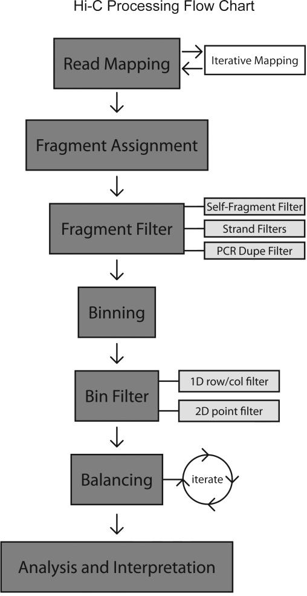
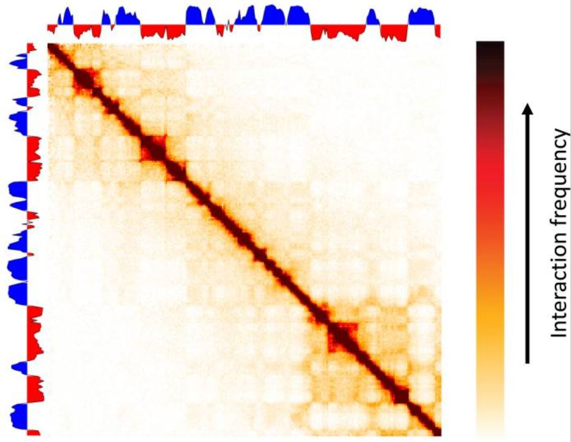

# TAD-calling
## What are TADs?

TADs are called topology-associated domains. TADs were first discovered on low-resolution mammalian Hi-C contact frequency heatmaps in 2012. Several research groups found that the contact frequency heatmaps could be clustered into megabase-scale blocks where the DNA sequences exhibit significantly higher interaction frequency with other DNA sequences within the domain than those outside of the block [1]. The empirical block structures on the heatmap were defined as TADs. The size of a TAD varies from 100kb to several megabases.

## Why are TADs important?

DNAs were long believed to be mingled and intertwined in the nucleus like a bowl of spaghetti. However, the Hi-C contact frequency maps revealed more organized chromatin structures on different scales, including TADs. 

The majority of observed interactions between promoters and enhancers do not cross TAD boundaries [2]. Removing a TAD boundary can form new promoter-enhancer contacts. It has been proposed that TADs constitute functional units in the genome, important for the correct regulation of gene expression. TADs co-localize regulatory elements with their target genes, and are thought to promote co-regulation of the genes they contain, creating “gene regulatory domains” [3]. Disrupted TAD boundaries are associated with diseases, such as cancer.

Divergent CTCF sites were found to be enriched at TAD boundaries. One of the proposed mechanisms for the formation of TADS was loop extrusion. In this mechanism, cohesins extrude DNA loops until encounter divergent CTCF sites [4]. DNA sequences on the loop self interact more than interacting with sequences out of the loop. 

*CTCF binding sites and chromatin marks enriched at TAD boundaries [6] and a model for loop extrusion and extrusion-based chromosome organization [4]*

Recent studies in single-cell Hi-C and high-resolution microscopy data revealed that TAD-like structures were also present on the single-cell level. However, the TAD-like structures are highly variable from cell to cell, with a non-zero boundary probability across the genome. Moreover, single-cell level TAD-like structures were observed in cohesion-depleted cells whereas ensemble-averaged TAD structures disappeared in bulk Hi-C data [5]. This indicated that loop extrusion is not sufficient to explain TAD formations. Other mechanisms such as thermodynamic models of phase separations were proposed. 

*Bulk and single-cell Hi-C contact frequency heatmap for normal and cohesin-depleted cells. TAD-like structures showed a high variablility from cell to cell. In cohesin-depleted cells, TAD structures disappeared on the ensemble average level, but were preserved in single cells. [5]*

In summary, understanding the formation and effects of TAD structures will help us understand chromatin dynamics and gene regulations, and potentially provide insights into treatments of diseases.

## How are these physical interactions within the genome detected?
The original technique which allowed scientists to analyze physical interactions within the genome was 3C, introduced by Dekker et al. in 2002. 3C stands for chromosome conformation capture and was the first procedure which was able to analyze contact frequencies between select pairs of genomic sequences within the nucleus. Following its introduction in 2002, there have been many different methodologies derived from 3C such as 4C, 5C, ChIA-PET, and Hi-C. In this chapter we will be focusing on Hi-C, as Hi-C was the original method in which TADs were discovered.

>To learn more about the various techniques, read [this paper](https://molecularcytogenetics.biomedcentral.com/articles/10.1186/s13039-018-0368-2).

## Why Hi-C?
Prior to Hi-C’s development in 2010, the primary method of detection of chromosomal interactions was through 3C and similar adaptations of the method. However, these methods all had the same issue of having to target specific loci to study, causing it to be impossible to analyze chromosomal interactions in a genome-wide manner. Hi-C was created to address this issue, using proximity-based ligation and next generation sequencing to study all chromosomal interactions within a region simultaneously.

Due to its usage of next-generation sequencing, Hi-C has the highest through-put out of the 3C derived techniques, with around a billion reads per sample. This does come with the tradeoff of a relatively low resolution compared to the other techniques (0.1-1 Mb for Hi-C whereas 3C, 4C, and 5C all have resolutions of ~1kb). However, when it comes to determining TADs, the lower resolution is not a big issue because of the size of TADs.

## The Hi-C Process
Now that we have discussed why Hi-C is helpful for the discovery of TADs, let’s take a look at a brief overview of the steps that make up the Hi-C process.

*Overview of Hi-C [10]*

1. Crosslink the cells with formaldehyde in order to stabilize the chromosomal interactions.
2. Digest the chromatin with a restriction enzyme (usually HindIII or EcoRI).
3. Fill in the 5’ overhangs left from the restriction enzyme and mark the DNA ends with biotin. The biotin helps with selectivity later on.
4. Ligate the crosslinked fragments.
5. Reverse the crosslinks and degrade proteins present.
6. Purify DNA and remove biotin from non-ligated DNA ends.
7. Shear the DNA into smaller fragments for better sequencing results.
8. Fragments containing ligation junctions, which have been selected through the biotinylated ends, are then amplified and sequenced using next generation sequencing.

>To read more in-depth about the steps of Hi-C, check out [this paper](https://www.ncbi.nlm.nih.gov/pmc/articles/PMC3149993/) written by the Hi-C’s inventors!

## What should the results be?
When Hi-C has been properly performed, the results should result in a FASTQ file of bands larger than 10kb. From this point, there are a series of steps to perform in order to process the Hi-C data.

*Step 1. Read Mapping*
Using any conventional software, align the reads to the genome of interest. Despite having been sequenced using paired-end reads, paired-end alignment is difficult to use. This is because Hi-C reads consist of fragments from two separate segments of the genome. Instead, a common solution is to map each side of the paired end read independently using a normal alignment technique.

*Step 2. Fragment Assignment*
Every mapped read from Hi-C should align to a restriction fragment, which can be determined ahead of time using the genome sequence. After this has been done, filtering will be performed to remove excess noise from the data.

*Step 3. Filtering*
If read pairs end up mapping within the same restriction fragment, that can mean that the read pair is from an un-ligated fragment or a circularized fragment. These two cases are both unwanted and should therefore be removed from the data. In addition to filtering read pairs within the same fragment, make sure to also filter for PCR artifacts, which can be found as they either share the exact same paired-end sequence or have the same 5’ alignment positions.

*Step 4. Binning*
As Hi-C tends to have a lower resolution, the data should be binned into fixed genomic interval sizes. This reduces the complexity of the possible genomic interactions and increases the signal to noise ratio. Typical sizes for binning range from 40kb to 1Mb. If bins have a very low signal or are very noisy, they likely are from highly repetitive regions or regions with low mappability, such as telomeres and centromeres. Make sure to filter the data for these bins too.

>In-depth guides on how to process Hi-C data with specific pipelines can be found [here](https://zhonglab.gitbook.io/3dgenome/chapter2-computational-analysis/3.2-higer-order-data-analysis/analytical-pipelines).

Once Hi-C data has been processed, the result is a binned genome-wide interaction matrix, in which each section reflects interaction frequency between two loci on the genome. An example of what that may look like is found below.

## Finding TADs in Hi-C Maps

### Theoretical Basis

*Relationship between Hi-C contact matrix elements and structural elements of chromatin [12]*

All methods for determining TADs attempt to locate regions in which multiple contacts between genomic regions
occur that are otherwise isolated from other regions containing distal genomic contacts. On a Hi-C map, this can be seen
as a checkered board, in which the total region is the TAD, isolated from other high contact frequency regions, and each individual
checkered square indicates a high contact interaction between two distal genomic regions. A good algorithm for accurately 
determining TADs from a Hi-C map should be able to both determine all highly contacted regions and determine the borders
between isolated regions to accurately showcase real compartments in the chromatin structure. [13] Since TADs vary in size  
and number of sub-compartments, approaches to categorize often face various challenges specific to the region being analyzed,
with different algorithms having greater or worse success depending on the area of interest. Approaches vary in their use
of computational techniques, with some centered around probabilistic computations, others utilizing HMMs, and others 
utilizing clustering based approaches. [13]

## Some approaches

### Arrowhead Matrix

*Transformation of contact map to arrowhead matrix [12]*

Transformation of the Hi-C contact map to an arrowhead matrix gives a probabilistic estimate of the likelihood a region is within
a TAD. For every position in the matrix $i,i+d$ where $d$ is some predefined distance, the value in the arrowhead matrix is computed as
$$A_{i,i+d}=\frac{M_{i,i-d}-M_{i,i+d}}{M_{i,i-d}+M_{i,i+d}}=1-\frac{2*M_{i,i+d}}{M_{i,i+d}+M_{i,i-d}}$$
Where $A_{x,y}$ is the value of the position $x,y$ in the arrowhead matrix and $M_{x,y}$ is the value of the position $x,y$ in the contact
matrix. [12] This can be understood as the observed contact frequency over the expected contact frequency based on the related positions. If the value is high
the observed contact frequency cannot be reasonably explained by the related region, implying the relationship is significant and that the position of interest
is within a TAD. Once the transformation is applied to the entire matrix, high positive "arrows" indicate the region is 
within a TAD and are kept isolated from other regions.

### Clustering

*Contacts from Hi-C contact map, shown on right, are associated with specific clusters with different likelihoods [12]*

As the output of a Hi-C analysis is the locations of high-contact frequency regions, a TAD can be thought of as a collection of closely
related regions, making clustering a reasonable approach to organizing the contacts. K-means clustering attempts to group the 
contacts to contacts that are distally close in euclidean distance across the Hi-C map. This approach faces difficulties because
it is often unclear how many TADs should belong to a region and does not isolate specific regions well.
In recent years, TADs have been found to be defined more directly by hierarchical levels of organization rather than explicitly disjoint
compartments. Hierarchical clustering has been found to capture this organization well by grouping levels of relationship rather
than isolated regions. This method groups the closest contacts together into levels, and then continuously groups levels into higher order levels.
In this way, depending on the study being conducted, a researcher can specify the level of compartmentalization they are looking at 
by which level of clustering they want to examine.

## References

[1] Beagan, J.A., Phillips-Cremins, J.E. On the existence and functionality of topologically associating domains. Nat Genet 52, 8–16 (2020). https://doi.org/10.1038/s41588-019-0561-1

[2] Whalen, S., Truty, R. M., & Pollard, K. S. (2016). Enhancer-promoter interactions are encoded by complex genomic signatures on looping chromatin. Nature genetics, 48(5), 488–496. https://doi.org/10.1038/ng.3539 

[3] Long, H.S., Greenaway, S., Powell, G. et al. Making sense of the linear genome, gene function and TADs. Epigenetics & Chromatin 15, 4 (2022). https://doi.org/10.1186/s13072-022-00436-9 

[4] Banigan, E. J., & Mirny, L. A. (2020). Loop extrusion: theory meets single-molecule experiments. Current opinion in cell biology, 64, 124–138. https://doi.org/10.1016/j.ceb.2020.04.011 

[5] Conte, M., Fiorillo, L., Bianco, S. et al. Polymer physics indicates chromatin folding variability across single-cells results from state degeneracy in phase separation. Nat Commun 11, 3289 (2020). https://doi.org/10.1038/s41467-020-17141-4 

[6] Barrington, C., Georgopoulou, D., Pezic, D. et al. Enhancer accessibility and CTCF occupancy underlie asymmetric TAD architecture and cell type specific genome topology. Nat Commun 10, 2908 (2019). https://doi.org/10.1038/s41467-019-10725-9

[7] Denker, Annette, and Wouter de Laat. “The second decade of 3C technologies: detailed insights into nuclear organization.” Genes & development vol. 30,12 (2016): 1357-82. doi:10.1101/gad.281964.116

[8] Han, J., Zhang, Z. & Wang, K. 3C and 3C-based techniques: the powerful tools for spatial genome organization deciphering. Mol Cytogenet 11, 21 (2018). https://doi.org/10.1186/s13039-018-0368-2

[9] van Berkum, Nynke L et al. “Hi-C: a method to study the three-dimensional architecture of genomes.” Journal of visualized experiments : JoVE ,39 1869. 6 May. 2010, doi:10.3791/1869

[10] Lieberman-Aiden, Erez et al. “Comprehensive mapping of long-range interactions reveals folding principles of the human genome.” Science (New York, N.Y.) vol. 326,5950 (2009): 289-93. doi:10.1126/science.1181369

[11] Lajoie, Bryan R et al. “The Hitchhiker's guide to Hi-C analysis: practical guidelines.” Methods (San Diego, Calif.) vol. 72 (2015): 65-75. doi:10.1016/j.ymeth.2014.10.031

[12] Zufferey, M., Tavernari, D., Oricchio, E. et al. Comparison of computational methods for the identification of topologically associating domains. Genome Biol 19, 217 (2018). https://doi.org/10.1186/s13059-018-1596-9

[13] Rao, Suhas S P et al. “A 3D map of the human genome at kilobase resolution reveals principles of chromatin looping.” Cell vol. 159,7 (2014): 1665-80. doi:10.1016/j.cell.2014.11.021
