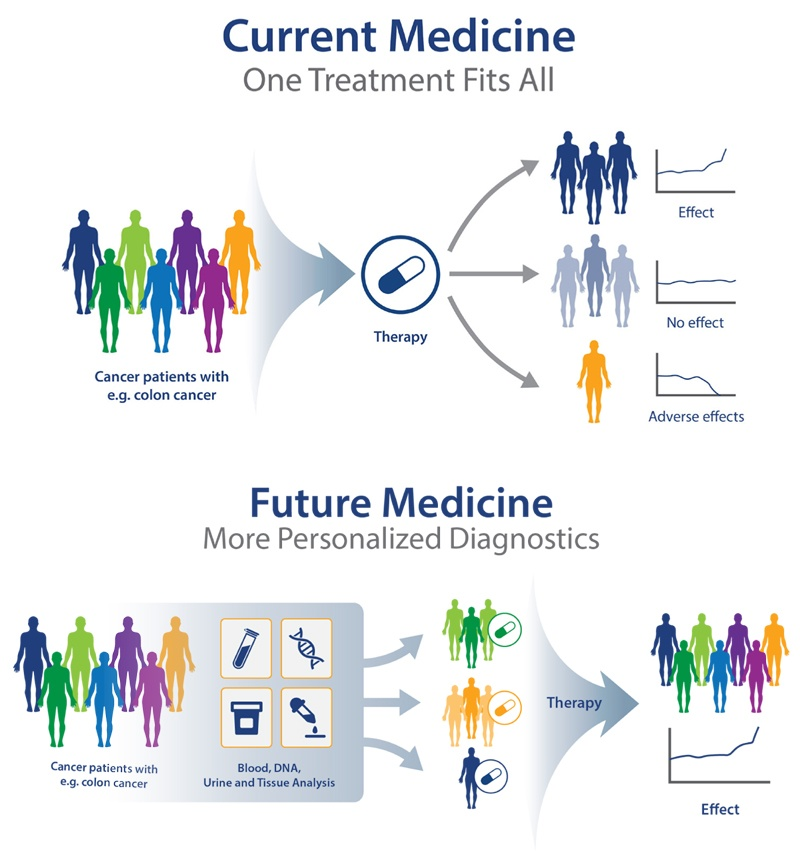
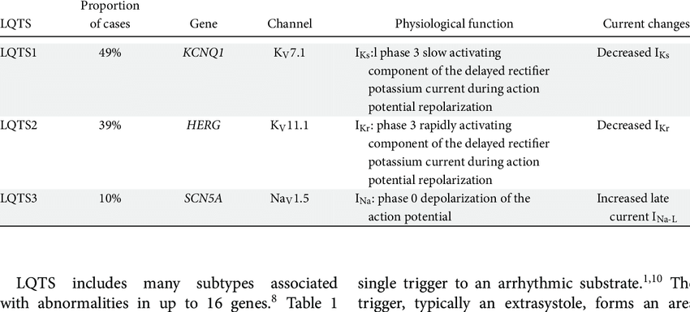
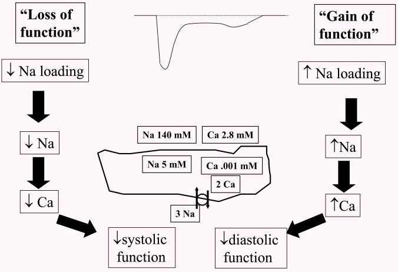
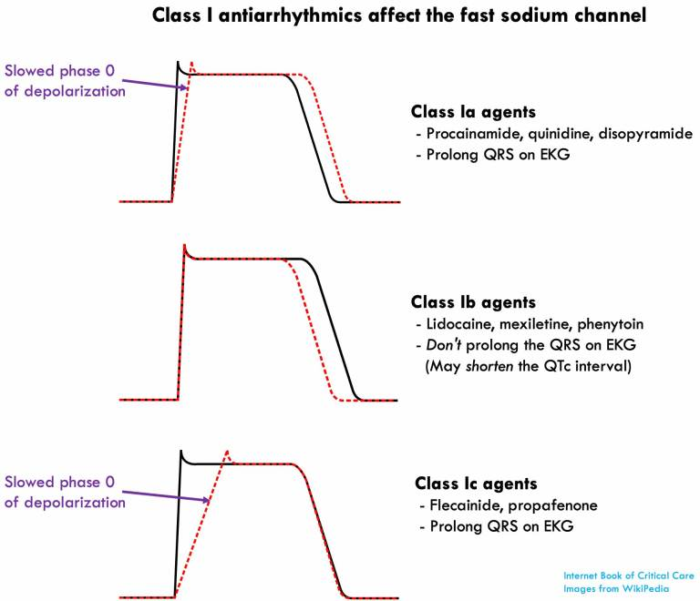

# Precision Medicine and Long QT Syndrome
## Overview
1. What is precision medicine
2. Long QT Syndrome
3. Different types of Long QT Syndrome caused by the mutant of differnt gene
4. Mechanism of LQTS3
5. Precision medicine for LQTS3

## 1. What is precision medicine
Precision medicine is a new type of medicine that utilizes people's genes to prevent, diagnose and treat disease. In contrast to traditional treatment which treats patients with same disease together, precision medicine will include patient's gene, environment as well as lifestyle to provide a more personalized treatment for a cluster of patient that share the same causes of disease. 

credit: https://blog.crownbio.com/pdx-personalized-medicine

@Author Jody Barbeau, PhD. &ensp; PDX and Personalized Medicine 

## 2. Long QT Syndrome

Long QT syndrome (LQTS) is heart signaling disorder elongating relaxing period(QT interval) of heart after each heartbeat. The electrocardiogram below shows a longer interval between Q wave and T wave of LQTS patient compare to normal person. Such disease may cause syncope, dizziness palpitations and even sudden cardiac death. Though showing similar symptom, LQTS may cause by multiple reasons and thus classified by corresponding gene types. 

credit:https://www.washingtonhra.com/wp-content/uploads/2015/05/Long-QT-collage.jpg

@Author Washington Heart Rhythm Associates

In 1970s, the correlation between LQTS symptoms and long QT interval on electrocardiogram is discovered, and some imprecision therapy like beta-blocker is also applied during this period. Then, in 1990s, accompanied by genetic field breakthrough, scientists found close relationship between certain genes and LQTS, making a foundation of today’s precision therapy of LQTS(Peter J Schwartz, 2021).

## 3. Different types of Long QT Syndrome

There are 15 types Long QT Syndrome (LQTS) which are led by mutations of 15 different ion channel genes. The three major types of LQTS that take up more than 90% of LQTS are LQTS1, which is led by mutation of the KCNQ1 gene (40%-45%), LQTS2, which is led by the mutation of the KCNH2 gene (40%-45%) and LQTS3, which is led by the SCN5A gene(5%-10%). (Saadeh, 2020)

credit:https://www.researchgate.net/publication/342754643_Targeting_the_b-adrenergic_receptor_in_the_clinical_management_of_congenital_long_QT_syndrome

@Author Saadeh et al.  &ensp; Targeting the β‐adrenergic receptor in the clinical management of congenital long QT syndrome

Among the three types of LQTS, LQTS3 is considered as the most lethal type of LQTS. Comparing to LQTS1 and LQTS2, patients with LQTS3 will have the longest QT interval which suggests the patients' heart system take the longest time to recharge between beats. This gives the patient the highest possibility to suffer from arrhythmias.(Saadeh, 2020) 

## 4. Mechanism of LQTS3
The mutant of SCN5A gene (LQTS3) is in charge of cardiac sodium ion channal, which is the most significant difference between the mutant of KCNQ1 gene (LQTS1) and mutant of KCNH2 gene (LQTS2) which are in charge of the cardiac potassium ion channel (Makielski, 2015).

credit: https://www.ncbi.nlm.nih.gov/pmc/articles/PMC4454281/figure/F3/
@Author Makielski &ensp; “Late sodium current: a mechanism for angina, heart failure, and arrhythmia” 

Late sodium current uses the stored energy in sodium gredient to take calcium out of the cell against calcium gredient. The gain-of-function mutant SCN5A will increase late sodium current and which, as the figure shows, increases sodium. This leads to the decrease of the force that remove Calcium from the cell and accumalates too much intracellular calcium ion. This destorys the homeostasis and leads to arrhythmia. (Makielski, 2015)

## 5. Precision medicine for LQTS3
Known that LQT3 is caused by excessive late Na+ current, the precision medicines mainly function as sodium channel blocker. There are three major types of sodium channel blocker, their mechanism in reliving LQTS is shown on the Action Potential diagram below.

credit: https://i0.wp.com/emcrit.org/wp-content/uploads/2016/12/nablockers.jpg?resize=768,660&ssl=1
@Author Josh Farkas  &ensp; Sodium Channel Blocker Toxicity

Mexiletine is a non-selective sodium channel blocker, belonging to class Ib. Mexiletine blocks the rapid inward Na+ current responsible for phase 0 of cardiac Action Potential(Pérez-Riera AR, 2017) . By reducing the rate of depolarization of the cardiac action potential, mexiletine shorten the patients’ QT interval and thus reduce the life-threatening arrhythmic event of LQT3.

Ranolazine as a comparatively new medicine applied to LQT3, is classified to class Id sodium channel blocker, because it blocks late sodium currents found during phase 2, which leads to a delay in the activation of repolarizing potassium channels in phase 3(Richard E. Klabunde, 2022).Ranolazine specialized to a certain type of LQT3 caused by the mutation called LQT3-Delta KPQ, which is a cysteine on SCN5A was substituted for a highly-conserved tyrosine. Ranolazine can bind to the structure of such mutation near  the cytoplasmic entrance of channel pore and thus block the channel(Pérez-Riera AR, 2017).

## Reference
Peter J Schwartz, 1970–2020: 50 years of research on the long QT syndrome—from almost zero knowledge to precision medicine, European Heart Journal, Volume 42, Issue 11, 14 March 2021, Pages 1063–1072, https://doi.org/10.1093/eurheartj/ehaa769

Saadeh, Khalil, et al. “Targeting the β‐Adrenergic Receptor in the Clinical Management of Congenital Long QT Syndrome.” Annals of the New York Academy of Sciences, vol. 1474, no. 1, 2020, pp. 27–46., https://doi.org/10.1111/nyas.14425. 

Makielski, Jonathan C. “Late Sodium Current: A Mechanism for Angina, Heart Failure, and Arrhythmia.” Trends in Cardiovascular Medicine, vol. 26, no. 2, 2016, pp. 115–122., https://doi.org/10.1016/j.tcm.2015.05.006. 

Pérez-Riera AR, Barbosa-Barros R, Daminello Raimundo R, da Costa de Rezende Barbosa MP, Esposito Sorpreso IC, de Abreu LC. The congenital long QT syndrome Type 3: An update. Indian Pacing Electrophysiol J. 2018 Jan-Feb;18(1):25-35. doi: 10.1016/j.ipej.2017.10.011. Epub 2017 Oct 31. PMID: 29101013; PMCID: PMC5840852.

