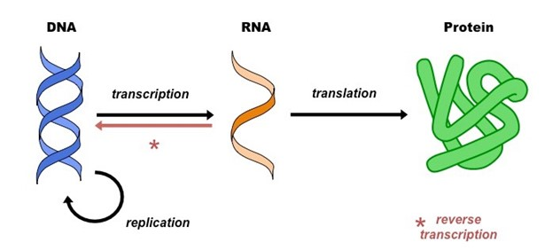
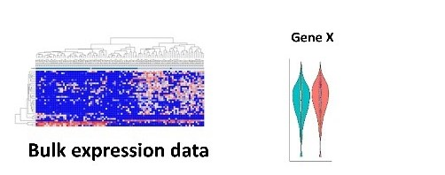
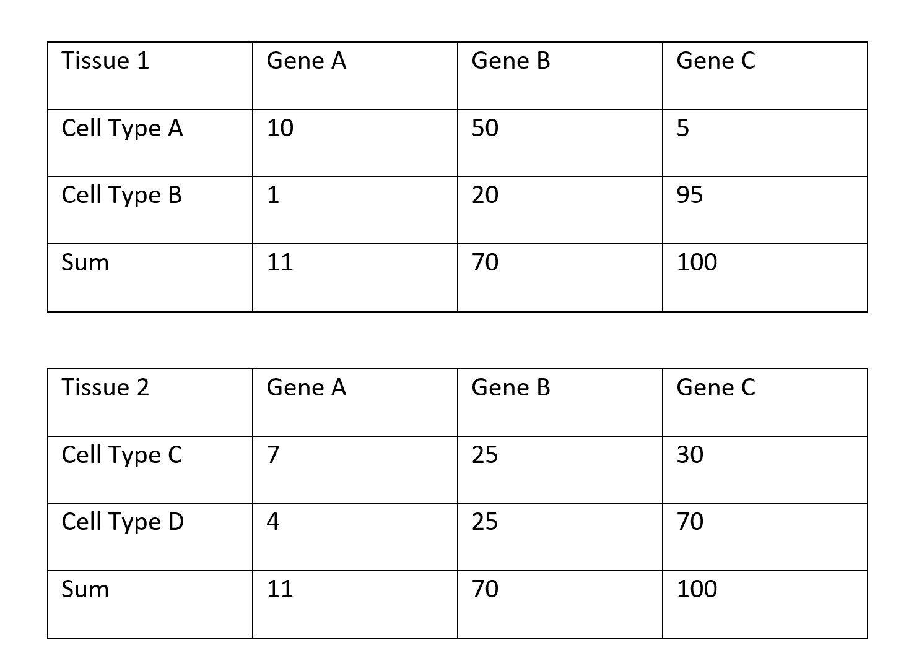
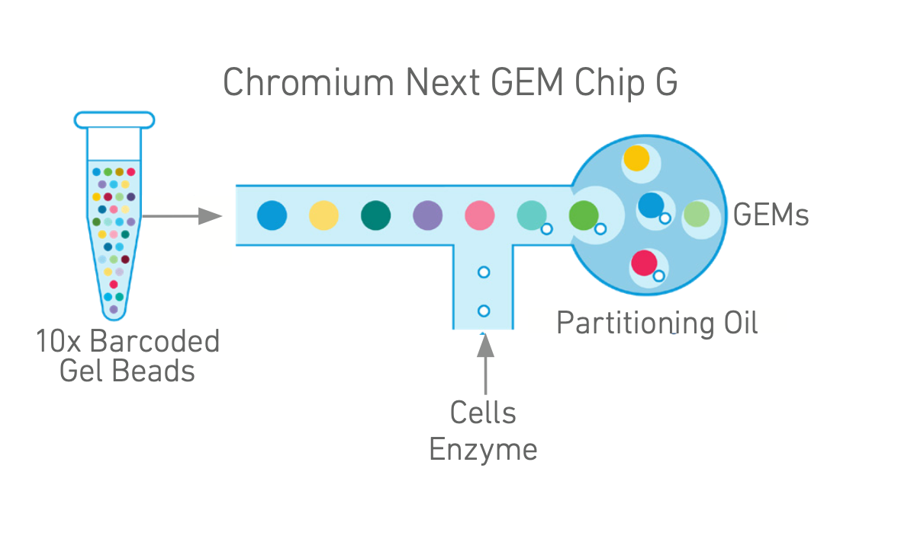
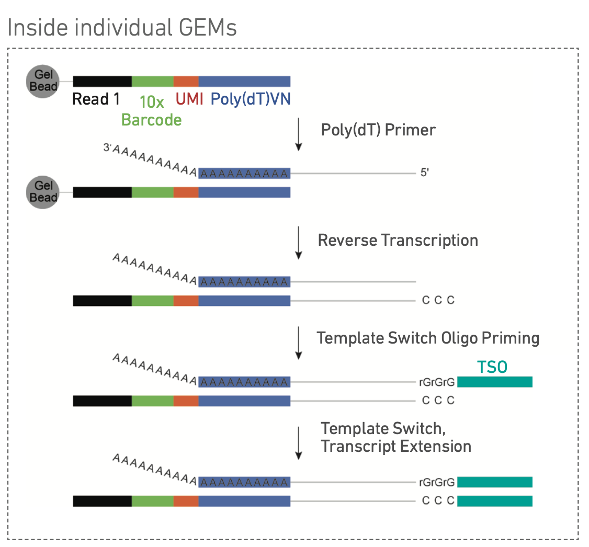
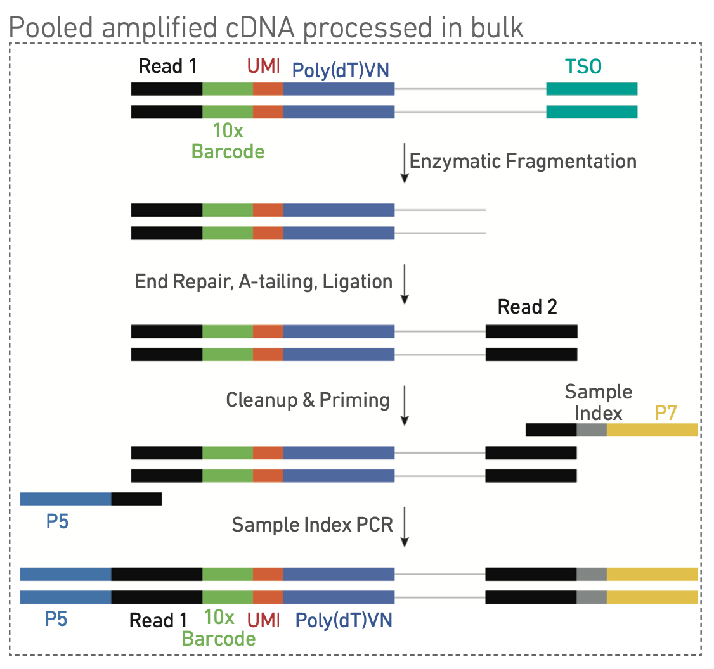
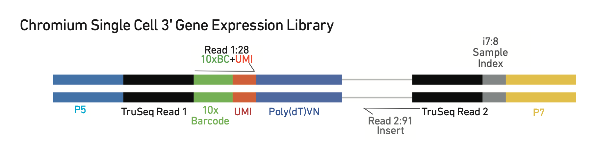

# Bulk RNA-seq and scRNA-seq
###### By: Bryce Henroid, Qilin Zhao, and Sakeef Sayeed | Team 3

## Bulk RNA Sequencing
### Why do we care about RNA expressions?
All life on earth, from plants that generate oxygen to your dog, uses DNA as the blueprint of various biological functions. From fighting invading pathogens to reproduction, DNA is crucial in all these processes. However, DNA cannot function directly to execute such processes. The functional molecule in life is protein. Unlike DNA, which is made of four different nucleotides, protein is made of twenty different amino acids. The diversity of amino acids and the structural arrangement of these amino acids allow proteins to perform various chemical reactions. Therefore, to understand how cells and organisms function, it is important to know which proteins are expressed, where proteins are expressed, and to what quantity the proteins are expressed.

However, it is very difficult to measure protein expressions in a cell. Using techniques such as western blot and immunohistochemistry, we can measure expression levels of a few proteins. However, it is very difficult to know the total number of proteins and their corresponding quantities in a cell. Luckily, nature offers us an intermediate between DNA and protein to help us gene expression. Ribonucleic acid, RNA, is the intermediate step in the information flowing from DNA to protein. From DNA, cells make RNAs through the process of transcription. Using the generated RNA, the cell then makes proteins through translation. This process from DNA to RNA to protein is called the central dogma and is the foundation of all lives we know. By measuring the level of RNA in the cell, we can have an estimation of how much each of the protein (gene) is expressed.

###### Figure 1: Central Dogma. (Gillings, M, 2013)

Besides its importance in the central dogma, RNA can also have important regulatory functions in lives. siRNA and miRNA are important for regulating gene expression; rRNA is the backbone of the ribosome; some RNAs can also act as enzymes to catalyze reactions. RNA is also much easier to sequence than protein as well. Since RNA is made of nucleotides like DNA, they can form complementary pairs with each other. The discovery of reverse transcriptase also allows the conversion of RNA to its complementary DNA and then perform DNA sequencing. All these attributes make RNA an ideal candidate for understanding gene expression in the cell and make RNA sequencing one of the most important techniques in modern molecular biology.

### Bulk RNA sequencing: eat your veggies like a smoothie
The first technology developed in an attempt to sequence all RNA copies in a cell is bulk RNA sequencing. The technique takes cells/tissues of interest and then lyses the cells within. Then, we remove unwanted molecules in the mixture such as DNA and proteins. Then, using reverse transcriptase, we can convert the RNAs into their complementary DNAs. The collection of cDNAs from a sample is called a library which contains information of all RNAs. Using DNA sequencing, we can then know the sequence of each cDNA in the library and the complementary RNA expressed in the sample. With computational tools, we can align the sequences we get to specific regions on the genome to understand how each gene/genomic region is expressed in the cells/tissues.

###### Figure 2: Process for bulk RNA sequencing. (Dmitry Velmeshev, 2019)
Bulk RNA is undeniably a powerful technique and is very important to understand gene expression. With this technique, we can compare expression profiles of samples treated with different conditions. We can also quantify how much of certain genes are expressed in the sample. However, this technique does have limitations. The experiment is like making a smoothie. You take different fruits and vegetables you like and blend them together. In the end, rather than getting the flavors of each ingredient, you get a mixed flavor of all of them. The same principle is true for bulk RNA sequencing. Inside tissue or cell culture, there could be multiple types of cells. Each cell might have a different expression profile of all the genes, like each fruit and vegetable have different flavor. By mixing them together, you cannot taste each ingredient by itself. For bulk RNA sequencing, the result is a gene expression quantification of all cells in the sample. We will not know how genes are expressed specifically within each cell.

###### Figure 3: Data collected by bulk RNA sequencing. (Dmitry Velmeshev, 2019)
This is a major limitation for bulk RNA sequencing. Most tissues are heterogeneous and contain different cell types. For instance, in the eye, there are epithelial cells that make the blood vesicle; there are rod cells to sense light; and there are nervous cells to transduce information from the eye to the brain. Each type of cell expresses genes differently, and by blending all these different types of cells together, we can only get the average of each gene expressed in all these cells. This problem can be demonstrated by a simple illustration:

###### Figure 4: Example of gene expressions in tissues. (Made by Qilin)

The example above shows two tissues with expression of three genes. For each cell type in the tissues (A, B, C, D), when we blend them together, the total number of copies of genes in the two tissues are the same despite the difference in cell type. This is a major problem for people who want to know how genes are expressed in certain types of cells in the tissue. Since bulk RNA sequencing cannot achieve this task, scientists developed the next generation of RNA sequencing technology called single-cell RNA sequencing.

## Single-Cell RNA-sequencing

### Overview

Bulk RNA-sequencing has proven to be a technology that provides an accurate, albeit average, view of the transcriptional landscape inside samples of interest. However, research over the past decades has progressed the understanding that complex biological systems are more specifically composed of many individual cells each playing a unique role and concerting their functions to generate the complexity we see inside living organisms. As a result, the limitations of traditional bulk RNA-sequencing technologies quickly became obvious, and concordantly came the genesis of single-cell RNA-sequencing.

Single-cell RNA-sequencing (scRNA-seq) enables researchers with the ability to analyze transcriptomes on a cell-by-cell basis. Microfluidic partitioning is used to capture single cells, which are subsequently used to create next-generation barcoded sequencing libraries. Through the interrogation of single-cell transcriptional profiles, researchers can unravel the cellular diversity of complex samples to 1) discover novel cell types and/or states; 2) gain insight into the cellular processes driving diseases and development; 3) understand the mechanisms behind cellular responses or resistance to therapeutic treatments1.
### Workflow

The workflow for preparing single-cell RNA-sequencing libraries, in particular using 10x Genomics’ scRNA-seq sample preparation kit (Chromium Next GEM Single Cell 3’ Reagent Kit v3.1)2, can be briefly divided into the following steps:
1. **Gel Bead-in-emulsion (GEM) Generation & Barcoding** 
   
   a) GEM generation begins with loading the following onto the Chromium Next GEM Chip G: Barcoded single cell 3’ v3.1 gel beads, Master mix containing single cells at an appropriate dilution, and Partitioning oil.

   b) The loaded Chromium Next GEM Chip G is inputted into a Chromium Controller, where a single cell and GEM are passed by one at a time. With each cell that is passed through, a GEM simultaneously passes through, in a manner that ensures each GEM gets loaded with a single cell.
   * i) To ensure single-cell resolution, cells are delivered at a dilution in the Chromium Controller such that ~90-99% of the GEMs that are generated contain no cells, and the remaining majority contain only a single cell.
   
   * 

     ###### Figure2 5: Depiction of how GEMs are generated inside the Chromium Controller— a critical step in attaining single-cell resolution. Single cells are passed in through one entry, 10x barcoded gel beads are passed through another entry, and the two combine to produce a gel bead-in-emulsion i.e. a GEM. Each GEM contains thousands of copies of the same barcode which are ultimately attached to all the mRNA molecules released from the single cell contained within the GEM, as well as reverse transcription reagents used to reverse transcribe the mRNA molecules into cDNA molecules.
        
        c) Following GEM generation, gel beads are dissolved, any co-partitioned cells are lysed, and primers containing the following: 
        * i) Illumina TruSeq Read 1 (a read 1 sequencing primer) 
        * ii) 16 nucleotide 10x Barcode 
        * iii) 12 nucleotide unique molecular identifier 
        * iv) 30 nucleotide poly(dT) sequence
      
        are mixed with the cell lysate and reverse transcription reagents. Incubation of the above generates full-length cDNA strands that are barcoded from poly-adenylated mRNA.
        
   * 

     ###### Figure2 6: Depiction of how cDNA molecules are generated from the barcoded mRNA molecules contained within each GEM. As seen, the same 10x barcode is attached to each mRNA molecule that is released from a cell, along with a unique molecular identifier and a poly(dT) tail. Each of these mRNA molecules is then reverse transcribed using the reverse transcription reagents already present within each GEM to produce a full-length non-amplified barcoded cDNA library.

2.	**Post GEM-RT Cleanup & cDNA Amplification** 

    a) After generating the full-length cDNA library, GEMs are broken, and fractions are recovered.
   
    b) Silane magnetic beads (also referred to as Dynabeads) are subsequently used to purify full-length cDNA from the fractions that include leftover biochemical reagents and primers from the conclusion of Step 1. 
   
    c) The full-length barcoded cDNA strands are then amplified using polymerase chain reaction (PCR) to produce sufficient cDNA strands for the construction of a cDNA library.
    * 

     ###### Figure2 7: Purified full-length barcoded cDNA molecules are pooled once GEMs are broken and subsequently amplified via polymerase chain reaction (PCR) to produce an amplified library containing solely full-length barcoded cDNA molecules.

3.	**3’ Gene Expression Library Construction**

    a) All cDNA from the amplified library containing full-length barcoded cDNA is enzymatically fragmented and subsequently undergoes size selection to optimize the size of fragmented cDNA used to generate the final (to be sequenced) cDNA library.
   
    b) P5, P7, a sample index, and TruSeq Read 2 (a read 2 primer sequence) are then added using End Repair, A-tailing, Adaptor Ligation, and PCR.
    * i) The P5 and P7 primers are notably used in the bridge amplification process run in Illumina sequencers. 

    * 
     
     ###### Figure2 8: Pooled full-length barcoded cDNA molecules are processed in bulk where they are enzymatically fragmented and have the appropriate primers attached to ultimately produce a cDNA library compatible for subsequent sequencing using standard next generation sequencers— compatible sequencers are more specifically identified below.

4.	**Sequencing**

    a) Sequencing Libraries
    * i) Sequencing the single cell 3’ gene expression libraries generated through the use of 10x Genomics’ Chromium Next GEM Single Cell 3’ Reagent Kits v3.1 produce a standard Illumina BCL data output folder. 
   
    * 

      ###### Figure2 9: The generated library begins and ends at the standard P5 and P7 Illumina paired-end constructs. Read 1 encodes the 16-base pair 10x barcode and 12-base pair unique molecular identifier. Read 2 is used for the sequencing of the corresponding cDNA fragment. Samples indices are encoded by the sample index sequence. Finally, TruSeq Read 1 and 2 are standard Illumina sequencing primer sites that are used in Illumina’s paired-end sequencing. 

    b) Illumina Sequencer Compatibility
    * i) The following Illumina sequencers have been verified to be compatible with the libraries produced using 10x Genomics’ Chromium Next GEM Single Cell 3’ Reagent Kits v3.1:
           1) MiSeq;
           2) NextSeq 500/550; 
           3) HiSeq 2500 (Rapid Run);
           4) HiSeq 3000/4000; 
           5) NovaSeq

    c) 3’ Gene Expression Library Sequencing Depth & Run Parameters
    * i) The following outlines the parameters 10x Genomics recommends running sequencing at:
           1) Sequencing Depth: Minimum 20,000 read pairs per cell;
           2) Sequencing Type: Paired-end, single indexing;
           3) Sequencing Read: Recommended number of cycles;
               3.i) Read 1: 28 Cycles;
               3.ii) i7 Index: 8 Cycles;
               3.iii) i5 Index: 0 Cycles;
               3.iv) Read 2: 91 Cycles

### How Single Cell Resolution is Achieved

Described above was the workflow for generating scRNA-seq data, but it is important that we highlight the particular steps that lead to single-cell resolution compared to the results produced through bulk RNA-seq. Notably, depicted above was the generation of GEMs. Specifically, the GEMs are the key to producing single-cell resolution as they isolate each cell in the sample from each other, and enable the barcoding of all mRNA molecules that arise from a single cell with the same barcode.  Since all the mRNA molecules, and eventually, the cDNA molecules produced through reverse transcription, from a single cell are isolated inside a GEM and barcoded with the same barcode, researchers post-sequencing can tell that a particular set of reads came from a particular cell as all the reads share a common 10x barcode. But again, without the isolation of single cells into GEMs, you would not be able to barcode all the mRNA molecules produced within a single cell with the same barcode, which is key to attaining single-cell resolution. This step is notably not present in bulk RNA-sequencing workflows, which explains why you are only able to get sample resolution when using bulk RNA-sequencing, and not single-cell resolution.

## Types of scRNA-seq Data Analysis
### Basic Pipeline for Analyzing Data
The final output of scRNA-seq data is a huge matrix composed of cells in the rows and genes in the columns, with counts for every gene in every cell. This is a huge amount of data, and visualizing the data is not possible in its raw form. As such processing of the data must be done before visualization can occur. First this is done by filtering out cells with a high percentage of mitochondrial genes in their cytoplasm, since this is associated with dead cells. In essence, by filtering out the mitochondrial genes, we are helping to eliminate the dead cells from out sample. Next the data is normalized and many times logarithmized to account for differences between cells and make comparisons easier. Following this, clustering is usually performed (not shown in the pipeline below), which enables comparisons in gene expression to be made between clusters of cells by finding the highly variable genes present in. Clustering involves using an algorithm such as leiden or k-means, which identifies similarities in cell types.  Lastly, scRNA-seq data is scaled and irrelevant/confounding variables are regressed out. Then, meaningful calculations can be made to 1. Understand gene expression at the cellular level between groups and 2. Identify cell types.

###### Figure 10: A typical pipeline for filtering scRNA-seq data (Note: clustering is not shown but is a crucial part of the pipeline). (Diagram by Bryce Henroid)
### 2D Clustering Graphs

tSNE and UMAPs are both important plots in analyzing scRNA-seq data. They both work by projecting  n by m (cell by gene) expression count data on a 2-D plane. T Stochastic Neighborhodd Embedding (tSNE) is an older method that allows for the visualization of scRNA-seq data in 2-D. UMAP is a newer algorithm that is similar to tSNE in that it also projects differences in gene expression of cells onto a 2-D plot, but it’s visualization more accurately represents these differences thant tSNE.

###### Figure 11: Example of a tSNE Plot. This is a 2-D projection of the single cell RNA-sequencing data. This is done because there are nearly 30000 genes in the RNA-sequencing data, it’s impossible for us humans to visualize this. Each dot on the plot indicates a cell, with 2 labels shown to identify the wild-type and knock-down cell types, which might occur in an experiment where the we might want to determine the differences in gene expression between a control and experimental group. (Diagram by Sakeef Sayeed)

###### Figure 12: Example of a UMAP Plot... This is a  also 2-D projection of the single cell RNA-sequencing data. This is done because there are nearly 30000 genes in the RNA-sequencing data, it’s impossible for us humans to visualize this. Each dot on the plot indicates a brain cell type, which has been identified in a separate, in-depth process using a supervised machine learning neural network algorithm. Both the x and y dimensions are two different UMAP dimensions to help visualize the differences in the data.

### Heatmaps
Often scientists with to understand gene expression differences between clusters. Onces these clusters have been identified (such as using kmeans or leiden clustering), a visualization, such as a heatmap can be made to help determine the relative gene expression of various genes of interest across clusters.

###### Figure 13: Example of a heat map. The x-axis shows a list of highly variable genes of interest while the y-axis shows different clustering groups. The brighter the box, the more a gene is expressed in a group relative to the others; the darker the box, the less expressed it is compared to the other groups. (Diagram by Bryce Henroid)

### Identifying Cell Types

One of the main goals of scRNA-seq is to identify cell types. This is crucial to understanding disease because the different cells and their change over time play a key role in the development of so many diseases.  There are three main ways of identifying cell types: marker genes, machine learning, and experimental validation. In the dry lab with a large scRNA-seq data matrix, only the first two methods can be done. Marker genes are specific genes whose presence is usually only found in a particular cell type. As an example, GAD67 is a common gene present only in GABAergic neurons, so a relatively high expression of this gene would classify it as a GABAergic neuron. However, marker genes may not always be effective on their own in identifying cell types. This is because 1 or a few marker genes may not be unique enough to identify the cell as a particular type. Additionally, more complex and less obvious methods must be used to identify cell types, such as machine learning. Machine Learning is becoming an increasingly more common approach to identifying cell types, whose patterns of gene expression are hard to accurately predict from 1 or a few marker genes. Machine Learning, such as knearest neighbor and neural networks are being utilized to create models of cell types based off scRNA-seq gene expression data. Of course this requires training and testing to ensure the model performs accurately. A main downside of machine learning is the fact that how it got the results is unknown. While we can get an idea of the effects of certain genes on the cell type label by looking at the model’s feature weights, the relevance of gene expression on cell types in machine learning is largely a black box.

###### Figure 14: An example of a SCANVI machine learning tool and how it works to train and predict cell types using raw scRNA-seq data counts. (Lotfollah)

###### Figure 15: Example of training a machine learning model to predict cell types from scRNA-seq data. (Diagram by Bryce Henroid)

# Acknowledgements

We thank the BENG 183 Fall 2022 instructional staff for their help and support. 

# Citations

1. “Grant Application Resources - Chromium Single Cell Gene Expression.” Grant Application Resources - Chromium Single Cell Gene Expression - 10X Genomics, www.10xgenomics.com/resources/document-library/26fdb0. 

2. “Library Construction - Official 10X Genomics Support.” 10x Genomics, www.10xgenomics.com/support/single-cell-gene-expression/documentation/steps/library-prep/chromium-single-cell-3-reagent-kits-user-guide-v-3-1-chemistry.

3. Ilicic, Tomislav et al. “Classification of low quality cells from single-cell RNA-seq data.” Genome biology vol. 17 29. 17 Feb. 2016, doi:10.1186/s13059-016-0888-1 

4. Gillings MR, Westoby M. DNA technology and evolution of the Central Dogma. Trends Ecol Evol. 2014 Jan;29(1):1-2. doi: 10.1016/j.tree.2013.10.001. Epub 2013 Oct 19. PMID: 24148293.
