# Hi-C: Workflow and Data Analysis

BENG 183 Fall 2022 Final Paper

Group 4: Harshita Saha, Jordan Burkhardt, Carlos Garcia Padilla

---
## Table of Contents:

This paper will provide details on the biological context of Hi-C, the workflow process, and an overview of Hi-C Data Analysis. 

The different sections of the paper are listed and linked below for easy navigation:

- [Genome Organization](#genome-organization): 
  - [Chromosome Territories](#chromosome-territories)
  - [Chromatin Compartments](#chromatin-compartments)
  - [Topologically Associating Domains](#topologically-associating-domains)
  - [Chromatin Loops](#chromatin-loops)
  - [Purpose of Hi-C](#purpose-of-hi-c)

- [Hi-C Workflow](#hi-c-workflow):
  - [Overview](#overview)
  - [Cross Linking](#cross-linking)
  - [Digestion](#digestion)
  - [Biotinylation and Ligation](#biotinylation-and-ligation)
  - [Reverse Crosslinking, Sonication, and Biotin Removal](#reverse-crosslinking-sonication-and-biotin-removal)
  - [Biotin Pulldown](#biotin-pulldown)
  - [Ligation of Adapters and Amplification](#ligation-of-adapters-and-amplification)
  - [Comparison of Hi-C workflow to 3C and 4C](#comparison-of-hi-c-workflow-to-3c-and-4c)

- [Hi-C Data Analysis](#hi-c-data-analysis):
  - [Data Setup](#data-setup)
  - [Chromosome Territories](#chromosome-territories-1)
  - [A/B Compartments](#ab-compartments)
  - [TADs](#tads)
  - [Chromatin Loops](#chromatin-loops-1)

- [Additional Resources](#additional-resources)
- [References](#references)

---
## Genome Organization: 

In order to understand Hi-C, we must give context for the technology.

Because Hi-C aims to analyze the organization of the genome, we will first talk about genome organization. 

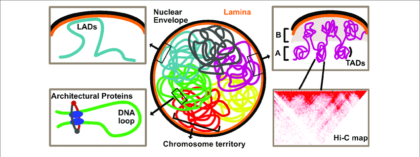

###### Image Source [[1]](#spatial-genome-organization-from-development-to-disease-frontiers-in-cell-and-developmental-biology-718)

#
### Chromosome Territories: 
#

At the highest level, chromatin is organized in the nucleus such that each chromosome occupies its own subspace, known as chromosome territories. 

Chromatin from each chromosome tends to be grouped in its own spatially distinct area, and DNA from each chromosome tends to interact with other loci within the chromosome, more frequently than with loci external to that chromosome. [[2]](#comprehensive-mapping-of-long-range-interactions-reveals-folding-principles-of-the-human-genome-science-3265950-289-93)[[4]](#3d-genome-from-technology-to-visualization).

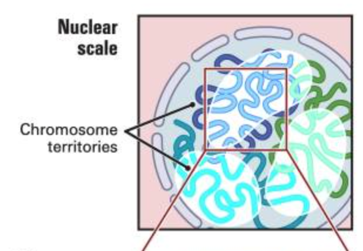

###### Image Source [[2]](#comprehensive-mapping-of-long-range-interactions-reveals-folding-principles-of-the-human-genome-science-3265950-289-93)

#
### Chromatin Compartments:
#

Across the entire nucleus, chromosomes have regions with more open or closed chromatin [[11]](#reconstructing-ab-compartments-as-revealed-by-hi-c-using-long-range-correlations-in-epigenetic-data-genome-biology-180).

A compartments are those that are more open, gene-rich, and have higher transcription levels. These regions are more active, and are associated with euchromatin. 

B compartments are those that are more closed, gene-poor, and have lower transcription levels. These regions are more inactive, and are associated with heterochromatin. These tend to exist closer to the lamina or the periphery of the nucleus, but can also exist further within the nucleus. 

A compartments tend to interact with A compartments, while B compartments tend to interect with B compartments [[11]](#reconstructing-ab-compartments-as-revealed-by-hi-c-using-long-range-correlations-in-epigenetic-data-genome-biology-180).

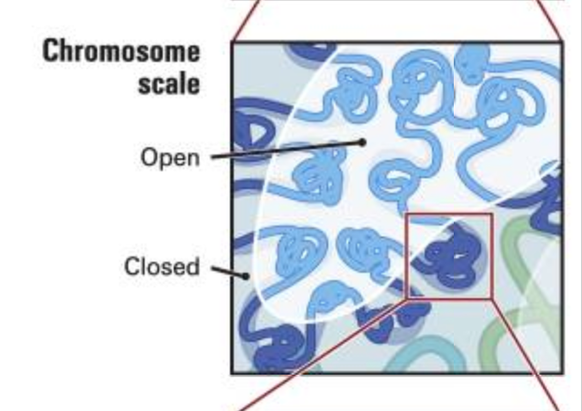

###### Image Source [[2]](#comprehensive-mapping-of-long-range-interactions-reveals-folding-principles-of-the-human-genome-science-3265950-289-93)

#
### Topologically Associating Domains:
#

Focusing on chromosomes, we see TADs, Topologically Associating Domains. These self-interacting subunits are on the scale of a million base pairs, and regions within a TAD mutually display spatial proximity within each domain [[4]](#3d-genome-from-technology-to-visualization). 

TADs are usually associated with more active genes, and regions within a TAD interact with each other more frequently than they do with regions outside the TAD [[12]](#organization-and-function-of-the-3d-genome-nature-reviews-genetics-17-661–678). 

###### Image Source [[12]](#organization-and-function-of-the-3d-genome-nature-reviews-genetics-17-661–678)

#
### Chromatin Loops:
#

On an even closer level, we see chromatin loops, which are protein or protein-complex mediated associations of two genomic loci, formed when proteins binds loci on a DNA strand simultaneously.

These structures are linked to the regulation of transcriptional processes, and engage in activation or repression depending on the location of loop formation. [[2]](#comprehensive-mapping-of-long-range-interactions-reveals-folding-principles-of-the-human-genome-science-3265950-289-93)[[12]](#organization-and-function-of-the-3d-genome-nature-reviews-genetics-17-661–678). 

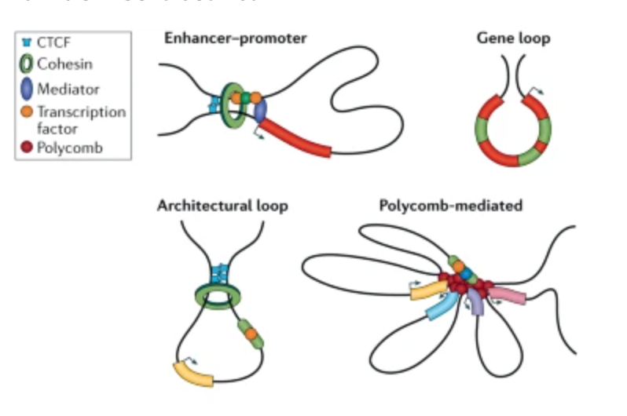

###### Image Source [[12]](#organization-and-function-of-the-3d-genome-nature-reviews-genetics-17-661–678)

#
### Purpose of Hi-C:
#

There are many different technologies that can be used to investigate genome organization on a genomic level.

Locus-landmark technologies focus on genomic interactions with fixed or stable nuclear regions, such as DNA associated with the lamina, and technologies used for this include Chip-seq, ATAC-Seq, and Dam-ID. 

ChIP-seq isolates fragments of DNA associated with histone modifications and transcription factors by using magnetic antibodies specific to these proteins. In ATAC-seq, accessible regions DNA are cut by transposase and adapters are added allowing the sequence of genome wide accessible chromatin. In DamID, the Dam protein fuses to the protein of interest. 

Although those technologies probe DNA sequences associated with proteins, we need to understand the way DNA interacts with other DNA molecules to understand the true structure of the genome. 

Methods that seek to measure DNA-DNA interactions are known as locus-locus technologies. This includes technologies such as 3C, 4C, ChIA-Pet, and Hi-C [[4]](#3d-genome-from-technology-to-visualization). 

In 3C, chromatin is crosslinked, DNA is fragmented, and then primers are used for two DNA sequences of interest. This allows a one vs. one probing of DNA interactions in the genome [[4]](#3d-genome-from-technology-to-visualization). 

4C is an adaptation of this method which allows for one to many probing of DNA interactions [[4]](#3d-genome-from-technology-to-visualization). 

Although these technologies allow for information about DNA-DNA interactions to be collected, they are limited in scope as there must be specificity for one or both genes in the interaction. 

Hi-C also consists of systematically investigating genomic interactions, but is all vs all, which means that it can detect all interactions between genomic loci, at a genome-wide level. It is specifically capable of looking at the tertiary level of genome organization, ranging from ten thousand to a million base pair scale. This includes chromosome territories, compartments, TADs, and chromatin loops. 

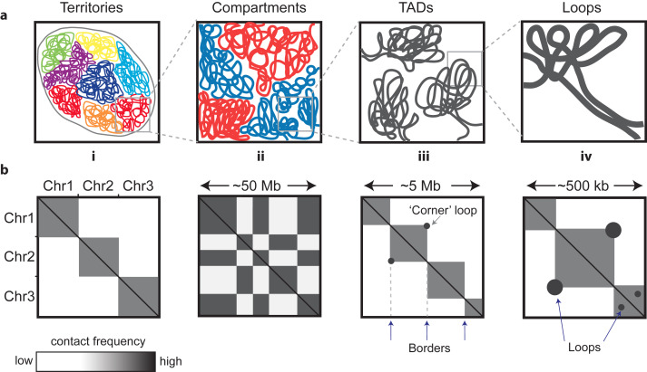

###### Image Source [[13]](#defining-functionally-relevant-spatial-chromatin-domains-it-is-a-tad-complicated-journal-of-molecular-biology-4323653-664)

---
## Hi-C Workflow:

### Overview: 
#

The Hi-C workflow follows these steps. 

First the DNA is crosslinked to keep DNA-DNA interactions in place. Then the DNA is digested and the sticky fragment ends are filled in and biotinylated. The now blunt ends of the crosslinked fragments are then ligated to each other, and exonucleases are used to remove biotin from unligated DNA strands. Then crosslinks are reversed, DNA is fragmented, and biotin containing strands are pulled down. [[2]](#comprehensive-mapping-of-long-range-interactions-reveals-folding-principles-of-the-human-genome-science-3265950-289-93).

Each of these steps will be described in further detail below.

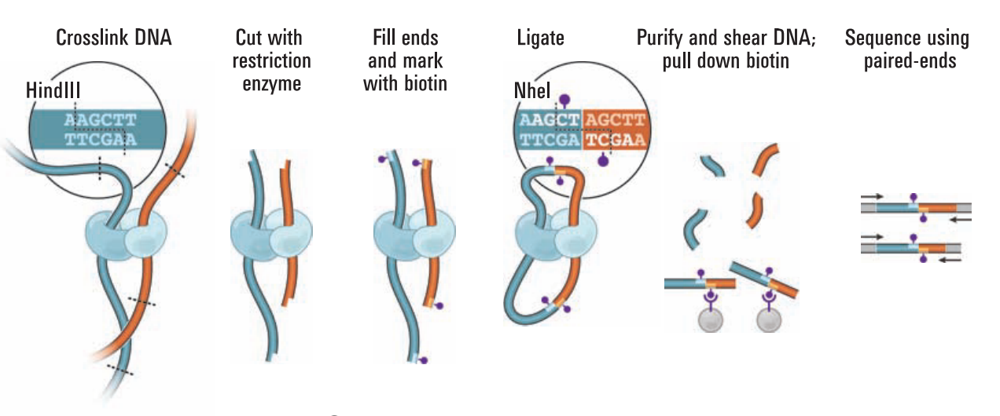

###### Image Source [[2]](#comprehensive-mapping-of-long-range-interactions-reveals-folding-principles-of-the-human-genome-science-3265950-289-93).

#
### Cross Linking:
#

Hi-C follows a similar work-up to the other C methods, however its differences allow for probing all to all interactions. 

Alike 3C, we first crosslink cells with formaldehyde, allowing protein mediated DNA-DNA interactions to be preserved. 

In crosslinking, the carbonyl carbon in formaldehyde is attacked by a strong nucleophile, most often the amino group in the side chain of a lysine residue in the protein, forming a methylol intermediate [[3]](#formaldehyde-crosslinking-a-tool-for-the-study-of-chromatin-complexes-journal-of-biology-and-biochemistry-2904426404-11). Then a schiff base reaction results in the hydrolysis of the methylol group into an imine [[3]](#formaldehyde-crosslinking-a-tool-for-the-study-of-chromatin-complexes-journal-of-biology-and-biochemistry-2904426404-11). A nucleophilic attack between a nucleophile in the DNA molecule and the carbon in the imine occurs producing the crosslinked product [[3]](#formaldehyde-crosslinking-a-tool-for-the-study-of-chromatin-complexes-journal-of-biology-and-biochemistry-2904426404-11). 

###### Image Source [[3]](#formaldehyde-crosslinking-a-tool-for-the-study-of-chromatin-complexes-journal-of-biology-and-biochemistry-2904426404-11)

#
### Digestion:
#

Next DNA must be fragmented. 

In other locus technologies such as ChIP-seq, this can be done through sonication, however in methods like Hi-C and 4C, sticky ends are required for biotinylation. 

To produce sticky ends so that an oligonucleotide with 5’ overhangs can anneal the two DNA molecules, restriction enzymes must be used. At this step, we expect two fragments of interacting DNA with sticky ends both crosslinked to a protein. 

These interacting DNA fragments must next be ligated together, removed from the protein, and isolated from all DNA fragments not involved in a DNA-DNA interaction before sequencing. 

#
### Biotinylation and Ligation:
#

An oligonucleotide adapter that has already been biotinylated is used to fill in the sticky overhanging ends, after which these ends are ligated together. This forms a loop on each side of the protein between the previously sticky ends of the two interacting DNA fragments [[5]](#a-cookbook-for-dnase-hi-c-epigenetics--chromatin-1415). 

These oligonucleotide adapters are biotinylated through the incorporation of Biotin dT, a modified deoxythymidine where the imide of the thymidine has been replaced with the incorporation of a spacer attached to a biotin molecule [[6]](#which-biotin-modification-to-use-integrated-dna-technologies). 

The use of biotin is necessary in this step, as it will allow us to select specifically for fragments displaying DNA-DNA interaction, in conjunction with streptavidin beads. This interaction is further explained in the upcoming Biotin Pulldown step. 

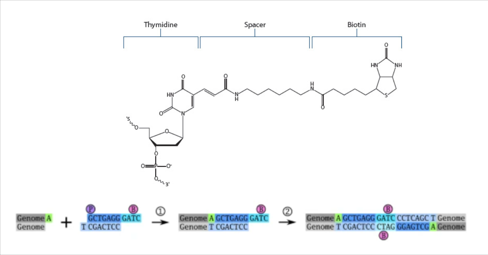

###### Image Source [[5]](#a-cookbook-for-dnase-hi-c-epigenetics--chromatin-1415)[[6]](#which-biotin-modification-to-use-integrated-dna-technologies)

#
### Reverse Crosslinking, Sonication, and Biotin Removal:
#

Now that the two interacting DNA molecules have been ligated together with a biotinylated linker, they must be removed from the protein they are crosslinked to. 

Crosslinking can be reversed [[3]](#formaldehyde-crosslinking-a-tool-for-the-study-of-chromatin-complexes-journal-of-biology-and-biochemistry-2904426404-11) at a temperature around 65°C for 3 hours [[5]](#a-cookbook-for-dnase-hi-c-epigenetics--chromatin-1415) or through sonication [[4]](#3d-genome-from-technology-to-visualization) in Hi-C experiments. 

The biotinylated oligonucleotide linker that annealed interacting DNA together is now positioned in the center of these molecules. 

However, non-interacting DNA fragments were also likely bound by the biotinylated oligonucleotide, with the biotinylated sequences annealed to the ends of these non-interacting DNA. As these unligated DNA fragments are also now biotinylated, we must remove the biotinylation for the upcoming filtration step to be successful. 

To do this, the solution is treated with Klenow Enzyme, which has a 3’ to 5’ exonuclease activity [[5]](#a-cookbook-for-dnase-hi-c-epigenetics--chromatin-1415)[[9]](#hi-c-data-analysis-bootcamp-harvard-medical-school). This property of the exonuclease allows the enzyme to remove base pairs at the 5’ end. As the biotinylated oligonucleotide linker is at this end of unpaired DNA molecules, the biotinylated thymidine base is removed from non-interacting DNA-fragments only. 

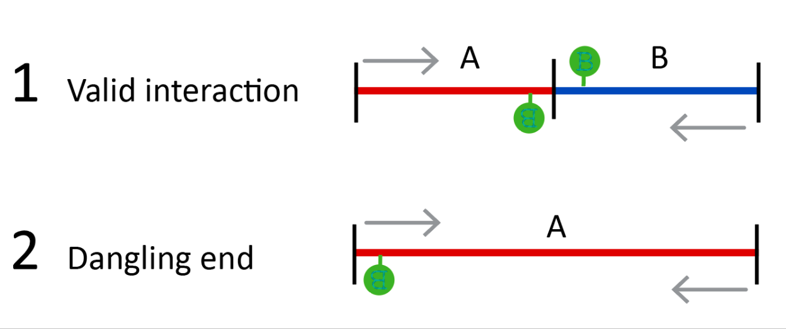

###### Image Source [[9]](#hi-c-data-analysis-bootcamp-harvard-medical-school)[[14]](#hi-c-20-an-optimized-hi-c-procedure-for-high-resolution-genome-wide-mapping-of-chromosome-conformation-pubmed-12356-65)

#
### Biotin Pulldown: 
#

Now to isolate the desired nucleotide polymers from the other genomic fragments, we can use streptavidin beads to pull down the biotinylated DNA fragments, allowing the isolation of only interacting DNA fragments. 

A common chemical biology technique for the purification of proteins, nucleic acids and other molecules from a solution involves the use of the protein-ligand binding of biotin and streptavidin. The active site of the protein streptavidin forms eight hydrogen bonds with biotin, and uses non-polar groups to interact with the molecule through van-der-waals interactions [[8]](#the-origin-of-the-cooperativity-in-the-streptavidin-biotin-system-a-computational-investigation-through-molecular-dynamics-simulations-nature-627190). These interactions, shown below, allow the biotinylated molecules to stay with the streptavidin beads while other molecules are washed away. 

Streptavidin can be purified into beads, and then used to extract molecules bound by biotin from a solution [[10]](#streptavidin-magnetic-beads). Such purification through biotinylation is used in Hi-C to isolate DNA fragments involved in DNA-DNA interactions from the rest of the genomic fragments.

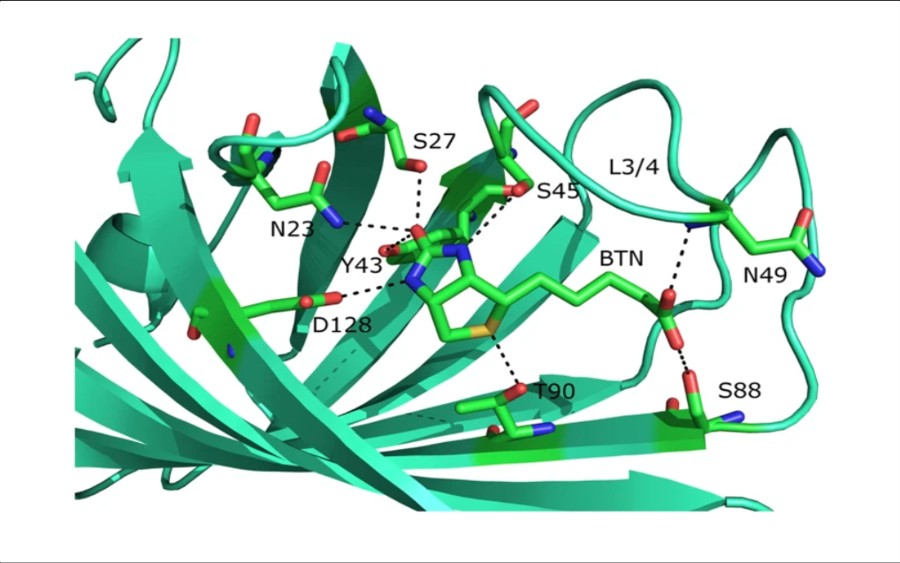

###### Image Source [[8]](#the-origin-of-the-cooperativity-in-the-streptavidin-biotin-system-a-computational-investigation-through-molecular-dynamics-simulations-nature-627190)

#
### Ligation of Adapters and Amplification:
# 

Now the retained DNA fragments are those representing DNA-DNA interactions. Adapters are ligated to the ends of the isolated nucleotides and the molecules are amplified using PCR and then sequenced [[5]](#a-cookbook-for-dnase-hi-c-epigenetics--chromatin-1415)[[4]](#3d-genome-from-technology-to-visualization). 

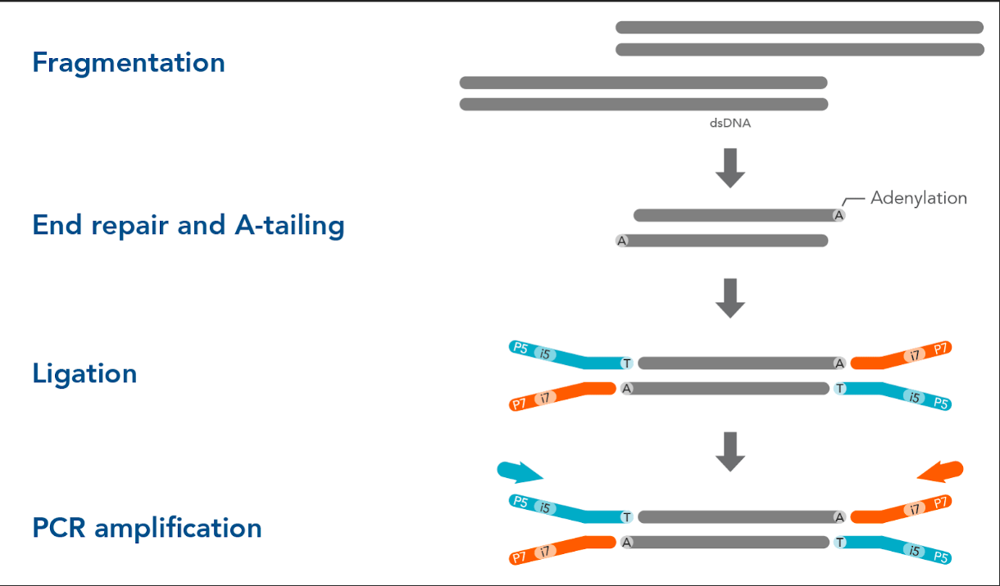

###### Image Source [[7]](#ligation-based-library-preparation)

#
### Comparison of Hi-C workflow to 3C and 4C:
#

Although restriction enzymes are necessary for 4C, this method only involves the use of primers specific to a specific nucleotide sequence whose interactions are being probed [[4]](#3d-genome-from-technology-to-visualization). Therefore in 4C, an oligonucleotide is not introduced in between the interacting DNA molecules, and instead ligation occurs immediately after cross-linking.

After reverse cross-linking, a second ligation occurs to circularize the nucleotide before primers in PCR allow for the specificity of the sequence of interest. The circularization allows for the use of only primers specific to one of the nucleotides that were ligated, the sequence of interest. This allows for the identification of DNA-DNA interactions as each amplified sequence will contain either the sequence of interest or this sequence ligated to the sequence it was interacting with [[4]](#3d-genome-from-technology-to-visualization). 

Likewise restriction enzymes are required for 3C, as DNA fragments cross-linked to the same protein must be ligated together, although only one ligation is necessary as primers for both nucleotides are used in PCR [[4]](#3d-genome-from-technology-to-visualization).

---
## Hi-C Data Analysis: 

### Data Setup:
#

The data derived from the Hi-C workflow is analyzed using a contact matrix, that is a square matrix organized such that entries at position Mij indicate the number of reads for interaction between locus i and locus j of the genome [[2]](#comprehensive-mapping-of-long-range-interactions-reveals-folding-principles-of-the-human-genome-science-3265950-289-93).

Sequenced reads derived from the Hi-C workflow are mapped back to the reference genome and are placed in bins based on their relative positions in the genome [[18]](#the-hitchhikers-guide-to-hi-c-analysis-practical-guidelines-methods-201572-65–75).

These bins are what make up the data matrix, and the sizes of the bins respond to the lengths of the sequences, which in turn correspond to the resolution of the data [[11]](#reconstructing-ab-compartments-as-revealed-by-hi-c-using-long-range-correlations-in-epigenetic-data-genome-biology-180). 

The higher the count of reads in a certain position in the matrix, the more interaction between the corresponding loci can be inferred. Darker or more concentrated colors at intersections of loci in the heat-map indicate a higher number of interactions between those loci [[18]](#the-hitchhikers-guide-to-hi-c-analysis-practical-guidelines-methods-201572-65–75).

Hi-C contact matrices, or heat maps, can also be visualized as triangular maps, where the bottom boundary of the triangular map corresponds to the diagonal of the square matrix, as seen in the images below this one. 

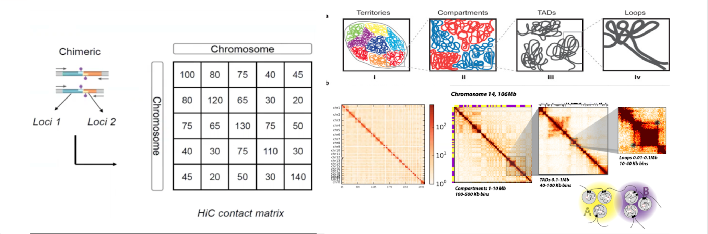

###### Image Source [[2]](#comprehensive-mapping-of-long-range-interactions-reveals-folding-principles-of-the-human-genome-science-3265950-289-93)[[13]](#defining-functionally-relevant-spatial-chromatin-domains-it-is-a-tad-complicated-journal-of-molecular-biology-4323653-664)[[14]](#hi-c-20-an-optimized-hi-c-procedure-for-high-resolution-genome-wide-mapping-of-chromosome-conformation-pubmed-12356-65)

#
### Chromosome Territories:
#

The image below visualizes the largest scale view of the Hi-C contact matrix, which includes all analyzed chromosomes part of the genome.

Here the Hi-C contact matrix shows significantly higher intensity of colors, and therefore higher interaction levels, across the diagonal of the matrix. This pattern is seen in both the square and the triangular matrices below. 

Higher contact frequency across the diagonal displays that there are significantly more frequent intra-chromosome than inter-chromosome interactions [[2]](#comprehensive-mapping-of-long-range-interactions-reveals-folding-principles-of-the-human-genome-science-3265950-289-93)[[12]](#organization-and-function-of-the-3d-genome-nature-reviews-genetics-17-661–678). This supports the existence and understanding of chromosome territories.

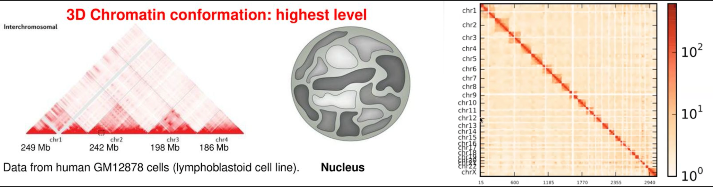

###### Image Source [[2]](#comprehensive-mapping-of-long-range-interactions-reveals-folding-principles-of-the-human-genome-science-3265950-289-93)[[12]](#organization-and-function-of-the-3d-genome-nature-reviews-genetics-17-661–678)

#
### A/B Compartments:
#

Looking at the Hi-C map at a megabase resolution, which is just below the level at which chromosome territories were visualized, compartmentalization can be seen, as seen in the checkerboard pattern in both the triangular and the square contact matrices in the image below. 

By applying Principal Component Analysis to the normalized Hi-C contact map, the first eigenvector can be generated, which correlates with defining open or closed regions, as done to generate the square matrix below on the right [[2]](#comprehensive-mapping-of-long-range-interactions-reveals-folding-principles-of-the-human-genome-science-3265950-289-93)[[11]](#reconstructing-ab-compartments-as-revealed-by-hi-c-using-long-range-correlations-in-epigenetic-data-genome-biology-180).

The positive eigenvector, represented in red, corresponds to A compartments, while the negative eigenvector, represented in blue, corresponds to B compartments [[2]](#comprehensive-mapping-of-long-range-interactions-reveals-folding-principles-of-the-human-genome-science-3265950-289-93). 

Regions in A compartments interact with A compartments, while regions in B compartments interact with B compartments [[2]](#comprehensive-mapping-of-long-range-interactions-reveals-folding-principles-of-the-human-genome-science-3265950-289-93)[[11]](#reconstructing-ab-compartments-as-revealed-by-hi-c-using-long-range-correlations-in-epigenetic-data-genome-biology-180).  

A compartments are characterized by more open chromatin and higher transcription levels, while B compartments are characterized by more closed chromatin and lower transcription levels.  

B compartments, which are repressed and less active, are more likely to be on the borders of the nucleus, closer to the lamina, though regions inside can also be B compartments. A B switching can also occur, which is related to gene expression [[12]](#organization-and-function-of-the-3d-genome-nature-reviews-genetics-17-661–678).

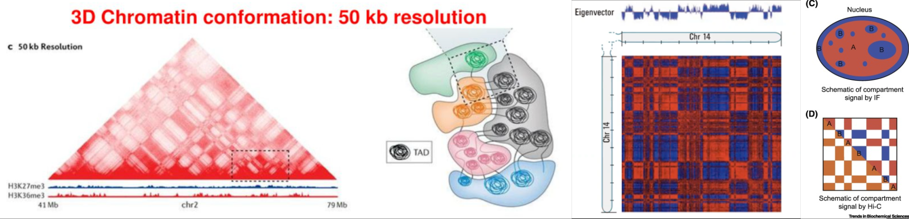

###### Image Source [[2]](#comprehensive-mapping-of-long-range-interactions-reveals-folding-principles-of-the-human-genome-science-3265950-289-93)[[12]](#organization-and-function-of-the-3d-genome-nature-reviews-genetics-17-661–678)[[15]](#mechanisms-and-functions-of-chromosome-compartmentalization-trends-in-biochemical-sciences-455385-396)

#
### TADs:
#

At the level below A/B compartments, TADs can be seen. 

TADs are the domains visualized by the outlined triangles within the triangular Hi-C heat map seen below, where the bottom boundary of the triangle heat map again, corresponds to the diagonal of a square heat map [[12]](#organization-and-function-of-the-3d-genome-nature-reviews-genetics-17-661–678)[[18]](#the-hitchhikers-guide-to-hi-c-analysis-practical-guidelines-methods-201572-65–75). 

Within these labeled triangles, there is a higher frequency of interactions, indicated by the darker red, than between triangles, where the interactions appear sparse, corresponding to the less concentrated coloring. 

These represent the self-interacting regions that are characteristic of TADs, and also supports the fact that DNA-DNA interactions occur more frequently within a TAD, than DNA sequences from a TAD interacting with sequences outside the TAD [[18]](#the-hitchhikers-guide-to-hi-c-analysis-practical-guidelines-methods-201572-65–75). 

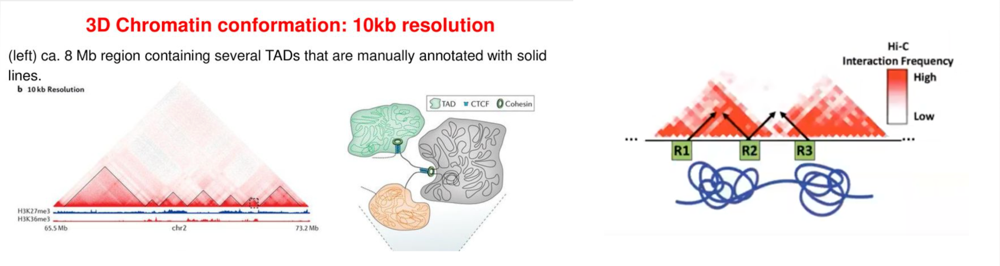

###### Image Source [[12]](#organization-and-function-of-the-3d-genome-nature-reviews-genetics-17-661–678)[[17]](#topological-domains-in-mammalian-genomes-identified-by-analysis-of-chromatin-interactions-nature-485376-380)

#
### Chromatin Loops:
#

Finally, looking within a single chromosome in the image below, the diagonal shows frequent interactions, both in the triangular and square matrices. 

The lower boundary, or diagonal, of the triangular matrix has a higher color intensity and is therefore enriched for interactions, meaning that regions closer to each other had more frequent interactions. 

The top corner of the triangle represents interaction between the farthest ends of the map shown here, and we can observe that interaction mostly decreases the further apart the loci are  [[13]](#defining-functionally-relevant-spatial-chromatin-domains-it-is-a-tad-complicated-journal-of-molecular-biology-4323653-664)[[20]](#a-3d-map-of-the-human-genome-at-kilobase-resolution-reveals-principles-of-chromatin-looping-cell-15971665-80). A similar phenomenon is observed in the square matrix, as loci pairs move away from the diagonal.

However, there are some instances where there is an enriched dot that can be seen at the intersection of the dotted lines in the triangular matrix [[12]](#organization-and-function-of-the-3d-genome-nature-reviews-genetics-17-661–678). A similar pattern occurs in the square map on the right, with these enriched regions being circled. 

These enriched dots represent chromatin loops that result from the interaction of the corresponding loci in the matrix [[12]](#organization-and-function-of-the-3d-genome-nature-reviews-genetics-17-661–678)[[20]](#a-3d-map-of-the-human-genome-at-kilobase-resolution-reveals-principles-of-chromatin-looping-cell-15971665-80). 

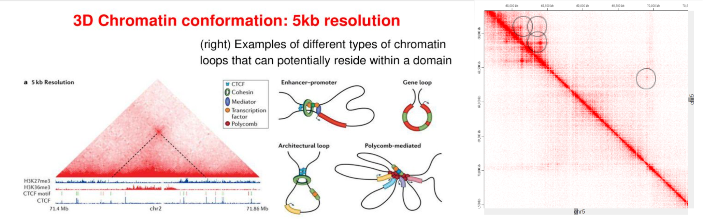

###### Image Source [[12]](#organization-and-function-of-the-3d-genome-nature-reviews-genetics-17-661–678)[[16]](#the-energetics-and-physiological-impact-of-cohesin-extrusion-cell-2018-may-17-1735-1165–1178e20)

---
## Additional Resources:

In summary, this paper discussed genome organization, the Hi-C workflow, and the basics of Hi-C Data Analysis. For genome organization, chromosome territories, A/B compartments, TADs, and chromatin loops were discussed. Then the workflow of Hi-C was described, and was compared to workflows for 3C and 4C. Finally, an overview of Hi-C Data Analysis was provided, pertaining to all the units of genome organization discussed in this paper.   

A visual summary of these topics and their relation to each other can be seen below.

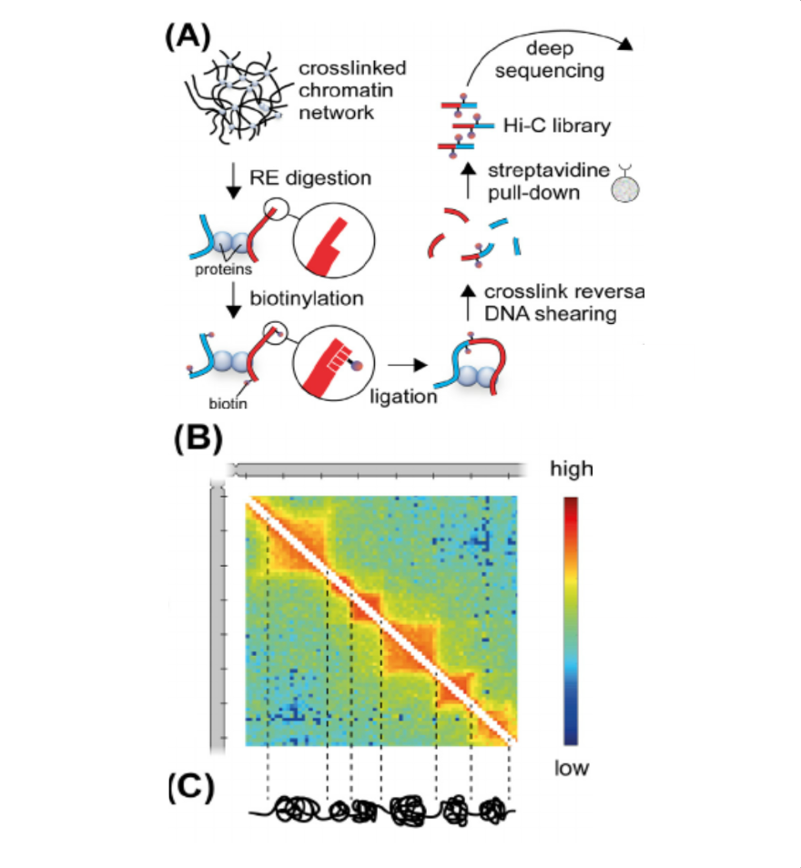

###### Image Source [[19]](#nuclear-compartments-genome-folding-and-enhancer-promoter-communication-international-review-of-cell-and-molecular-biology-315183-244)

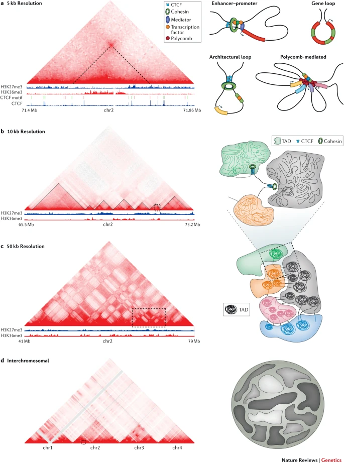

###### Image Source [[12]](#organization-and-function-of-the-3d-genome-nature-reviews-genetics-17-661–678)

&nbsp;

In addition, these resources provide more detail about different aspects of Hi-C, and are valuable in gaining a more in depth understanding of the technology than can be covered in this paper.

- [Overview of Hi-C](https://github.com/hms-dbmi/hic-data-analysis-bootcamp/blob/master/HiC-Protocol.pdf) from Harvard Medical School.
- [Introduction to Hi-C](https://www.youtube.com/watch?v=Hk5ixO7Tb24&t=800s) from STAT 115 at Harvard University.
- [Hi-C Data Analysis: TADs](https://www.youtube.com/watch?v=hg24ZIX06Tk&t=1067s) from STAT 115 at Harvard University.
- [Hi-C Data Analysis: Chromatin Compartments](https://www.youtube.com/watch?v=wYd4Nf5D0yk&t=152s) from STAT 115 at Harvard University.

---
## References:

1. Sivakumar, de las Heras, Schirmer. 2019. 
    #### [Spatial Genome Organization: From Development to Disease. Frontiers in Cell and Developmental Biology. 7:18.](https://www.researchgate.net/publication/331930839_Spatial_Genome_Organization_From_Development_to_Disease)

2. Lieberman-Aiden, Berkum, Williams, Imakaev, Ragoczy, Telling, Amit, Lajoie, Sabo, Dorschner, Sandstrom, Bernstein, Bender, Groudine,  Gnirke, Stamatoyannopoulos, Mirny, Lander, and Dekker. 2009. 
    #### [Comprehensive mapping of long-range interactions reveals folding principles of the human genome. Science. 326(5950): 289-93.](https://www.ncbi.nlm.nih.gov/pmc/articles/PMC2858594/)

3. Hoffman, Frey, Smith, and Auble. 2015. 
    #### [Formaldehyde crosslinking: a tool for the study of chromatin complexes. Journal of Biology and Biochemistry. 290(44):26404-11.](https://pubmed.ncbi.nlm.nih.gov/26354429/)

4. Wen and Zhong. 2015. 
    #### [3D genome: From Technology to Visualization.](https://zhonglab.gitbook.io/3dgenome/)

5. Gridina, Mozheiko, Valeev, Nazarenko, Lopatkina, Markova, Yablonskaya, Voinova, Shilova, Lebedev and Fishman. 2021. 
    #### [A cookbook for DNase Hi-C. Epigenetics & Chromatin. 14:15.](https://www.ncbi.nlm.nih.gov/pmc/articles/PMC7981840/)

6. Pritchard. 2012. 
    #### [Which biotin modification to use? Integrated DNA technologies.](https://www.idtdna.com/pages/education/decoded/article/which-biotin-modification-to-use-)

7. Integrated DNA Technologies. 
    #### [Ligation-based library preparation.](https://www.idtdna.com/pages/technology/next-generation-sequencing/library-preparation/ligation-based-library-prep)

8. Liu, Zhang and Mei. 2016. 
    #### [The origin of the cooperativity in the streptavidin-biotin system: A computational investigation through molecular dynamics simulations. Nature. 6:27190.](https://pubmed.ncbi.nlm.nih.gov/27249234/)

9. Gibcus. 2018. 
    #### [Hi-C Data Analysis Bootcamp. Harvard Medical School.](https://github.com/hms-dbmi/hic-data-analysis-bootcamp/blob/master/HiC-Protocol.pdf)

10. New England biolabs. 
    #### [Streptavidin magnetic beads.](https://www.fishersci.com/shop/products/streptavidin-mag-beads-5-ml/50812660) 

11. Fortin and Hansen. 2015.
    #### [Reconstructing A/B compartments as revealed by Hi-C using long-range correlations in epigenetic data. Genome Biology. 180.](https://genomebiology.biomedcentral.com/articles/10.1186/s13059-015-0741-y)

12. Bonev and Cavalli. 2016. 
    #### [Organization and function of the 3D genome. Nature Reviews Genetics 17, 661–678.](https://www.nature.com/articles/nrg.2016.112).

13. Sikorska, Sexton. 2020. 
    #### [Defining Functionally Relevant Spatial Chromatin Domains: It is a TAD Complicated. Journal of Molecular Biology. 432(3):653-664.](https://www.sciencedirect.com/science/article/pii/S0022283619307065?via%3Dihub)

14. Belaghzal, Dekker, Gibcus. 2017. 
    #### [Hi-C 2.0: An optimized Hi-C procedure for high-resolution genome-wide mapping of chromosome conformation. Pubmed. 123:56-65.](https://www.ncbi.nlm.nih.gov/pmc/articles/PMC5522765/)

15. Hildebrand and Dekker. 2020. 
    #### [Mechanisms and Functions of Chromosome Compartmentalization. Trends in Biochemical Sciences. 45(5):385-396.](https://www.ncbi.nlm.nih.gov/pmc/articles/PMC7275117/)

16. Vian, Perowska, Rao, Kieffer-Kwon, Jung, Baranello, Huang, Khattabi, Dose, Pruett, Sanborn, Canela, Maman, Oksanen, Resch, Li, Lee, Kovalchuk, Tang, Nelson, Pierro, Cheng, Machol, Hilaire, Durand, Shamim, Stamenova, Onuchic, Ruan, Nussenzwieg, Levens, Lieberman-Aiden, and Casellas. 2019. 
    #### [The energetics and physiological impact of cohesin extrusion. Cell. 2018 May 17; 173(5): 1165–1178.e20.](https://www.ncbi.nlm.nih.gov/pmc/articles/PMC6065110/)

17. Dixon, Selvaraj, Yue, Kim, Li, Shen, Hu, Liu and Ren. 2012.
    #### [Topological domains in mammalian genomes identified by analysis of chromatin interactions. Nature. 485:376-380.](https://www.nature.com/articles/nature11082#auth-Siddarth-Selvaraj)

18. Lajoie, Dekker, and Kaplan. 2016.
    #### [The Hitchhiker's Guide to Hi-C Analysis: Practical guidelines. Methods. 2015.72: 65–75.](https://www.ncbi.nlm.nih.gov/pmc/articles/PMC4347522/)

19. Ulianov, Gavrilov, and Razin. 2015.
    #### [Nuclear Compartments, Genome Folding, and Enhancer-Promoter Communication. International Review of Cell and Molecular Biology 315:183-244](https://www.researchgate.net/publication/273205266_Nuclear_Compartments_Genome_Folding_and_Enhancer-Promoter_Communication)

20. Rao, Huntley, Durand, Stamenova, Bochkov, Robinson, Sanborn, Machol, Omer, Lander, Lieberman-Aiden. 2014.
    #### [A 3D map of the human genome at kilobase resolution reveals principles of chromatin looping. Cell 159(7):1665-80.](https://www.ncbi.nlm.nih.gov/pmc/articles/PMC5635824/)

