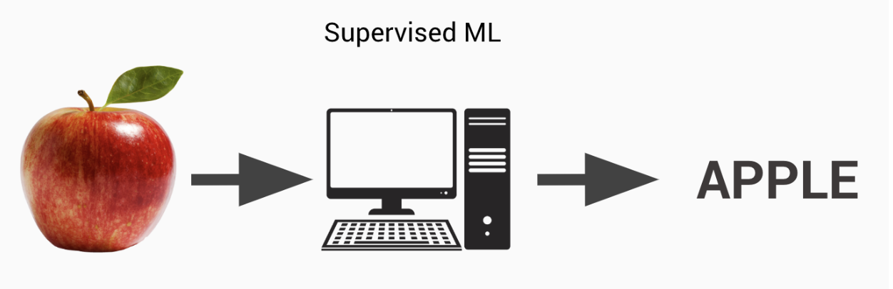
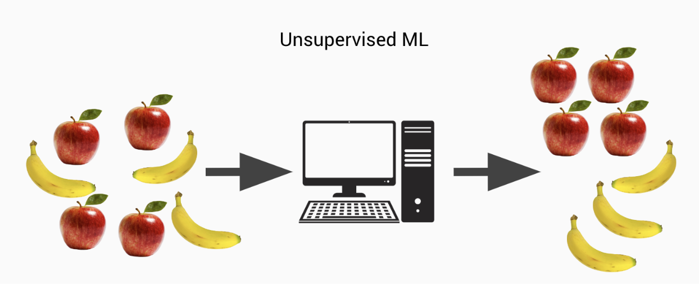
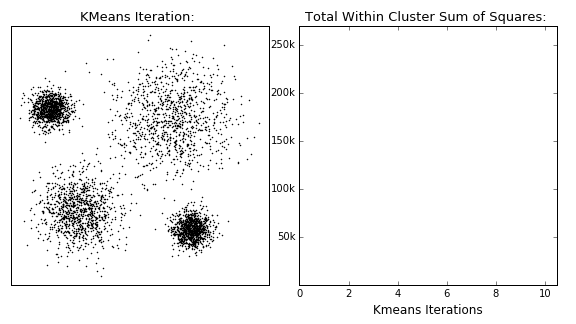
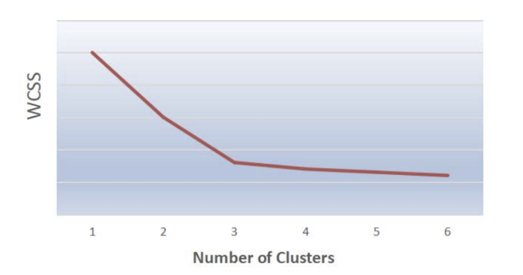
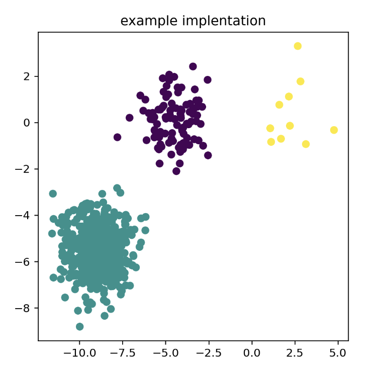
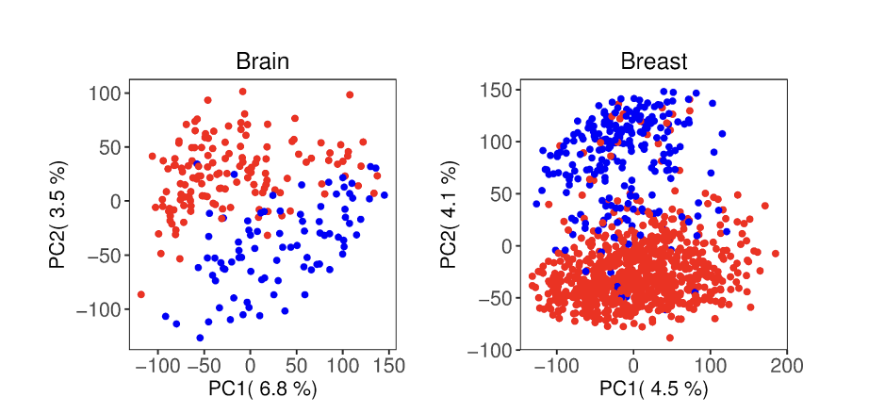
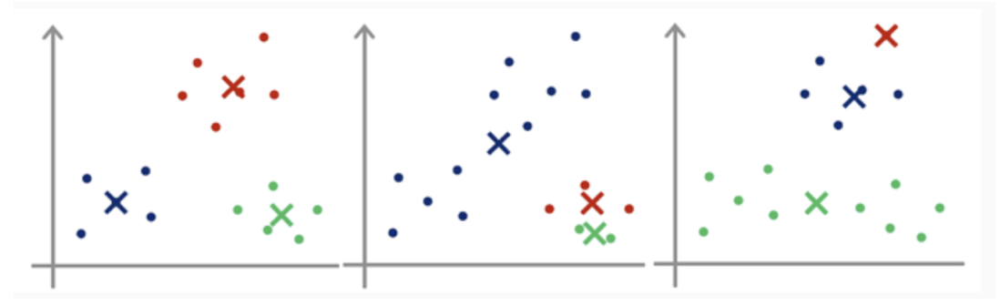

# Kmeans Clustering

Tyler Houchin, Hongji Zhu, & Anna Dinov

## Background
Machine learning is a subfield of artificial intelligence that involves the use of algorithms and statistical models to enable a system to improve its performance on a given task over time. There are two main types of machine learning: supervised and unsupervised. Supervised learning involves training a model on labeled data, where the correct output is provided for each input. This allows the model to make predictions on new, unseen data based on the patterns it has learned from the training data.

<b>Figure 1:</b> Supervised Machine learning

Unsupervised learning, on the other hand, involves training a model on unlabeled data, where the correct output is not provided. This is useful for finding hidden structures and relationships in complex data and can be applied to a wide range of applications, such as clustering, anomaly detection, and density estimation. Because unsupervised learning does not rely on labeled data, it can be used on large datasets and help uncover previously unknown insights from the data.

<b>Figure 2:</b> Unsupervised Machine learning

K-means clustering is a type of unsupervised machine learning algorithm used to classify data into groups (called clusters) based on the similarity of their features. The algorithm works by identifying a fixed number (k) of clusters within the data, and then assigning each data point to one of the clusters based on its similarity to the other points in that cluster. This is typically done by calculating the distance between each data point and the cluster's center point (also known as the centroid), and then assigning the data point to the cluster with the closest centroid. K-means clustering is a popular method for identifying patterns in data and is often used in a wide range of applications, including market research and image processing.


## How K-mean works


<b>Figure 3:</b> K mean Clustering Animation[1]


Step 1: Select appropriate number of k centroids

Step 2: Selectively or randomly put centroids among data points and assign data points to their nearest centroids, and that forms the initial clusters.


Step 3: Calculate the mean vector of for each data points to their assigned centroids. Update the new centroids with the mean vector and reassign the  data points to their nearest centroids to form new clusters.


Step 4: Repeat Step3 until the result converge (i.e., no more changes in clusters and centroids) or meet the maximum iteration



<b>Figure 4:</b> K mean Iterations and change on total within graph sum square[2]


Note that K mean may not always converge and we need to set a maximum number of iteration. Different initial position of centroids could lead to different final results. Therefore, it’s important to choose the number of centroids and initial centroids’ position wisely. 


There are multiple ways to choose the number of clusters. One of the well known way is called Elbow method.[3] The method works by plotting the WCSS (Within-Cluster Sum-of-Squares) graph with different k, and the inflection point would indicate the optimal number of clusters. The below example has inflection point at k=3.



<b>Figure 5:</b> Example WCSS graph

There is another way to determine the number of cluster by calculating sqrt(n/2), where n is the number of data points. [4]

K-mean++ helps to optimize the initial centroids placement.[5] K-mean++ works by selecting initial cluster centroids using sampling based on an empirical probability distribution of the points’ contribution to the overall inertia. This technique speeds up convergence, and is theoretically proven to be O(logk) optimal.[6] K-mean++ is usually already selected as the default centroids initialization method. 


### Example Implementation [7]

```
import numpy as np
import matplotlib.pyplot as plt
from sklearn.cluster import KMeans
from sklearn.datasets import make_blobs

plt.figure(figsize=(5, 5))

n_samples = 1500
random_state = 170
X, y = make_blobs(n_samples=n_samples, random_state=random_state)


X_filtered = np.vstack((X[y == 0][:500], X[y == 1][:100], X[y == 2][:10]))
y_pred = KMeans(n_clusters=3, init='k-means++', n_init=10, max_iter=300, tol=0.0001, verbose=0, random_state=None, copy_x=True, algorithm='lloyd').fit_predict(X_filtered)

plt.scatter(X_filtered[:, 0], X_filtered[:, 1], c=y_pred)
plt.title("example implentation")
plt.show()

```



<b>Figure 6:</b> Example k mean implementation 


## Real World Uses

Categorization of unlabeled data using K-means clustering can have many real-world applications across many fields of science, research, medicine, cyber security, and recommender systems. It is extremely useful in bioinformatics because we often start out with large amounts of unlabeled biological data, with the goal being to categorize it. We can use K-means clustering to group similar data points together. Specifically, this can be helpful when looking to categorize subtypes of a disease. Oftentimes disease types can be differentiated based on differences in their gene expression data. K-means clustering can be used as a tool to group samples based on gene expression and therefore be able to arrange them into clusters based on similarity.



<b>Figure 7:</b> Usage of k mean in Brain cancer and Breast cancer[8]

Here is a display of two subtypes of Brain cancer (IDHnocodel (red) and IDHcodel (blue)) and two subtypes of Breast cancer (ER+(red) and ER-(blue)). Note that the majority of samples of a particular subtype fall into a corresponding region of the graph. These clusters can be used to determine the best subtype diagnosis of a cancer patient. [8]

The effectiveness and wide variety of applications of the K-means clustering has influenced many publications that look at ways to optimize the algorithm. An example of one of these optimization research efforts is the work described in the paper “An enhanced deterministic K-Means clustering algorithm for cancer subtype prediction from gene expression data” [9]. This paper proposes a variation of the K-means clustering algorithm that can be used to more accurately predict what cancer type a sample falls into. The novel k-means algorithm that is explained in this paper is an improved method for selection of the initial centroid points. Specifically, they suggest selecting the initial centroids to be in dense regions of the dataset that are relatively distant from one another. This differs from the baseline K-means clustering algorithm that selects the initial centroids randomly, which can influence the clusters in the result. It is shown in this paper that selecting initial centroids in dense regions of the graph that are also spatially distant creates more accurate clustering results. Any improvement in accuracy is vital when dealing with high stakes outcomes, such as cancer type classification. Also, this improved algorithm can run quicker because there may be less iterations of picking new centroids and reclustering.



<b>Figure 8:</b> Selection of different initial centroids[9]

Here we see three different choices for initial centroids. The leftmost one strategically selected centroids in dense and spatially far apart regions of the dataset, similarly to the algorithm proposed in the paper. On the other hand, the middle and rightmost images show what a random selection of initial centroids may look like.

When working with large and intricate datasets, like gene expression data from cancer patients, the final results from these three clustering start points may have slight variations that cause problems in accurately classifying which cancer type each belongs to. Nowadays, and in future research, many scientists are looking at designing new ways to optimize the baseline k-means clustering algorithm both generally and for specific purposes. This paper is just one of many optimization ideas that pertains to cancer subtype classification from gene expression, but there is still so much more optimization work that can be done.


## References
[1]https://github.com/jhagelback/kmeans-viz

[2]https://dashee87.github.io/data%20science/general/Clustering-with-Scikit-with-GIFs/

[3]Cui, M. (2020). Introduction to the k-means clustering algorithm based on the elbow method. Accounting, Auditing and Finance, 1(1), 5-8.

[4] Han, J., &amp; Kamber, M. (2006). Data Mining: Concepts and Techniques. Elsevier. Chapter 10

[5]Arthur, D., & Vassilvitskii, S. (2006). k-means++: The advantages of careful seeding. Stanford.

[6]Scikit-learn: Machine Learning in Python, Pedregosa et al., JMLR 12, pp. 2825-2830, 2011.https://scikit-learn.org/stable/modules/generated/sklearn.cluster.KMeans.html 

[7] Scikit-learn: Machine Learning in Python, Pedregosa et al., JMLR 12, pp. 2825-2830, 2011. https://scikit-learn.org/stable/auto_examples/cluster/plot_kmeans_assumptions.html#sphx-glr-auto-examples-cluster-plot-kmeans-assumptions-py 

[8] Vidman L, Källberg D, Rydén P (2019). Cluster analysis on high dimensional RNA-seq data with applications to cancer research - An evaluation study. PLoS ONE 14(12): e0219102. https://doi.org/10.1371/journal.pone.0219102

[9] N.Nidheesh et al. 2017. An enhanced deterministic K-Means clustering algorithm for cancer subtype prediction from gene expression data.
