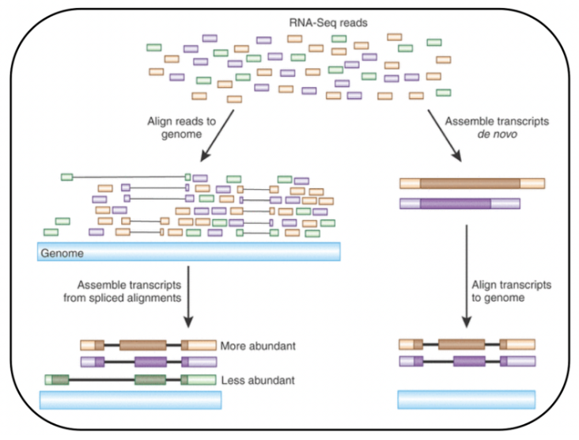

<h1 align="center">
RNA-Sequencing Alignment
</h1>

<h3 align="center">
Author: Nicholas, Garrett, Shuhao
</h3>

<h3 align="center">
Group: 8
</h3>

### Introduction

Alignment of these raw reads into a reference genome is the first and essential step in almost all applications:

- Genetic variants detection
- Methylation patterns profiling (MeDIP-Seq)
- Protein-DNA interactions mapping (ChIP-Seq)
- Differentially expressed gene identification (RNA-Seq)

<p align="center">
  


</p>
 
<h3 align = "center">
Examples of Genome Alignment Tools
</h3>

STAR                       |  TopHat2
:-------------------------:|:-------------------------:
  |  

### Compare STAR and TopHat
##### STAR
Pro:

- Better Mapping Accuracy
- Quicker Run Time
- Higher Precision in Identifying Splice Junctions
- Better Sensitivity in Detecting Variants (INDELs & SNPs)

Cons:

- Uses a large amount of RAM (memory)
- Run time relies on available memory

##### TopHat2
Pro:

- More widely used, help is highly available
- Created before STAR
- Maps a greater percentage of reads on the reference genome

Cons:

- Often has problems when mapping reads with 2 or more differences

| Program     | Sensitivity (%) | Precision (%)  | Run Time (min)   | Memory Usage(GB) | Total Reference Mapped (%) |
| ----------- | ----------- | ----------- | ----------- | ----- | ------ |
| TopHat2 | 90.6 | 82.6 | 1,170 | 4.3 | 94.108 |
| STAR | 96.3 | 88.3 | 25 | 28 | 86.332 |

### Running STAR and Tophat2

This section will demonstrate how to use STAR and TopHat2 to align raw sequencing reads to a reference genome. Key differences in the processes of running the two tools will also be highlighted. First, the files required to run each tool will be described. Next, we will demonstrate how to create an index for the reference genome using each tool. Finally, we will demonstrate how to run the alignment and give a brief overview of the output files. 

#### Required Files

Both STAR and TopHat2 require the same files to align reads to the reference genome. The files needed are:

1. FASTQ (`.fastq`) file(s)
2. FASTA (`.fa`) file
3. Gene Transfer Format (`.gtf`) file

We will discuss each of these files in more detail below.

**FASTQ file(s)** - FASTQ files contain sequencing reads from a DNA sequencer. For the purposes of RNA-seq, the FASTQ files contain the sequences of the RNA reads from the RNA-seq experiment. If you did paired end sequencing, you will have two FASTQ files. Otherwise, you will have one. Before using FASTQ files for alignment, they must undergo quality control. Poor quality positions and reads must be removed. This can be done using programs such as FASTQC and FASTP. We will not cover how quality control works in detail here, as the focus is on read alignment. Once poor quality reads and base pairs are removed from the FASTQ files, they are ready for use with aligners.

**FASTA file** - This file contains the DNA sequence of the genome of the cells we are performing RNA-seq on. This genome is known as a reference genome. The aligner takes each read in the FASTQ file(s) and attempts to align it with the reference genome.

**GTF file** - In many organisms, after being transcribed, RNA is spliced. Intron sequences are removed from the RNA and exon sequences are linked together. Many of the RNA reads in the FASTQ files come from RNA that has already undergone splicing and only contains exon sequences. Some reads may contain portions of multiple exons that are spliced together in the RNA read, but have introns between them in the reference genome. Therefore, some reads may need to be split into segments and each segment must align to a different position in the reference genome. To accurately align the reads to the reference genome, the aligner must know what parts of the reference genome are exons and what parts are introns. The GTF file contains this information.

#### Creating an Index

After obtaining the required files, the next step in sequence alignment with both tools is to generate an index of the reference genome. This step is necessary to speed up the alignment step later on. An index of the reference genome is essentially a special way to store the reference genome that speeds up the alignment process.

**Generating an Index for STAR:**

STAR is able to generate an index on its own. An example command to do so is as follows.

```
STAR --runThreadN 16\
--runMode genomeGenerate\
--genomeDir STAR_index/\
--genomeFastaFiles reference_genome.fa\
--sjdbGTFfile genome_annotations.gtf\
--sjdbOverhang 124
```

Please note that there are other arguments that can be set to customize how the index is created. For further information on these arguments, please see the STAR documentation.

The most important arguments in this command are as follows.

`--runThreadN` - This argument tells STAR the number of threads on the computer to use, and can be used to speed up index generation. 

`--runMode` - This argument tells STAR to create an index, not an alignment.

`--genomeDir` - This parameter tells the command which folder to store the genome index in. This directory must already exist on your computer before running the command in STAR. If it does not exist, STAR will give an error.

`--genomeFastaFiles` and `--sjdbGTFfile` - These parameters point to the FASTA and GTF files, respectively.

`--sjdbOverhang` - This number is equal to `read_length - 1` where `read_length` is the length of each read in the FASTQ file. It is used when generating a database of splice junctions.

**Generating an Index for TopHat2:**

Unlike STAR, TopHat2 cannot build an index on its own. Instead, it is designed to work with indices built by a separate program called Bowtie2, which must be installed separately. A sample command to build an index using Bowtie2 is as follows:

```
bowtie2-build -f reference_genome.fa Drosophila_melanogaster_index
```

Some key arguments in this command are:

`-f` - This argument specifies the FASTA file containing the reference genome.

`Drosophila_melanogaster_index` - This is an example prefix for the index files. Bowtie2 generates 6 index files, each with a unique suffix followed by the `.bt2` extension. This prefix is appended to the beginning of the file name, before the suffix.

**Further Comparison:**

There are a few more key differences between the commands for building an index using STAR and Bowtie2. First, with STAR we specify both the FASTA file and the GTF file when building the index. However, with Bowtie2, we cannot specify the GTF file, so we only specify the FASTQ file. Second, STAR outputs its index files into the folder specified in the `--genomeDir` argument, whereas Bowtie2 outputs the index files into the current working directory by default. If you would like your index files to be within a particular folder, you can run the Bowtie2 command from within that folder.

**Output:**

The output files for both commands are illustrated in the figures below.

<p align = "center">
STAR Index Files
</p>


<p align = "center">
Bowtie2 Index Files
</p>


We will not cover the details of these files here. STAR and TopHat2 will use these index files to perform the next step: alignment.

#### Aligning to Reference Genome

After building the indices of the reference genomes, the reads in the FASTQ files must be aligned to the reference genome. This section will discuss the some important parameters in the STAR and TopHat2 commands to perform these alignments.

**Aligning with STAR:**

The command to perform the alignment with STAR is as follows:

```
STAR --runThreadN 16\
--genomeDir STAR_index/\
--readFilesIn input1.fastq input2.fastq\
--outSAMtype BAM SortedByCoordinate\
--outFileNamePrefix ./female_midgut1_STAR_genome
```

Some key arguments in this command are:

`--runThreadN` - Again, this argument sets the number of threads STAR will use when aligning reads to the reference genome.

`--genomeDir` - When generating the index, this argument was used to specify the folder in which to put the index. Now, this argument specifies where the index is located on the computer. It must point to the directory containing the index generated earlier.

`--readFilesIn` - This argument contains the FASTQ file(s) to use for alignment. If you have paired end reads, you will have two FASTQ files. Otherwise, you will have one.

`--outSAMtype` - This argument specifies the type of output file to generate with the results of the alignment. The alignment results can be stored in a SAM file or a BAM file. Both file formats store the positions where each read aligns in the reference genome, along with other data. SAM files are in plain text format whereas BAM files are stored as binary files. Binary files generally take up less disk space and are faster to use by programs, but require special software, such as Samtools, to inspect. They can't be directly viewed with commands such as `less`. You can also specify how you would like the results in your SAM/BAM file to be sorted, for example, sorted by genome coordinate.

`--outFileNamePrefix` This parameter lets you specify a prefix for the names of your output files. By default, this command places the results in your working directory, but you can use this argument to place your files in a directory of your choice by specifying the path to that directory before the prefix of the names of your output files. For example, `--outFileNamePrefix ./alignment_results/female_midgut1_STAR_genome` stores your results in a folder in your current working directory called `alignment_results`.

**Aligning with TopHat2:**

The command to perform the alignment with TopHat2 is as follows:

```
tophat2 -o tophat_output_dir\
-G genome_annotations.gtf\
-p 16\
--no-coverage-search [path to index]/Drosophila_melanogaster_index [fastq file 1] [fastq file 2] 
```

Some key parameters in this command are:

`-o` - This parameter specifies the directory where the results of your alignment should be stored.

`-G` - Recall how when building the index for TopHat2 using Bowtie2, we did not specify the GTF file in the Bowtie2 command. We can specify it here using this argument.

`-p` - This argument sets the number of threads on the computer to use when performing the alignment.

`--no-coverage-search` - This argument turns off the "coverage search" algorithm, an algorithm used by TopHat2 for detecting exon junctions. This algorithm uses a lot of RAM and is slow. It is also not useful when performing expression analysis of genes, so it can be turned off.

`[path to index]/Drosophila_melanogaster_index` - This argument consists of the path to the index files, followed by the prefix of the index file names specified in the Bowtie2 command earlier. It tells TopHat2 where the genome index is.

`[fastq file 1] [fastq file 2]` - These arguments are paths to the FASTQ files containing the reads to be aligned to the reference genome. If you have single end reads instead of paired end reads, you only need to specify the path to one FASTQ file.

#### Aligner Output Overview:

The aligners output many files. The files outputted by each aligner are pictured in the figures below.

<p align = "center">
STAR Alignment Output
</p>


<p align = "center">
TopHat2 Alignment Output
</p>


The main files to pay attention to in these outputs are the BAM files. These files contain information about each read, including the coordinates where each read aligns to in the reference genome. In the image above, the BAM file generated by STAR is `female_midgut1_STARgenomeAligned.sortedByCoord.out.bam`. TopHat2 generates two BAM files. One of them, `accepted_hits.bam`, contains the information on the aligned reads, much like the BAM file generated by STAR. The other one, `unmapped.bam`, contains reads from the FASTQ files that were not mapped to the reference genome. In the next section, we will give an overview of how these BAM files are further processed into meaningful results.

### Results and Future Direction

The output BAM files from STAR or TopHat2 will need further processing.

<p align="center">
  
  
  
</p>

The BAM file looks like below:

<p align="center">
  
  
  
</p>

Researchers cannot directly read from the BAM file. Quantification of the alignment reads is necessary. The matrix below provides much clearer and convenient information of the reads.

<p align="center">
  
  
  
</p>

#### "featureCounts" is highly recommended for the next step.

<p align="center">
  
  
  
</p>
